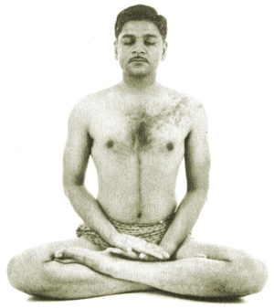

  
[Intangible Textual Heritage](../../index)  [Hinduism](../index.md) 
[Yoga](../yoga/index.md) 

------------------------------------------------------------------------

[Buy this Book at
Amazon.com](https://www.amazon.com/exec/obidos/ASIN/054808047X/internetsacredte.md)

------------------------------------------------------------------------

<table width="75%">
<colgroup>
<col style="width: 50%" />
<col style="width: 50%" />
</colgroup>
<tbody>
<tr class="odd">
<td width="50%" data-valign="TOP"></td>
<td width="50%" data-valign="CENTER"><h1 id="relax-with-yoga" data-align="CENTER">Relax With Yoga</h1>
<h2 id="by-arthur-liebers" data-align="CENTER">by Arthur Liebers</h2>
<h4 id="section" data-align="CENTER">[1960]</h4></td>
</tr>
</tbody>
</table>

------------------------------------------------------------------------

[Contents](#contents)    [Start Reading](rwy00.md)    [Page
Index](pageidx)    [Text \[Zipped\]](rwytxt.zip.md)

------------------------------------------------------------------------

|                                                                                                                           |
|---------------------------------------------------------------------------------------------------------------------------|
|  |

This is a short guide to modern western Raja Yoga, illustrated by a
couple of dozen photos of yogic postures (asanas). This little book is a
surprisingly comprehensive introduction to the metaphysical background
of yogic practice, along with a host of related practical matters.

The exercises introduced here are all fairly easy and well-described.
When this was written, Yoga teachers were far and few between in the US,
so this was by necessity a self-help guide. While, strictly speaking, I
wouldn't recommend trying these exercises (particularly the mental ones)
without a teacher, at least it isn't hard to find Yoga classes any more.

In the [first chapter (p. 7)](rwy02.htm#page_7.md), Liebers traces
stereotypical misconceptions of Yoga by mid-century Americans to
sideshow performers and "supposedly esoteric literature." By the latter
one infers is meant the 'Yogi Publication Society' books, for instance,
[Raja Yoga](../../eso/ryo/index.md), which bears comparison with this book.

------------------------------------------------------------------------

 [Title Page](rwy00.md)  
[Contents](rwy01.md)  
[1. The Origin of Yoga](rwy02.md)  
[2. Control of the Brain and Nervous System](rwy03.md)  
[3. The Eight Principles of Raja Yoga](rwy04.md)  
[4. Obtaining Relaxation Through Yoga](rwy05.md)  
[5. Corrective Poses of Yoga](rwy06.md)  
[6. Specific Asanas For Weight Reduction](rwy07.md)  
[7. Specific Postures For Relaxation](rwy08.md)  
[8. The Bandhas—Mystic Breathing Exercises](rwy09.md)  
[9. Sankya Yoga—Yoga of the Mind](rwy10.md)  
[10. Yoga Principles of Diet](rwy11.md)  
[11. Sexual Principles and Practices in Yoga](rwy12.md)  
[12. How to Achieve Painless Childbirth Through Yoga](rwy13.md)  
[Glossary of Yogic Terms](rwy14.md)  
