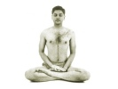
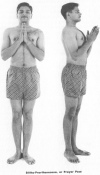
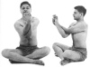

  
[Intangible Textual Heritage](../../index)  [Hinduism](../index.md) 
[Yoga](../yoga/index)  [Index](index)  [Previous](rwy05)  [Next](rwy07.md) 

------------------------------------------------------------------------

[Buy this Book at
Amazon.com](https://www.amazon.com/exec/obidos/ASIN/054808047X/internetsacredte.md)

------------------------------------------------------------------------

  
*Relax With Yoga*, by Arthur Liebers, \[1960\], at Intangible Textual
Heritage

------------------------------------------------------------------------

p. 29

### 5. CORRECTIVE POSES OF YOGA

The first section of this book discussed the mental, or psychological,
approach to Yoga. As you apply the earlier lessons to mental relaxation,
you must also bring your body to a state in which it will support your
efforts to attain full contentment, relaxation and ease. Ancient
teachers of scientific Yoga realized, as do modern physicians, that
proper carriage of the body is essential for mental and physical health.
You will note that on the following pages there is very little reference
to the Sanskrit philosophy of Yoga, for here we put aside the mind and
devote our attention to the body. As you assume these postures, however,
keep in mind the eight principles of Raja Yoga. They will help you in
dealing with both mind and body as you practice Yoga.

At first, spend only as much time on each exercise as you can without
feeling fatigued. As the timbre of your body improves and as your mind
takes fuller control of your body, you will find it possible to remain
in any pose for longer and longer periods. One of the most prevalent
causes of sluggishness and disturbance of the digestive organs is faulty
carriage of the body, especially above the waist, involving the spinal

p. 30

and abdominal muscles. Practically all of us are victims of faulty
posture and suffer from enteroptosis, a condition in which the stomach,
intestines and very often the kidneys, liver and pelvic organs, are
dragged downwards and remain permanently out of their correct anatomical
positions.

Medical internists will verify the statement that poor carriage retards
circulation of large blood vessels. An habitual slouching position
causes the blood of the abdomen to stagnate in the liver, inducing a
feeling of despondency and confusion, as well as headache, accompanied
by coldness of the hands and feet, chronic fatigue and often
constipation. The Yoga Institute in Bombay has traced varied disorders
of the digestive and pelvic organs and even functional defects of the
heart and lungs directly to poor posture habits. Persons who had been
[approaching](errata.htm#0.md) invalidity as a result of posture habits are
said to have been cured after a few weeks of training. Persons in normal
health have gained markedly, physically and mentally, from a short, but
regular, corrective posture program.

The proper pose of the body imparts graceful curves to the female figure
and an air of strength to the male. The proper posture, as imparted by
Yoga, embodies in beauty the feelings of triumph and self-respect,
whatever the age or condition of the practitioner. The common drooped
and slouching position is both ugly and unhealthy, and invariably
reflects a degenerated mental attitude.

Ancient Yogis were perhaps first to recognize the influence of carriage
on health of the mind and body. The prime objective of posture in Yoga
is not mystic, mysterious or magic, but the achievement of physical ease
and poise. An erect posture is recommended to maintain free spinal
circulation during prolonged sitting and concentration.

p. 31

#### The First Lesson in Yoga Posture

When beginning the practice of Yoga postures, start with the simple
prayer pose in a standing position. Medical investigation shows that
many corrective and therapeutic benefits stem from even these first
simple poses. It is no longer known whether the ancient Yogins, the
founders of Yoga, attached any special mystical significance to these
first poses. However, they are excellent poses for prayer and
meditation.

#### Stitha-Prarthanasana, or Prayer Pose

This pose helps to achieve steadiness through gradual control of
voluntary muscular movements and offers, through steadiness, the best
physical attitude for standing prayer; it permits normal standing
posture by coordinating skeletal muscles and it corrects postural
defects.

While standing, hold your body as tall as possible without actually
rising on your toes. Keep your heels together, placing all your weight
upon the balls of your feet. Throw your head and chest up, shoulder
blades flat. The abdominal muscles should be deflated at their lower
part, but not drawn inward, and fuller just below the ribs, while the
pelvis should be tilted at such an angle as to prevent any exaggeration
of the lumbar curve. Your knees must be straight but not stiff, with
legs together touching at the knees. Fold your hands over the sternum;
avoid tension. Relax your mind and fix your eyes on any pleasing object
before you.

In this position, the thorax is full and round; the diaphragm is high;
the abdomen at its greatest length. The stomach and intestinal viscera
are held in proper place and the pelvic organs are relieved of pressures
from above. There is a partial relaxation of the larger muscles and
relief from

p. 32

 
[  
Click to enlarge](img/03200.jpg.md)  
Stitha-Prarthanasana, or Prayer Pose  

p. 33

tension. With the arms relaxed and let down at the sides, it is an ideal
position for standing. Maintain this position for about one minute,
breathing normally. Keep your mind free and observe complete silence.
Turn slowly to either side, parallel to a wall or post, and notice
whether you sway. Swaying is an indication of nervous disturbance which
must be overcome.

If possible, practice opposite a mirror, where swaying motions can be
noted. During the period of test and correction, keep your eyes
half-closed, allowing just enough vision for observation, and
concentrate on the parts of your body above the waist. Stand immobile as
a statue, and as soon as you have a tendency to sway, check it by will
power. After the first few weeks, try to sustain this motionless pose
for two to three minutes, always breathing normally. This pose is best
practiced in the morning, and should be followed daily until complete
control has been achieved. Afterwards, it may be practiced once weekly.

#### Ekapadasana, or One-Leg Pose

Begin by assuming the Prayer Pose. Bend down, lift one leg with your
hands and bring it up to the thigh. Keep your balance on the other leg.
If you experience the fear of falling, stand and practice near a wall or
window sill or other support. After you have attained sufficient
steadiness on one leg, adjust the raised leg by pressing the heel
tightly against the opposite groin, with the sole of the foot against
the opposite thigh. Study the illustration (page [34](#img_03400).md) for
details of this pose.

Steadiness, or nerve control and coordination between muscular and
nervous systems, is one of the prime goals of Yoga physical education,
and must be learned in slow stages. At first it may be necessary to use
some support to maintain

p. 34

  [  
Click to enlarge](img/03400.jpg.md)  
Ekapadasana, or One-Leg Pose  

balance. Later you will be able to practice without support, maintaining
this pose with your hands in the prayer posture. It may be difficult to
keep this pose for more than a few seconds at the beginning, but you
should gradually be able to extend the duration of time until you can
keep the pose comfortably for two or three minutes. Do not overdo at
first. Limit practice to one or two minutes mornings and evenings,
alternating legs.

p. 35

In addition to exercising and relaxing the muscles and nerves of
alternate legs, this pose helps to develop the nerve control necessary
for relaxation. When swaying is experienced during this exercise, the
best corrective is to concentrate your mind on each of your movements.
Become consciously aware of the most insignificant variations in
steadiness, so that you will be able to secure control over all motion.
Along with other Yoga measures—meditation, diet, etc.—this posture
facilitates nerve control in the course of a few months.

#### Padmasana, or Lotus Pose

The traditional meditative posture, the Padmasana, or Lotus Pose, is
essential for posture training, body-free meditation and preserving
normal elasticity of the muscles connected with the pelvis and lower
extremities. As noted previously, those who have been raised in the
Western culture are stiff and lack flexibility in their legs and lower
bodies. This must be corrected in order to restore natural suppleness of
the limbs. The Lotus Pose may at first be a bit difficult, but with
regular practice, massage of the limbs and determination, it can be
achieved. Avoid undue strain and do not force yourself into this by
violent jerks or tension of your legs. When you are ready for it, your
body will fall naturally into the desired posture.

Now that you have begun the sitting and the lying-down exercises, you
should avoid the use of a bare floor. If the room in which you are
practicing is not carpeted, provide yourself with a soft mat at least 6
x 3 feet, and spread a clean sheet over the area where you will sit or
lie.

p. 36

  [  
Click to enlarge](img/03600.jpg.md)  
Padmasana, or Lotus Pose  

  [  
Click to enlarge](img/03601.jpg.md)  
Ardha-Padmasana, or Semi-Lotus Pose  

p. 37

#### Ardha-Padmasana, or Semi-Lotus Pose

Beginning with the Lotus Pose, sit on the floor with your legs stretched
out. Bend the right leg slowly and fold it upon itself. Using your
hands, place the right heel at the root of the thigh so that its sole is
turned upwards and your foot is stretched over the left groin.
Similarly, bend the left leg and fold it upon itself with your hands,
placing the left heel over the root of the right thigh. Your ankles
should cross each other, while your heel-ends touch closely. The left
foot with its upturned sole should lie fully stretched over the right
groin. Keep your knees pressed to the ground, feet tight against the
thighs, and press your heels firmly against the upper front margin of
the pubic bone slightly above the sex organs.

To complete this pose, hold your body erect, with neck straight, chest
thrown forward and abdomen drawn moderately inwards. Fix your eyes on
any object in front of you, then close them. Spread your left hand with
its back touching both heels, palm upwards. Place your right hand over
the left in the same manner. The ancient texts associate this pose with
peace. Although many find it easier to achieve the pose by folding the
left leg first, you may alternate the position of your legs.

A highly effective meditative posture, the Semi-Lotus Pose offers many
corrective and cultural benefits. It results in either extension,
flexion or relaxation to almost all the important muscles, ligaments and
tendons of the lower limbs. It also induces increased blood circulation
in the abdominal and genital areas by blocking the flow in some areas
and drawing a larger supply of blood from the bifurcation of the
abdominal aorta. Restraint of the general circulation

p. 38

caused by the pressure of the heels provides an increased supply of
blood to the sex organs and also helps to tone the various nerve centers
located in the pelvic region, such as the chain of coccygeal and sacral
nerves.

Respiration is improved as a result of the chest being thrown forward
and the abdomen being held in normal position. Muscle tone is increased
in the internal organs, especially those of the intestinal tract. In
this posture, it is important that the shoulders should not sag forward,
crowding the chest, nor should the upper part of the body crowd down
upon the stomach and the abdominal viscera. The Lotus Pose is suggested
for the regulation of breath movements.

#### Yastikasana, or Stick Pose

This is a recent addition to the traditional *asanas*, or poses.
Developed in the 19th century by Yoga practitioners, it is believed to
increase the height of the user. While this benefit may be questioned,
the pose induces a state of complete relaxation. An all-body stretch
which does not strain even the novice in Yoga, this pose is most easily
held while lying down.

To take this pose, harmonize your breathing with your actions. Lie on
your back on a comfortable mat or carpet, with your legs and arms fully
extended. Fall into a relaxed position. Inhale for three seconds and,
while retaining your breath, stretch your body slowly to full length.
Your toes and fingers should point outwards, as if trying to reach an
object beyond their grasp. Repeat this stretch position for three
seconds and then release the tension of the stretch

p. 39

  [  
Click to enlarge](img/03900.jpg.md)  
Yastikasana, or Stick Pose  

while exhaling. Any maximum stretching of the body should be attempted
only while the breath is retained. Do not attempt to hold your breath
for more than four or five seconds.

To simplify the explanation of the Yastikasana movements: (1) With body
supine, arms and legs outstretched, inhale for three seconds; (2) while
your body is outstretched, hold your breath for three seconds; (3)
return to the starting position; exhale for three seconds. Repeat the
entire exercise five times in one minute.

The primary object of this posture is to stretch the body fully. It
serves to correct faulty postural habits and tenses the usually relaxed
abdominal and pelvic muscles.

According to the schools of Yoga which have utilized the Stick Pose,
stretching aids height and its regular practice will at least halt the
tendency of the aging to lose height. It may be done both in the morning
and in the evening. Where it is used solely for relaxation, normal,
rhythmic breathing should be maintained without any effort at
stretching.

p. 40

  [  
Click to enlarge](img/04000.jpg.md)  
Parvatasana, or Mountain Pose  

#### Parvatasana, or Mountain Pose

Overweight can bring both mental and physical problems. The posture
known as Parvatasana, or the Mountain Pose, has been found in several
Yoga institutes to be highly effective in maintaining slimness and in
correcting minor postural defects of the spinal cord.

Assuming the Semi-Lotus Pose, slowly raise your hands upward and above
the head. Keep your palms pressed together. If it is easier, interlace
your fingers. Finally, stretch upward as if to touch some object
directly above your head. Keep your arms close to your ears, your head
erect, your back straight, and pull your abdomen in. While inhaling,
raise the upper part of your body to its maximum height. Make sure your
elbows and wrists are in a straight line.

p. 41

Maintain this slightly stretched, upright position between breaths,
since this is the point at which attempts at upward stretching are most
successful. During this exercise, keep your eyes fixed on some object
before you and keep your mind at ease. This pose was named Parvatasana
because it has the appearance of a mountain.

For maximum benefits, the movements and breathing should be in harmony
with actions as shown in the following instructions: (1) In a sitting
pose, raise arms and inhale for three seconds; (2) maintain pose and try
to retain breath for six seconds; (3) return to starting position,
exhale for three seconds. Repeat this pose five times to a minute
without pausing.

This posture tenses and pulls all the abdominal and pelvic muscles,
strengthens and straightens the muscles of the back and also stretches
and exercises the usually inactive waist zone. One of its most evident
benefits will be the reduction of fat and flabby abdominal tissue.
However, it must be followed consistently for one minute, both in the
morning and evening.

#### Variations of the Parvatasana Pose

There are four dynamic variations of this pose. They are: (1) Swaying
forward; (2) leaning backward; (3) bending to the right; (4) bending to
the left. These variations should be utilized during a six-second
breathing pause. Instead of maintaining the perpendicular position while
stretching, vary it by making the movements on the four sides and
alternately. Gradually increase the retention of your breath to nine
seconds, which will permit four movements to a minute. The purpose of
the variations is to provide additional

p. 42

  [  
Click to enlarge](img/04200.jpg.md)  
Variations of the Parvatasana Pose: forward, backward, right and left.  

p. 43

stretching of all sets of muscles in the trunk. They also massage the
internal organs just below the ribs and the abdominal muscles.

#### Trikonasana, or Triangle Pose

The Trikonasana will enable you to reach a state of physical suppleness
and elasticity that will have a relaxing effect on your mental state. It
is more difficult at first than the earlier poses, as it calls upon
ordinarily unexercised muscles. Because of the exceptionally straight
and full-length adjustments of the bony structure of the spine, this
pose will correct many of the ailments due to misplaced internal organs
and poor body tonicity. The dynamic variations of this pose will enhance
its benefits considerably.

Stand erect with your feet together and arms down at your sides. Slowly
exhale while bending downward; keep your legs straight. Lower only the
upper part of the body. Keep your legs perfectly straight and pressed
backwards. Now, touch your toes with the tips of your fingers, keeping
your arms straight, with spine and neck horizontal, abdomen in, head
thrown forward, and your eyes fixed on the tip of your nose. Maintain
this pose as illustrated on the next page, then return to the original
position while inhaling. Your movements and timing should be as follows:
(1) Touch toes and exhale for three seconds; (2) keep pose and hold
breath for six seconds; (3) return to starting position and inhale for
three seconds. Repeat five times in one minute without pausing.

Do not become discouraged if you fail to touch your toes on the first
attempt. Try each day until you can hold the pose comfortably. Work into
this pose gradually, avoiding attempts to force your body into it by
jerks or sudden

p. 44

  [  
Click to enlarge](img/04400.jpg.md)  
Trikonasana, or Triangle Pose  

pulling of muscles. Before working for other refinements of the pose,
aim to touch your toes. If you should find yourself feeling muscle
tenderness, try a warm massage to alleviate the discomfort.

A dynamic variation of the Triangle Pose is fairly simple. Stand with
your feet twenty-four inches apart and, while inhaling, raise one arm
and bend it laterally on the opposite

p. 45

side, sliding the other arm lengthwise. When the complete lateral
stretch is achieved, retain your breath and return to the original
position. Repeat the lateral stretch on the other side.

Movements, breathing and timing should be as follows: (1) Bend sideward;
inhale for three seconds; (2) keep pose and retain breath for six
seconds; (3) return to normal position and exhale for three seconds.
Repeat alternately, without pausing, ten times in two minutes.

For best effects, the exercise should be practiced for at least one
minute. However, persons with poor physical tone and those with a
history of circulatory or respiratory ailments should try it only in
moderation, for about ten seconds at one time.

  [  
Click to enlarge](img/04500.jpg.md)  
Variations of the Triangle Pose  

p. 46

#### Garudasana, or Eagle Pose

Another cause of both physical and mental tenseness is a lack of
suppleness and elasticity in joints and extremities. Correctives for
this are postures involving fairly simple body twists. The purposeful
twisting of the extremities may be accomplished through the Garudasana.

  [  
Click to enlarge](img/04600.jpg.md)  
Garudasana, or Eagle Pose  

p. 47

Stand erect as shown in the illustration. Lift either leg (the alternate
use of each leg will follow), and twist the same leg both near the hip
joint and the knee. Then twine one leg around the other. Adjust the
twists very carefully without strain or muscle tension. Lock the ankle
with the toe of the other twisted leg and hold it there as a safety
against possible accidental release. Do this while exhaling. When you
are balanced on one leg, make an effort to keep the body straight, and
gradually increase the pressure of the toe-hold near the opposite ankle
until the greatest possible twist is achieved.

At first, practice only the leg twist while retaining your breath. After
the first week or so, when this becomes easier, try the arm and hand
twists by twining one arm around the other (alternating arms). Twist the
hands from the wrists and press the palms against each other. Try to
keep

  [  
Click to enlarge](img/04700.jpg.md)

p. 48

the pose for several seconds and, while inhaling, return to the original
position.

Do not force yourself into this pose until your limbs have gained
sufficient suppleness. Then you should follow this time-plan: (1) Twist
your body and exhale for five seconds; (2) maintain the pose as shown in
the illustration and retain your breath for ten seconds (or you may with
normal, rhythmic breathing hold the pose for not more than two minutes);
(3) return to starting position and inhale for five seconds.

It is advised that this posture be repeated alternately three times on
each side for a two-minute period, preferably in the morning. Note that
in the Garudasana you should avoid straining while twisting. Practice it
by gradual stages before attempting to follow the full exercise.

------------------------------------------------------------------------

[Next: 6. Specific Asanas For Weight Reduction](rwy07.md)
