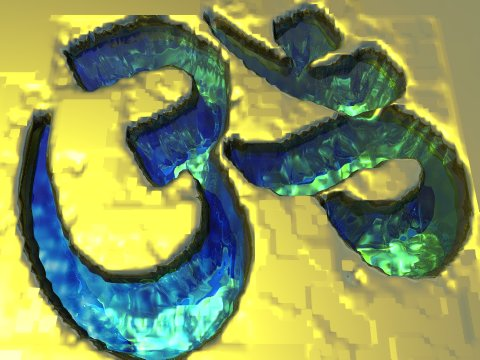

  
[Intangible Textual Heritage](../../index)  [Hinduism](../index) 

------------------------------------------------------------------------

[Buy this Book at
Amazon.com](https://www.amazon.com/exec/obidos/ASIN/B002DEMBW6/internetsacredte)

------------------------------------------------------------------------

<table width="75%">
<colgroup>
<col style="width: 50%" />
<col style="width: 50%" />
</colgroup>
<tbody>
<tr class="odd">
<td width="50%" data-valign="TOP"></td>
<td width="50%" data-valign="CENTER"><h1 id="the-upanishads-part-1-sbe01" data-align="CENTER">The Upanishads, Part 1 (SBE01)</h1>
<h2 id="by-max-müller" data-align="CENTER">by Max Müller</h2>
<h4 id="section" data-align="CENTER">[1879]</h4></td>
</tr>
</tbody>
</table>

------------------------------------------------------------------------

[Contents](#contents)    [Start Reading](sbe01000)    [Page
Index](pageidx)    [Text \[Zipped\]](sbe01.txt.gz)

------------------------------------------------------------------------

**Part I** \|  [Part II](../sbe15/index)

------------------------------------------------------------------------

|                                                                                                                           |
|---------------------------------------------------------------------------------------------------------------------------|
|  |

This is the first volume of the Sacred Books of the East, and the first
etext ever prepared for Intangible Textual Heritage. SBE 1 contains the
introduction to the entire series, and explains the methodology and
conventions used in the rest of the SBE. The Upanishads translated here
are the Chandogya, Talavakara, Aitreya-Aranyaka, the
Kaushitaki-Brahmana, and the Vajasaneyi Samhita.

------------------------------------------------------------------------

[Introduction](#section_000)    [Khândogya Upanishad](#section_001)   
[Talavakâra or Kena-Upanishad](#section_002)  
[Aitareya-Âranyaka](#section_003)   
[Kaushîtaki-Upanishad](#section_004)   
[Vâgasaneyi-Samhitâ-Upanishad](#section_005)

------------------------------------------------------------------------

 [Title Page](sbe01000)  
[Contents](sbe01001)  
[Preface to the Sacred Books of the East](sbe01002)  
[Program of a Translation of the Sacred Books of the East](sbe01003)  
[Transliteration of Oriental Alphabets](sbe01004)  
[Transliteration Chart, Page 1](sbe01005)  
[Transliteration Chart, Page 2](sbe01006)  
[Transliteration Chart, Page 3](sbe01007)  
[Transliteration Chart, Page 4](sbe01008)  
[Sanskrit Transliteration Chart](sbe01009)  

### Introduction to the Upanishads

[First Translation of the Upanishads](sbe01010)  
[Rammohun Roy](sbe01011)  
[Position of the Upanishads in Vedic Literature](sbe01012)  
[Different Classes of Upanishads](sbe01013)  
[Critical Treatment of the Text of the Upanishads](sbe01014)  
[Meaning of the Word Upanishad](sbe01015)  
[Works on the Upanishads](sbe01016)  
[I. The *Kh*ândogya-Upanishad](sbe01017)  
[II. The Talavakâra-Upanishad](sbe01018)  
[III. The Aitareya-Âra*n*yaka](sbe01019)  
[IV. The Kaushîtaki-Brâhmana-Upanishad](sbe01020)  
[V. The Vâgasaneyi-Samhitâ-Upanishad](sbe01021)  

### Khândogya Upanishad

[I, 1](sbe01022)  
[I, 2](sbe01023)  
[I, 3](sbe01024)  
[I, 4](sbe01025)  
[I, 5](sbe01026)  
[I, 6](sbe01027)  
[I, 7](sbe01028)  
[I, 8](sbe01029)  
[I, 9](sbe01030)  
[I, 10](sbe01031)  
[I, 11](sbe01032)  
[I, 12](sbe01033)  
[I, 13](sbe01034)  
[II, 1](sbe01035)  
[II, 2](sbe01036)  
[II, 3](sbe01037)  
[II, 4](sbe01038)  
[II, 5](sbe01039)  
[II, 6](sbe01040)  
[II, 7](sbe01041)  
[II, 8](sbe01042)  
[II, 9](sbe01043)  
[II, 10](sbe01044)  
[II, 11](sbe01045)  
[II, 12](sbe01046)  
[II, 13](sbe01047)  
[II, 14](sbe01048)  
[II, 15](sbe01049)  
[II, 16](sbe01050)  
[II, 17](sbe01051)  
[II, 18](sbe01052)  
[II, 19](sbe01053)  
[II, 20](sbe01054)  
[II, 21](sbe01055)  
[II, 22](sbe01056)  
[II, 23](sbe01057)  
[II, 24](sbe01058)  
[III, 1](sbe01059)  
[III, 2](sbe01060)  
[III, 3](sbe01061)  
[III, 4](sbe01062)  
[III, 5](sbe01063)  
[III, 6](sbe01064)  
[III, 7](sbe01065)  
[III, 8](sbe01066)  
[III, 9](sbe01067)  
[III, 10](sbe01068)  
[III, 11](sbe01069)  
[III, 12](sbe01070)  
[III, 13](sbe01071)  
[III, 14](sbe01072)  
[III, 15](sbe01073)  
[III, 16](sbe01074)  
[III, 17](sbe01075)  
[III, 18](sbe01076)  
[III, 19](sbe01077)  
[IV, 1](sbe01078)  
[IV, 2](sbe01079)  
[IV, 3](sbe01080)  
[IV, 4](sbe01081)  
[IV, 5](sbe01082)  
[IV, 6](sbe01083)  
[IV, 7](sbe01084)  
[IV, 8](sbe01085)  
[IV, 9](sbe01086)  
[IV, 10](sbe01087)  
[IV, 11](sbe01088)  
[IV, 12](sbe01089)  
[IV, 13](sbe01090)  
[IV, 14](sbe01091)  
[IV, 15](sbe01092)  
[IV, 16](sbe01093)  
[IV, 17](sbe01094)  
[V, 1](sbe01095)  
[V, 2](sbe01096)  
[V, 3](sbe01097)  
[V, 4](sbe01098)  
[V, 5](sbe01099)  
[V, 6](sbe01100)  
[V, 7](sbe01101)  
[V, 8](sbe01102)  
[V, 9](sbe01103)  
[V, 10](sbe01104)  
[V, 11](sbe01105)  
[V, 12](sbe01106)  
[V, 13](sbe01107)  
[V, 14](sbe01108)  
[V, 15](sbe01109)  
[V, 16](sbe01110)  
[V, 17](sbe01111)  
[V, 18](sbe01112)  
[V, 19](sbe01113)  
[V, 20](sbe01114)  
[V, 21](sbe01115)  
[V, 22](sbe01116)  
[V, 23](sbe01117)  
[V, 24](sbe01118)  
[VI, 1](sbe01119)  
[VI, 2](sbe01120)  
[VI, 3](sbe01121)  
[VI, 4](sbe01122)  
[VI, 5](sbe01123)  
[VI, 6](sbe01124)  
[VI, 7](sbe01125)  
[VI, 8](sbe01126)  
[VI, 9](sbe01127)  
[VI, 10](sbe01128)  
[VI, 11](sbe01129)  
[VI, 12](sbe01130)  
[VI, 13](sbe01131)  
[VI, 14](sbe01132)  
[VI, 15](sbe01133)  
[VI, 16](sbe01134)  
[VII, 1](sbe01135)  
[VII, 2](sbe01136)  
[VII, 3](sbe01137)  
[VII, 4](sbe01138)  
[VII, 5](sbe01139)  
[VII, 6](sbe01140)  
[VII, 7](sbe01141)  
[VII, 8](sbe01142)  
[VII, 9](sbe01143)  
[VII, 10](sbe01144)  
[VII, 11](sbe01145)  
[VII, 12](sbe01146)  
[VII, 13](sbe01147)  
[VII, 14](sbe01148)  
[VII, 15](sbe01149)  
[VII, 16](sbe01150)  
[VII, 17](sbe01151)  
[VII, 18](sbe01152)  
[VII, 19](sbe01153)  
[VII, 20](sbe01154)  
[VII, 21](sbe01155)  
[VII, 22](sbe01156)  
[VII, 23](sbe01157)  
[VII, 24](sbe01158)  
[VII, 25](sbe01159)  
[VII, 26](sbe01160)  
[VIII, 1](sbe01161)  
[VIII, 2](sbe01162)  
[VIII, 3](sbe01163)  
[VIII, 4](sbe01164)  
[VIII, 5](sbe01165)  
[VIII, 6](sbe01166)  
[VIII, 7](sbe01167)  
[VIII, 8](sbe01168)  
[VIII, 9](sbe01169)  
[VIII, 10](sbe01170)  
[VIII, 11](sbe01171)  
[VIII, 12](sbe01172)  
[VIII, 13](sbe01173)  
[VIII, 14](sbe01174)  
[VIII, 15](sbe01175)  

### Talavakâra or Kena-Upanishad

[Khanda I](sbe01176)  
[Khanda II](sbe01177)  
[Khanda III](sbe01178)  
[Khanda IV](sbe01179)  

### Aitareya-Âranyaka

[I, 1, 1](sbe01180)  
[I, 1, 2](sbe01181)  
[I, 1, 3](sbe01182)  
[I, 1, 4](sbe01183)  
[I, 2, 1](sbe01184)  
[I, 2, 2](sbe01185)  
[I, 2, 3](sbe01186)  
[I, 2, 4](sbe01187)  
[I, 3, 1](sbe01188)  
[I, 3, 2](sbe01189)  
[I, 3, 3](sbe01190)  
[I, 3, 4](sbe01191)  
[I, 3, 5](sbe01192)  
[I, 3, 6](sbe01193)  
[I, 3, 7](sbe01194)  
[I, 3, 8](sbe01195)  
[I, 4, 1](sbe01196)  
[I, 4, 2](sbe01197)  
[I, 4, 3](sbe01198)  
[I, 5, 1](sbe01199)  
[I, 5, 2](sbe01200)  
[I, 5, 3](sbe01201)  
[II, 1, 1](sbe01202)  
[II, 1, 2](sbe01203)  
[II, 1, 3](sbe01204)  
[II, 1, 4](sbe01205)  
[II, 1, 5](sbe01206)  
[II, 1, 6](sbe01207)  
[II, 1, 7](sbe01208)  
[II, 1, 8](sbe01209)  
[II, 2, 1](sbe01210)  
[II, 2, 2](sbe01211)  
[II, 2, 3](sbe01212)  
[II, 2, 4](sbe01213)  
[II, 3, 1](sbe01214)  
[II, 3, 2](sbe01215)  
[II, 3, 3](sbe01216)  
[II, 3, 4](sbe01217)  
[II, 3, 5](sbe01218)  
[II, 3, 6](sbe01219)  
[II, 3, 7](sbe01220)  
[II, 3, 8](sbe01221)  
[II, 4, 1](sbe01222)  
[II, 4, 2](sbe01223)  
[II, 4, 3](sbe01224)  
[II, 5, 1](sbe01225)  
[II, 6, 1](sbe01226)  
[II, 7, 1](sbe01227)  
[III, 1, 1](sbe01228)  
[III, 1, 2](sbe01229)  
[III, 1, 4](sbe01230)  
[III, 1, 5](sbe01231)  
[III, 1, 6](sbe01232)  
[III, 2, 1](sbe01233)  
[III, 2, 2](sbe01234)  
[III, 2, 3](sbe01235)  
[III, 2, 4](sbe01236)  
[III, 2, 5](sbe01237)  
[III, 2, 6](sbe01238)  

### Kaushîtaki-Upanishad

[Adhyâya I](sbe01239)  
[Adhyâya II](sbe01240)  
[Adhyâya III](sbe01241)  
[Adhyâya IV](sbe01242)  

### Vâgasaneyi-Samhitâ-Upanishad, sometimes called Îsâvâsya or Îsâ-Upanishad.

[Î*s*â-Upanishad](sbe01243)  
