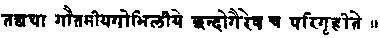
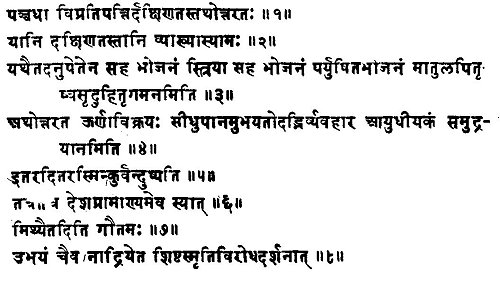
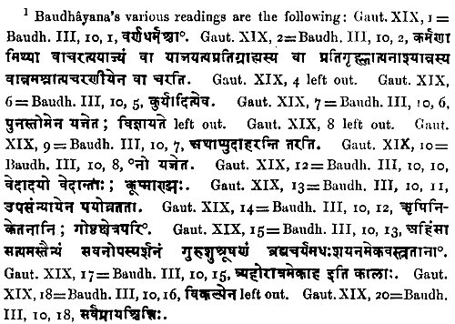
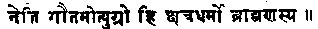

  
[Intangible Textual Heritage](../../index)  [Hinduism](../index.md) 
[Index](index)  [Previous](sbe0202)  [Next](sbe0204.md) 

------------------------------------------------------------------------

p. xlix

# INTRODUCTION TO GAUTAMA

COMPARED with the information collected above regarding the origin and
the history of Âpastamba's Dharma-sûtra, the facts which can be brought
to bear on Gautama's Institutes are scanty and the conclusions deducible
from them somewhat vague. There are only two points, which, it seems to
me, can be proved satisfactorily, viz. the connection of the work with
the Sâma-veda and a Gautama *K*ara*n*a, and its priority to the other
four Dharma-sûtras which we still possess. To go further appears for the
present impossible, because very little is known regarding the history
of the schools studying the Sâma-veda, and because the Dharma*s*âstra
not only furnishes very few data regarding the works on which it is
based, but seems also, though not to any great extent, to have been
tampered with by interpolators.

As regards its origin, it was again Professor Max Müller, who, in the
place of the fantastic statements of a fabricated tradition, according
to which the author of the Dharma*s*âstra is the son or grandson of the
sage Utathya, and the grandson or great-grandson of U*s*anas or *S*ukra,
the regent of the planet Venus, and the book possessed generally binding
force in the second or Tretâ Yuga [1](#fn_81.md),
first put forward a rational explanation which, since, has been adopted
by all other writers on Sanskrit literature. He says, Hist. Anc. Sansk.
Lit., p. 134, 'Another collection of Dharma-sûtras, which, however, is
liable to critical doubts, belongs

p. l

to the Gautamas, a *K*ara*n*a of the Sâma-veda.' This assertion agrees
with Kumârila's statement, that the Dharma*s*âstra of Gautama and the
G*ri*hya-sûtra of Gobhila were (originally) accepted (as authoritative)
by the *Kh*andogas or Sâmavedins alone [1](#fn_82.md). Kumârila certainly refers to the work
known to us. For he quotes in other passages several of its Sûtras [2](#fn_83.md).

That Kumârila and Professor Max Müller are right, may also be proved by
the following independent arguments. Gautama's work, though called
Dharma*s*âstra or Institutes of the Sacred Law, closely resembles, both
in form and contents, the Dharma-sûtras or Aphorisms on the Sacred Law,
which form part of the Kalpa-sûtras of the Vedic schools of Baudhâyana,
Âpastamba, and Hira*n*yake*s*in. As we know from the *K*ara*n*avyûha,
from the writings of the ancient grammarians, and from the numerous
quotations in the Kalpa-sûtras and other works on the Vedic ritual, that
in ancient times the number of Vedic schools, most of which possessed
*S*rauta, G*ri*hya, and Dharma-sûtras, was exceedingly great, and that
the books of many of them have either been lost or been disintegrated,
the several parts being torn out of their original connection, it is not
unreasonable to assume that the aphoristic law-book, usually attributed
to the *Ri*shi Gautama, is in reality a manual belonging to a Gautama
*K*ara*n*a. This conjecture gains considerably in probability, if the
fact is taken into account that formerly a school of Sâma-vedîs, which
bore the name of Gautama, actually existed. It is mentioned in one of
the redactions of the *K*ara*n*avyûha [3](#fn_84.md) as a subdivision of the Râ*n*âyanîya
school. The Va*m*sa-brâhma*n*a of the Sâma-veda, also, enumerates four
members of the Gautama family among the teachers who handed down the
third Veda, viz. Gât*ri* Gautama, Sumantra Bâbhrava

p. li

\[paragraph continues\] Gautama, Sa*m*kara Gautama, and Râdha
Gautama [1](#fn_85.md), and the existing *S*rauta
and G*ri*hya-sûtras frequently appeal to the opinions of a Gautama and
of a Sthavira Gautama [2](#fn_86.md). It follows,
therefore, that at least one, if not several Gautama *K*ara*n*as,
studied the Sâma-veda, and that, at the time when the existing Sûtras of
Lâ*t*yâyana and Gobhila were composed, Gautama *S*rauta and
G*ri*hya-sûtras formed part of the literature of the Sâma-veda. The
correctness of the latter inference is further proved by Dr. Burnell's
discovery of a Pit*ri*medha-sûtra, which is ascribed to a teacher of the
Sâma-veda, called Gautama [3](#fn_87.md).

The only link, therefore, which is wanting in order to complete the
chain of evidence regarding Gautama's Aphorisms on the sacred law, and
to make their connection with the Sâma-veda perfectly clear, is the
proof that they contain special references to the latter. This proof is
not difficult to furnish, For Gautama has borrowed one entire chapter,
the twenty-sixth, which contains the description of the K*rikkh*ras or
difficult penances from the Sâmavidhâna, one of the eight Brâhma*n*as of
the Sâma-veda [4](#fn_88.md). The agreement of the
two texts is complete except in the Mantras (Sûtra 12) where invocations
of several deities, which are not usually found in Vedic writings, have
been introduced. Secondly, in the enumeration of the purificatory texts,
XIX, 12, Gautama shows a marked partiality for the Sâma-veda. Among the
eighteen special texts mentioned, we find not less than nine Sâmans.
Some of the latter, like the B*ri*hat, Rathantara, *G*yesh*th*a, and
Mahâdivâkîrtya chants, are mentioned also in works belonging to the
*Rig*-veda and the Ya*g*ur-veda, and are considered by Brâhma*n*as of
all schools to possess great efficacy. But others, such as the
Purushagati, Rauhina, and Mahâvairâ*g*a Sâmans, have hitherto not been
met with anywhere but in books belonging to the Sâma-veda, and

p. lii

do not seem to have stood in general repute. Thirdly, in two passages,
I, 50 and XXV, 8; the Dharma*s*âstra prescribes the employment of five
Vyâh*ri*tis, and mentions in the former Sûtra, that the last Vyâh*ri*ti
is satyam, truth. Now in most Vedic works, three Vyâh*ri*tis only,
bhû*h*, bhuva*h*, sva*h*, are mentioned; sometimes, but rarely, four or
seven occur. But in the Vyâh*ri*ti Sâman, as Haradatta points out [1](#fn_89.md), five such interjections are used, and
satyam is found among them. It is, therefore, not doubtful, that Gautama
in the above-mentioned passages directly borrows from the Sâma-veda.
These three facts, taken together, furnish, it seems to me, convincing
proof that the author of our Dharma*s*âstra was a Sâma-vedi. If the only
argument in favour of this conclusion were, that Gautama appropriated a
portion of the Sâmavidhâna, it might be met by the fact that he has also
taken some Sûtras (XXV, 1-6), from the Taittirîya Âra*n*yaka. But his
partiality for Sâmans as purificatory texts and the selection of the
Vyâh*ri*tis from the Vyâh*ri*ti Sâman as part of the Mantras for the
initiation (1, 50), one of the holiest and most important of the
Brahmanical sacraments, cannot be explained on any other supposition
than the one adopted above.

Though it thus appears that Professor Max Müller is right in declaring
the Gautama Dharma*s*âstra to belong to the Sâma-veda, it is, for the
present, not possible to positively assert, that it is the Dharma-sûtra
of that Gautama *K*ara*n*a, which according to the *K*ara*n*avyûha
quoted in the Sabdakalpadruma of Râdhâkanta, formed a subdivision of the
Râ*n*âya*n*îyas. The enumeration of four Â*k*âryas, bearing the
family-name Gautama, in the Va*m*sa-brâhma*n*a, and Lâ*t*yâyana's
quotations from two Gautamas, make it not unlikely, that several Gautama
*K*ara*n*as once existed among the Sâma-vedi Brâhma*n*as, and we possess
no means for ascertaining to which our Dharma*s*âstra must be
attributed. Further researches into the history of the schools of the
Sâma-veda must be awaited until we can do more. Probably the living
tradition of the Sâma-vedîs of

p. liii

\[paragraph continues\] Southern India and new books from the South will
clear up what at present remains uncertain.

In concluding this subject I may state that Haradatta seems to have been
aware of the connection of Gautama's law-book with the Sâma-veda, though
he does not say it expressly. But he repeatedly and pointedly refers in
his commentary to the practices of the *Kh*andogas, and quotes the
G*ri*hya-sûtra of the *G*aiminîyas [1](#fn_90.md),
who are a school of Sâma-vedîs, in explanation of several passages.
Another southern author, Govindasvâmin (if I understand the somewhat
corrupt passage correctly), states directly in his commentary on
Baudhâyana I, 1, 2, 6, that the Gautamîya Dharma*s*âstra was originally
studied by the *Kh*andogas alone [2](#fn_91.md).

In turning now to the second point, the priority of Gautama to the other
existing Dharma-sûtras, I must premise that it is only necessary to take
into account two of the latter, those of Baudhâyana and Vasish*th*a.
For, as has been shown above in the Introduction to Âpastamba, the
Sûtras of the latter and those of Hira*n*yake*s*in Satydshâ*dh*a are
younger than Baudhâyana's. The arguments which allow us to place Gautama
before both Baudhâyana and Vasish*th*a are, that both those authors
quote Gautama as an authority on law, and that Baudhâyana has
transferred a whole chapter of the Dharma*s*âstra to his work, which
Vasish*th*a again has borrowed from him.

As regards the case of Baudhâyana, his references to Gautama are two,
one of which can be traced in our Dharma*s*âstra. In the discussion on
the peculiar customs prevailing in the South and in the North of India
(Baudh. Dh. 1, 2, 1-8) Baudhâyana expresses himself as follows:

p. liv

'1. There is a dispute regarding five (practices) both in the South and
in the North.

'2. We shall explain those (peculiar) to the South.

'3. They are, to eat in the company of an uninitiated person, to eat in
the company of one's wife, to eat stale food, to marry the daughter of a
maternal uncle or of a paternal aunt.

'4. Now (the customs peculiar) to the North are, to deal in wool, to
drink rum, to sell animals that have teeth in the upper and in the lower
jaws, to follow the trade of arms and to go to sea.

'5. He who follows (these practices) in (any) other country than the one
where they prevail commits sin.

'6. For each of these practices (the rule of) the country should be
(considered) the authority.

'7, Gautama declares that this is false.

'8. And one should not take heed of either (set of practices), because
they are opposed to the tradition of those learned (in the sacred
law [1](#fn_92).md).'

From this passage it appears that the Gautama Dharma-sûtra, known to
Baudhâyana, expressed an opinion adverse to the authoritativeness of
local customs which might be opposed to the tradition of the
*S*ish*t*as, i.e. of those who really deserve to be called learned in
the law. Our Gautama teaches the same doctrine, as he says, XI, 20, 'The
laws of countries, castes, and families, which are not opposed to the
(sacred) records, have also authority.'

p. lv

As clear as this reference, is the case in which Baudhâyana has borrowed
a whole chapter of our Dharma*s*âstra. The chapter in question is the
nineteenth, which in Gautama's work forms the introduction to the
section on penances and expiation. It is reproduced with a number of
various readings [1](#fn_93.md) in the third
Pra*s*na of Baudhâyana's Dharma-sûtra, where it forms the tenth and last
Adhyâya. Its contents, and especially its first Sûtra which connects the
section on penances with the preceding ones on the law of castes and
orders, make it perfectly clear that its proper position can only be at
the beginning of the rules on expiation, not in the middle of the
discussion, as Baudhâyana places it [2](#fn_94.md).
This circumstance alone would be sufficient to prove that Baudhâyana is
the borrower, not Gautama, even if the name of the latter did not occur
in Baudhâyana's Dharma-sûtra. But the character of many of Baudhâyana's
readings, especially of those in Sûtras 2, 10, 5 11, 13, and 15, which,
though supported by all the MSS. and Govindasvâmin's commentary, appear
to have arisen chiefly through clerical mistakes or carelessness,
furnishes

p. lvi

even an additional argument in favour of the priority of Gautama's text.
It must, however, be admitted that the value of this point is seriously
diminished by the fact that Baudhâyana's third Pra*s*na is not above
suspicion and may be a later addition [1](#fn_95.md).

As regards Baudhâyana's second reference to Gautama, the opinion which
it attribute, to the latter is directly opposed to the teaching of our
Dharma*s*âstra. Baudhâyana gives II, 2, 4, 16 the rule that a Brâhma*n*a
who is unable to maintain himself by teaching, sacrificing, and
receiving gifts, may follow the profession of a Kshatriya, and then goes
on as follows [2](#fn_96.md):

'17. Gautama declares that he shall not do it. For the duties of a
Kshatriya are too cruel for a Brâhma*n*a.'

As the commentator Govindasvâmin also points out, exactly the opposite
doctrine is taught in our Dharma*s*âstra, which (VII, 6) explicitly
allows a Brâhma*n*a to follow, in times of distress the occupations of a
Kshatriya. Govindasvâmin explains this contradiction by assuming that in
this case Baudhâyana [2](#fn_96.md) cites the
opinion, not of the author of our Dharma*s*âstra, but of some other
Gautama. According to what has been said above [3](#fn_97.md), the existence of two or even more ancient
Gautama Dharma-sûtras is not very improbable, and the commentator may
possibly be right. But it seems to me more likely that the Sûtra of
Gautama (VII, 6) which causes the difficulty is an interpolation, though
Haradatta takes it to be genuine. My reason for considering it to be
spurious is that the permission to follow the trade of arms is opposed
to the sense of two other rules of Gautama. For the author states at the
end of the same chapter on times of distress, VII, 25, that 'even a
Brâhma*n*a may take up arms when his life is in danger.' The meaning of
these words can only be, that a Brâhma*n*a must not fight under any
other circumstances.

p. lvii

\[paragraph continues\] But according to Sûtra 6 he is allowed to follow
the occupations of a Kshatriya, who lives by fighting. Again, in the
chapter on funeral oblations, XV, 18, those Brâhma*n*as 'who live by the
use of the bow' are declared to defile the company at a funeral dinner.
It seems to me that these two Sûtras, taken together with Baudhâyana's
assertion that Gautama does not allow Brâhma*n*as to become warriors,
raise a strong suspicion against the genuineness, of VII. 6, and I have
the less hesitation in rejecting the latter Sûtra, as there are several
other interpolated passages in the text received by Haradatta [1](#fn_98.md). Among them I may mention here the Mantras
in the chapter taken from the Sâmavidhâna, XXVI, 12, where the three
invocations addressed to Siva are certainly modern additions, as the old
Sûtrakâras do not allow a place to that or any other Paurâ*n*ic deity in
their works. A second interpolation will be pointed out below.

The Vâsish*th*a Dharma-sûtra. shows also two quotations from Gautama;
and it is a curious coincidence that, just as in the case of
Baudhâyana's references, one of them only can be traced in our
Dharma*s*âstra. Both the quotations occur in the section on impurity,
Vâs. IV, where we read as follows ' [2](#fn_99.md):

'33. If an infant aged less than two years, dies, or in the case of a
miscarriage, the impurity of the Sapi*nd*as (lasts) for three (days and)
nights.

'34. Gautama declares that (they become) pure at once (after bathing).

'35. If (a person) dies in a foreign country and (his Sapi*nd*as) hear
(of his death) after the lapse of ten days, the impurity lasts for one
(day and) night.

'36. Gautama declares that if a person who has kindled the sacred fire
dies on a journey, (his Sapi*nd*as) shall again

p. lviii

celebrate his obsequies, (burning a dummy made of leaves or straw,) and
remain impure (during ten days) as (if they had actually buried) the
corpse.'

The first of these two quotations or references apparently points to
Gautama Dh. XIV, 44, where it is said, that 'if an infant dies, the
relatives shall be pure at once.' For, though Vasish*th*a's Sûtra 34,
strictly interpreted, would mean, that Gautama declares the relatives to
be purified instantaneously, both if an infant dies and if a miscarriage
happens, it is also possible to refer the exception to one of the two
cases only, which are mentioned in Sûtra 33. Similar instances do occur
in the Sûtra style, where brevity is estimated higher than perspicuity,
and the learned commentator of Vasish*th*a does not hesitate to adopt
the same view. But, as regards the second quotation in Sûtra 36, our
Gautama contains no passage to which it could possibly refer.
Govindasvâmin, in his commentary on the second reference to Gautama in
Baudhâyana's Dharma*s*âstra II, 2, 71, expresses the opinion that this
Sûtra, too, is taken from the 'other' Gautama Dharma-sûtra, the former
existence of which he infers from Baudhâyana's passage. And curiously
enough the regarding the second funeral -actually is found in the
metrical V*ri*ddha-Gautama [1](#fn_100.md) or
Vaish*n*ava Dharma-*s*âstra, which, according to Mr. Vâman Shâstrî
Islâmpurkar [2](#fn_101.md), forms chapters 94-115
of the A*s*vamedha-parvan of the Mahâbhârata in a Malayâlam MS.
Nevertheless, it seems to me very doubtful if Vasish*th*a did or could
refer to this work. As the same rule occurs sometimes in the
*S*rauta-sûtras [3](#fn_102.md), I think it more
probable that the *S*rauta-sûtra of the Gautama school is meant. And it
is significant that the V*ri*ddha-Gautama declares its teaching to be
kalpa*k*odita 'enjoined in the Kalpa or ritual.'

Regarding Gautama's nineteenth chapter, which appears in the Vasish*th*a
Dharma*s*âstra as the twenty-second, I have

p. lix

already stated above that it is not taken directly from Gautama's work,
but from Baudhâyana's. For it shows most of the characteristic readings
of the latter. But a few new ones also occur, and some Sûtras have been
left out, while one new one, a well-known verse regarding the efficacy
of the Vai*s*vânara vratapati and of the Pavitresh*t*i, has been added.
Among the omissions peculiar to Vasish*th*a, that of the first Sûtra is
the most important, as it alters the whole character of the chapter, and
removes one of the most convincing arguments as to its original position
at the head of the section on penances. Vasish*th*a places it in the
beginning of the discussion on penances which are generally efficacious
in removing guilt, and after the rules on the special penances for the
classified offences.

These facts will, I think, suffice to show that the Gautama
Dharma*s*âstra may be safely declared to be the. oldest of the existing
works on the sacred law [1](#fn_103.md). This
assertion must, however, not be taken to mean, that every single one of
its Sûtras is older than the other four Dharma-sûtras. Two
interpolations have already been pointed out above [2](#fn_104.md), and another one will be discussed
presently. It is also not unlikely that the wording of the Sûtras has
been changed occasionally. For it is a suspicious fact that Gautama's
language agrees closer with Pâ*n*ini's rules than that of Âpastamba and
Baudhâyana. If it is borne in mind that Gautama's work has been torn out
of its original connection, and from a school-book has become a work of
general authority, and that for a long time it has been studied by
Pandits who were brought up in the traditions of classical grammar, it
seems hardly likely that it could retain much of its ancient
peculiarities of language. But I do not think that the interpolations
and alterations can have affected the general character of the book very
much. It is too methodically planned and too carefully arranged to admit
of any very great changes. The fact, too, that in

p. lx

the chapter borrowed by Baudhâyana the majority of the variae lectiones
are corruptions, not better readings, favours this view. Regarding the
distance in time between Gautama on the one hand, and Baudhâyana and
Vasish*th*a on the other, I refer not to hazard any conjecture, as long
as the position of the Gautamas among the schools of the Sâma-veda has
not been cleared up. So much only can be said that Gautama probably was
less remote from Baudhâyana than from Vasish*th*a. There are a few
curious terms and rules in which the former two agree, while they, at
the same time, differ from all other known writers on Dharma. Thus the
term bhikshu, literally a beggar, which Gautama [1](#fn_105.md) uses to denote an ascetic, instead of
the more common yati or sannyâsin, occurs once also in Baudhâyana's
Sûtra. The same is the case with the rule, III, 13, which orders the
ascetic not to change his residence during the rains. Both the name
bhikshu and the rule must be very ancient, as the *G*ainas and Buddhists
have borrowed them, and have founded on the latter their practice of
keeping the Vasso, or residence in monasteries during the rainy season.

As the position of the Gautamas among the Sâman schools is uncertain, it
will, of course, be likewise inadvisable to make any attempt at
connecting them with the historical period of India. The necessity of
caution in this respect is so obvious that I should not point it out,
were it not that the Dharma*s*âstra contains one word, the occurrence of
which is sometimes considered to indicate the terminus a quo for the
dates of Indian works. The word to which I refer is Yavana. Gautama
quotes, IV, 21, an opinion of 'some,' according to which a Yavana is the
offspring of a *S*ûdra male and a Kshatriya female. Now it is well known
that this name is a corruption of the Greek Ἰαϝων, an Ionian, and that
in India it was applied, in ancient times, to the Greeks, and especially
to the early Seleucids who kept up intimate relations with the first
Mauryas, as well as later to the Indo-Bactrian and Indo-Grecian kings
who from the beginning of the second century B. C. ruled

p. lxi

over portions of north-western India. And it has been occasionally
asserted that an Indian work, mentioning the Yavanas, cannot have been
composed before 300 B. C., because Alexander's invasion first made the
Indians acquainted with the name of-the Greeks. This estimate is
certainly erroneous, as there are other facts, tending to show that at
least the inhabitants of north-western India became acquainted with the
Greeks about 200 years earlier [1](#fn_106.md).
But it is not advisable to draw any chronological conclusions from
Gautama's Sûtra, IV, 21. For, as, pointed out in the note to the
translation of Sûtra IV, 18, the whole section with the second
enumeration of the mixed castes, IV, 17-21, is probably spurious.

The information regarding the state of the Vedic literature, which the
Dharma*s*âstra furnishes, is not very extensive. But some of the items
are interesting, especially the proof that Gautama knew the Taittirîya
Âra*n*yaka, from which he took the first six Sûtras of the twenty-fifth
Adhyâya; the Sâmavidhâna Brâhma*n*a, from which the twenty-sixth Adhyâya
has been borrowed; and the Atharva*s*iras, which is mentioned XIX, 12.
The latter word denotes, according to Haradatta, one of the Upanishads
of the Atharva-veda, which usually are not considered to belong to a
high antiquity. The fact that Gautama and Baudhâyana knew it, will
probably modify this opinion. Another important fact is that Gautama,
XXI, 7, quotes Manu, and asserts that the latter declared it to be
impossible to expiate the guilt incurred by killing a Brâhma*n*a,
drinking spirituous liquor, or violating a Guru's bed. From this
statement it appears that Gautama knew an ancient work on law which was
attributed to Manu. It probably was the foundation of the existing
Mânava Dharma*s*âstra [2](#fn_107.md). No other
teacher on law, besides Manu, is mentioned by name. But the numerous
references to the opinions of 'some' show that Gautama's work was not
the first Dharma-sûtra.

p. lxii

In conclusion, I have to add a few words regarding the materials on
which the subjoined translation is based. The text published by
Professor Stenzler for the Sanskrit Text Society has been used as the
basis [1](#fn_108.md). It has been collated with a
rough edition, prepared from my own MSS. P and C, a MS. belonging to the
Collection of the Government of Bombay, bought at Belgâm, and a MS.
borrowed from a Pu*n*a *S*âstrî. But the readings given by Professor
Stenzler and his division of the Sûtras have always been followed in the
body of the translation. In those cases, where the variae lectiones of
my MSS. seemed preferable, they have been given and translated in the
notes. The reason which induced me to adopt this course was that I
thought it more advisable to facilitate references to the printed
Sanskrit text than to insist on the insertion of a few alterations in
the translation, which would have disturbed the order of the Sûtras. The
notes have been taken from the above-mentioned rough edition and from my
MSS. of Haradatta's commentary, called Gautamîyâ Mitâksharâ, which are
now deposited in the India Office Library, Sansk. MSS. Bühler, Nos.
165-67.

------------------------------------------------------------------------

### Footnotes

[xlix:1](sbe0203.htm#fr_81.md) Manu III, 19;
Colebrooke, Digest of Hindu Law, Preface, p. xvii (Madras ed.);
Anantaya*g*van in Dr. Burnell's Catalogue of Sanskrit MSS., (p. 57;
Pârâ*s*ara, Dharma*s*âstra I, 22 (Calcutta ed.).

[l:1](sbe0203.htm#fr_82.md) Tantravârttika, p. 179
(Benares ed.),  .

[l:2](sbe0203.htm#fr_83.md) Viz. Gautama I, 2 on p.
143; II, 45-46 on p. 112, and XIV, 45-46 on p. 109.

[l:3](sbe0203.htm#fr_84.md) Max Müller, Hist. Anc.
Sansk. Lit., p. 374.

[li:1](sbe0203.htm#fr_85.md) See Burnell,
Va*m*sa-brâhma*n*a, pp. 7, 9, 11, and 12.

[li:2](sbe0203.htm#fr_86.md) See the Petersburg
Dictionary, s. v. Gautama; Weber, Hist. Ind. Lit., p. 77 (English ed.);
Gobhila G*ri*hya-sûtra III, 10, 6.

[li:3](sbe0203.htm#fr_87.md) Weber, Hist. Ind.
Lit., p. 84, note 89 (English ed.)

[li:4](sbe0203.htm#fr_88.md) See below, pp.
[292](sbe0288.htm#page_292.md)-296.

[lii:1](sbe0203.htm#fr_89.md) See Gautama I, 50,
note.

[liii:1](sbe0203.htm#fr_90.md) A G*ri*hya-sûtra. of
the *G*aiminîyas has been discovered by Dr. Burnell with a commentary by
*S*rînivâsa. He thinks that the *G*aiminîyas are a Sûtra-*s*âkhâ of the
*S*â*t*yâyana-Talavakâras.

[liii:2](sbe0203.htm#fr_91.md) My transcript has
been made from the MS. presented by Dr. Burnell, the discoverer of the
work, to the India Office Library. The passage runs as follows: Yathâ vi
bodhâkyanîya*m* dharma*s*âstra*m* kai*sk*id eva pa*th*yamâna*m*
sarvâdhikâram bhavati tathâ gautamîye gobhilîye (?) *kh*andogair eva
pa*th*yate \|\| vâsish*th*a*m* tu bahv*rik*air eva \|\|

[liv:1](sbe0203.htm#fr_92.md) 

[lv:1](sbe0203.htm#fr_93.md)  .

[lv:2](sbe0203.htm#fr_94.md) Baudhâyana's treatment
of the subject of penances is very unmethodical. He devotes to them the
following sections: II, 1-2; II, 2, 3, 48-53; II, 2, 4; III, 5-10; and
the greater part of Pra*s*na IV.

[lvi:1](sbe0203.htm#fr_95.md) See Sacred Books of
the East, vol. xiv, p. xxxiv seq.

[lvi:2](sbe0203.htm#fr_97.md) Baudh. Dh. II, 2, 4,
17.

 

[lvi:3](sbe0203.htm#fr_98.md) See [p.
lii](#page_lii.md).

[lvii:1](sbe0203.htm#fr_99.md) In some MSS. a whole
chapter on the results of various sins in a second birth is inserted
after Adhyâya XIX. But Haradatta does not notice it; see Stenzler,
Gautama, Preface, p. iii.

[lvii:2](sbe0203.htm#fr_100.md) In quoting the
Vâsish*th*a Dh. I always refer to the Benares edition, which is
accompanied by the Commentary of K*ri*sh*n*apa*nd*ita Dharmâdhikârin,
called Vidvanmodinî.

[lviii:1](sbe0203.htm#fr_101.md) Dharma*s*âstra
sa*m*graha (*G*îbânand), p. 627, Adhy. 20, 1 seqq.

[lviii:2](sbe0203.htm#fr_102.md) Parâ*s*ara Dharma
Sa*m*hitâ (Bombay Sansk. Series, No. xlvii), vol. i, p. 9.

[lviii:3](sbe0203.htm#fr_103.md) See e.g. Âp.
*S*r. Sû.

[lix:1](sbe0203.htm#fr_104.md) Professor Stenzler,
too, had arrived independently at this conclusion, see Grundriss der
Indo-Ar. Phil. und Altertumsk., vol. ii, Pt. 8, p. 5.

[lix:2](sbe0203.htm#fr_105.md) See [p.
lvii](#page_lvii.md).

[lx:1](sbe0203.htm#fr_106.md) Gaut. Dh. III, 2,
11; see also Weber, Hist. Ind. Lit., P.327 (English ed.)

[lxi:1](sbe0203.htm#fr_107.md) See my Indian
Studies, No. iii, p. 26, note 1.

[lxi:2](sbe0203.htm#fr_108.md) Compare also Sacred
Books of the East, vol. xxv, p. xxxiv seq.

[lxii:1](sbe0203.htm#fr_109.md) The Institutes of
Gautama, edited with an index of words by A. F. Stenzler, London, 1876.

------------------------------------------------------------------------

[Next: Pra*sn*a I, Pa*t*ala 1, Kha*nd*a 1](sbe0204.md)
