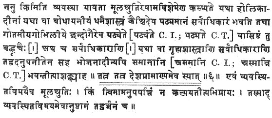
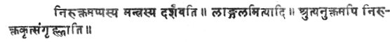
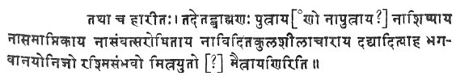

  
[Intangible Textual Heritage](../../index)  [Hinduism](../index) 
[Index](index)  [Previous](sbe1401)  [Next](sbe1403) 

------------------------------------------------------------------------

p. xi

# INTRODUCTION

###### TO

# VASISH*TH*A.

THE Vâsish*th*a Dharma*s*âstra is, like that of Gautama, the last
remnant of the Sûtras of a Vedic school, which, as far as our knowledge
goes at present, has perished, together with the greater part of its
writings. We owe the preservation of its Dharma-sûtra probably to the
special law schools of India, which, attracted as it would seem by its
title and the legend connecting it with Vasish*th*a Maitrâvaru*n*i, one
of the most famous *Ri*shis of the Rig-veda and a redoubtable champion
of Brâhmanism, made it one of their standard authorities. The early
existence of a legend according to which the Vâsish*th*a Dharma-sûtra
was considered either to be a work composed by the *Ri*shi Vasish*th*a,
or at least to contain the sum of his teaching on the duty of man, is
indicated by several passages of the work itself. For the Dharma-sûtra
names Vasish*th*a, or appeals to his authority on no less than three
occasions. First, we find a rule on lawful interest, which is
emphatically ascribed to Vasish*th*a [1](#fn_0).
'Learn the interest for a money lender,' the Sûtra says, 'declared by
the word of Vasish*th*a; five mâshas (may be taken) for twenty
(kârshâpa*n*as every month).' Again, at the end of a long string of
rules [2](#fn_1) which contain the observances to
be kept by sinners who undergo K*rikkh*ra penances, Vasish*th*a's name
is brought forward as the authority for them, and the last words are,
'Thus speaks the divine Vasish*th*a.' Finally, the concluding Sûtra of
the whole work [3](#fn_2) gives

p. xii

expression to the devotion felt by the author for the *Ri*shi,
'Adoration to Vasish*th*a, *S*atayâtu, the son of Mitra and Varu*n*a and
of Urva*s*î.' The epithets used in this last passage conclusively show
that the Vasish*th*a after whom the Dharma-sûtra is named, is the
individual who, according to the Brâhmanical tradition, is the *Ri*shi
of a large portion of the seventh Ma*nd*ala of the Rig-veda and the
progenitor of the Vâsish*th*a clan of Brâhmans, and who in some hymns of
the Rig-veda appears as the purohita or domestic priest of king Sudâs
and the rival of Vi*s*vâmitra, and in other Sûktas as a half mythical
being. For the verses Rig-veda VII, 33, 11-14 trace the origin of this
Vasish*th*a to the two sons of Aditi, Mitra and Varu*n*a, and to the
Apsaras Urva*s*î, and contain the outline of the curious, but disgusting
story of his marvellous birth, which Sâya*n*a narrates more
circumstantially in the commentary on verse 11. Moreover, the word
*S*atayâtu, which in the Dharma-sûtra is used as an epithet of
Vasish*th*a, occurs Rig-veda VII, 18, 21 in close connexion with the
*Ri*shi's name. Sâya*n*a explains it in his commentary on the latter
passage as 'the destroyer of many demons,' or, 'he whom many demons seek
to destroy,' and takes it as an epithet of the sage Parâ*s*ara, who is
named together with Vasish*th*a. It would, however, seem that, if the
verse is construed on strictly philological principles, neither
Sâya*n*a's interpretation, nor that suggested by the Dharma-sûtra can be
accepted, and that *S*atayâtu has to be taken as a proper name [1](#fn_3). But, however that may be, it is not
doubtful that we may safely infer from the expressions used in the last
sentence of the Dharma-sûtra, that the Vasish*th*a to whom the
invocation is addressed and the composition of the work is ascribed,
either immediately or through the medium of pupils, is the individual
named in the Rig-veda. The connexion of the Dharma-sûtra with one of the
*Ri*shis of the Rig-veda which is thus established, possesses a
particular interest and importance, because it corroborates the
statement of Govindasvâmin, the commentator of Baudhâyana, that the
Institutes of Vasish*th*a were

p. xiii

originally studied by and authoritative for the Bahv*rik*as, the
*Ri*gvedins alone, and afterwards became an authority for all
Brâhmans [1](#fn_4). In the introduction to
Gautama it has been shown that a similar assertion which Govinda makes
with regard to the Gautama Dharma-sûtra can be corroborated by a
considerable amount of external and internal evidence. It has been
pointed out that not only the fact that the spiritual pedigrees of the
*Kh*andoga schools enumerate several Gautamas, but also the partiality
for texts of the Sâma-veda, which the Institutes of Gautama show on
several occasions, strongly support the tradition that the Gautamîya
Dharma*s*âstra originally was the exclusive property of a school of
Sâmavedins. In the case of the Vâsish*th*a Dharma*s*âstra indications of
the latter kind are, if not entirely wanting, at least very faint. The
number of Vedic passages quoted is, no doubt, large; but few among them
belong to the class of Mantras which are recited during the performance
of g*ri*hya rites, and must be taken from the particular recension of
the Veda to which the performer belongs. Besides, the texts of this
description which actually occur, do not bear the mark of a particular
Veda or *S*âkhâ. The numerous texts, on the other hand, which are quoted
in support or explanation of the rules, are taken impartially from all
the three ancient Vedas. For this reason it would be dangerous to use
the references to a dozen *Rik*as in chapters XVII and XXVI, as well as
to the legend of Suna*h*sepa, which is told only in works belonging to
the Rig-veda,

p. xiv

as a proof that the Vâsish*th*a Dharma*s*âstra is the work of a
*Ri*gvedin. Under these circumstances the three passages, mentioning
Vasish*th*a's name, and especially the last which identifies him with
the *Ri*shi of the Rig-veda, have a particularly great importance, as
they are the only pieces of internal evidence which can be brought
forward in favour of Govindasvâmin's valuable statement. But the latter
is, even without any further corroboration, credible enough, because no
reason is apparent why Govinda should have invented such a story, and
because his assertion fully agrees with the well-established facts known
about the other existing Dharma-sûtras, which all were composed not for
the benefit of the Âryans in general, but in order to regulate the
conduct of particular sections of the Brâhmanical, community.

There is, however, one point in Govindasvâmin's statement which requires
further elucidation. He says that the Bahv*rik*as, i.e. the *Ri*gvedins
in general, formerly studied the Vâsish*th*a Dharma*s*âstra. It might,
therefore, be inferred that the work possessed equal authority among the
A*s*valâyanîyas, the Sâṅkhâyanîyas, the Mâ*nd*ûkâyanas, and all the
other schools of the Rig-veda, and that it belonged to the most ancient
heirlooms of its adherents. That is, however, improbable for several
reasons. For, first, neither the A*s*valâyanîyas nor the Sâṅkhâyanîyas
of the present day study or attach any special importance to the
Vâsish*th*a Dharma*s*âstra. Secondly, if the Vâsish*th*a Dharma*s*âstra
had ever been the common authority on Dharma in all the different
schools of the Rig-veda, it would be necessary to ascribe to it an
antiquity which it clearly does not possess. All Sûtras were originally
composed for a single school only. Where we find that the same Sûtra is
adopted by several *K*ara*n*as, as is the case with the Dharma-sûtra,
which both the Âpastambîyas and the Haira*n*yake*s*as study, and with
the *K*ayana-sûtra, which the Bhâradvâ*g*as and the Haira*n*yake*s*as
have in common, it is evident that the later school did not care to
compose a treatise of its own on a certain subject, but preferred to
take over the composition of an earlier teacher, If, now, a Sûtra on a
certain

p. xv

subject were acknowledged by all the schools of one Veda, it would
follow that it must belong to the most ancient books of that Veda, and
must have been adopted successively by all its later schools. In such a
case the Sûtra must certainly show signs of its great antiquity. But if
we look for the latter in the Vâsish*th*a Dharma-sûtra, the trouble will
be in vain. Though that work contains a good deal that is archaic, yet,
as will be shown presently, its numerous quotations from Vedic writings
and older Dharma-sûtras clearly prove that it does not belong to the
oldest productions of its class, but takes even among the still existing
Institutes of the Sacred Law only a secondary rank. Under these
circumstances the correct interpretation of Govindasvâmin's words will
be, that according to the Brâhmanical tradition, known to him, some
school of *Ri*gvedins, the name of which he did not know, or did not
care to give, originally possessed the Vâsish*th*a Dharma*s*âstra as its
exclusive property, and that the work later, through the action of the
special law schools, acquired general authority for all Brâhmans. It is
a pity that no authentic information regarding the name of that school
of *Ri*gvedins has been handed down. But, considering the fact that
Vedic schools are frequently named after Vedic *Ri*shis, it seems not
improbable that it was called after the Vasish*th*a whose authority the
Dharma-sûtra invokes, and that we may assume the former existence of a
Vâsish*th*a school, a Sûtra-*k*ara*n*a, of the Rig-veda [1](#fn_5), founded perhaps by a teacher of the
Vâsish*th*a gotra. This conjecture, which, it must be confessed, is not
supported by any corroborative evidence from the Brâhmanical tradition,
will explain why the title-pages of this and of the first part speak of
a school of Vâsish*th*a.

The position of the Vâsish*th*a Dharma-sûtra in Vedic literature can be
defined, to a certain extent, by an analysis

p. xvi

of its numerous quotations from the Sa*m*hitâs, Brâhma*n*as, and the
older Sûtras. By this means it will become evident that the work belongs
to a period when the chief schools of the three ancient Vedas had been
formed and some of the still existing Dharma-sûtras had been composed.
Faint indications will be found which make it probable that the home of
the school to which it belonged, lay in the northern half of India,
north of the Narmadâ and of the Vindhyas, As regards the quotations from
the *S*ruti, the revealed texts of the Hindus, they are chiefly taken
from the Rig-veda and from three recensions of the Ya*g*ur-veda.
Passages from the Rig-veda-sa*m*hitâ are quoted IV, 21; XVII, 3--4; and
XXVI, 5-7. With respect to the quotations in the latter chapter it must,
however, be noted that its genuineness is, as will be shown in the
sequel, not above suspicion. A Brâhma*n*a of the Rig-veda seems to be
referred to in XVII, 2, 32, 35. But the extracts, given there, agree
only in part with the text of the Aitareya, and it is probable that they
are taken from some lost composition of the same class. A curious Sûtra,
II, 35, shows a great resemblance to the explanations of Vedic passages
given by Yâska in the Nirukta [1](#fn_6). The
passage points either to a connexion of the author with the school of
the Nairuktas or, at least, to an acquaintance with its principles.
Among the schools of the Ya*g*ur-veda, that of the Ka*th*as is twice
referred to by name, XII, 29; XXX, 5. But Professor Weber, who kindly
looked for the quotations in the Berlin MS. of the Kâ*th*aka, has not
been able to find them. A. third passage, I, 37, said to be taken from
the *K*âturmâsyas, i.e. the portion of a Sa*m*hitâ which treats of the
*K*âturmâsya sacrifices, actually occurs in the Kâ*th*aka. But, as it is
likewise found in the *K*âturmâsya-kâ*nd*a of the Maitrâya*n*îyas, it
must remain uncertain from which of the two recensions of the Black
Ya*g*ur-veda it has been quoted. The chapter on the duties of women,
vers. 6-8, contains a

p. xvii

long quotation which, in spite of some small discrepancies, seems to
have been taken from the Taittirîya-sa*m*hitâ of the Black Ya*g*ur-veda.
Passages of the Taittirîya Âra*n*yaka are quoted or referred to X, 35
and XXIII, 23. The White Ya*g*ur-veda is mentioned several times as the
Vâ*g*asaneyi-*s*âkhâ or the Vâ*g*asaneyaka. The former expression occurs
III, 19 and XXIII, 13. The quotations, marked as taken from the
Vâ*g*asaneyaka, XII, 31, XIV, 46 are found in the
*S*atapatha-brâhma*n*a, and another passage of the same work is quoted
I, 45, without a specification of the source. A very clear proof that
the author of the Dharma-sûtra knew the Vâ*g*asaneyi-sa*m*hitâ is
furnished by the Mantra, given II, 34. The text, quoted there, occurs in
three different *S*âkhâs, that of the Vâ*g*asaneyins, that of the
Taittirîyas and the Atharva-veda, and in each shows a few variae
lectiones. Its wording in the Vâ*g*asaneyi-sa*m*hitâ literally agrees
with the version, given in the Sûtra. The Sâma-veda is referred to III,
19, and particular Sâmans are mentioned in the borrowed chapter XXII, 9.
A passage from the Nidâna, probably a work on Stomas and metres, which
belonged to the Bhâllavins, an ancient school of Sâmavedins, occurs I,
14-16. An Upanishad, connected with the Atharva-veda, the
Atharva*s*iras, is mentioned in the borrowed chapter XXII, 9, and the
existence of the Atharva-veda is presupposed, also, by 'the vows called
*S*iras,' which are alluded to in the suspicious chapter XXVI, 11, and
are said to be peculiar to the Atharvavedins [1](#fn_7). The chapters, which are undoubtedly
genuine, contain no allusion to the fourth Veda.

As regards the older works on Dharma, the author of the Institutes of
Vasish*th*a certainly knew and used a treatise, attributed to Yama, the
Dharma-sûtras of Manu, Hârîta and Gautama, and perhaps that of
Baudhâyana. With respect to two verses, which, as the Sûtra says, were
proclaimed by Pra*g*âpati, XIV, 24, 30, it is somewhat doubtful, if it
is meant that they have been taken from a work, attributed to
Pra*g*âpati, or that they are merely utterances, supposed to have been
made by that deity for the benefit

p. xviii

of mankind. The latter view seems, however, the more likely one, as it
is customary in the Sm*ri*tis to ascribe the revelation of social
institutions, ceremonies, and penances to Pra*g*âpati, who, in the older
works, occupies much the same position as Brahmâ, the creator, in the
later religious systems. It is not impossible that some of the
references to Yama, e.g. XI, 20, have to be explained in the same
manner. But other passages, attributed to Yama, e.g. XVIII, 13-26, seem
to have been taken from a work which was considered the production of
the Dharmarâ*g*a. Of course, none of the Yamasm*ri*tis, which exist in
the present day, can be meant. The quotations from Manu are
numerous [1](#fn_8). They have all been taken
from a book attributed to a Manu, and possess a very high interest for
the history of the present metrical Manusm*ri*ti. For the prose passage
from the Mânava, given IV, 5, furnishes the proof that the author of the
Vâsish*th*a Dharma*s*âstra quotes from a Dharma-sûtra attributed to a
Manu, while other quotations show that the Mânava Dharma-sûtra
contained, also, verses, some of which, e.g. XIX, 37, were Trish*t*ubhs,
and that a large proportion of these verses has been embodied in
Bh*ri*gu's version of the Manusm*ri*ti. Fifteen years ago [2](#fn_9) I first called attention to Vasish*th*a's
prose quotation from the Mânava, and pointed out that, if the MSS. of
the Vâsish*th*a Dharma*s*âstra were to be trusted, a small piece of the
lost Mânava Dharma-sûtra, on which the present Manusm*ri*ti is based,
had been found. The incorrectness and the defective state of the
materials which I then had at my disposal did not allow me to go
further. Since that time several, comparatively speaking, good MSS. of
the Institutes of Vâsish*th*a and many inferior ones have been found,
and all, at least all those which I have examined, give the quotation in
prose exactly in the same form. The fact that Vasish*th*a gives, in IV,
5, a prose quotation from Manu may, therefore, be considered as
certain [3](#fn_10). Moreover several of the
best MSS.

p. xix

show, by adding the particle 'iti' at the end of Sûtra 8, that the
quotation from the Mânava is not finished with Sûtra 5, but includes the
two verses given in Sûtras 6 and 7 and the second prose passage in Sûtra
8. Among the verses the first is found entire in the metrical
Manusm*ri*ti, and the second has likewise a representative in that work,
though its concluding portion has been altered in such a manner that the
permission to slaughter animals at sacrifices has been converted into an
absolute prohibition to take animal life. Sûtra 8, which again is in
prose, has no counterpart in the metrical Manusm*ri*ti, as might be
expected from its allowing 'a full-grown ox' or 'a full-grown he-goat'
to be killed in honour of a distinguished Brâhma*n*a or Kshatriya guest.
A closely corresponding passage is found in the *S*atapatha-brâhma*n*a,
and a verse expressing the same opinion in the Yâ*gñ*avalkya Sm*ri*ti,
the versification of a Dharma-sûtra of the White Ya*g*ur-veda. As the
last part of the quotation resembles the text of the Brâhma*n*a and its
language is very archaic, it is quite possible that, though belonging to
the passage from the Mânava-sûtra, it contains a Vedic text, taken from
some hitherto unknown Brâhma*n*a which Manu adduced in support of his
opinion. On this supposition the arrangement of the whole quotation
would be as follows. Sûtra 5 would give the original rule of the author
of the Mânava in an aphoristic form; Sûtras 6-7 would repeat the same
opinion in verse, the latter being probably *S*lokas current among the
Brâhmanical community; and Sûtra 8 would give the Vedic authority for
the preceding sentences. This arrangement would be in strict conformity
with the plan usually followed by the authors of Dharma-sûtras. But
whether Sûtra 8 contains a second original aphorism of the Mânava
Dharma-sûtra or a. Vedic passage, it seems in-disputable that the author
of the Vâsish*th*a Dharma-sûtra knew a treatise attributed to a teacher
called Manu, which, like all other Dharma-sûtras, was partly written in
aphoristic

p. xx

prose and partly in verse. The passage furnishes, therefore, the proof
for Professor Max Müller's conjecture that our metrical Manusm*ri*ti,
like all the older works of the same class, is based on the Dharma-sûtra
of a Vedic Sûtra-*k*ara*n*a. In connexion with this subject it maybe
mentioned that the Institutes of Vasish*th*a contain, besides the
above-mentioned passages, no less than thirty-nine verses [1](#fn_11), which are not marked as quotations, but
occur in Bh*ri*gu's metrical Manusa*m*hitâ. Some of them present more or
less important variae lectiones. Moreover, there are four verses which,
though Vasish*th*a attributes them to Hârîta and Yama [2](#fn_12), are included in our Manusm*ri*ti and
treated as utterances of the father of mankind. The bearing of both
these facts on the history of the Manusm*ri*ti is obvious. But the
frequency of the references to or quotations from Manu which Vasish*th*a
makes, teaches another important lesson. Like the fact that Manu is the
only individual author to whom Gautama refers [3](#fn_13), it shows that in ancient times Manu's
name had as great a charm for the Brahman teachers as it has for those
of the present day, and that the--old Mânava Dharma-sûtra was one of the
leading works- on the subject, or, perhaps, even held that dominant
position which the metrical Manusm*ri*ti. actually occupied in the
Middle Ages and theoretically occupies in our days. It is interesting to
observe that precisely the same inference can be drawn from the early
Sanskrit inscriptions. If these speak of individual authors of
Sm*ri*tis, they invariably place Manu's name first [4](#fn_14).

Vasish*th*a gives only one quotation from Hârîta, II, 6. Hârîta was one
of the ancient Sûtrakâras of the Black Ya*g*ur-veda, who is known also
to Baudhâyana. From a passage which K*ri*sh*n*apa*nd*ita quotes in
elucidation of

p. xxi

\[paragraph continues\] Vasish*th*a XXIV, 6, I conclude that Hârîta was
a Maitrâya*n*îya [1](#fn_15). The relation of
the Vâsish*th*a Dharma-sûtra to Gautama and Baudhâyana has already been
discussed in the introduction to the translation of the former
work [2](#fn_16). To the remarks on its
connexion with Baudhâyana it must be added that the third Pra*s*na of
the Baudhâyana Dharma-sûtra, from which Vasish*th*a's twenty-second
chapter seems to have been borrowed, perhaps does not belong to the
original work, but is a later, though presumably a very ancient,
addition to the composition of the founder of the Baudhâyana school. The
reasons for this opinion will be given below. If Baudhâyana's third
Pra*s*na is not genuine, but has been added by a later teacher of that
school, the interval between Baudhâyana and the author of the
Vâsish*th*a Dharma*s*âstra must be a very considerable one. I have,
however, to point out that the inference regarding the priority of
Baudhâyana to Vasish*th*a is permissible only on the sup-position that
Vasish*th*a's twenty-second chapter is not a later addition to the
latter work, and that, though it is found in all our MSS., this fact is
not sufficient to silence all doubts which might be raised with respect
to its genuineness; for we shall see presently that other chapters in
the section on penances have been tampered with by a later hand. It
will, therefore, be advisable not to insist too strongly on the
certainty of the conclusion that Vasish*th*a knew and used Baudhâyana's
work.

In the introduction to his translation of the Vish*n*usm*ri*ti [3](#fn_17), Professor Jolly has pointed out two
passages of Vasish*th*a which, as he thinks, have been borrowed from
Vish*n*u, and prove the posteriority of the Vâsish*th*a Dharma*s*âstra,
if not to the Vish*n*usm*ri*ti, at least to its original, the Kâ*th*aka
Dharma-sûtra. He contends that the passage Vasish*th*a XXVIII, 20-15 is
a versification of the Sûtras of Vish*n*u LVI, which, besides being
clumsy, shows a number of

p. xxii

corruptions and grammatical mistakes, and that Vasish*th*a XXVIII,
18--22 has been borrowed from Vish*n*u LXXXVII. Professor Jolly's
assertion regarding the second passage involves, however, a little
mistake. For the first two *S*lokas, Vasish*th*a XXVIII, 18-19, describe
not the gift of the skin of a black antelope, which is mentioned in the
first six Sûtras of Vish*n*u LXXXVII, but the rite of feeding Brâhmans
with honey and sesamum grains, which occurs Vish*n*u XC, 10. The three
verses, Vasish*th*a XXVIII, 20--22, on the other hand, really are the
same as those given by Vish*n*u LXXXVII, 8-10. It is, however, expressly
stated in the Vish*n*usm*ri*ti that they contain a quotation, and are
not the original composition of the author of the Dharma-sûtra. Hence no
inference can be drawn from the recurrence of the same stanzas in the
Vâsish*th*a Dharma-sûtra. As regards the other passage, Vasish*th*a
XXVIII, 10-15, Professor Jolly is quite right in saying that it is a
clumsy versification of Vish*n*u's Sûtras, and it is not at all
improbable that Vasish*th*a's verses may have been immediately derived
from the Kâ*th*aka. The further inference as to the priority of the
ancient Kâ*th*aka-sûtra to Vasish*th*a, which Professor Jolly draws from
the comparison of the two passages, would also be unimpeachable, if the
genuineness of Vasish*th*a's twenty-eighth chapter were certain. But
that is unfortunately not the case. Not only that chapter, but the
preceding ones, XXV--XXVII, in fact the whole section on secret
penances, are, in my opinion, not only suspicious, but certainly betray
the hand of a later restorer and corrector. Everybody who carefully
reads the Sanskrit text of the Dharma-sûtra will be struck by the change
of the style and the difference in the language which the four chapters
on secret penances show, as compared with the preceding and following
sections. Throughout the whole of the first twenty-four chapters and in
the last two chapters we find a mixture of prose and verse. With one
exception in the sixth chapter, where thirty-one verses form the
beginning of the section on the rule of conduct, the author follows
always one and the same plan in arranging his materials. His own rules
are given first in the form of aphorisms, and after

p. xxiii

these follow the authorities for his doctrines, which consist either of
Vedic passages or of verses, the latter being partly quotations taken
from individual authors or works, partly specimens of the versified
maxims current among the Brâhmans, and sometimes memorial verses
composed by the author himself. But chapters XXV--XXVIII contain not a
single Sûtra. They are made up entirely of Anush*t*ubh *S*lokas, and the
phrases [1](#fn_18) 'I will now declare,'
'Listen to my words,' which are so characteristic of the style of the
later metrical Sm*ri*tis and of the Purâ*n*as, occur more frequently
than is absolutely necessary. Again, in the first twenty-four and the
last two chapters the language is archaic Sanskrit, interspersed here
and there with Vedic anomalous forms. But in the four chapters on secret
penances we have the common Sanskrit of the metrical Sm*ri*tis and
Purâ*n*as, with its incorrect forms, adopted in order to fit
inconvenient words into the metre. Nor is this all. The contents of a
portion of this suspicious section are merely useless repetitions of
matters dealt with already in the preceding chapters, while some verses
contain fragmentary rules on a subject which is treated more fully
further on. Thus the description of the K*rikkh*ra and *K*ândrâya*n*a
penances, which has been given XXI, 20 and XXIV, 45, is repeated XXVII,
16, 21. Further, the enumeration of the purificatory texts XXVIII, 10-15
is merely an enlargement of XXII, 9. Finally, the verses XXVIII, 16-22
contain detached rules on gifts, and in the next chapter, XXIX, the
subject is begun once more and treated at considerable length. Though it
would be unwise to assume that all genuine productions of the old
Sûtrakâras must, throughout, show regularity and consistency, the
differences between the four chapters and the remainder of the work,
just pointed out, are, it seems to me, sufficient to warrant the
conclusion that they do not belong to the author of the Institutes.
Under these circumstances it might be assumed that the whole section is
simply an interpolation. But that would be going too far. For, as other
Dharma-sûtras show, one or even several chapters on secret penances
belonged to such works.

p. xxiv

\[paragraph continues\] Moreover, in the section on women, Vasish*th*a
V, 3-4, the author makes a cross-reference to the rahasyas, the section
on secret penances, and quotes by anticipation half a *S*loka which is
actually found in chapter XXVIII. The inference to be drawn from these
facts is, that the section on secret penances is not simply a later
addition intended to supply an omission of the first writer, but that,
for some reason or other, it has been remodelled. The answer to the
question why this was done is suggested, it seems to me, partly by the
state of the MSS. of the Vâsish*th*a Dharma*s*âstra, and partly by the
facts connected with the treatment of ancient works by the Pa*nd*its,
which my examination of the libraries of Northern India has brought to
light [1](#fn_19). MSS. of the Vâsish*th*a
Dharma*s*âstra are very rare,. and among those found only three are
complete. Some stop with chapter X, others with chapter XXI, and a few
in the middle of the thirtieth Adhyâya. Moreover, most of them are very
corrupt, .and even the best exhibit some Sûtras which are hopeless.
These circumstances show clearly that after the extinction of the Vedic
school, with which the work originated, the Sûtra was for some time
neglected, and existed in a few copies only, perhaps even in a single
MS. The materials on which the ancient Hindus wrote, the birch bark and
the palm leaves, are so frail that especially the first and last leaves
of a Pothî are easily lost or badly damaged. Instances of this kind are
common enough in the *G*aina and Ka*s*mîr libraries, where the beginning
and still more frequently the end of many works have been irretrievably
lost. The fate of the Vâsish*th*a Dharma*s*âstra, it would seem, has
been similar. The facts related above make it probable that the MS. or
MSS. which came into the hands of the Pa*nd*its of the special law
schools, who revived the study of the work, was defective. Pieces of the
last leaves which remained, probably showed the extent of the damage
done, and the. Pa*nd*its set to work at the restoration of the lost
portions, just as the Ka*s*mîrian Sâhebrâm Pa*nd*it restored the
Nîlamata-purâ*n*a for Mahârâ*g*a Ra*n*avira*s*i*m*ha. They,

p. xxv

of course, used the verses which they still found on the fragments, and
cleverly supplied the remainder from their knowledge of. Manu and other
Sm*ri*tis, of the Mahâbhârata and the Purâ*n*as. This theory, I think,
explains all the difficulties which the present state of the section on
secret penances raises. Perhaps it may be used also to account for some
incongruities observable in chapter XXX. The last two verses, XXX, 9-10,
are common-places which are frequently quoted in the Mahâbhârata, the
Hariva*m*sa, the Pa*ñk*atantra, and modern anthologies. With their
baldness of expression and sentiment they present a strong contrast to
the preceding solemn passages from the Veda, and look very much like an
unlucky attempt at filling up a break at the end of the MS. In connexion
with this subject it ought, however, to be mentioned that this
restoration of the last part of the Vâsish*th*a Dharma*s*âstra must have
happened in early times, at least more than a thousand years ago. For
the oldest commentators and compilers of digests on law, such as
Vi*gñ*âne*s*vara [1](#fn_20), who lived at the
end of the eleventh century A. D., quote passages from the section on
secret penances as the genuine utterances of Vasish*th*a. These details
will suffice to show why I differ from Professor Jolly with respect to
his conclusion from the agreement of the verses of Vasish*th*a XXVIII,
10-15 with the Sûtras of Vish*n*u LVI.

With the exception of the quotations, the Vâsish*th*a Dharma*s*âstra
contains no data which could be used either to define its relative
position in Sanskrit literature or to connect it with the historical
period of India. The occurrence of the word Romaka, XVIII, 4, in some
MSS., as the name of a degraded caste of mixed origin, proves nothing,,
as other MSS. read Râmaka, and tribes called Rama and Râma*th*a are
mentioned in the Purâ*n*as. It would be wrong to assert on such evidence
that the Sûtra belonged to the time when the Romans, or rather the
Byzantines (Rômaioi), had political relations with India. Nor will it be
advisable to adduce the fact that Vasish*th*a

p. xxvi

\[paragraph continues\] XVI, 10, 14, 15 mentions written documents as a.
means of legal proof, in order to establish the 'comparatively late'
date of the Sûtra. For though the other Dharma-sûtras do not give any
hint that the art of writing was known or in common use in their times,
still the state of society which they describe is so advanced that
people could not have got on without writing, and the proofs for the
antiquity of the Indian alphabets are now much stronger than they were
even a short time ago. The silence of Âpastamba and the other Sûtrakâras
regarding written documents is probably due to their strict adherence to
a general principle under-lying the composition of the Dharma-sûtras.
Those points only fall primarily within the scope of the Dharma-sûtras
which have some immediate, close connexion with the Dharma, the
acquisition of spiritual merit. Hence it sufficed for them to give some
general maxims for the fulfilment of the gu*n*adharma of kings, the
impartial administration of justice, and to give fuller rules regarding
the half-religious ceremony of the swearing in and the examination of
witnesses. Judicial technicalities, like the determination of the legal
value of written documents, had less importance in their eyes, and were
left either to the de*s*â*k*âra, the custom of the country, or to the
Nîti and Artha-*s*âstras, the Institutes of Polity and of the Arts of
common life. It would, also, be easy to rebut attempts at assigning the
Vâsish*th*a Dharma-sûtra to what is usually 'a comparatively late
period' by other pieces of so-called internal evidence tending to show
that it is an ancient work. Some of the doctrines of the Sûtra
undoubtedly belong to an ancient order of ideas. This is particularly
observable in the rules regarding the subsidiary sons, which place the
offspring even of illicit unions in the class of heirs and members of
the family, while adopted sons are relegated to the division of members
of the family excluded from inheritance. The same remark applies to the
exclusion of all females, with the exception of putrikâs or appointed
daughters, from the succession to the property of males, to the
permission to re-marry infant widows, and to the law of the Niyoga or
the appointment of adult

p. xxvii

widows, which Vasish*th*a allows without hesitation, and even extends to
the wives of emigrants. But as most of these opinions occur also in some
of the decidedly later metrical Sm*ri*tis, and disputes on these
subjects seem to have existed among the various Brâhmanical schools down
to a late period, it would be hazardous to use them as arguments for the
antiquity of the Sûtra.

The following points bear on the question where the original home of the
Vedic school, which produced the Dharma-sûtra, was situated. First, the
author declares India north of the Vindhyas, and especially those
portions now included in the North-western Provinces, to be the country
where holy men and pure customs are to be found, I, 8-16. Secondly, he
shows a predilection for those redactions of the Veda and those Sûtras
which belong to the northern half of India, viz. for the Kâ*th*aka, the
Vâ*g*asaneyi-*s*âkhâ, and the Sûtras of Manu and Hârîta. Faint as these
indications are, I think, they permit us to conclude that the Sûtra
belongs to a *K*ara*n*a settled in the north.

As regards the materials on which the subjoined translation is based, I
have chiefly relied on the Benares edition of the text, with the
commentary of K*ri*sh*n*apa*nd*ita Dharmâdhikârî, and on a rough edition
with the varietas lectionum from the two MSS. of the Bombay Government
Collection of 1874-75 [1](#fn_21), B. no. 29 and
Bh. no. 30, a MS. of the Elphinstone College Collection of 1867-68, E.
no. 23 of Class VI, and an imperfect apograph F. in my own collection,
which was made in 1864 at Bombay. The rough edition was prepared under
my superintendence by Vâmanâ*k*ârya *Gh*alkîkar, now teacher of Sanskrit
in the Dekhan College, Pu*n*a. When I wrote the translation, the Bombay
Government MSS. were not accessible to me. I could only use my own MS.
and, thanks to the kindness of Dr. Rost, Colebrooke's MS., I. O. no.
913, from which the now worthless Calcutta editions have been derived
either immediately or mediately. These materials belong to two groups.
The Bombay MS. B., which comes from Benares, closely agrees with
K*ri*sh*n*apa*nd*ita's text; and E., though

p. xxviii

purchased at Pu*n*a, does not differ much from the two. Bh., which comes
from Bhuj in Ka*kh*, and my own MS. F. form. a second group, towards
which Colebrooke's MS., I. O. no. 913, also leans. Ultimately both
groups are derived from one codex archetypus.

The first group of MSS. gives a fuller and in general a correcter text
than the second. But it seems to me that the text of B., and still more
K*ri*sh*n*apa*nd*ita's, has in many places been conjecturally restored,
and that the real difficulties have been rather veiled than solved. I
have, therefore, frequently preferred the readings offered by the second
group, or based on them my conjectural emendations, which have all been
given in the notes. To give a translation without having recourse to
conjectural emendations was impossible, as a European philologist is
unable to avail himself of those wonderful tricks of interpretation
which permit an Indian Pa*nd*it to extract some kind of meaning from the
most desperate passages. In a few cases, where even the best MSS.
contain nothing but a conglomerate of meaningless syllables or
unconnected words, I have thought it advisable to refrain from all
attempts at a restoration of the text, and at a translation. A critical
edition of the Vâsish*th*a Dharma*s*âstra is very desirable, and I trust
that Dr. A. Führer, of St. Xavier's College, Bombay, will soon supply
this want. K*ri*sh*n*apa*nd*ita's commentary, for which he had not the
aid of older v*ri*ttis, shows considerable learning, and has been of
great value to me. I have followed him mostly in the division of the
Sûtras, and have frequently given his opinions in the notes, both in
cases where I- agree with him and in those where I differ from him, but
think his opinion worthy of consideration.

In conclusion, I have to thank Professors R. von Roth, Weber, and Jolly,
as well as Dr. L. von Schröder, for the verification of a number of
Vedic quotations, which they kindly undertook for me, as I was unable to
use my own books of reference during the translation of the work.

------------------------------------------------------------------------

### Footnotes

[xi:1](sbe1402.htm#fr_0) Vâsish*th*a
Dharma*s*âstra II. 51.

[xi:2](sbe1402.htm#fr_1) Vâsish*th*a
Dharma*s*âstra XXIV, 5.

[xi:3](sbe1402.htm#fr_2) Vâsish*th*a
Dharma*s*âstra XXX, it. Similar invocations of teachers at the end of
Sûtras occur frequently, e*g*. Â*s*valâyana *S*rauta-sûtra XII, 15, 14;
Rig-vidhâna V, 3, 4; Yâska, Nirukta, Roth, p. 226.

[xii:1](sbe1402.htm#fr_3) See Petersburg
Dictionary, s. v. *s*atayâtu.

[xiii:1](sbe1402.htm#fr_4) See Sacred Books of
the East, vol. ii, p. xlix, note 2. As Govindasvâmin's statements
possess a considerable importance, I give here the whole commentary on
Baudhâyana I, 1, 2, 6, according to my two MSS., C. I. and C*T*.:

 

[xv:1](sbe1402.htm#fr_5) A school of
Vâsish*th*as, belonging to the Sâma-veda, certainly existed in ancient
times. I have formerly put forward a conjecture that the Vâsish*th*a
Dharma*s*âstra might belong to that school (Digest of Hindu Law Cases,
p. xxii, first edition). But Govindasvâmin's explicit statement makes it
evident that it has to be abandoned.

[xvi:1](sbe1402.htm#fr_6) This resemblance has
not escaped K*ri*sh*n*apa*nd*ita, who says in his commentary,  

[xvii:1](sbe1402.htm#fr_7) See Baudhâyana
Dharma-sûtra II, 8, 14, 2, note

[xviii:1](sbe1402.htm#fr_8) They occur
Vâsish*th*a Dharma*s*âstra I, 17; III, 2; IV, 5-8; XI, 23; XII, 16;
XIII, 16; XIX, 37; XX, 18; XXIII, 43; XXVI, 8.

[xviii:2](sbe1402.htm#fr_9) Digest of Hindu Law
Cases, p. xxxi, note, first edition.

[xviii:3](sbe1402.htm#fr_10) Such, I suppose,
will be the opinion of all European scholars. Those Hindus p. xix who allow their religious convictions to get
the better of their reason, will perhaps prefer K*ri*sh*n*apa*nd*ita's
ingenious, but unsound explanation of the words iti mânavam, by iti
manumatam, 'such is the opinion of Manu.'

[xx:1](sbe1402.htm#fr_11) Vâsish*th*a
Dharma*s*âstra I, 22; II, 3, 10, 27, 48; III, 5, 11, 60; V, 2; VI, 6, 8,
II, 13, 19; VIII, 7, 15; X, 21-22; XI, 27-28, 32, 35; XIII, 48; XIV, 13,
16, 18; XVI, 18, 33-34; XVII, 5, 8; XVIII, 14, 15; XIX, 48; XX, 18; XXV,
4-5, 7; XXVII, 3.

[xx:2](sbe1402.htm#fr_12) Vâsish*th*a
Dharma*s*âstra 11,-6; XVIII, 14-15; XIX, 48.

[xx:3](sbe1402.htm#fr_13) Sacred Books of the
East. vol. ii, p. lvii.

[xx:4](sbe1402.htm#fr_14) See e.g. the grant of
Dhruvasena I, dated Sa*m*vat, i.e. Guptasa*m*vat 207, Pl. i, l. 7; Ind.
Ant., vol. iv. p. 105.

[xxi:1](sbe1402.htm#fr_15) He says:  

[xxi:2](sbe1402.htm#fr_16) Sacred Books of the
East, vol. ii, pp, liii-lv.

[xxi:3](sbe1402.htm#fr_17) Sacred Books of the
East, vol. vii, p. xviii.

[xxiii:1](sbe1402.htm#fr_18) See XXV, 1; XXVII,
10; XXVIII, 10, 20.

[xxiv:1](sbe1402.htm#fr_19) See Report on a Tour
in Ka*s*mîr, Journal of the Bombay Branch of the Royal Asiatic Society,
vol. xii, p. 33.

[xxv:1](sbe1402.htm#fr_20) Thus Vasish*th*a
XXVIII, y is quoted in the Mitâksharâ on Yâ*gñ*avalkya III, 298; XXVIII,
10-15 on Yâ*gñ*avalkya III, 309; and XXVIII, 18-19, 2a on Yâ*gñ*avalkya
III, 310.

[xxvii:1](sbe1402.htm#fr_21) See Report on
Sanskrit MSS. 1874-75, p. 11.

------------------------------------------------------------------------

[Next: Introduction to Baudhâyana](sbe1403)
