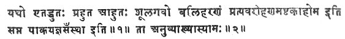
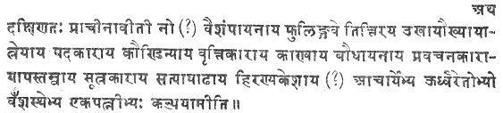
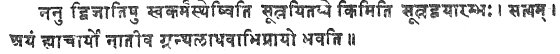

  
[Intangible Textual Heritage](../../index)  [Hinduism](../index.md) 
[Index](index)  [Previous](sbe1402)  [Next](sbe1404.md) 

------------------------------------------------------------------------

p. xxix

# INTRODUCTION

###### TO

# BAUDHÂYANA.

THE case of the Baudhâyana Dharma-sûtra is in many respects analogous to
that of the Institutes of the Sacred Law, current in the schools of
Âpastamba and Hira*n*yake*s*in. Like the latter, it is the work of a
teacher of the Black Ya*g*ur-veda, who composed manuals on all the
various subdivisions of the Kalpa, and founded a Sûtra-*k*ara*n*a, which
is said to exist to the present day [1](#fn_22.md).
The Brâhmanical tradition, too, acknowledges these facts, and, instead
of surrounding Baudhâyana's work with a halo of myths, simply states
that it was originally studied by and authoritative for the followers of
the Taittirîya-veda alone, and later only became one of the sources of
the Sacred Law for all Brâhmans [2](#fn_23.md).
Moreover, the position of Baudhâyana among the teachers of the
Ya*g*ur-veda is well defined, and his home, or at least the home of his
school, is known. But here the resemblance stops. For while the Sûtras
of Âpastamba-and Hira*n*yake*s*in have been preserved in care-fully and
methodically arranged collections, where a certain place is assigned to
each section of the Kalpa, no complete set of the Sutras of Baudhâyana's
school has, as yet; been found, and the original position of the
detached portions which are obtainable is not quite certain. Again,
while the works of Âpastamba and Hira*n*yake*s*in seem to have been kept
free from extensive interpolations, several parts of

p. xxx

\[paragraph continues\] Baudhâyana's Sûtras have clearly received
considerable additions from later hands.

According to the researches of Dr. A. Burnell [1](#fn_24.md), whose long residence in Southern India
and intimate acquaintance with its Brâhmanical libraries have made him
the first authority on the literature of the schools of the
Taittirîya-veda, the Sûtras of Baudhâyana consist of six sections, viz.
1. the *S*rauta-sûtras, probably in nineteen Pra*s*nas; 2. The
Karmânta-sûtra in twenty Adhyâyas; 3. The Dvaidha-sûtra in four
Pra*s*nas; 4. The G*ri*hya-sûtra in four Pra*s*nas; 5. The Dharma-sûtra
in four Pra*s*nas; 6. The *S*ulva-sûtra in three Adhyâyas. The results
of the search for Sanskrit MSS. in other parts of India, and especially
in Western India, do not differ materially from those obtained by Dr.
Burnell. The G*ri*hya-sûtra, which in Western India occasionally bears
the title Smârta-sûtra [2](#fn_25.md), contains,
however, nine instead of four Pra*s*nas. The MSS. of the
Baudhâyana-sûtras, which contain the text alone, are all incomplete,
mostly very corrupt and in bad order, and rarely give more than a small
number of Pra*s*nas on detached subjects. The copies in which the text
is accompanied by a commentary are in a better condition. Thus the
Kalpavivara*n*a of Bhavasvâmin [3](#fn_26.md)
extends over the whole of the *S*rauta-sûtra, and over the Karmânta and
the Dvaidha-sûtras. It shows the proper sequence of the Pra*s*nas on
*S*rauta sacrifices, and that probably the Karmânta and the Dvaidha
immediately followed the *S*rauta-sûtra. But there is no hint in the
MSS. or in the commentaries how the G*ri*hya, Dharma, and *S*ulva-sûtras
were originally placed. With respect to these sections, it is only
possible to judge from the analogy of the other extant sets of
Kalpa-sûtras

p. xxxi

and from internal evidence. On these grounds it may be shown that the
order, adopted by Dr. Burnell, is probably the correct one. For the
beginning of the G*ri*hya-sûtra [1](#fn_27.md)
shows by its wording that it was not a separate treatise, but was
immediately connected with some preceding Pra*s*na. The analogy of the
collections of the Âpastambîyas, the Haira*n*yake*s*as, the Ka*th*as,
and other schools permits us to infer that it stood after the
*S*rauta-sûtra. It is further clear that, in its turn, it was succeeded
by the Dharma-sûtra. For two passages of the latter work, 1, 2, 3, 15,
and II, 8, 15, 9, clearly contain references to the G*ri*hya-sûtra. In
the former, the author gives the rule regarding the length of the staff
to be carried by a student, as well as the general principle that the
staff must be cut from a tree fit for sacrificial purposes. With respect
to the latter clause he adds that the details have been given above.' As
the Dharma-sûtra contains nothing more on this subject, it follows that
the expression 'above' must refer to G*ri*hya-sûtra II, 7, where the
usual detailed rules regarding the employment of particular woods for
the several var*n*as are given. In the second passage Baudhâyana says
that the rules for the performance of funeral sacrifices have been fully
explained in the section on the Ash*t*akâhoma, which occurs
G*ri*hya-sûtra II, 17-18. It is, therefore, perfectly certain that
Baudhâyana, just like Âpastamba, placed the Pra*s*nas on the Sacred Law
after those on the domestic ceremonies, and that the Dharma-sûtra was
not a separate work. Under these circumstances it becomes highly
probable that the *S*ulva-sûtra formed, as is the case in other sets of
Kalpa-sûtras, the conclusion of the whole. Thus the only treatise, whose
position remains doubtful, is the Pravarakha*nd*a, the list of the
Brâhmanical gotras and of their deified ancestors [2](#fn_28.md). Possibly it may have stood at the end of
the *S*rauta-sûtra.

p. xxxii

The destruction of the continuity of Baudhâyana's Kalpa-sûtra has had
the consequence which is commonly observable in other dismembered works,
that several of its detached portions have received considerable
additions from later and, as it would seem, from several hands. There
can be no doubt that a small portion only of the nine Pra*s*nas, found
in the Western copies of the G*ri*hya-sûtra, really belongs to
Baudhâyana. For the description of the G*ri*hya rites, which strictly
follows the general plan laid down in the first Sûtra, is completed in
two or three Pra*s*nas [1](#fn_29.md). Next follows
a Pra*s*na on the anuk*ri*tis, rites resembling those comprised in the
subdivisions treated before, and then a Pra*s*na on prâya*sk*ittas, or
expiations of mistakes committed during, and of the neglect of, the
performance of the G*ri*hya-karmâ*n*i. The remaining Pra*s*nas are
filled with a medley of paribhâshâs, general rules, and of full
descriptions of ceremonies, some of which have been given before, while
others are added afresh. Many of the newly-added rites do not belong to
the ancient Brâhmanical worship, but to the Paurânic religions, the
service of *S*iva, Skanda, Nârâya*n*a, and other deities, and some show
an admixture of Tântric elements. In some of the later Pra*s*nas,
especially IV and V, the language closely resembles that of the first
three, and shows the same stereotyped phrases and the same Vedic
anomalous forms. But in other sections, particularly VI-IX, we find,
instead of Sûtras, the common Anush*t*ubh *S*loka throughout, and
expressions peculiar to the metrical Sm*ri*tis and the Purâ*n*as. At the
end of most Adhyâyas we read the phrase, ity âha Baudhâyana*h*, or
bhagavân Baudhâyana*h*, 'thus speaks Baudhâyana, or the divine
Baudhâyana.' Finally, while the first three Pra*s*nas are divided into
Ka*nd*ikâs or Kha*nd*as, the following ones consist of Adhyâyas or
chapters. These differences, as well as the fact that the most important
G*ri*hya rites, arranged according to a special plan, are done with in
the

p. xxxiii

first three Pra*s*nas, necessarily lead to the conclusion that the whole
remainder does not belong to Baudhâyana, but consists of so-called
Pari*s*ish*t*as, which were composed by the adherents of his school.
Further, the fact that the last six Pra*s*nas do not show everywhere the
same style and language, makes it probable that the additions were made
at different times and by different persons.

The Dharma-sûtra seems to have undergone exactly the same fate as the
G*ri*hya-sûtra. It will be obvious even to the readers of the
translation that its fourth Pra*s*na is a later addition. It consists of
two parts. The first, which ends with the fourth Adhyâya, treats of
penances, both public and secret ones. The second, Adhyâyas 5-8,
describes the means of obtaining siddhi, the fulfilment of one's
desires, and recommends for this purpose the offering of the Ga*n*ahomas
after a previous sanctification of the worshipper by means of a course
of austerities. The first part is perfectly superfluous, as the subject
of penances has already been discussed in the first sections of the
second Pra*s*na, and again in chapters 4-10 of the third Pra*s*na. Its
rules sometimes contradict those given before, and in other cases, e*g*.
IV, 2, 10-12, are mere repetitions of previous statements. The
introduction of the means of gaining siddhi, on the other hand, is
without a parallel in other Dharma-sûtras, and the subject is entirely
foreign to the scope of such works. Its treatment, too, shows that
chapters 5-8 do not belong to the author of the bulk of the
Dharma-sûtra. For the description of the preparatory 'restraints' or
austerities contains somewhat more detailed rules for a number of
penances, e.g. the K*rikkh*ras and the *K*ândrâya*n*a, which have
already been described in the preceding Pra*s*nas. Moreover, the style
and the language of the whole fourth Pra*s*na are very different from
those of the three preceding ones, and the differences observable are
exactly the same as those between the first five and the last four
Pra*s*nas of the G*ri*hya-sûtra. The epic *S*loka nearly throughout
replaces the aphoristic prose, and the common slipshod Sanskrit of the
Purâ*n*as appears instead of the archaic forms. Finally, the fourth
Pra*s*na is divided into

p. xxxiv

\[paragraph continues\] Adhyâyas, not into the Ka*nd*ikâs or Kha*nd*as
and Adhyâyas which are found in the first two Pra*s*nas.

This latter peculiarity is also observable in the third Pra*s*na, and
raises a suspicion against the genuineness of that part also. For,
though the third Pra*s*na in style and language resembles the first two,
it is hard to believe that the author should, for no apparent reason,
suddenly have changed the manner of dividing his work towards its end.
This suspicion is further strengthened by two other circumstances.
First, Pra*s*nas I-II really exhaust the discussion of the whole Dharma,
and the third offers supplementary information only on some points which
have been touched upon previously. Secondly, several Adhyâyas of
Pra*s*na III seem to have been borrowed from other works, or to be
abstracts from them. Thus the tenth chapter has certainly been taken
from the Gautamîya Dharma*s*âstra, the sixth bears a very close and
suspicious resemblance to Vish*n*u XLVIII [1](#fn_30.md), and the third looks very much like a
short summary of the doctrine of Vikhanas, whose lost Sûtra contained
the original rule of the order of the Vaikhânasas or hermits, living in
the forest. These circumstances justify, it seems to me, the assumption
that Baudhâyana's original Dharma-sûtra consisted, like Âpastamba's, of
two Pra*s*nas only, and that it received, through followers of his
school, two separate additions, first in very ancient times Pra*s*na
III, where the style of the master is strictly followed, and later
Pra*s*na IV, where the language and phraseology of the metrical
Sm*ri*tis are adopted. It ought to be noted that Govindasvâmin, too,
does not take the whole of the four Pra*s*nas for Baudhâyana's
composition. With respect to several passages [2](#fn_31.md) where Baudhâyana's name is introduced in
order to give weight to the rules, he says that the Sûtras may belong to
'a pupil.' I do not think that the criterion which he uses can be relied
on in every case, because oriental authors without doubt occasionally
speak of themselves as of third

p. xxxv

persons. But the fact that the commentator, though an orthodox Hindu,
had misgivings as to the genuineness of portions of the work, is not
without significance. It seems also that even the first two Pra*s*nas
are not quite free from interpolations. Thus the Ka*nd*ikâs on the
Tarpa*n*a [1](#fn_32.md) are certainly much
enlarged by additions, the verse at I, 5, 11, 36, a repetition of I, 5,
9, 5, and some prose quotations which are introduced by the words athâpy
udâharanti, 'now they quote also,' standing usually before verses only,
are at least suspicious. That the genuineness of many single passages
should be doubtful, is no more than might be expected, not only on
account of the separation of the Dharma-sûtra from the other parts of
the Kalpa, but also because the work, as we shall see further on,
remained for a long time without the protection of a commentary. The
practical conclusion to be drawn from this state of things is that the
greatest caution must be observed in using the Baudhâyana Dharma-sûtra
for historical purposes, and that it will be advisable to draw no
inferences regarding Baudhâyana's relation to other teachers and schools
from the last two Pra*s*nas, and not to trust too much to historical
inferences drawn from single passages of the first two.

The position which Baudhâyana occupies among the teachers of the
Taittirîya-veda has already been discussed in the Introduction to
Âpastamba. It has been shown that according to the Brâhmanical tradition
preserved by Mahâdeva, the commentator of the Hira*n*yake*s*i-sûtras, he
composed the first Sûtra for the followers of his *S*âkhâ. Internal and
external evidence has also been adduced, proving that he certainly was
more ancient than Âpastamba and Hira*n*yake*s*in. It is now possible to
bring forward some further facts bearing on these points. First, in the
section on the Tarpa*n*a, the libations of water offered to various
deities, *Ri*shis, and the manes, II, 5, 9, 14, Kâ*n*va Baudhâyana
receives his share immediately after the *Ri*shis of the Veda and before
Âpastamba, the Sûtrakâra, and

p. xxxvi

\[paragraph continues\] Satyâshâ*dh*a Hira*n*yake*s*in. The same order
is observed in the distribution of the offerings at the Sarpabali,
described in the G*ri*hya-sûtra [1](#fn_33.md),
where the following teachers of the Ya*g*ur-veda are specially named,
viz. Vai*s*ampâyana, Phuliṅgu, Tittiri, Ukha, Aukhya, Âtreya the author
of the Pada-text, Kau*nd*inya the author of the commentary, Kâ*n*va
Baudhâyana the author of the Prava*k*ana, Âpastamba the author of the
Sûtra, and Satyâshâ*dh*a Hira*n*yake*s*in. Neither of these two passages
belongs to Baudhâyana. They are both clearly interpolations. But they
show that Mahâdeva's statement, which makes Baudhâyana the first
expounder of the Kalpa among the Taittirîyavedins, agrees with the
tradition of the Baudhâyanîyas themselves. For not only the place
allotted to Baudhâyana's name, but still more the title Prava*k*anakâra
which he receives, show that the followers of his school placed him
before and above all other teachers of the ritual. The term prava*k*ana,
which literally means 'proclaiming or recitation,' has frequently the
technical sense of 'oral instruction,' and is applied both to the
traditional lore contained in the Brâhma*n*as, and to the more
systematic teaching of the Aṅgas [2](#fn_34.md).
If, therefore, a teacher is called the author of the Prava*k*ana of a
*S*âkhâ, that can only mean that he is something more than a common
Sûtrakâra, and is considered to be the originator of the whole 'system
of instruction among its followers. The epithet Kâ*n*va, which
Baudhâyana receives in both the passages quoted above, indicates that he
belonged to the Vedic Gotra of the Ka*n*vas. It deserves to be noted
that Govindasvâmin, too, on I, 3, 5, 13, explains the name Baudhâyana by
Kâ*n*vâyana [3](#fn_35.md).

p. xxxvii

The style of Baudhâyana's works furnishes, as Dr. Burnell has pointed
out [1](#fn_36.md), another argument for their high
antiquity. Compared with the Sûtras of Âpastamba and Hira*n*yake*s*in
they are much simpler in their arrangement, and the complete absence of
that anxiety to save 'half a vowel' which characterises the fully
developed Sûtra-style is very remarkable. The last point has been
noticed by Govindasvâmin also. In commenting on I, 2, 3, 17-18, where
Baudhâyana first permits students to beg food of men of all castes, and
afterwards explains that he means Âryans who follow their lawful
occupations, he says [2](#fn_37.md), '(If anybody
should ask), "Why give two Sûtras, while one Sûtra, ('A student shall
ask) Âryans who follow their lawful occupations,' would have sufficed?"
(his objection will be) correct. For this teacher is not particularly
anxious to make his book short.' In other cases we find a certain
awkwardness in the distribution of the subject matter, which probably
finds its explanation through the fact that Baudhâyana first attempted
to- bring the teaching of the Taittirîyas on the Dharma into a
systematic form. Thus the rules on the law of inheritance are given
without any apparent necessity and against the custom of the other
Sûtrakâras in two different chapters, I, 5, 11, 9-16 and II, 2, 3, 1-44.
The section on purification, too, is divided into two separate portions,
I, 4, 6-10 and I, 6, 13-15, and the second which treats of the
purification of the vessels at sacrifices, properly ought to have been
placed into the *S*rauta-sûtra, not into the Dharma-sûtra. Again, the
discussion of several topics is repeatedly interrupted by the
introduction of rules belonging to different subjects, and
Govindasvâmin's ingenuity is often taxed to the utmost in order to find
the reason why certain Sûtras which apparently

p. xxxviii

are unconnected with the main subject have been inserted. A third
argument for the great antiquity of Baudhâyana's Sûtras, derived from
the archaic character of some of his doctrines, has been discussed in
the Introduction to Âpastamba [1](#fn_38.md). The
number of instances where Baudhâyana's rules are based on a more ancient
order of ideas than Âpastamba's might be increased very considerably.
But, as now the comparison of the two works is open to all students, I
omit the cases contained in the two Dharma-sûtras, and content myself
with adducing one more from the less accessible G*ri*hya-sûtras. It is a
well-known fact that the ancient Vedic ritual in certain cases admitted
*S*ûdras, and particularly the Rathakâra or carpenter, who, according to
all accounts, has *S*ûdra blood in his veins, to a participation in the
*S*rauta rites. The Taittirîya-brâhma*n*a even gives certain Mantras to
be recited by the Rathakâra at the Agnyâdhâna sacrifice [2](#fn_39.md). Now Baudhâyana, who, Dh. S. I, 9, 17, 6,
derives the origin of the Rathakâras from a Vai*s*ya male and *S*ûdra
female, apparently reckons him amongst the twice-born, and explicitly
allows him to receive the sacrament of the initiation. He says,
G*ri*hya-sûtra II, 5, 8-9, 'Let him initiate a Brâhma*n*a in spring; a
Kshatriya in summer, a Vai*s*ya in autumn, a Rathakâra in the rainy
season; or all of them in spring [3](#fn_40.md).'
But Âpastamba, who shows great hostility against the mixed castes, and
emphatically denies the right of *S*ûdras to be initiated, gives the
same rule regarding the seasons for the initiation both in his G*ri*hya
and Dharma-sûtras [4](#fn_41.md). He, however,
omits the Rathakâra in both cases. There can be no doubt that
Âpastamba's exclusion of the carpenter, which agrees with the sentiments
prevailing in modern Brâhmanical society, is an off-shoot of a later
doctrine, and as both he and Baudhâyana

p. xxxix

belong to the same vidyâva*m*sa, or spiritual family, this difference
may be used as an argument for his posteriority to Baudhâyana. In
connexion with this rule of Baudhâyana's it ought to be mentioned that
even in the present day certain subdivisions of the modern Sutârs or
carpenters actually wear the Brâhmanical thread, and, in spite of the
adverse teaching of the *S*âstras, find Brâhmans willing to perform the
ceremony of investiture for them.

While it thus appears not incredible that Baudhâyana really was the
first Sûtrakâra of the Taittirîyas, the numerous quotations which his
works contain, permit us to form an idea of the extent of the Vedic and
profane literature known to him. Among the Vedic works which he adduces
as authorities, or otherwise refers to, the three sections of the
Taittirîya-veda, the Sa*m*hitâ, the Brâhma*n*a, and the Âra*n*yaka,
naturally take the first place. For the Âra*n*yaka he seems to have used
the Andhra version, as Dh. S. II, 10, 18, 7, 11 references to the
seventy-first Anuvâka of the tenth Prapâ*th*aka occur. Two long
passages, Dh. S. I, 2, 4, 3-8; II, 6, 11, 1-8, which apparently have
been taken from the *S*atapatha-brâhma*n*a, testify to his acquaintance
with the White Ya*g*ur-veda. Baudhâyana does not say expressly that he
quotes from the Brâhma*n*a of the Vâ*g*asaneyins, but Govinda has no
hesitation in pointing to the *S*atapatha as their source. It is
remarkable that the fact noticeable in Âpastamba's quotation from the
*S*atapatha reappears here, and that the wording of the two quotations
does not fully agree with the printed text of the Brâhma*n*a. The
differences in the first passage are, no doubt, partly owing to
corruptions and interpolations in Baudhâyana's text; but that cannot be
said of the second [1](#fn_42.md). References to
the Sâma-veda and the Sâmans occur repeatedly, and the passage from the
Nidâna of Bhâllavins regarding the geographical extent of true
Brâhmanical

p. xl

learning, which Vasish*th*a adduces, is given I, 1, 2, 11-12. From the
Rig-veda a few expiatory hymns and verses, such as the Aghamarsha*n*a
and the Taratsamandîs, are quoted. The Atharva-veda is not referred to
by name, but the existence of Âtharva*n*a schools may be inferred from
the mention made of the vows called *S*iras, II, 8, 14, 2. Among the
authorities on the Sacred Law, mentioned in the Dharma-sûtra, Kâtya I,
2, 3, 46, Maudgalya II, 2, 4, 8, and Aupa*g*andhani II, 2, 3,33, do not
occur in other works of the same class [1](#fn_43.md). Hârîta, who is mentioned II, 1, 2, 21,
and who probably was a teacher of the Maitrâya*n*îya school, is named by
Vasish*th*a and Âpastamba also. The Gautama who is quoted I, 1, 2, 7 and
II, 2, 4, 17, is, as has been shown in the Introduction to Gautama, most
probably the author of the still existing Institutes of Gautama. To the
arguments for the latter view, adduced there, I may add that two other
passages of the Dharma-sûtra, II, 6, 15 and 26, point to a close
connexion between Baudhâyana's and Gautama's works. The former of the
two Sutras contains, with the exception of one small clause in the
beginning, exactly the same description of the duties of a hermit in the
forest as that given by Gautama III, 26-35. The second Sutra states,
just as Gautama's rule III, 36, that the venerable teacher (â*k*âryâ*h*)
prescribes one order only, that of the householders. The reason given
for this opinion differs, however, according to Baudhâyana, from that
adduced in Gautama's text. The almost literal identity of the first long
passage makes it not improbable that Baudhâyana borrowed in this
instance also from Gautama without noting the source from which he drew.
On the other hand, the argument drawn from the fact that the tenth
Adhyâya of Pra*s*na III has been taken from Gautama's Sûtra loses its
force since, as I have shown above, it is improbable that the third
Pra*s*na formed part of Baudhâyana's

p. xli

original work. A metrical work on the Sacred Law seems to be quoted II,
2, 4, 14-15. For, as the second verse, adduced there, says that the
penance for one who violated his Guru's bed has been declared above, it
seems impossible to assume that the two *S*lokas belonged to the
versified maxims of the Dharma current among the learned Brâhmans. If
this quotation is not an interpolation, it proves that, side by side
with the Dharma-sutras, metrical treatises on the Sacred Law existed in
very early times [1](#fn_44.md). One quotation,
finally, which gives a verse from the dialogue of the daughters of
U*s*anas and V*ri*shaparvan seems to have been taken from an epic poem.
The verse is actually found in the Mahâbhârata I, 78, 10, and again 34,
where the altercation between Sarmish*th*â and Devayânî forms part of
the Yayâtyupâkhyâna. Considering what has been said above regarding the
state of the text of the Dharma-sûtra, and our imperfect knowledge of
the history of the Mahâbhârata, it would be hazardous to assert that the
verse proves Baudhâyana's acquaintance with Vyâsa's great epic. It will
be safer to wait for further proofs that it was known to the Sûtrakâras,
before one bases far-going speculations on this hitherto solitary
quotation.

The arguments which maybe brought forward to show that Baudhâyana's home
lay in Southern India are not as strong as those which permit us to
determine the native country of Âpastamba. The portions of the Sutras,
known to me, contain no direct mention of the south except in the
de*s*anir*n*aya or disquisition on the countries, Dharma-sûtra I, 1, 2,
where certain peculiar customs of the southern Brâhmans are enumerated,
and some districts of Southern India, e*g*. Kaliṅga, are referred to as
barbarous countries which must not be visited by Âryans. These
utterances show an acquaintance with the south, but by no means prove
that Baudhâyana lived there. A more significant fact is that Baudhâyana
declares, I, 1, 2, 4, 'going to sea' to be a custom prevailing among the
northern Brâhmans, and afterwards, II, I, 22, places that act at the
head of the Patanîyas,

p. xlii

the more serious offences causing loss of caste. It is probable that by
the latter rule he wished to show his stand-point as a southerner. But
the most conclusive argument in favour of the southern origin of the
Baudhâyanîyas is that they, like the Âpastambîyas and all other
adherents of the Taittirîya schools, are entirely confined to the
Dekhan, and are not found among the indigenous subdivisions of the
Brâhmans in Central and Northern India. This fact is, if not explicitly
stated, at least implied by the passage of the Mahâr*n*ava quoted in the
Introduction to Âpastamba [1](#fn_45.md). It is
proved by the present state of things, and by the evidence of the land
grants of the southern dynasties, several of which have been made in
favour of Baudhâyanîyas. Thus we find a grant of Bukkarâya, the
well-known ruler of Vi*g*ayanagara [2](#fn_46.md),
dated Sakasa*m*vat 1276 or 1354-5 A*D*., in which a Brâhma*n*a, studying
the Baudhâyanîya-sûtra, is mentioned as the donee of a village in
Maisûr. Again, in an inscription of Nandivarman Pallavamalla, which its
editor, the Rev. Mr. Foulkes, places in the ninth century A D. [3](#fn_47.md), a considerable number of Brâhma*n*as of
the Prava*k*ana-sûtra are named as recipients of the royal bounty,
together with some followers of the Âpastambha [4](#fn_48.md) school. As we have seen that Baudhâyana is
called in the G*ri*hya-sûtra the Prava*k*anakâra, it is not doubtful
that the Prava*k*ana-sûtra of this inscription is the Sûtra of his
school. The villages which the grantees received from Nandivarman were
situated on the Pâlâr river in the *K*ittûr districts of the Madras
Presidency. Besides, the interesting tradition which asserts that
Mâdhava-Sâya*n*a, the great commentator of the Vedas, was a
Baudhâyanîya [5](#fn_49.md) is another point which
may be brought forward as evidence for the location of the school in
Southern India. Further,

p. xliii

it must not be forgotten that most and the best MSS. of Baudhâyana's
Sûtras are found in Southern India. There are also some faint
indications that the Andhra country is the particular district to which
Baudhâyana belonged. For his repeated references to voyages by sea and
his rule regarding the duty payable on goods imported by sea show that
he must have lived in a coast district where sea-borne trade flourished,
and the fact that he uses the Andhra recension of the Taittirîya
Âra*n*yaka makes it probable that he was an inhabitant of the eastern
coast.

My estimate of the distance between Baudhâyana and Âpastamba and of that
between the latter and the historical period of India has been given in
the Introduction to Âpastamba, pp. xxii and xliii, and I have nothing
further to add on that subject. The oldest witness for the existence of
the *S*rauta-sûtra of Baudhâyana is its commentator Bhavasvâmin, whom
Dr. Burnell places in the eighth century A. D. The Dharma-sûtra is first
quoted by Vi*gñ*âne*s*vara, circiter 1080-1100 A*D*. Several of the
passages adduced by him are, however, not traceable in the MSS.

As regards the materials on which the translation is based, I had at my
disposal six MSS. of the text and two copies of Govindasvâmin's
commentary, the Bodhâyanîya-dharmavivara*n*a [1](#fn_50), one of which (C. I..md) gives the text also.
These MSS. belong to two chief groups, a northern and a southern one.
The northern group contains two subdivisions. The first comprises (1)
D., a MS. bought by me for the Government of Bombay at Ahmadâbâd (no. 6
of the Dekhan College collection of 1868-69), and about one hundred or
one hundred and fifty years old; (2) P., an old MS. of my own
collection, bought in 1865 at Pu*n*a; (3, 4) B. and Bh., two modern
transcripts, made for me in Baroda and Bombay, Among these, D. alone is
of real value, as P., B., and Bh. faithfully reproduce all its clerical
errors and add a good many new ones. The second subdivision of the
northern group is represented by K., a modern transcript, made for

p. xliv

the Government of Bombay at Kolhâpur in the southern Marâ*th*a country
(Elphinstone College collection of 1867-68, Class VI, no. 2). The MSS.
of the northern group, which give the vulgata current since the times of
Nîlaka*nth*a.(1650 A. D.) and Mitrami*s*ra (circiter 2 700 A. D.) in
Western and Central India, can be easily recognised by the omission of
the third Adhyâya of Pra*s*na IV, and by their placing IV, 5, 1 b-25
after IV, 7, 7. One of the chief differences between K. and the other
MSS. of the northern group is the omission of II, 5, 8, 4-II, 6, 11, 15
in the latter. The southern group of MSS. is formed by M., a slovenly
Devanâgarî transcript of a Grantha MS., no. 610/1929 of the Madras
Government collection [1](#fn_51.md), and by the
text of C. L, a Devanâgarî copy of the MS. of Govindasvâmin's
commentary, presented by Dr. Burnell to the India Office library [2](#fn_52.md), The second copy of the commentary, C. T.,
a Telugu paper MS. from Tanjore, I owe to the kindness of Dr. Burnell.

As might be expected, on account of the southern origin of the
Baudhâyanîya school, M. gives on the whole the best form of the text. It
also carefully marks the Ka*nd*ikâs [3](#fn_53.md)
in the first two Pra*s*nas, ignoring the Adhyâyas altogether, and
contains at the end of each Pra*s*na the first words of each Ka*nd*ikâ,
beginning with the last and ending with the first, after the fashion
which prevails in the MSS. of the Taittirîya Sa*m*hitâ, Brâhma*n*a, and
Âra*n*yaka. Very close to M. comes Govinda's copy, where, however, as in
most northern MSS., the Adhyâyas alone are marked. It is, however,
perfectly certain that in some very difficult passages, which are
disfigured by ancient corruptions, he corrected the text
conjecturally [4](#fn_54.md) In a certain number of
cases the northern MSS. present better and older readings than M. and C.
I. [5](#fn_55.md) Under these

p. xlv

circumstances it has not been possible to follow the commentary or M.
throughout. Though they had to be made the basis, they had in many
passages to be set aside in favour of readings of the northern group. In
some cases I have also been obliged to make conjectural emendations,
which have all been mentioned in the notes. Three Sûtras, I, 8, 16,
13-15, have been left untranslated, because the MSS. offer no safe basis
for a conjectural restoration, and the commentary is defective.

Govinda, who, as Dr. Burnell informs me, is said to be a modern writer,
seems to have composed his vivara*n*a without the aid of older
v*ri*ttis. Though he apparently was well acquainted with the writings
belonging to the Taittirîya-veda, with the ritual and with the common
law-books, he has not succeeded in explaining all the really difficult
passages. Sometimes he is clearly mistaken, and frequently he passes by
in silence words or whole Sûtras, the sense or the general bearing of
which is by no means certain. Though it would be ungrateful on my part
to underrate the importance of his work for my translation, I cannot
place him in the same rank with Haradatta, the commentator of Âpastamba
and Gautama, and can only regret that no older commentary based on the
living tradition of the Baudhâyanîyas has been available. If such a work
were found, better readings and better explanations of many difficult
passages would probably come to light. With the materials at my disposal
the translation has been a work of some difficulty, and in trying to
settle the text I have often experienced the feeling of insecurity which
comes over the decipherer of a difficult inscription when the facsimiles
are bad. The short Adhyâya on adoption, given in the appendix to the
Dharma-sûtra, has been taken from the Smârta or G*ri*hya-sûtra. It does
not belong to Baudhâyana, but is frequently quoted by the writers on
civil law, who wrote in the sixteenth and seventeenth centuries of our
era.

------------------------------------------------------------------------

### Footnotes

[xxix:1](sbe1403.htm#fr_22.md) I must here state
that during my residence in India I have never met with a follower of
Baudhâyana's school, and cannot personally vouch for its existence. But
many Pa*nd*its have assured me that many Baudhâyanîyas are to be found
among the Telingana and Kar*n*â*t*aka Brâhmans.

[xxix:2](sbe1403.htm#fr_23.md) See Govinda's
statement, quoted. above, [p. xiii](sbe1402.htm#page_xiii.md).

[xxx:1](sbe1403.htm#fr_24.md) See Burnell,
Catalogue of a Collection of Sanskrit MS., pp. 24-26, 28, 34-35, and
Tanjore Catalogue, pp. 18a-20b, and especially his remarks at pp. 18 b
and 20 a.

[xxx:2](sbe1403.htm#fr_25.md) This title is found
in the best copy known to me, Elphinstone College Collection of 1867-68,
Class B. I, no. 5, which has been prepared from the MS. of Mr. Limaye at
Ash*t*e. The other copies of the work, found in Western India, e*g*. no.
4 of the same collection and my own copy, are in a bad state, as they
are derived from a MS. the leaves of which were out of order.

[xxx:3](sbe1403.htm#fr_26.md) Burnell, Catalogue of
a Collection of Sanskrit MSS., no. LXXXVIII, and Tanjore Catalogue, no.
CXVII.

[xxxi:1](sbe1403.htm#fr_27.md) According to the
Elph. Coll. MS., Cl. I, B. 5, and my copy, it runs thus:

 

[xxxi:2](sbe1403.htm#fr_28.md) Burnell, Catalogue
of a Collection of Sanskrit MSS., no. CXVIII.

[xxxii:1](sbe1403.htm#fr_29.md) Elphinstone College
Collection, no. 5, according to which all quotations have been made,
gives three Pra*s*nas, my own MS. two Pra*s*nas. The number of the
Kha*nd*as is, however, the same.

[xxxiv:1](sbe1403.htm#fr_30.md) See also Jolly,
Sacred Books of the East, vol. vii, p. xix.

[xxxiv:2](sbe1403.htm#fr_31.md) E.g. Dharma-sûtra
III, 5, 7

[xxxv:1](sbe1403.htm#fr_32.md) Baudhâyana
Dharma-sûtra II, 5, 8-9.

[xxxvi:1](sbe1403.htm#fr_33.md) Baudhâyana
G*ri*hya-sûtra IV, 3 (fol. 29, B. 5, Elph. Coll. copy, no. 5),

 

See also Weber, Hist. Ind. Lit., p. 91 note; Max Müller, Hist. Anc.
Sansk. Lit., p. 223; Burnell, Catalogue of a Collection of Sanskrit
MSS., p. 14, no. LIII.

[xxxvi:2](sbe1403.htm#fr_34.md) See Max Müller,
Hist. Anc. Sansk. Lit., p. 109.

[xxxvi:3](sbe1403.htm#fr_35.md) The discovery that
Baudhâyana bore also the name Kâ*n*va makes it possible p. xxxvii to refer Âpastamba's quotation of an
opinion of a Kâ*n*va, I, 6, 19, 7, to Baudhâyana, instead of to a
teacher of the white Ya*g*ur-veda, Sacred Books of the East, vol. ii, p.
xxvi.

[xxxvii:1](sbe1403.htm#fr_36.md) Tanjore Catalogue,
p. 20b.

[xxxvii:2](sbe1403.htm#fr_37.md)  

[xxxviii:1](sbe1403.htm#fr_38.md) Sacred Books of
the East, vol. ii, pp. xviii-xx.

[xxxviii:2](sbe1403.htm#fr_39.md) See Weber,
Indische Studien X, 12.

[xxxviii:3](sbe1403.htm#fr_40.md)  

[xxxviii:4](sbe1403.htm#fr_41.md) G*ri*hya-sûtra
II, 4, 10, 5; Dharma-sûtra I, 1, 1, 18.

[xxxix:1](sbe1403.htm#fr_42.md) Professor Eggeling
has lately discussed the question of the discrepancies between
Âpastamba's quotations from the Brâhma*n*a of the Vâ*g*asaneyins and the
existing text. I can only agree with him that we must wait for a
comparison of all those quoted, with both the recensions of the
*S*atapatha, before we draw further inferences from the fact. See Sacred
Books of the East, vol. xii, p. xl.

[xl:1](sbe1403.htm#fr_43.md) Possibly Kâ*s*yapa,
whose name occurs in a *S*loka, I, 11, 21, 2, may also be an ancient
teacher to whom Baudhâyana refers. In the G*ri*hya-sûtra a teacher
called *S*âlîki is repeatedly quoted, and once, I, 11 (end), his opinion
is contrasted with that of Baudhâyana and of Â*k*ârya; i.e. Baudhâyana's
teacher. The G*ri*hya-sûtra refers also to Âtreya, Kâ*s*ak*ri*tsna, and
Bâdari.

[xli:1](sbe1403.htm#fr_44.md) See also West and
Bühler, Digest of Hindu Law Cases, p. xxvii, 2nd ed.

[xlii:1](sbe1403.htm#fr_45.md) Sacred Books of the
East, vol. ii, p. xxx; see also L. von Schröder, Maitrâya*n*îya
Sa*m*hitâ, p. xxvii.

[xlii:2](sbe1403.htm#fr_46.md) Journal of the
Bombay Branch. of the Royal Asiatic Society, XII, 349-351.

[xlii:3](sbe1403.htm#fr_47.md) Indian Antiquary,
VIII, 273-284.

[xlii:4](sbe1403.htm#fr_48.md) As all the older
inscriptions hitherto published give Âpastambha instead of Âpastamba, I
am now inclined to consider the former as the original form of the name.

[xlii:5](sbe1403.htm#fr_49.md) Burnell, Tanjore
Catalogue, p. 20 b, remarks on no. CCXXVI.

[xliii:1](sbe1403.htm#fr_50.md) It ought to be
noted that in the south of India the forms Bodhâyana and Bodhâyanîya are
invariably used for Baudhâyana and Baudhâyanîya. But it seems to me that
the southerners are in error, as the affix âyana requires v*ri*ddhi in
the first syllable.

[xliv:1](sbe1403.htm#fr_51.md) Taylor, Catalogue
Raisonnée (!), I, p. 190. The clerical errors in my transcript are
exceedingly numerous, and mostly owing to the faulty rendering of the
value of the Grantha characters, which seem not to have been familiar to
the copyist. There are also some small lacunae, and the last leaf has
been lost.

[xliv:2](sbe1403.htm#fr_52.md) See Burnell,
Catalogue of a Collection of MSS., p. 35, no, CXVII.

[xliv:3](sbe1403.htm#fr_53.md) I alone am
responsible for the title Ka*nd*ikâ, given to the small sections. M.
marks only the figures. D. and the better northern MSS. show only breaks
at the end of the Ka*nd*ikâs and their first words at the end of the
Pra*s*nas.

[xliv:4](sbe1403.htm#fr_54.md) See e*g*.
Dharma-sûtra I, 2, 3, 35, note.

[xliv:5](sbe1403.htm#fr_55.md) See e*g*.
Dharma-sûtra I, 5, 11, 35; II, I, 2, 36; II, 2, 3, 3; II, 2, 4, 10; II,
3, 6, 3; II, 7, 12, 5; III, 9, 2.

------------------------------------------------------------------------

[Next: Chapter I](sbe1404.md)
