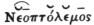
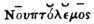

  
[Intangible Textual Heritage](../../index)  [Hinduism](../index) 
[Index](index)  [Previous](sbe3213)  [Next](sbe3215) 

------------------------------------------------------------------------

[Buy this Book at
Amazon.com](https://www.amazon.com/exec/obidos/ASIN/0543968677/internetsacredte)

------------------------------------------------------------------------

  
*Vedic Hymns, Part I (SBE32)*, by Max Müller, \[1891\], at Intangible
Textual Heritage

------------------------------------------------------------------------

Let us now turn back for one moment to look at the slaughter which has
been committed! Is there one single rule of prosody that has been
spared? Is there one single short syllable that must always remain
short, or a long syllable that must always remain long? If all
restrictions of prosody are thus removed, our metres, no doubt, become
perfectly regular. But it should be remembered that these metrical
rules, for which all this carnage has been committed, are not founded
upon any a priori principles, but deduced by ancient or modern
metricians from those very hymns which seem so constantly to violate

p. cxi

them. Neither ancient nor modern metricians had, as far as we know, any
evidence to go upon besides the hymns of the Rig-veda; and the
philosophical speculations as to the origin of metres in which some of
them indulge, and from which they would fain derive some of their
unbending rules, are, as need hardly be said, of no consequence
whatever. I cannot understand what definite idea even modern writers
connect with such statements as that, for instance, the Trish*t*ubh
metre sprang from the *G*agatî metre, that the eleven syllables of the
former are an abbreviation of the twelve syllables of the latter.
Surely, metres are not made artificially, and by addition or
subtraction. Metres have a natural origin in the rhythmic sentiment of
different people, and they become artificial and arithmetical in the
same way as language with its innate principles of law and analogy
becomes in course of time grammatical and artificial. To derive one
metre from another is like deriving a genitive from a nominative, which
we may do indeed for grammatical purposes, but which no one would
venture to do who is at all acquainted with the natural and independent
production of grammatical forms. Were we to arrange the Trish*t*ubh and
*G*agatî metres in chronological order, I should decidedly place the
Trish*t*ubh first, for we see, as it were before our eyes, how sometimes
one foot, sometimes two and three feet in a Trish*t*ubh verse admit an
additional syllable at the end, particularly in set phrases which would
not submit to a Trish*t*ubh ending. The phrase *s*a*m* no bhava dvipade
*s*a*m* *k*atushpade is evidently a solemn phrase, and we see it brought
in without hesitation, even though every other line of the same strophe
or hymn is Trish*t*ubh, i. e. hendecasyllabic, not dodecasyllabic. See,
for instance, VI, 74, 1; VII, 54, 1; X, 85, 44; 165, 1. However, I
maintain by no means that this was the actual origin of *G*agatî metres;
I only refer to it in order to show the groundlessness of metrical
theories which represent the component elements, a foot of one or two or
four syllables as given first, and as afterwards compounded into systems
of two, three or four such feet, and who therefore would wish us to look
upon the hendecasyllabic Trish*t*ubh as originally a dodecasyllabic
*G*agatî, only

p. cxii

deprived of its tail. If my explanation of the name of Trish*t*ubh,
i. e. Three-step, is right, its origin must be ascribed to a far more
natural process than that of artificial amputation. It was to accompany
a choros, i. e. a dance, which after advancing freely for eight steps in
one direction, turned back (v*ri*tta) with three steps, the second of
which was strongly marked, and would therefore, whether in song or
recitation, be naturally accompanied by a long syllable. It certainly is
so in the vast majority of Trish*t*ubhs which have been handed down to
us. But if among these verses we find a small number in which this
simple and palpable rhythm is violated, and which nevertheless were
preserved from the first in that imperfect form, although the temptation
to set them right must have been as great to the ancient as it has
proved to be to the modern students of the Veda, are we to say that
nearly all, if not all, the rules that determine the length and
shortness of syllables, and which alone give character to every verse,
are to be suspended? Or, ought we not rather to consider, whether the
ancient choregic poets may not have indulged occasionally in an
irregular movement? We see that this was so with regard to Gâyatrî
verses. We see the greater freedom of the first and second pâdas
occasionally extend to the third; and it will be impossible, without
intolerable violence, to remove all the varieties of the last pâda of a
Gâyatrî of which I have given examples above, pages
[civ](sbe3213.htm#page_civ) seqq.

It is, of course, impossible to give here all the evidence that might be
brought forward in support of similar freedom Traish*t*ubha V*ri*tta.in Trish*t*ubh verses,
and I admit that the number of real varieties with them is smaller than
with the Gâyatrîs. In order to make the evidence which I have to bring
forward in support of these varieties as unassailable as possible, I
have excluded nearly every pâda that occurs only in the first, second,
or third line of a strophe, and have restricted myself, with few
exceptions, and those chiefly referring to pâdas that had been quoted by
other scholars in support of their own theories, to the final pâdas of
Trish*t*ubh verses. Yet even with this limited evidence, I think I shall
be able to establish at least three

p. cxiii

varieties of Trish*t*ubh. Preserving the same classification which I
adopted before for the Gâyatrîs, so as to include the important eighth
syllable of the Trish*t*ubh, which does not properly belong to the
v*ri*tta, I maintain that class 4.  ̆  ̆  ̄  ̄, class 5.  ̄  ̄  ̄  ̄, and class
8.  ̄  ̆  ̆  ̄ must be recognised as [legitimate](errata.htm#1) endings in
the hymns of the Veda, and that by recognising them we are relieved from
nearly all, if not all, the more violent prosodial licences which
Professor Kuhn felt himself obliged to admit in his theory of Vedic
metres.

§4.  ̆  ̆  ̄  ̄.

The verses which fall under § 4 are so numerous that after those of the
first Ma*nd*ala, mentioned above, they need not be given here in full.
They are simply cases where the eighth syllable is not lengthened, and
they cannot be supposed to run counter to any rule of the Prâti*s*âkhya,
for the simple reason that the Prâti*s*âkhya never gave such a rule as
that the eighth syllable must be lengthened, if the ninth is short.
Examples will be found in the final pâda of Trish*t*ubhs: II, 30, 6;
III, 36, 4; 53, 15; 54, 12; IV, 1, 16; 2, 7; 9; 11; 4, 12; 6, 1; 2; 4;
7, 7; 11, 5; 17, 3; 23, 6; 24, 2; 27, 1; 28, 5; 55, 5; 57, 2; V, 1, 2;
VI, 17, 10; 21, 8; 23, 7; 25, 5; 29, 6; 33, 1; 62, 1; 63, 7; VII, 21, 5;
28, 3; 42, 4; 56, 15; 60, 10; 84, 2; 92, 4; VIII, 1, 33; 96, 9; IX, 92,
5; X, 61, 12; 13; 74, 3; 117, 7.

In support of § 5.  ̄  ̄  ̄  ̄, the number of cases is smaller, but it
should be remembered that it might be considerably increased if I had
not restricted myself to the final pâda of each Trish*t*ubh, while the
first, second, and third pâdas would have yielded a much larger harvest:

§5.  ̄  ̄  ̄  ̄.

I, 89, 9. mâ no madhyâ rîrishatâ̄yūr gāntō*h*.

I, 92, 6. supratîkâ saumanasâ̄yâ̄*g*î̄gā*h*.

I, 114, 5; 117, 2; 122, 1; 122, 8; 186, 3; II, 4, 2; III, 49, 2; IV, 3,
9; 26, 6; V, 41, 14; VI, 25, 2; 66, 11; VII, 8, 6; 28, 4; 68, 1; 71, 2;
78, 1; 93, 7b; IX, 90, 4; X, 11, 8.

p. cxiv

I do not wish to deny that in several of these lines it would be
possible to remove the long syllable from the ninth place by conjectural
emendation. Instead of â´yur in I, 89, 9, we might read â´yu; in I, 92,
6, we might drop the augment of a*g*î*g*ar; in II, 4, 2, we might admit
synizesis in ă͡ră\*tir, and then read
*g*î̄ră-ā*s*vā*h*, as in I, 141, 12. In VI, 25, 2, after eliding the a of
ava, we might read d̆â̄sî̄*h*. But even if, in addition to all this, we
were to admit the possible suppression of final m in asmabhyam, mahyam,
and in the accusative singular, or the suppression of s in the
nominative singular, both of which would be extreme measures, we should
still have a number of cases which could not be righted without even
more violent remedies. Why then should we not rather admit the
occasional appearance of a metrical variation which certainly has a
powerful precedent in the dispondeus of Gâyatrîs? I am not now
acquainted with the last results of metrical criticism in Virgil, but,
unless some new theories now prevail, I well recollect that spondaic
hexameters, though small in number, much smaller than in the Veda, were
recognised by the best scholars, and no emendations attempted to remove
them. If then in Virgil we read,

'Cum patribus populoque, penatibusque et magnis dis,'

why not follow the authority of the best MSS. and the tradition of the
Prâti*s*âkhyas and admit a dispondeus at the end of a Trish*t*ubh rather
than suspend, in order to meet this single difficulty, some of the most
fundamental rules of prosody?

I now proceed to give a more numerous list of Traish*t*ubha pâdas ending
in a choriambus,  ̄  ̆  ̆  ̄, again confining myself, with few exceptions,
to final pâdas:

§ 8.  ̄  ̆  ̆  ̄

I, 62, 3. sam usriyâbhir vâva*s*āntă nărā*h*.

I, 103, 4. yad dha sûnu*h* *s*ravase nâ̄mă dădhē.

I, 121, 9; 122, 10b; 173, 8; 186, 2; II, 4, 3; 19, 1; 33, 14;
IV, 1, 19c [a](#fn_55); 25, 4; 39, 2;
V, 30, 12; 41, 4; 41, 15;

p. cxv

\[paragraph continues\] VI, 4, 7; 10, 5;
11, 4; 13, 1b; 13, 1d; 20, 1b; 20,
1d; 29, 4; 33, 3; 33, 5; 44, 11; 49, 12; 68, 5; 68, 7; VII,
19, 10; 62, 4; IX, 97, 26; X, 55; 8; 99, 9; 108, 6; 169, 1.

It is perfectly true that this sudden change in the rhythm of
Trish*t*ubh verses, making their ending iambic instead of trochaic,
grates on our ears. But, I believe, that if we admit a short stop after
the seventh syllable, the intended rhythm of these verses will become
intelligible. We remarked a similar break in the verses of hymn X, 77,
where the sudden transition to an iambic metre was used with great
effect, and the choriambic ending, though less effective, is by no means
offensive. It should be remarked also, that in many, though not in all
cases, a cæsura takes place after the seventh syllable, and this is, no
doubt, a great help towards a better delivery of these choriambic
Trish*t*ubhs.

While, however, I contend for the recognition of these three varieties
of the normal Trish*t*ubh metre, I am quite willing to admit that other
variations besides these, which occur from time to time in the Veda,
form a legitimate subject of critical discussion.

§ 2.  ̆  ̆  ̆  ̄.

Trish*t*ubh verses, the final pâda of which ends in  ̆  ̆  ̆  ̄, I should
generally prefer to treat as ending in a *G*âgata pâda, in which this
ending is more legitimate. Thus I should propose to scan:

I, 122, 11. pră*s*āstăyē măhĭn̆â̄ ̍ răthăvătē.

III, 20, 5. văsû̄n rūdrâ̄n̐ â̄dīty̆â̄n̐ ̍ ĭhă hŭvē.

V, 2, 1. pŭrā*h* pā*s*yāntĭ nĭhĭtām ̍ (tăm) ărătaū.

VI, 13, 5. văyō v*rĭ*kâ̄y̆â̆răyē ̍ *g*ăsŭrăyē.

§ 1.  ̆  ̄  ̆  ̄.

I should propose the same medela for some final pâdas of Trish*t*ubhs
apparently ending in  ̆  ̄  ̆  ̄. We might indeed, as has been suggested,
treat these verses as single instances of that peculiar metre which we
saw carried out in the whole of hymn X, 77, but at the end of a verse
the admission

p. cxvi

of an occasional *G*âgata pâda is more in accordance with the habit of
the Vedic poets. Thus I should scan:

V, 33, 4. v*rĭ*shâ̄ sămātsŭ d̄â̆sās̍yă nâ̄mă *k*īt [a](#fn_56).

V, 41, 5b. râ̄yă ĕs̄hēऽ̆văsē ̍ dădhî̄tă dhî̄*h*.

After what I have said before on the real character of the teaching of
the Prâti*s*âkhya, I need not show again that the fact of Uva*t*a's
counting to of dadhîta as the tenth syllable is of no importance in
determining the real nature of these hymns, though it is of importance,
as Professor Kuhn remarks (Beiträge, vol. iii, p. 451), in showing that
Uva*t*a considered himself at perfect liberty in counting or not
counting, for his own purposes, the elided syllable of avase.

VII, 4, 6. m̆â̄psăvā*h* părĭ shădâ̄m̍ă mâ̄dŭvā*h*.

§6.  ̆  ̄  ̄  ̄.

Final pâdas of Trish*t*ubhs ending in  ̆  ̄  ̄  ̄ are very scarce. In VI, 1,
4,

bhadrâyâ*m* te ra*n*ayantă sā*m*d*ri̅*sh*t*aū,

it would be very easy to read bhadrâyâ*m* te sa*m*d*ri*sh*t*au
ră*n*ăyāntā; and in X, 74, 2,

dy̆aūr nă vâ̄rēbhī*h* k*rĭn*ăvāntă svăī*h*,

we may either recognise a *G*âgata pâda, or read

dy̆aūr nă vâ̄rēbhī*h* k*rĭn*̍ăvāntă svaī*h*,

which would agree with the metre of hymn X, 77.

§ 7.  ̄  ̄  ̆  ̄

Pâdas ending in  ̄  ̄  ̆  ̄ do not occur as final in any Traish*t*ubha hymn,
but as many *G*âgata pâdas occur in the body of Traish*t*ubha hymns, we
have to scan them as dodecasyllabic:

I, 63, 4a. tv̆ā*m* hā tyăd īndr̆ă *k*ōd̆î̄*h* săkhâ̄.

IV, 26, 6b. părâ̄vătā*h* *s*ăkŭnō māndr̆ām mădām.

The adjective pâvaka which frequently occurs at the end of final and
internal pâdas of Trish*t*ubh hymns has always

p. cxvii

to be scanned p̆â̄văkā. Cf. IV, 51, 2; VI, 5, 2; 10, 4; 51, 3; VII, 3, 1;
9; 9, 1b; 56, 12; X, 46, 7b.

I must reserve what I have to say about other metres of the Veda for
another opportunity, but I cannot leave Omission
of final m and s.this subject without referring once more to a
metrical licence which has been strongly advocated by Professor Kuhn and
others, and by the admission of which there is no doubt that many
difficulties might be removed, I mean the occasional omission of a final
m and s, and the subsequent contraction of the final and initial vowels.
The arguments that have been brought forward in support of this are very
powerful. There is the general argument that final s and m are liable to
be dropt in other Aryan languages, and particularly for metrical
purposes. There is the stronger argument that in some cases final s and
m in Sanskrit may or may not be omitted, even apart from any metrical
stress. In Sanskrit we find that the demonstrative pronoun sas appears
most frequently as sa (sa dadâti), and if followed by liquid vowels, it
may coalesce with them even in later Sanskrit. Thus we see saisha for sa
esha, sendra*h* for sa indra*h* sanctioned for metrical purposes even by
Pâ*n*ini, VI, 1, 134. We might refer also to feminines which have s in
the nominative singular after bases in û, but drop it after bases in î.
We find in the Sa*m*hitâ text, V, 7, 8, svádhitîva, instead of
svádhiti*h*-iva in the Pada text, sanctioned by the Prâti*s*âkhya 259;
likewise IX, 61, 10, Sa*m*hitâ, bhû´my â´ dade, instead of Pada,
bhû´mi*h* â´ dade. But before we draw any general conclusions from such
instances, we should consider whether they do not admit of a grammatical
instead of a metrical explanation. The nominative singular of the
demonstrative pronoun was sa before it was sas; by the side of bhû´mi*h*
we have a secondary form bhû´mî; and we may conclude from svádhitî-vân,
I, 88, 2, that the Vedic poets knew of a form svádhitî, by the side of
svádhiti*h*.

As to the suppression of final m, however, we see it admitted by the
best authorities, or we see at least alternate forms with or without m,
in túbhya, which occurs

p. cxviii

frequently instead of túbhyam [a](#fn_57), and
twice, at least, without apparently any metrical reason [b](#fn_58). We find asmâ´ka instead of asmâ´kam (I,
173, 10), yushmâ´ka instead of yushmâ´kam (VII, 59, 9-10), yá*g*adhva
instead of yá*g*adhvam (VIII, 2, 37) sanctioned both by the Sa*m*hitâ
and Pada texts [c](#fn_59).

If then we have such precedents, it may well be asked why we should
hesitate to adopt the same expedient, the omission of final m and s,
whenever the Vedic metres seem to require it. Professor Bollensen's
remark, that Vedic verses cannot be treated to all the licences of Latin
scanning [d](#fn_60), is hardly a sufficient
answer; and he himself, though under a slightly different form, would
admit as much, if not more, than has been admitted on this point by
Professors Kuhn and Roth. On a priori grounds I should by no means feel
opposed to the admission of a possible elision of final s or m, or even
n; and my only doubt is whether it is really necessary for the proper
scanning of Vedic metres.

My own opinion has always been, that if we admit on a larger scale what
in single words can hardly be doubted Synizesis.by anybody, viz. the pronunciation of
two syllables as one, we need not fall back on the elision of final
consonants in order to arrive at a proper scanning of Vedic metres. On
this point I shall have to say a few words in conclusion, because I
shall frequently avail myself of this licence, for the purpose of
righting apparently corrupt verses in the hymns of the Rig-veda; and I
feel bound to explain, once for all, why I avail myself of it in
preference to other emendations which have been proposed by scholars
such as Professors Benfey, Kuhn, Roth, Bollensen, and others.

The merit of having first pointed out-some cases where

p. cxix

two syllables must be treated as one, belongs, I believe, to Professor
Bollensen in his article, 'Zur Herstellung des Veda,' published in
Benfey's Orient and Occident, vol. ii, p. 461. He proposed, for
instance, to write hyânâ´ instead of hiyânâ´, IX, 13, 6; dhyânó instead
of dhiyânó, VIII, 49, 5; sáhyase instead of sáhîyase, I. 71, 4; yânó
instead of iyânó, VIII, 50, 5, &c. The actual alteration of these words
seems to me unnecessary; nor should we think of resorting to such
violent measures in Greek where, as far as metrical purposes are
concerned, two vowels have not unfrequently to be treated as one.

That iva counts in many passages as one syllable is admitted by
everybody. The only point on which I differ is that I do not see why
iva, when monosyllabic, should be changed to va, instead of being
pronounced quickly, or, to adopt the terminology of Greek grammarians,
by synizesis [a](#fn_61). Synizesis is well
explained by Greek scholars as a quick pronunciation of two vowels so
that neither should be lost, and as different thereby from synalœphe,
which means the contraction of two vowels into one [b](#fn_62). This synizesis is by no means restricted
to iva and a few other words, but seems to me a very frequent expedient
resorted to by the ancient *Ri*shis.

Originally it may have arisen from the fact that language allows in many
cases alternate forms of one or two syllables. As in Greek we have
double forms like ἀλεγεινός and ἀλγεινός, γαλακτοφάγος and γλακτοφάγος,
πετηνός and πτηνός, πυκινός and πυκνός [c](#fn_63), and as in Latin we have the shortening

p. cxx

or suppression of vowels carried out on the largest scale [a](#fn_64). we find in Sanskrit, too, such double
forms as p*ri*thvî or p*ri*thivî, adhi and dhi, api and pi, ava and va.
The occurrence of such forms which have nothing to do with metrical
considerations, but are perfectly legitimate from a grammatical point of
view, would encourage a tendency to treat two syllables—and particularly
two short syllables—as one, whenever an occasion arose. There are,
besides, in the Vedic Sanskrit a number of forms where, as we saw, a
long syllable has to be pronounced as two. In some of these cases this
pronunciation is legitimate, i. e. it preserves an original dissyllabic
form which in course of time had become monosyllabic. In other cases the
same process takes place through a mistaken sense of analogy, where we
cannot prove that an original dissyllabic form had any existence even in
a prehistoric state of language. The occurrence of a number of such
alternate forms would naturally leave a general impression in the minds
of poets that two short syllables and one long syllable were under
certain circumstances interchangeable. So considerable a number of words
in which a long syllable has to be pronounced as two syllables has been
collected by Professors Kuhn, Bollensen, and others, that no doubt can
remain on this subject. Vedic poets, being allowed to change a semivowel
into a vowel, were free to say nâ̄sātyâ̄ and nâ̄sā̆*t*y̆â̄, VIII, 5, 32;
p*rĭ*thīvyâ̄s and p*rĭ*thī̆vy̆â̄*h*; pītrō*h* and pī̆tr̆ō*h*, I, 31, 4. They
could separate compound words, and pronounce gh*ri̅*tâ̄nnā*h* or
gh*rĭ*tă-ānnā*h*, VII, 3, 1. They could insert a kind of shewa or
svarabhakti in words like sâ̄mnē, or sâ̄mn̆ē, VIII, 6, 47; dhâ̄mnē or
dhâ̄mn̆ē, VIII, 92, 25; ărâ̄v*n*ā*h* and ărâ̄vn̆ā*h*, IX, 63, 5. They might
vary between pâ̄ntĭ and p̆â̄ntĭ, I, 41, 2; yâ̄thănă and y̆â̄thănă, I, 39, 3;
nĭdhâ̄tō*h* and nĭdhâ̄t̆ō*h*, I, 41, 9; trēdhâ̄ and trēdh̆â̄, I, 34, 8;
dēvâ̄*h* and dēv̆â̄*h* (besides devâsa*h*), I, 23, 24; rōdăsî̄ and r̆ōdăsî̄,
I, 33, 9; 59, 4; 64, 9; and r̄ŏdāsyō*h*, I, 33, 5; 59, 2; 117, 10;

p. cxxi

\[paragraph continues\] VI, 24, 3; VII, 6,
2; X, 74, 1  [a](#fn_65). Need we wonder then if
we find that, on the other hand, they allowed themselves to pronounce
p*ri*̆thĭvî̄ as p*ri*̆͡thĭ\*vî̄, I, 191, 6; VII,
34, 7; 99, 3; dh*ri̅*sh*n*ăvă as dh*ri̅*sh*n*̆͡avă\*, V, 52, 14; sŭvâ̄nā as sŭ͡vâ̄\*nā? There is no reason why we should change the
spelling of sŭvâ̄nă into svâ̄nā. The metre itself tells us at once where
suvâna is to be pronounced as two or as three syllables. Nor is it
possible to believe that those who first handed down and afterwards
wrote down the text of the Vedic hymns, should have been ignorant of
that freedom of pronunciation. Why, there is not one single passage in
the whole of the ninth Ma*nd*ala, where, as far as I know, suvâna should
not be pronounced as dissyllabic, i. e. as sŭ͡vâ̄\*nā; and to suppose that the scholars of India did
not know how that superfluous syllable should be removed, is really
taking too low an estimate of men like Vyâ*li* or *S*aunaka.

But if we once admit that in these cases two syllables separated by a
single consonant were pronounced as one and were metrically counted as
one, we can hardly resist the evidence in favour of a similar
pronunciation in a large number of other words, and we shall find that
by the admission of this rapid pronunciation, or of what in Plautus we
should call irrational vowels, many verses assume at once their regular
form without the necessity of admitting the suppression of final s, m,
n, or the introduction of other prosodial licences. To my mind the most
convincing passages are those where, as in the Atyash*t*i and similar
hymns, a poet repeats the same phrase twice, altering only one or two
words, but without endeavouring to avoid an excess of syllables which,
to our mind, unless we resort to synizesis, would completely destroy the
uniformity of the metre. Thus we read:

I, 133, 6. ăpû̄rŭshāghnō͡ऽpră\*tî̄tă
*s*û̄ră sātvăbhī*h*,  
                             trĭsāptaī*h* *s*û̄ră sātvăbhī*h*.

p. cxxii

Here noऽpra must be pronounced with one ictus only, in order
to get a complete agreement between the two iambic diameters.

I, 134, 5.

ūgrâ̄ ĭ͡shă\**n*āntă bhūrvă*n*ī,  
ăpâ̄m ĭshāntă bhūrvă*n*ī.

As ishanta never occurs again, I suspect that the original reading was
isha*n*anta in both lines, and that in the second line isha*n*anta,
pronounced rapidly, was mistaken for ishanta. Is not bhurvá*n*i a
locative, corresponding to the datives in vane which are so frequently
used in the sense of infinitives? See note to I, 6, 8, page 47 seq. In
I, 138, 3, we must read:

ăhē*l*ămâ̄nă ŭ͡rŭ\**s*ā*m*să sărî̄ bhăvā,  
             vâ̄*g*ē-vâ̄*g*ē sărî̄ bhăvā.

In I, 129, I I,

ădhâ̄ hĭ tvâ̄ *g*ănĭtâ̄ *g*î̄*g*ănād văsō,  
               rākshōhă͡*n*ā\**m* tvâ̄
*g*î̄*g*ă͡nā\*d văsō,

we might try to remove the difficulty by omitting vaso at the end of the
refrain, but this would be against the general character of these hymns.
We want the last word vaso, if possible, at the end of both lines. But,
if so, we must admit two cases of synizesis, or, if this seems too
clumsy, we must omit tvâ.

I shall now proceed to give a number of other examples in which the same
consonantal synizesis seems necessary in order to make the rhythm of the
verses perceptible to our ears as it was to the ears of the ancient
*Ri*shis.

The preposition anu takes synizesis in

I, 127, 1. gh*rĭ*tāsyă vībhrâ̄sh*t*ĭm ă͡nŭ\*
vāsh*t*ĭ *s*ō*k*ĭshâ̄. Cf. X, 14, 1.

The preposition abhi:

I, 91, 23. râ̄yō bhâ̄gā*m* săhăsâ̄vānn ă͡bhĭ\*
yūdhyā.

Here Professor Kuhn changes sahasâvan into sahasva*h*, which, no doubt,
is a very simple and very plausible emendation. But in altering the text
of the Veda many things have to be considered, and in our case it might
be objected that sahasva*h* never occurs again as an epithet of Soma.

p. cxxiii

\[paragraph continues\] As an invocation
sahasva*h* refers to no deity but Agni, and even in its other cases it
is applied to Agni and Indra only. However, I do not by any means
maintain that sahasva*h* could not be applied to Soma, for nearly the
same arguments could be used against sahasâvan, if conjecturally put in
the place of sahasva*h*; I only wish to point out how everything ought
to be tried first, before we resort in the Veda to conjectural
emendations. Therefore, if in our passage there should be any objection
to admitting the synizesis in abhi, I should much rather propose
synizesis of sahasâvan, than change it into sahasva*h*. There is
synizesis in maha, e*g*. I, 133, 6. ăvār mă͡hă\* īndră dâ̄d*rĭ*hĭ *s*rŭdhî̄ nā*h*. Although this
verse is quoted by the Prâti*s*âkhya, Sara 522, as one in which the
lengthened syllable dhî of *s*rudhî does not occupy the tenth place, and
which therefore required special mention, the original poet evidently
thought otherwise, and lengthened the syllable, being a syllable liable
to be lengthened, because it really occupied the tenth place, and
therefore received a peculiar stress.

The preposition pari:

VI, 52, 14.

mâ̄ vō vă*k*â̄*m*sĭ pă͡rĭ\**k*ākshyâ̄nĭ
vō*k*ām,  
sūmnēshv̆ īd vō̆ āntămâ̄ mădēmā.

\[paragraph continues\] Here Professor
Kuhn (Beiträge, vol. iv, p. 197) begins the last pada with vo*k*am, but
this is impossible, unless we change the accent of vo*k*am, though even
then the separation of the verb from mâ and the accumulation of two
verbs in the last line would be objectionable.

Hărĭ is pronounced as hă͡rĭ\*:

VII, 32, 12. yă īndrō hă͡rĭ\*vâ̄n nă dăbhāntĭ
tā*m* rĭpā*h*.

II, 18, 5. â̄ *k*ātvâ̄rī*ms*ătâ̄ hă͡rĭ\*bhīr
yŭ*g*â̄nā*h*.

Hence I propose to scan the difficult verse I, 167, 1, as follows:

săhās̆ră*m* tă īndră-û̄tăyō nā*h*,  
săhāsrăm ĭshō hă͡rĭ\*vō gû̄rtătămâ̄*h* [a](#fn_66),

p. cxxiv

săhās̆rām r̆â̄yō mâ̄dăyādhyāi,  
săhāsrĭ*n*ă ŭpă nō yāntŭ vâ̄*g*â̄*h*.

That the final o instead of as is treated as a short syllable we saw
before, and in I, 133, 6, we observed that it was liable to synizesis.
We see the same in

I, 175, 6. măyă ĭvâ̄pŏ͡ nă\* t*ri̅*shyătē
băbhû̄thā.

V, 61, 16. â̄ yā*gñ*ĭyâ̄sŏ͡ vă\*v*ri̅*ttănā.

The prag*ri*hya î of the dual is known in the Veda to be liable in
certain cases to Sandhi. If we extend this licence beyond the limits
recognised by the Prâti*s*âkhya, we might scan

VI, 52, 14. ŭbhē rōdāsy ăpâ̄*m* năpâ̄*k* *k*ă mānmā, or we might shorten
the î before the a, and admitting synizesis, scan:

ubhē rōdăsî̆͡ ă\*pâ̄*m* năpâ̄*k* *k*ă mānmā.

In III, 6, 10, we must either admit Sandhi between prâ´*k*î and
adhvaréva, or contract the first two syllables of adhvaréva.

The o and e of vocatives before vowels, when changed into av or a(y),
are liable to synizesis;

IV, 48, 1. vâ̄yă͡v â̄\* *k*āndrē*n*ă răthēnā
(Anush*t*ubh, c.)

IV, I, 2. să bhrâ̄tărā*m* vă͡rŭ\**n*ăm āgnă͡
â̄\* văv*ri̅*tsv̆ā.

The termination ava*h* also, before vowels, seems to count as one
syllable in V, 52, 14, dĭvō vâ̄ dh*ri̅*sh*n*ă͡vă\* ō*g*ăsâ̄, which would render Professor
Bollensen's correction (Orient and Occident, vol. ii, p. 480),
dhrish*n*úo*g*asâ, unnecessary.

Like ava and iva, we find aya and iya, too, in several words liable to
be contracted in pronunciation; e. g. vayam, VI, 23, 5; ayam, I, 177, 4;
iyam, VII, 66, 82; I, 186, 11 (unless we read
voऽsme); X, 129, 6. Professor Bollensen's proposal to change
iyam to îm, and ayam to âm (Orient and Occident, vol. ii, p. 461), would
only cause obscurity, without any adequate gain, while other words would
by a similar suppression of vowels or consonants become simply
irrecognisable. In I, 169, 6, for instance, ádha has to be

p. cxxv

pronounced with one ictus; in VI, 26, 7, să͡dhă\*vî̄ră is tri-syllabic. In VI, 10, 1, we must admit
synizesis in adhvaré; in I, 161, 8, either in udakâm or in abravîtana;
I, 110, 9, in *ri*bhumâ´n; VIII, 79, 4, in divá*h*; V, 4, 6, in
n*ri*tama (unless we read soऽgne); I, 164, 17, in pará*h*;
VI, 15, 14, in pâ´vaka; I, 191, 6; VII, 34, 7; 99, 3, in p*ri*thivî´;
II, 20, 8, in púra*h*; VI, 10, I, in prayatí; VI, 17, 7, in b*ri*hát;
IX, 19, 6, in bhiyásam; I, 133, 6, in mahá*h*; II, 28, 6; IV, 1, 2; VI,
75, 18, in varu*n*a; III, 30, 21, in v*ri*shabha; VII, 41, 6, in
vâ*g*ína*h*; II, 43, 2, in *s*í*s*umatî*h*; VI, 51, 2, in sanutár; VI,
18, 12, in sthávirasya, &c.

These remarks will, I hope, suffice in order to justify the principles
by which I have been guided in my treatment of the text and in my
translation of the Rig-veda. I know I shall seem to some to have been
too timid in retaining whatever can possibly be retained in the
traditional text of these ancient hymns, while others will look upon the
emendations which I have suggested as unpardonable temerity. Let
everything be weighed in the just scales of argument. Those who argue
for victory, and not for truth, can have no hearing in our court. There
is too much serious work to be done to allow time for wrangling or
abuse. Any dictionary will supply strong words to those who condescend
to such warfare, but strong arguments require honest labour, sound
judgment, and, above all, a genuine love of truth.

The second volume, which I am now preparing for Press, will contain the
remaining hymns addressed to the Maruts. The notes will necessarily have
to be reduced to smaller dimensions, but they must always constitute the
more important part in a translation or, more truly, in a deciphering of
Vedic hymns.

F. MAX MÜLLER.

Parks End, Oxford:  
  March, 1869.

------------------------------------------------------------------------

### Footnotes

[cxiv:a](sbe3214.htm#fr_64) 'Nur eine Stelle
habe ich mir angemerkt, wo das Metrum âam verlangt.' Kuhn, Beiträge,
vol. iv, p. 180; Bollensen, Zeitschrift der D. M. G., vol. xxii, p. 587.

[cxvi:a](sbe3214.htm#fr_65) Professor Kuhn has
finally adopted the same scanning, Beiträge, vol. iv, p. 584.

[cxviii:a](sbe3214.htm#fr_66) I, 54, 9; 135, 2;
III, 42, 8; V, 11, 5; VII, 22, 7; VIII, 51, 9; 76, 8; 82, 5; IX, 62, 27;
86, 30; X, 167, 1.

[cxviii:b](sbe3214.htm#fr_67) II, 11, 3; V, 30,
6.

[cxviii:c](sbe3214.htm#fr_68) See Bollensen,
Orient and Occident, vol. iii, p. 459; Kuhn, Beiträge, vol. iv, p. 199.

[cxviii:d](sbe3214.htm#fr_69) Orient and
Occident, vol. iv, p. 449.

[cxix:a](sbe3214.htm#fr_70) Synizesis in Greek
applies only to the quick pronunciation of two vowels, if in immediate
contact; and not, if separated by consonants. Samprasâra*n*a might seem
a more appropriate term, but though the grammatical process designated
in Sanskrit by Samprasâra*n*a offers some analogies, it could only by a
new definition be applied to the metrical process here intended.

[cxix:b](sbe3214.htm#fr_71) A. B. p. 835, 30.
ἐστὶ δὲ ἐν τοῖς κοινοῖς μέτροις καὶ ἡ καλουένη συνεκφώνησις ἣ καὶ
συνίζησις λέγεται. Ὄταν γὰρ φωνηέντων ἐπάλληλος γένηται ἡ προφορά τότε
γίνεται ἡ συνίζησις εἰς μίαν συλλαβήν. Διαφέρει δὲ συναλοιφῆς· ἡ μὲν γὰρ
γραμμάτων ἐστὶ κλοπή, ῆ δὲ χρόων· καὶ μὲν συναλοιφή, ὡς λέγεται,
φαίνεται, ῆ δὲ οὔ Mehlhorn, Griechische Grammatik, § 10s. Thus in   we have synizesis, in   synæresis.

[cxix:c](sbe3214.htm#fr_72) Cf. Mehlhorn,
Griechische Grammatik, § 57.

[cxx:a](sbe3214.htm#fr_73) See the important
chapters on 'Kürzung der Vokale' and 'Tilgung der Vokale' in Corssen's
'Aussprache des Lateinischen;' and more especially his remarks on the
so-called irrational vowels in Plautus, ibid. vol. ii, p. 70.

[cxxi:a](sbe3214.htm#fr_74) Professor Bollensen
in some of these passages proposes to read rodasīos. In I, 96, 4, no
change is necessary if we read vĭ*s*̆â̄m. Zeitschrift der D. M. G., vol.
xxii, p. 587.

[cxxiii:a](sbe3214.htm#fr_75) As to the scanning
of the second line see [p. cxiv](#page_cxiv).

------------------------------------------------------------------------

[Next: X, 121. To the Unknown God](sbe3215)
