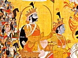

  
[Intangible Textual Heritage](../../index)  [Hinduism](../index) 
[Index](index)  [Previous](sbg04)  [Next](sbg06) 

------------------------------------------------------------------------

[Buy this Book at
Amazon.com](https://www.amazon.com/exec/obidos/ASIN/0766103498/internetsacredte)

------------------------------------------------------------------------

  
*Srimad-Bhagavad-Gita*, English translation and commentary by Swami
Swarupananda, \[1909\], at Intangible Textual Heritage

------------------------------------------------------------------------

p. xii

### INVOCATION [\*](#fn_0)

O blessed Mother  
Who showerest (upon us) the nectar of Advaita  
In the form of (these) eighteen chapters!  
Thou Destroyer of rebirth!  
Thou loving Mother!  
Thou Bhagavad-Gitâ!  
    Upon Thee I meditate.

Thee, O Vyâsa, of lotus-eyes,  
And mighty intellect,  
Who hast lighted the lamp of wisdom  
Filled with the oil of the Mahâbhârata,  
    Thee we salute.

O Thou who art the Refuge  
Of the (ocean-born) Lakshmi,  
Thou in whose right hand is the shepherd's crook,  
Who art the milker of the divine nectar of the Gitâ,  
    To Thee, O Krishna, to Thee our salutation!

The Upanishads are even as the herd of cows,  
The Son of the cowherd as the milker,  
Pârtha as the sucking-calf,  
And men of purified intellect the drinkers,  
    Of this, the supreme nectar, the milk of the Gitâ.

p. xiii

Thou son of Vasudeva,  
Destroyer of Kamsa and Chânura,  
Thou supreme bliss of Devaki,  
Guru of the Worlds,  
    Thee, O Krishna, as God, we salute!

Of that great river of battle which the Pândavas crossed over,  
Bhishma and Drona were as the high banks;  
And Jayadratha as the water of the river;  
The King of Gândhâra the water-lily;  
Shalya as the sharks, Kripa as the current;  
Karna the mighty waves;  
Ashvatthâmâ and Vikarna dread water-monsters,  
And Duryodhana was the very whirlpool;  
    But Thou, O Krishna, wast the Ferry-man!

This spotless product of the words of Vyâsa,  
This lotus of the Mahâbhârata,—  
With the Bhagavad-Gitâ as its strong sweet fragrance,  
And tales of heroes as its full-blown petals,  
Held ever open by the talk of Hari, of Him  
Who is destroyer of the taint of Kali-Yuga;  
This lotus to which come joyously  
Day after day the honey-seeking souls,—  
    May this produce in us the highest good!

Him Whose compassion maketh the dumb man eloquent,  
And the cripple to cross mountains,  
Him the All-blissful Mâdhava,  
    Do I salute!

p. xiv

To that Supreme One Who is bodied forth in Brahmâ,  
In Varuna, in Indra, in Rudra and Maruts;  
That One Whom all divine beings praise with hymns;  
Him Whom the singers of Sâma-Veda tell;  
Him of Whose glory, sing in full choir, The Upanishads and Vedas;  
Him Whom the Yogis see, with mind absorbed in perfect meditation;  
Him of Whom all the hosts of Devas and Asuras  
Know not the limitations,  
    To Him, the Supreme Good, be salutation,—  
Him we salute. Him we salute. Him we salute.

------------------------------------------------------------------------

### Footnotes

[xii:\*](sbg05.htm#fr_0) Another rendering of the
"Meditation."

------------------------------------------------------------------------

[Next: First Chapter. The Grief of Arjuna](sbg06)

