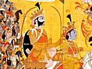

  
[Intangible Textual Heritage](../../index)  [Hinduism](../index) 
[Index](index)  [Previous](sbg07)  [Next](sbg09) 

------------------------------------------------------------------------

[Buy this Book at
Amazon.com](https://www.amazon.com/exec/obidos/ASIN/0766103498/internetsacredte)

------------------------------------------------------------------------

  
*Srimad-Bhagavad-Gita*, English translation and commentary by Swami
Swarupananda, \[1909\], at Intangible Textual Heritage

------------------------------------------------------------------------

p. 72

### THIRD CHAPTER

Arjuna said:

1\. If, O Janârdana, according to Thee, knowledge is superior to action,
why then, O Keshava, dost Thou engage me in this terrible action?

p. 73

2\. With these seemingly conflicting words, Thou art, as it were,
bewildering my understanding;—tell me that one thing for certain, by
which I can attain to the highest.

The Blessed Lord said:

3\. In the beginning (of creation), O sinless one, the twofold path of
devotion was given by Me to this world;—the path of knowledge for the
meditative, the path of work for the active. [3](#fn_67)

p. 74

4\. By non-performance of work none reaches worklessness; by merely
giving up action no one attains to perfection. [4](#fn_68)

5\. Verily none can ever rest for even an instant, without performing
action; for all are made to act, helplessly indeed, by the Gunas, born
of Prakriti. [5](#fn_69)

p. 75

6\. He, who restraining the organs of action, sits revolving in the
mind, thoughts regarding objects of senses, he, of deluded
understanding, is called a hypocrite.

7\. But, who, controlling the senses by the mind, unattached, directs
his organs of action to the path of work, he, O Arjuna, excels.

p. 76

8\. Do thou perform obligatory [\*](#fn_71)
action; for action is superior to inaction, and even the bare
maintenance of thy body would not be possible if thou art inactive.

9\. The world is bound by actions other than those performed for the
sake of Yajna; do thou therefore, O son of Kunti, perform action for
Yajna alone, devoid of attachment. [9](#fn_70)

p. 77

10\. The Prajâpati, having in the beginning created mankind together
with Yajna, said,—"By this shall ye multiply: this shall be the milch
cow of your desires. [10](#fn_72)

11\. "Cherish the Devas with this, and may those Devas cherish you: thus
cherishing one another, ye shall gain the highest good. [11](#fn_73)

p. 78

12\. "The Devas, cherished by Yajna, will give you desired-for objects."
So, he who enjoys objects given by the Devas without offering (in
return) to them, is verily a thief.

13\. The good, eating the remnants of Yajna, are freed from all sins:
but who cook food (only) for themselves, those sinful ones eat
sin. [13](#fn_74)

p. 79

14\. From food come forth beings: from rain food is produced: from Yajna
arises rain and Yajna is born of Karma. [14](#fn_75)

p. 80

15\. Know Karma to have risen from the Veda, and the Veda from the
Imperishable. Therefore the all-pervading Veda is ever centred in
Yajna. [15](#fn_76)

16\. He, who here follows not the wheel thus set revolving, living in
sin, and satisfied in the senses, O son of Prithâ,—he lives in
vain. [16](#fn_77)

p. 81

17\. But the man who is devoted to the Self, and is satisfied with the
Self, and content in the Self alone, he has no obligatory duty.

18\. He has no object in this world (to gain) by doing (an action), nor
(does he incur any loss) by non-performance of action,—nor has he (need
of) depending on any being for any object.

p. 82

19\. Therefore, do thou always perform actions which are obligatory,
without attachment;—by performing action without attachment, one attains
to the highest.

20\. Verily by action alone, Janaka and others attained
perfection;—also, simply with the view for the guidance of men, thou
shouldst perform action. [20](#fn_78)

p. 83

21\. Whatsoever the superior person does, that is followed by others.
What he demonstrates by action, that, people follow.

22\. I have, O son of Prithâ, no duty, nothing that I have not gained,
and nothing that I have to gain, in the three worlds; yet, I continue in
action.

p. 84

23\. If ever I did not continue in work, without relaxation, men, O son
of Prithâ, would in every way, follow in My wake.

24\. If I did not do work, these worlds would perish. I should be the
cause of the admixture of races, and I should ruin these beings.

25\. As do the unwise, attached to work, act, so should the wise act, O
descendant of Bharata, (but) without

p. 85

attachment, desirous of the guidance of the world.

26\. One should not unsettle the understanding of the ignorant, attached
to action; the wise, (himself) steadily acting, should engage (the
ignorant) in all work.

27\. The Gunas of Prakriti perform all action. With the understanding
deluded by egoism, man thinks, "I am the doer."

p. 86

28\. But, one, with true insight into the domains of Guna and Karma,
knowing that Gunas as senses merely rest on Gunas as objects, does not
become attached. [28](#fn_79)

29\. Men of perfect knowledge should not unsettle (the understanding of)
people of dull wit and imperfect knowledge, who deluded by the Gunas of
Prakriti attach (themselves) to the functions of the Gunas. [29](#fn_80)

p. 87

30\. Renouncing all actions to Me, with mind centred on the Self,
getting rid of hope and selfishness, fight,—free from (mental) fever.

31\. Those men who constantly practise this teaching of Mine, full of
Shraddhâ and without cavilling, they too, are freed from work. [31](#fn_81)

p. 88

32\. But those who decrying this teaching of Mine do not practise (it),
deluded in all knowledge, and devoid of discrimination, know them to be
ruined.

33\. Even a wise man acts in accordance with his own nature: beings
follow nature: what can restraint do? [33](#fn_82)

p. 89

34\. Attachment and aversion of the senses for their respective objects
are natural: let none come under their sway: they are his foes. [34](#fn_83)

p. 90

35\. Better is one's own Dharma, (though) imperfect, than the Dharma of
another well-performed. Better is death in one's own Dharma: the Dharma
of another is fraught with fear. [35](#fn_84)

Arjuna said:

36\. But by what impelled does man commit sin, though against his
wishes, O Vârshneya, constrained as it were, by force? [36](#fn_85)

p. 91

The Blessed Lord said:

37\. It is desire—it is anger, born of the Rajo-guna: of great craving,
and of great sin; know this as the foe here (in this world). [37](#fn_86)

p. 92

38\. As fire is enveloped by smoke, as a mirror by dust, as an embryo by
the secundine, so is it covered by that. [38](#fn_87)

39\. Knowledge is covered by this, the constant foe of the wise, O son
of Kunti, the unappeasable fire of desire. [39](#fn_88)

p. 93

40\. The senses, the mind and the intellect are said to be its abode:
through these, it deludes the embodied by veiling his wisdom. [40](#fn_89)

p. 94

41\. Therefore, O Bull of the Bharata race, controlling the senses at
the outset, kill it,—the sinful, the destroyer of knowledge and
realisation.

42\. The senses are said to be superior (to the body); the mind is
superior to the senses; the intellect is superior to the mind; and that
which is superior to the intellect is He (the Atman).

43\. Thus, knowing Him who is superior to the intellect, and restraining

p. 95

the self by the Self, destroy, O mighty-armed, that enemy, the
unseizable foe, desire.

 

The end of the third chapter, designated The Way
of Action.

------------------------------------------------------------------------

### Footnotes

[73:3](sbg08.htm#fr_67) *Meditative*—those who
prefer meditation to external action.

*Active*—those who believe in external work with or without meditation.

[74:4](sbg08.htm#fr_68) Worklessness and
perfection: These are synonymous terms, meaning, becoming one with the
Infinite and free from all ideas of want. A man who has reached this
state can have no necessity or desire for work as a means to an end.
Perfect satisfaction in the Self is his natural condition. (Vide III.
17.)

[74:5](sbg08.htm#fr_69) *All are made to act:*
All men living under bondage.

[76:9](sbg08.htm#fr_71) *Yajna:* means a
religious rite, sacrifice, worship: Or an action done with a good or
spiritual motive. It also means the Deity. The Taittiriya-Samhitâ (I. 7.
4.) says, "Yajna is Vishnu Himself."

[76:\*](sbg08.htm#fr_70) See comment on V. 13.

[77:10](sbg08.htm#fr_72) *Prajâpati*—the creator
or Brahma.

[77:11](sbg08.htm#fr_73) *Devas:* (lit. the
shining ones) beings much higher than man in the scale of evolution, who
are in charge of cosmic functions.

[78:13](sbg08.htm#fr_74) *Deva-Yajna:* offering
sacrifices to the gods, *Brahma-Yajna:* teaching and reciting the
Scriptures, *Pitri-Yajna:* offering libations of water to one's p. 79 ancestors, *Nri-Yajna:* the feeding of the
hungry, and *Bhuta-Yajna:* the feeding of the lower animals;—are the
five daily duties enjoined on householders. The performance of these
duties frees them from the fivefold sin, inevitable to a householder's
life, due to the killing of life, from the use of, (1) the pestle and
mortar, (2) the grinding-stone, (3) the oven, (4) the water-jar, and (5)
the broom.

[79:14](sbg08.htm#fr_75) *Yajna:* Here it
denotes not the sacrificial deeds themselves but the subtle principle,
into which they are converted, after they have been performed, to
appear, later on, as their fruits. This is technically known as Apurva.

*Karma* or sacrificial deeds prescribed in the Vedas.

[80:15](sbg08.htm#fr_76) *All-pervading Veda:*
because it illumines all subjects and is the store of all knowledge,
being the out-breathing of the Omniscient. It is said to be ever centred
in Yajna, because it deals chiefly with Yajna, as the means of achieving
the end, either of prosperity or final liberation, according as it is
performed with or without desire.

[80:16](sbg08.htm#fr_77) The *wheel* of action
started by Prajâpati on the basis of Veda and sacrifice.

[82:20](sbg08.htm#fr_78) *Guidance of men:* the
Sanskrit word means, gathering of men,—that is, into the right path.

[86:28](sbg08.htm#fr_79) *With true insight
etc.:* Knowing the truth that the Self is distinct from all Gunas, and
actions.

[86:29](sbg08.htm#fr_80) p.
87 *Those of imperfect knowledge*—those who can only see as far
as the immediate effect of actions.

[87:31](sbg08.htm#fr_81) *Shraddhâ:* is a mental
attitude constituted primarily of sincerity of purpose, humility,
reverence and faith. You have Shraddhâ for your Guru—it p. 88 is sincere reverence. You have Shraddhâ for
the Gita —it is admiration for those of its teachings you understand and
faith in those that you do not. You give alms to a beggar with
Shraddhâ—it is a sense of humility combined with the hope that what you
give will be acceptable and serviceable.

[88:33](sbg08.htm#fr_82) p.
89 The reason why some people do not follow the teaching of the
Lord is explained here: Their (lower) nature proves too strong for them.

[89:34](sbg08.htm#fr_83) *His:* of the seeker
after truth.

Though, as has been said in the foregoing Sloka, some are so completely
under the sway of their natural propensities, that restraint is of no
avail to them, yet the seeker after truth should never think of
following their example, but should always exert himself to overrule all
attachment and aversion of the senses for their objects.

[90:35](sbg08.htm#fr_84) The implication is that
Arjuna's thought of desisting from fight and going in for the calm and
peaceful life of the Brahman is promoted by man's natural desire to shun
what is disagreeable and embrace what is agreeable to the senses. He
should on no account yield to this weakness.

[90:36](sbg08.htm#fr_85) p.
91 *Vârshneya:* a descendant of the race of Vrishni.

[91:37](sbg08.htm#fr_86) *It is desire etc.:*
anger is only another form of desire,—desire obstructed. (See Note, II.
62-63).

[92:38](sbg08.htm#fr_87) "*It*" is knowledge,
and "*that*" is desire, as explained in the following Sloka.

Three stages of the overclouding of knowledge or Self by desire are
described by the three illustrations here given. The first stage is
Sâttvika,—fire enveloped by smoke:—the rise of a slight wind of
discrimination dispels the smoke of desire in a Sâttvika heart. The
second, the Râjasika,—the dust on a mirror, requires some time and
preparation. While the third,—the Tâmasika, takes a much longer time,
like the release of the embryo from the afterbirth.

[92:39](sbg08.htm#fr_88) Desire is undoubtedly
the foe of all mankind. Why it is said to be the constant foe of the
wise, is p. 93 that they *feel* it to be so
even when under its sway. Fools are awakened for a moment only, when
they suffer from its painful reactions.

[93:40](sbg08.htm#fr_89) Like a wise general,
Krishna points out the fortress of the enemy, by conquering which the
enemy is easily defeated.

*Through these:* by vitiating the senses, mind and the intellect.

------------------------------------------------------------------------

[Next: Fourth Chapter. The Way of Renunciation of Action in
Knowledge](sbg09)

