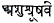

  
[Intangible Textual Heritage](../../index)  [Hinduism](../index) 
[Index](index)  [Previous](sbg22)  [Next](sbg24) 

------------------------------------------------------------------------

[Buy this Book at
Amazon.com](https://www.amazon.com/exec/obidos/ASIN/0766103498/internetsacredte)

------------------------------------------------------------------------

  
*Srimad-Bhagavad-Gita*, English translation and commentary by Swami
Swarupananda, \[1909\], at Intangible Textual Heritage

------------------------------------------------------------------------

p. 364

### EIGHTEENTH CHAPTER

Arjuna said:

1\. I desire to know severally, O mighty-armed, the truth of Sannyâsa, O
Hrishikesha, as also of Tyâga, O slayer of Keshi. [1](#fn_356)

p. 365

The Blessed Lord said:

2\. The renunciation of Kâmya actions, the sages understand as.
Sannyâsa: the wise declare the abandonment of the fruits of all works as
Tyâga. [2](#fn_357)

3\. Some philosophers declare that all action should be relinquished as
an evil, whilst others (say) that the work of Yajna, gift and austerity
should not be relinquished.

p. 366

4\. Hear from Me the final truth about relinquishment, O best of the
Bhâratas. For relinquishment has been declared to be of three kinds, O
tiger among men.

5\. The work of Yajna, gift and austerity should not be relinquished,
but it should indeed be performed; (for) Yajna, gift and austerity are
purifying to the wise.

p. 367

6\. But even these works, O Pârtha, should be performed, leaving
attachment and the fruits;—such is My best and certain conviction.

7\. But the renunciation of obligatory action is not proper. Abandonment
of the same from delusion is declared to be Tâmasika. [7](#fn_358)

p. 368

8\. He who from fear of bodily trouble relinquishes action, because it
is painful, thus performing a Râjasika relinquishment, he obtains not
the fruit thereof. [8](#fn_359)

9\. When obligatory work is performed, O Arjuna, only because it ought
to be done, leaving attachment and fruit, such relinquishment is
regarded as Sâttvika.

p. 369

10\. The relinquisher endued with Sattva and a steady understanding and
with his doubts dispelled, hates not a disagreeable work nor is attached
to an agreeable one.

11\. Actions cannot be entirely relinquished by an embodied being, but
he who relinquishes the fruits of action is called a relinquisher.

p. 370

12\. The threefold fruit of action—disagreeable, agreeable and
mixed,—accrues to non-relinquishers after death, but never to
relinquishers.

13\. Learn from Me, O mighty-armed, these five causes for the
accomplishment of all works as declared in the wisdom which is the end
of all action: [13](#fn_360)

p. 371

14\. The body, the agent, the various senses, the different functions of
a manifold kind, and the presiding divinity, the fifth of these; [14](#fn_361)

15\. Whatever action a man performs by his body, speech and mind—whether
right or the reverse—these five are its causes.

p. 372

16\. Such being the case, he who through a non-purified understanding
looks upon his Self, the Absolute, as the agent, he of perverted mind
sees not.

17\. He who is free from the notion of egoism, whose intelligence is not
affected (by good or evil), though he kills these people, he kills not,
nor is bound (by the action); [17](#fn_362)

p. 373

18\. Knowledge, the known and the knower form the threefold cause of
action. The instrument, the object and the agent are the threefold basis
of action. [18](#fn_363)

19\. Knowledge, action and agent are declared in the Sânkhya philosophy
to be

p. 374

of three kinds only, from the distinction of Gunas: hear them also
duly. [19](#fn_364)

20\. That by which the one indestructible Substance is seen in all
beings, inseparate in the separated, know that knowledge to be
Sâttvika. [20](#fn_365)

p. 375

21\. But that knowledge which sees in all beings various entities of
distinct kinds as different from one another, know thou that knowledge
as Râjasika. [21](#fn_366)

22\. Whilst that which is confined to one single effect as if it were
the whole, without reason, without foundation in truth, and
trivial,—that is declared to be Tâmasika. [22](#fn_367)

p. 376

23\. An ordained action done without love or hatred by one not desirous
of the fruit and free from attachment, is declared to be Sâttvika.

24\. But the action which is performed desiring desires, or with
self-conceit and with much effort, is declared to be Râjasika.

p. 377

25\. That action is declared to be Tâmasika which is undertaken through
delusion, without heed to the consequence, loss (of power and wealth),
injury (to others) and (one's own) ability.

26\. An agent who is free from attachment, non-egotistic, endued with
fortitude and enthusiasm and unaffected in success or failure, is called
Sâttvika.

27\. He who is passionate, desirous of the fruits of action, greedy,
malignant, impure, easily elated or dejected, such an agent is called
Râjasika. [27](#fn_368)

p. 378

28\. Unsteady, vulgar, arrogant, dishonest, malicious, indolent,
desponding and procrastinating, such an agent is called Tâmasika.

29\. Hear thou the triple distinction of intellect and fortitude,
according to the Gunas, as I declare them exhaustively and severally, O
Dhananjaya. [29](#fn_369)

p. 379

30\. That which knows the paths of work and renunciation, right and
wrong action, fear and fearlessness, bondage and liberation, that
intellect, O Pârtha, is Sâttvika. [30](#fn_370)

31\. That which has a distorted apprehension of Dharma and its opposite
and also of right action and its opposite, that intellect, O Pârtha, is
Râjasika.

p. 380

32\. That which enveloped in darkness regards Adharma as Dharma and
views all things in a perverted light, that intellect, O Pârtha, is
Tâmasika.

33\. The fortitude by which the functions of the mind, the Prâna and the
senses, O Pârtha, are regulated, that fortitude, unswerving through
Yoga, is Sâttvika.

p. 381

34\. But the fortitude by which one regulates (one's mind) to Dharma,
desire and wealth, desirous of the fruit of each from attachment, that
fortitude, O Pârtha, is Râjasika.

35\. That by which a stupid man does not give up sleep, fear, grief,
despondency and also overweening conceit, that fortitude, O Pârtha, is
Tâmasika. [35](#fn_371)

p. 382

36\. And now hear from Me, O bull of the Bhâratas, of the threefold
happiness. That happiness which one learns to enjoy by habit, and by
which one comes to the end of pain;

37\. That which is like poison at first, but like nectar at the end;
that happiness is declared to be Sâttvika, born of the translucence of
intellect due to Self-realisation.

p. 383

38\. That which arises from the contact of object with sense, at first
like nectar, but at the end like poison, that happiness is declared to
be Râjasika. [38](#fn_372)

39\. That happiness which begins and results in self-delusion arising
from sleep, indolence and miscomprehension, that is declared to be
Tâmasika.

p. 384

40\. There is no entity on earth, or again in heaven among the Devas,
that is devoid of these three Gunas, born of Prakriti.

41\. Of Brâhmanas and Kshatriyas and Vaishyas, as also of Sudras, O
scorcher of foes, the duties are distributed according to the Gunas born
of their own nature. [41](#fn_373)

p. 385

42\. The control of the mind and the senses, austerity, purity,
forbearance, and also uprightness, knowledge, realisation, belief in a
hereafter,—these are the duties of the Brâhmanas, born of (their own)
nature.

43\. Prowess, boldness, fortitude, dexterity, and also not flying from
battle, generosity and sovereignty are the duties of the Kshatriyas,
born of (their own) nature.

p. 386

44\. Agriculture, cattle-rearing and trade are the duties of the
Vaishyas, born of (their own) nature; and action consisting of service
is the duty of the Sudras, born of (their own) nature.

45\. Devoted each to his own duty, man attains the highest perfection.
How engaged in his own duty, he attains perfection, that hear. [45](#fn_374)

p. 387

46\. From whom is the evolution of all beings, by whom all this is
pervaded, worshipping Him with his own duty, a man attains
perfection. [46](#fn_375)

47\. Better is one's own Dharma, (though) imperfect, than the Dharma of
another well-performed. He who does the duty ordained by his own nature
incurs no evil. [47](#fn_376)

p. 388

48\. One should not relinquish, O son of Kunti, the duty to which one is
born, though it is attended with evil; for, all undertakings are
enveloped by evil, as fire by smoke. [48](#fn_377)

p. 389

49\. He whose intellect is unattached everywhere, who has subdued his
heart, whose desires have fled, he attains by renunciation to the
supreme perfection, consisting of freedom from action. [49](#fn_378)

50\. Learn from Me in brief, O son of Kunti, how reaching such
perfection, he attains to Brahman, that supreme consummation of
knowledge.

p. 390

51\. Endued with a pure intellect, subduing the body and the senses with
fortitude, relinquishing sound and such other sense-objects, abandoning
attraction and hatred; [51](#fn_379)

52\. Resorting to a sequestered spot, eating but little, body, speech
and mind

p. 391

controlled, ever engaged in meditation and concentration, possessed of
dispassion; [52](#fn_380)

53\. Forsaking egoism, power, pride, lust, wrath and property, freed
from the notion of "mine," and tranquil, he is fit for becoming
Brahman. [53](#fn_381)

p. 392

54\. Brahman-become, tranquil-minded, he neither grieves nor desires;
the same to all beings, he attains to supreme devotion unto Me. [54](#fn_382)

55\. By devotion he knows Me in

p. 393

reality, what and who I am; then having known Me in reality, he
forthwith enters into Me.

56\. Even doing all actions always, taking refuge in Me,—by My grace he
attains to the eternal, immutable State.

57\. Resigning mentally all deeds to Me, having Me as the highest goal,
resorting to Buddhi-Yoga do thou ever fix thy mind on Me.

p. 394

58\. Fixing thy mind on Me, thou shalt, by My grace, overcome all
obstacles; but if from self-conceit thou wilt not hear Me, thou shalt
perish.

59\. If filled with self-conceit thou thinkest, "I will not fight," vain
is this thy resolve; thy Prakriti will constrain thee. [59](#fn_383)

p. 395

60\. Fettered, O son of Kunti, by thy own Karma, born of thy own nature,
what thou, from delusion, desirest not to do, thou shalt have to do in
spite of thyself.

61\. The Lord, O Arjuna, dwells in the hearts of all beings, causing all
beings, by His Mâyâ, to revolve, (as if) mounted on a machine. [61](#fn_384)

62\. Take refuge in Him with all thy heart, O Bhârata; by His grace
shalt thou

p. 396

attain supreme peace (and) the eternal abode.

63\. Thus has wisdom more profound than all profundities, been declared
to. thee by Me; reflecting over it fully, act as thou likest. [63](#fn_385)

64\. Hear thou again My supreme word, the profoundest of all; because
thou art dearly beloved of Me, therefore will I speak what is good to
thee. [64](#fn_386)

p. 397

65\. Occupy thy mind with Me, be devoted to Me, sacrifice to Me, bow
down to Me. Thou shalt reach Myself; truly do I promise unto thee, (for)
thou art dear to Me. [65](#fn_387)

66\. Relinquishing all Dharmas take

p. 398

refuge in Me alone; I will liberate thee from all sins; grieve
not. [66](#fn_388)

p. 399

67\. This is never to be spoken by thee to one who is devoid of
austerities or devotion, nor to one who does not render service, nor to
one who cavils at Me. [67](#fn_389)

68\. He who with supreme devotion to Me will teach this deeply profound
philosophy to My devotees, shall doubtless come to Me alone. [68](#fn_390)

p. 400

69\. Nor among men is there any who does dearer service to Me, nor shall
there be another on earth dearer to Me, than he. [69](#fn_391)

70\. And he who will study this sacred dialogue of ours, by him shall I
have been worshipped by the Yajna of knowledge; such is My
conviction. [70](#fn_392)

p. 401

71\. And even that man who hears this, full of Shraddhâ and free from
malice, he too, liberated, shall attain to the happy worlds of those of
righteous deeds. [71](#fn_393)

72\. Has this been heard by thee, Pârtha, with an attentive mind? Has
the delusion of thy ignorance been destroyed, O Dhananjaya?

p. 402

Arjuna said:

73\. Destroyed is my delusion, and I have gained my memory through Thy
grace, O Achyuta. I am firm; my doubts are gone. I will do Thy
word. [73](#fn_394)

p. 403

Sanjaya said:

74\. Thus have I heard this wonderful dialogue between Vâsudeva and the
high-souled Pârtha, causing my hair to stand on end.

75\. Through the grace of Vyâsa have I heard this supreme and most
profound Yoga, direct from Krishna, the Lord of Yoga, Himself declaring
it. [75](#fn_395)

p. 404

76\. O King, as I remember and remember this wonderful and holy dialogue
between Keshava and Arjuna, I rejoice again and again. [76](#fn_396)

77\. And as I remember and remember that most wonderful Form of Hari,
great is my wonder, O King; and I rejoice again and again. [77](#fn_397)

p. 405

78\. Wherever is Krishna, the Lord of Yoga, wherever is Pârtha, the
wielder of the bow, there are prosperity, victory, expansion, and sound
policy: such is my conviction. [78](#fn_398)

Thus in the Srimad-Bhagavad-Gita, the Essence of the Upanishads, the
Science of the Brahman, the Scripture of Yoga, the Dialogue between Sri
Krishna and Arjuna, ends the Eighteenth Chapter designated:

The Way of Liberation in Renunciation.

*Here the Bhagavad-Gita ends*.

Om! Peace! Peace! Peace be to all!

------------------------------------------------------------------------

### Footnotes

[364:1](sbg23.htm#fr_356) *Sannyâsa and Tyâga*
both mean renunciation. Keshi—was an Asura.

[365:2](sbg23.htm#fr_357) *Kâmya*—which are
accompanied with a desire for fruits.

[367:7](sbg23.htm#fr_358) Since it is purifying
in the case of the ignorant.

[368:8](sbg23.htm#fr_359) *Fruit*, *i.e.*,
Moksha, which comes out of the renunciation of all actions accompanied
with wisdom.

[370:13](sbg23.htm#fr_360) *Wisdom:*
Sânkhya,—literally, in which all the things that are to be known are
expounded, therefore, the highest wisdom.

[371:14](sbg23.htm#fr_361) *Presiding
divinity:* Each of the senses has its god who presides over it, and by
whose aid it discharges its own functions; *e.g.*, the Aditya (Sun) is
the presiding divinity of the eye, by whose aid it sees and acts; and so
on with the other senses.

[372:17](sbg23.htm#fr_362) He whose
self-consciousness, by the force of long, strenuous, and
properly-trained self-concentration, is ever identified with Brahman,
and not with the five causes of action as mentioned in Sloka 14,—he
whose self-consciousness never mistakes itself for the body, mind and
the like, even when performing p. 373
physical acts,—he is ever free from the taint of action.

[373:18](sbg23.htm#fr_363) *Basis*—because the
threefold action inheres in these three.

[374:19](sbg23.htm#fr_364) *Sânkhya:* the
Science of the Gunas by Kapila. Though there is a conflict in the matter
of supreme Truth—the oneness or non-duality of Brahman—between the
Vedânta and the Sânkhya, yet the Sânkhya view is given here, because it
is an authority on the science of Gunas.

*Duly*—described according to the Science, according to reason.

[374:20](sbg23.htm#fr_365) *Inseparate:*
undifferentiated; permeating all.

[375:21](sbg23.htm#fr_366) *Entities:* Souls.

*Different from one another:* Different in different bodies.

[375:22](sbg23.htm#fr_367) *One single effect:*
such as the body,—thinking it to be the Self.

[377:27](sbg23.htm#fr_368) *Elated or
dejected*—at the success or failure of the action in which he is
engaged.

[378:29](sbg23.htm#fr_369) *Dhananjaya:* the
conqueror of wealth—human and divine, earthly and celestial; an epithet
of Arjuna.

[379:30](sbg23.htm#fr_370) *Fear . . .
liberation*—the cause of fear and the cause of fearlessness; similarly,
the cause of bondage and the cause of liberation.

[381:35](sbg23.htm#fr_371) *Does not give up
sleep &c.*,—is inordinately addicted to sleep &c., regarding these to be
only proper.

[383:38](sbg23.htm#fr_372) *At the end like
poison*—because it leads to deterioration in strength, vigour,
complexion, wisdom, intellect, wealth and energy.

[384:41](sbg23.htm#fr_373) According to the
Karma or habits and tendencies formed by desire, action and association
in the past life manifesting themselves in the present as effects. Or,
nature (Svabhâva) may here mean the Mâyâ made up of the three Gunas, the
Prakriti of the Lord.

[386:45](sbg23.htm#fr_374) *Own*—according to
his nature.

The Apastamba Dharma-Shâstra says: "Men of several castes and orders,
each devoted to his respective duties, reap the fruits of their actions
after death, and then by the residual Karma attain to births in superior
countries, castes and families, possessed of comparatively superior
Dharma, span of life, learning, conduct, wealth, happiness and
intelligence."

[387:46](sbg23.htm#fr_375) The highest worship
to the Lord consists in the closest approach to Him. The veil of Mâyâ
comprising Karma or habits, tendencies and actions prevents a man from
nearing the Lord, *i.e.*, realising his own Self. By working out one's
Karma alone, according to the law of one's being, can this veil be rent
and the end accomplished.

[387:47](sbg23.htm#fr_376) p. 388 As a poisonous substance does not injure the
worm born in that substance, so he who does his Svadharma incurs no
evil.

[388:48](sbg23.htm#fr_377) *Duty etc.*—this
need not mean caste duty.

*All undertakings:* one's own as well as others’ duties.

The greatest evil is bondage and this endures so long as one lives in
the realm of the Gunas, except in the case of a freed soul. All action
is comprised in one or the other of the Gunas. All action therefore
involves the evil of bondage.

[389:49](sbg23.htm#fr_378) *He attains . . .
renunciation*—This may also be interpreted to mean: he attains the
supreme state in which he remains as the actionless Self, by his
renunciation of all actions, for which he is prepared by his right
knowledge.

[390:51](sbg23.htm#fr_379) *Pure:* free from
doubt and misconception, being merged in Brahman through the elimination
of all alien attributes ascribed to It.

*Relinquishing sound &c.*—abandoning all superfluous luxuries, all
objects except those only which are necessary for the bare maintenance
of the body, and laying aside attraction and hatred even for those
objects.

[391:52](sbg23.htm#fr_380) *Eating but
little*—as conducive to the serenity of thought by keeping off languor,
sleepiness and the like.

*Meditation*—upon the nature of the Self.

*Concentration*—one-pointedness of thought, on one feature of the Self.

*Dispassion*—for the seen and the unseen.

[391:53](sbg23.htm#fr_381) *Power*—that power
which is combined with passion and desire.

*Property:* Though a man who is free from all passions of the mind and
the senses, may own so much of external belongings as is necessary for
bodily sustenance and for the observance of his religious duties
(Dharma), yet this the aspirant abandons, even if this comes of itself,
because he does not regard p. 392 the bodily
life as his; thus he becomes a Paramahamsa Parivrâjaka, a Sannyâsin of
the highest order.

[392:54](sbg23.htm#fr_382) *Brahman-become:*
not that he is yet freed and become the Absolute, but is firmly grounded
in the knowledge that he is Brahman. His attainment of freedom is
described in the next verse.

*Supreme devotion:* the devotion stated in VII. 17.

[394:59](sbg23.htm#fr_383) *Thy Prakriti:* Thy
nature as a Kshatriya.

[395:61](sbg23.htm#fr_384) See commentary to
IX. 10.

*Arjuna* means 'white,' and here it signifies—'O pure-hearted one.'

[396:63](sbg23.htm#fr_385) It: the Shâstra, the
teaching as declared above.

[396:64](sbg23.htm#fr_386) Again: though more
than once declared.

[397:65](sbg23.htm#fr_387) *Thou shalt reach
Myself:* Thus acting,—*i.e.*, looking upon the Lord alone as thy aim,
means and end—thou shalt attain the Highest.

*Truly do I promise unto thee*.—Have implicit faith in the declarations
of Me, the Lord, as I pledge thee My troth.

[398:66](sbg23.htm#fr_388) *All
Dharmas*—including Adharma also: all actions, righteous or unrighteous,
since absolute freedom from the bondage of all action is intended to be
taught here.

*Take refuge in Me alone*—knowing that there is naught else except Me,
the Self of all, dwelling the same in all.

*Liberate thee*—by manifesting Myself as thy own Self.

*All sins:* all bonds of Dharma and Adharma.

Sankara in his commentary here very strongly combats the opinion of
those who hold that highest spiritual realisation (Jnâna) and
ritualistic work (Karma) may go together in the same person. For Karma
is possible only in the relative world (Samsâra), which is the outcome
of ignorance; and knowledge dispels this ignorance. So neither the
conjunction of Jnâna with Karma, nor Karma alone conduces to the
absolute cessation of Samsâra, but it is only the Right Knowledge of the
Self which does so.

[399:67](sbg23.htm#fr_389) *This*—Shâstra which
has been taught to you.

*Service*—to the Guru;  
also means,—to one who does not wish to hear.

[399:68](sbg23.htm#fr_390) *Teach*—in the faith
that he is thus doing service to the Lord, the Supreme Teacher.

*Doubtless:* or, freed from doubts.

[400:69](sbg23.htm#fr_391) *He:* who hands down
the Shâstra to a fit person.

[400:70](sbg23.htm#fr_392) *Yajna of
knowledge:* A Yajna can be performed in four ways, such as (1) Vidhi or
ritual, (2). Japa, (3) Upâmsu, or a prayer uttered, in a low voice, or
(4) Mânasa or prayer offered with the mind. Jnâna-yajna or the Yajna of
knowledge comes under the head of Mânasa, and is therefore the highest.

The study of the Gitâ will produce an effect equal to that of the Yajna
of knowledge.

[401:71](sbg23.htm#fr_393) *Even that man:*
much more so he who understands the doctrine.

[402:73](sbg23.htm#fr_394) *Memory*—of the true
nature of the Self.

*Firm*—in Thy command.

The purpose of the knowledge of the Shâstras is the destruction of
doubts and delusions, and the recognition of the true nature of the
Self. Here, the answer of Arjuna conclusively shows, that that purpose
has been fulfilled in him.

The teaching of the Shâstra is over here. The rest is only to connect it
with the main narrative.

[403:75](sbg23.htm#fr_395) *Through . . .
Vyâsa:* by obtaining from him the Divya-chakshu or divine vision.

[404:76](sbg23.htm#fr_396) *King:*
Dhritarâshtra.

[404:77](sbg23.htm#fr_397) Form: Vishvarupa,
the Universal Form.

[405:78](sbg23.htm#fr_398) *The bow*—called the
Gândiva.

------------------------------------------------------------------------

[Next: The Greatness of the Gita](sbg24)

