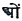

  
[Intangible Textual Heritage](../../index)  [Hinduism](../index.md) 
[Index](index)  [Previous](sbg23)  [Next](sbg25.md) 

------------------------------------------------------------------------

[Buy this Book at
Amazon.com](https://www.amazon.com/exec/obidos/ASIN/0766103498/internetsacredte.md)

------------------------------------------------------------------------

  
*Srimad-Bhagavad-Gita*, English translation and commentary by Swami
Swarupananda, \[1909\], at Intangible Textual Heritage

------------------------------------------------------------------------

p. 406

### THE GREATNESS OF THE GITA

Salutation to Sri Ganesha!

Salutation to Sri Râdhâramana! [\*](#fn_399.md)

Dharâ (the Earth) said:

1\. O Blessed Lord, O Supreme Ruler, how may one, who is held back by
his Prârabdha Karma, obtain unswerving devotion? [1](#fn_400.md)

p. 407

The Lord Vishnu said:

2\. If one be devoted to the constant practice of the Gita, even though
he be restrained by Prârabdha Karma, yet is he Mukta, happy, in this
very world. lie is not tainted by (new) Karma.

3\. No evil, however great, can affect him who meditates on the Gita. He
is like the lotus leaf untouched by the water.

p. 408

4-5. Where there is the book of the Gita, where its study is proceeded
with, there are present all the holy places, there verily, are Prayâga
and the rest. There also are all the Devas, Rishis, Yogins, and
Pannagas, so also the Gopâlas and Gopikâs, with Nârada, Uddhava and
their whole train of comrades.

6\. Where the Gita is read, forthwith comes help. Where the Gita is
discussed, recited, taught, or heard, there, O Earth, beyond a doubt, do
I Myself unfailingly reside.

7\. In the refuge of the Gita I abide; the Gita is My chief abode.
Standing on the wisdom of the Gita, I maintain the three worlds.

p. 409

8-9. The Gita is My Supreme Knowledge; it is undoubtedly inseparable
from Brahman, this Knowledge is absolute, imperishable, eternal, of the
essence of My inexpressible State, the Knowledge comprising the whole of
the three Vedas, supremely blissful and consisting of the realisation of
the true nature of the Self,—declared by the All-knowing and Blessed
Krishna, through his own lips, to Arjuna. [8](#fn_401.md)

10\. That man who with steady mind recites the eighteen chapters daily,
attains the perfection of knowledge and thus reaches the highest plane.

11\. If the whole cannot be recited, then half of it may be read; and he
who

p. 410

does this acquires merit, equal to that of the gift of a cow. There is
no doubt about. this.

12\. By the recitation of a third part,. he gains the same merit as by
bathing in the Ganges. By the repetition of a. sixth part, he obtains
the fruit of the Soma-sacrifice.

13\. He who reads, full of devotion, even one chapter daily, attains to
the Rudraloka, and lives there for a long time, having become one of
those who wait on Shiva. [13](#fn_402.md)

14\. The man who daily reads a quarter of a chapter, or of a Sloka, O
Earth, attains to human birth throughout the duration of a Manu. [11](#fn_403.md)

p. 411

15-16. The man who recites ten, seven, five, four, three or two Slokas,
or even one or half a Sloka of the Gita, certainly lives in Chandraloka
for ten thousand years. He who leaves the body while reading the Gita,
obtains the world of Man.

17\. Again practising the Gita, he attains Supreme Mukti. The dying man
uttering the word "Gita" will attain the goal.

18\. One who loves to hear the meaning of the Gita, even though he has
committed heinous sins, attains to heaven, and lives in beatitude with
Vishnu.

p. 412

19\. He who constantly meditates on the meaning of the Gita, even though
he performs Karma incessantly, he is to be regarded as a Jivanmukta, and
after the destruction of his body he attains to the highest plane of
knowledge.

20\. By the help of this Gita, many kings like Janaka became free from
their impurities and attained to the highest goal. It is so sung.

21\. He who having finished the reading of the Gita, does not read its
Mâhâtmyam as declared here, his reading is in vain, it is all labour
wasted.

22\. He who studies the Gita, accompanied with this discourse on its
Mâhâtmyam,

p. 413

obtains the fruit stated herein, and reaches that goal which is
difficult to attain.

Suta said:

23\. He who will read this eternal greatness of the Gita, declared by
me, after having finished the reading of the Gita itself, will obtain
the fruit described herein. [23](#fn_404.md)

p. 414

Thus ends in the Vârâha Purâna the discourse designated: The Greatness of the Gita.

------------------------------------------------------------------------

### Footnotes

[406:\*](sbg24.htm#fr_399.md) Ganesha is the god
of wisdom and remover of obstacles; hence he is invoked and worshipped
at the commencement of every important undertaking. Râdhâramana—the
Lover of Râdhâ,—Sri Krishna.

[406:1](sbg24.htm#fr_400.md) *Prârabdha
Karma*—There are three kinds of Karma: (1) Sanchita or accumulated and
stored up in past lives; (2) Agâmi or that which is yet to be done; (3)
Prârabdha or that which is already bearing fruit. This last is that part
of the accumulated actions (Sanchita) which has brought about the p. 407 present life and will influence it until its
close. The knowledge of Brahman destroys all accumulated Karma and makes
the current work abortive. But the Prârabdha Karma must run out its
course, though the balanced mind of a liberated man is not affected by
it.

[409:8](sbg24.htm#fr_401.md) *Ardhamâtrâ*—lit. the
half-syllable, and refers to the dot on the 
; symbolically, it stands for the Turiya state, hence
the Absolute.

[410:13](sbg24.htm#fr_402.md) *Become &c.*—lit.,
attained to Ganahood.

[410:11](sbg24.htm#fr_403.md) *Attains to
Manhood:* is born every time in a man-body.

[413:23](sbg24.htm#fr_404.md) These declarations
will, no doubt, seem to be mere flights of extravagant fancy, if they
are taken in their literal sense. They may be explained either (1) as
mere Arthavâda or a statement of glorification meant to stimulate a
strong desire for the study of the Gita, which being performed from day
to day, may, by the force of the truth and grandeur of one or other of
its teachings, strike an inner chord of the heart some time, so much so
as to change the whole nature of the man for good; (2) or, the "reading"
and "reciting" and so forth, of the whole or a part, may not perhaps be
taken in their ordinary sense, as meaning lip-utterance and the like,
but in view of the great results indicated, they may be reasonably
construed to mean the assimilation of p. 414
the essence of the Gita teachings into the practical daily life of the
individual. What wonder, then, that such a one who is the embodiment of
the Gita would be a true Jnânin, or a Jivanmukta, or that he would, in
proportion to his success of being so, attain the intermediate spheres
of evolution and finally obtain Mukti?

------------------------------------------------------------------------

[Next: Index](sbg25.md)

