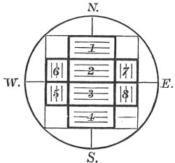

  
[Intangible Textual Heritage](../../../index)  [Hinduism](../../index) 
[Satapatha Brahmana](../index)  [Index](index)  [Previous](sbe4154) 
[Next](sbe4156) 

------------------------------------------------------------------------

[Buy this Book at
Amazon.com](https://www.amazon.com/exec/obidos/ASIN/8120801423/internetsacredte)

------------------------------------------------------------------------

*Satapatha Brahmana Part III (SBE41)*, Julius Eggeling tr. \[1894\], at
Intangible Textual Heritage

------------------------------------------------------------------------

p. 298

7:1:1

# SEVENTH KÂ*ND*A.

#### THE GÂRHAPATYA HEARTH.

### FIRST ADHYÂYA. FIRST BRÂHMA*N*A.

7:1:1:11. Being
about to build the Gârhapatya (fire-place), he sweeps (its site) with a
Palâ*s*a (butea frondosa) branch. For when he builds the
Gârhapatya [1](#fn_554) he settles on that
place; and whatsoever builders of fire-altars (there have been), they
are indeed settled on this earth; and when he sweeps (that place) he
thereby sweeps away those settled (there before hire), thinking, 'Lest I
should settle on those already settled (here).'

7:1:1:22. \[He
sweeps, with Vâ*g*. S. XII, 45\] 'Off with you! away with you! crawl
away from here [2](#fn_555)!'--that is, 'Go
off, go away, and crawl away from here!' he says this to those that
crawl on their belly;--'Ye that are here of old and of late!' that is,
'both ye who were here of yore, and ye of the present day.'

7:1:1:33. 'Yama
hath given the settlement on earth (to this Sacrificer);'--for Yama
indeed rules over the settling on this earth, and it is he who grants to
this (Sacrificer) a settlement on this earth.

p. 299

7:1:1:44. 'The
Fathers have prepared this place for him!' for Yama is the Kshatra
(nobility, or ruling power), and the Fathers (deceased ancestors) are
the clansmen; and to whomsoever the chief (kshatriya), with the approval
of the clan, grants a settlement, that (settlement) is properly given:
and in like manner does Yama, the ruling power, with the consent of the
Fathers, the clan, now grant to this (Sacrificer) a settlement on this
earth.

7:1:1:55. With a
palâ*s*a branch he sweeps; for the Palâ*s*a tree is the Brahman [1](#fn_556): it is by the Brahman he thus sweeps
away those already settled;--with a prayer (he does so), for the prayer
is the Brahman: it is by the Brahman he thus sweeps away those already
settled. He throws it (the branch) out towards the north [2](#fn_557).

7:1:1:66. He
then scatters saline soil (over the hearth-site); for the Gârhapatya is
this world, and salt means cattle: he thus bestows cattle on this
world,--hence those cattle here in this world.

7:1:1:77. And
again why he scatters saline soil. Pra*g*âpati created creatures; he
created them with different kinds of amnions: they did not agree
together. He desired, 'May they agree together!' He made them to be of
the same (kind of) amnion: hence even to this day, being of equal
amnions, they agree together. And he who offers, offers thinking, 'May I
be (born) with the same (kind of) amnion as the gods!' and when he
scatters saline salt (in the hearth-site) he thereby becomes of equal
amnion with the gods.

p. 300

7:1:1:88. \[He
does so, with Vâ*g*. S. XII, 46\] 'Concord thou art!' for thereby they
agreed together [1](#fn_558);--'fulfilment of
desire;' for salt is cattle, and fulfilment of desire means cattle;--'In
me may there be the fulfilment of thy desire!' that is, 'May there be on
me cattle for thee!'--He covers with it the whole (circular) Gârhapatya;
for the Gârhapatya altar is the womb, and the saline soil is the amnion:
he thus covers the whole womb with the amnion.

7:1:1:99. He
then scatters sand to keep (the saline soil, or amnion) from being
scorched [2](#fn_559);--for sand is nothing
else than the ashes of Agni Vai*s*vânara, and him, Agni Vai*s*vânara, he
is indeed about to build up; and Agni does not scorch his own self.

7:1:1:1010. And
again why he scatters sand,--sand is nothing else than the seed of Agni
Vai*s*vânara [3](#fn_560), and him, Agni
Vai*s*vânara, he is about to build up; but nothing is fashioned from out
of the seedless: 'May he (Agni) be fashioned from out of this seed!' so
he thinks.

7:1:1:1111.
\[He scatters it, with Vâ*g*. S. XII, 46\] 'Agni's ashes thou art!
Agni's soil thou art!' for Agni's ashes are useless, and the sand is not
useless: he thus makes it (the Gârhapatya hearth) to be useful. He
covers with it the whole Gârhapatya; for the

p. 301

\[paragraph continues\] Gârhapatya altar
is the womb, and the sand is seed: he thus fills the whole womb with
seed.

7:1:1:1212. He
then encloses it with enclosing-stones; for the enclosing-stones are the
womb: he thus encloses the seed here cast in the womb; and hence the
seed which is cast is enclosed in the womb.

7:1:1:1313.
And, again, why he encloses it with enclosing-stones;--the Gârhapatya
hearth is this (terrestrial) world, and the enclosing-stones are the
waters: he thus surrounds this world with water,--it is with the ocean
that he thus surrounds it on all sides, and hence the ocean flows round
this world on all sides. (He puts up the stones) by turning to the right
(or south) [1](#fn_561), whence the ocean flows
round this world (from the east) southwards;--by means of a dug out
(hole, or moat) [2](#fn_562), whence the ocean
flows round this world in a moat.

7:1:1:1414.
\[Vâ*g*. S. XII, 46\] 'Ranging ye are!' for he does range
them;--'ranging around ye are!' for he does range them all
round;--'upwards ranging get ye fixed!' thus he says, placing them
upright: hence the ocean surges upwards; but were he to place them
sideways, the ocean surely would all at once overflow all this (earth).
He does not settle them, for unsettled are the waters; nor does he
pronounce the Sûdadohas (verse) on them [3](#fn_563).

p. 302

7:1:1:1515. For
the enclosing-stones are the bones, and the Sûdadohas is the breath; and
there is no breath in the bones. With one and the same formula he lays
down many bricks [1](#fn_564), for of one and
the same form are the waters; and as to there being many
enclosing-stones, it is because there are many waters.

7:1:1:1616. The
enclosing-stones, then, are the womb; the saline earth is the amnion,
and the sand is the seed. The enclosing-stones are outside, and the
saline earth is inside; for the womb is outside, and the amnion inside.
The saline earth is outside, and the sand inside; for the amnion is
outside, and the seed inside. He who is born is born from these: it is
from them that he thus causes him (Agni) to be born.

7:1:1:1717.
Thereon he now builds it (the hearth): he

   
GÂRHAPATYA HEARTH.

thereby fashions that infused seed; and hence the infused seed is
fashioned in the womb.

p. 303

7:1:1:1818. He
puts on (the circular site) four (bricks) running eastwards [1](#fn_565); two behind running crosswise (from
south to north), and two (such) in front. Now the four which he puts on
running eastwards are the body; and as to there being four of these, it
is because this body (of ours) consists, of four parts [2](#fn_566). The two at the back then are the
thighs; and the two in front the arms; and where the body is that
(includes) the head.

7:1:1:1919. Now
he here fashions him (Agni) with wings and tail; for whatlike the seed
is fashioned in the womb suchlike (offspring) is born: thus inasmuch as
he now fashions him with wings and tail, he is born hereafter [3](#fn_567) with wings and tail.

7:1:1:2020.
While being indeed furnished with wings and tail, people do not see him
as one having wings and tail [4](#fn_568):
hence one does not see the child in the womb in its proper shape; but
hereafter they (will) see him as one having wings and tail, and hence
one sees the child after it is born in its proper shape.

7:1:1:2121.
Four (bricks) he puts on first, for of him that

p. 304

is being produced it is the body (trunk) that is produced first. Sitting
south (of the hearth-site) with his face to the north he puts on first
one (brick) of the upper (north) part [1](#fn_569) (of the trunk); and in this manner that
Agni of his comes to be built up towards (or for the Sacrificer)
himself.

7:1:1:2222.
\[He puts it on, with Vâ*g*. S. XII, 47; *Ri*k S. III, 22, 1, &c.\]
'This is the Agni wherein Indra taketh the Soma-juice,' for the
Gârhapatya hearth is this (terrestrial) world, and the Soma-juice is the
waters: Indra thus took up the waters in this world;--'into his belly,
craving it,'--for the belly is the centre;--'thousandfold strength, like
a swift racer,'--the thousandfold strength, doubtless, is the
waters,--'thou, having gained, art exalted, O knower of beings!' that
is, 'thou, being built, art built [2](#fn_570),
O knower of beings!'

7:1:1:2323.
\[The second brick, with Vâ*g*. S. XII, 48\] 'O Agni, what splendour is
thine in the heaven,'--his splendour in the heaven doubtless is the
sun;--'on earth,' that on earth is this fire;--'and that which is in the
plants, in the waters, O holy one!' he thereby means the fire that is
both in the plants, and in the waters;--'wherewith thou hast overspread
the wide air,'--that is, the wind;--'brilliant is that light, surging,
man-viewing;' that is, 'great is that light, surging, man-viewing.'

7:1:1:2424.
\[The third, with Vâ*g* . S. XII, 49\] 'O Agni,

p. 305

thou goest up to the flood of the heaven;' the flood of that heaven
doubtless is the waters (of the atmosphere): to them he goes by his
smoke;--'hither callest thou the divine inspirers,'--the divine
inspirers doubtless are the vital airs, for these inspire all
thoughts;--'the waters approach (thee), they that are beyond the
luminous sphere of the sun, and they that are below here;'--the luminous
sphere doubtless is that world yonder where that (sun) is burning: he
thereby means both the waters which are beyond, and those which are
below that (sun).

7:1:1:2525.
\[The fourth one, with Vâ*g*. S. XII, 50\] 'The Agnis Purîshyas,'--that
is, the Agnis favourable to cattle; 'together with those of the streams
(prâva*n*a);' this is a form of starting [1](#fn_571) (prâya*n*a), for the Gârhapatya is
indeed a starting of the fire;--'may they, benevolent, accept the
sacrifice, the copious, salutary draughts!' that is, 'may they
benevolently accept the sacrifice, the copious, innocuous draughts!'

7:1:1:2626. He
puts them down separately: what different desires there are, those he
thereby lays into the self. He 'settles' them once: he thereby makes the
self one. He pronounces the Sûdadohas [2](#fn_572) verse on them; for the Sûdadohas is the
vital air: by means of the vital air he thus makes him (Agni)
continuous, joins him together.

7:1:1:2727.
Thereupon going round behind, he sits down on the north side with his
face to the south, and puts on first the southern one of the two behind,

p. 306

with (Vâ*g*. S. XII, 51), 'Potent nourishment, O Agni, the possession of
kine,'--nourishment means cattle: he thus invokes for him the blessing
of cattle;--'Grant thou perpetually unto him that calleth!'--he that
calls doubtless is the Sacrificer; 'May there be to us a son, the
perpetuator of the race,'--a son means offspring;--'let that, O Agni, be
thy good-will unto us!' he therewith invokes a blessing.

7:1:1:2828.
Then the northern one, with (Vâ*g*. S. XII, 52; *Ri*k S. III, 29, 10),
'This is thy natural womb, whence born thou shonest forth,'--that is,
'this (householder's hearth) is thy primeval, perennial womb
(birth-place), whence born thou wert enkindled;'--'knowing it, ascend, O
Agni, and increase our substance!' as the text, so its meaning.

7:1:1:2929.
These two are his (Agni's) thighs,--separately he puts them on,
separately he 'settles' them, separately he pronounces the Sûdadohas
verse upon them, for separate are these two thighs. There are two of
them, for there are two thighs. Behind he puts them on, for behind are
those thighs. At their upper ends they are joined (to the central
ones [1](#fn_573)), for so are these thighs
joined (to the body) at their upper ends.

7:1:1:3030.
Thereupon, going round again by the same way, he sits down on the south
side, with his face to the north, and puts on first the northern one of
the two (bricks) in front, with (Vâ*g*. S. XII, 53),

p. 307

\[paragraph continues\] 'Ranging thou art:
by that deity, Aṅgiras-like, lie thou steady [1](#fn_574)!' Then the southern one, with, 'Ranging
round thou art: by that deity, Aṅgiras-like, lie thou steady'!'

7:1:1:3131.
These two are his (Agni's) arms,--separately he puts them on, separately
he 'settles' them, separately he pronounces the Sûdadohas [2](#fn_575) verse on them; for separate are these
two arms. There are two of them, for there are two arms. He puts them on
in the forepart, for these arms are here in front. At their upper ends
they are joined (to the central ones), for so are these two arms joined
(to the body) at the upper ends. Those two (arms) he puts on thus (from
north to south), and those two (thighs) thus (from south to north): that
is (from east to) southward [3](#fn_576), for
thus it is with the gods [4](#fn_577).

7:1:1:3232.
Eight bricks he puts on (the hearth-site),the Gâyatrî consists of eight
syllables, and Agni is Gâyatra [5](#fn_578): as
great as Agni is, as great as is his measure, so great he thus builds
him. Five times he 'settles' (the bricks)--the fire-altar consists of
five layers; five seasons are a year, and Agni is the year: as great as
Agni is, as great as is his measure,

p. 308

so great he thus builds him. Eight bricks he 'settles' five times, that
makes thirteen,--thirteen months are a year, and there are thirteen
layers of earth in the fire-altar: as great as Agni is, as great .as is
his measure, so great does this become.

7:1:1:3333. He
then puts on a space-filling one: the significance of that one (will be
explained) further on [1](#fn_579). Three there
are in front [2](#fn_580),--threefold is Agni:
as great as Agni is, as great as is his measure, so great he thus builds
him;--and ten those that follow [3](#fn_581),--the significance of these (will be
explained) further on. Or first two, then ten, and then one, for in this
way they build up the pile,--these amount to thirteen: the significance
of this has been told.

7:1:1:3434.
Both these kinds (of bricks) amount to twenty-one;--there are twelve
months, five seasons, these three worlds, and yonder sun as the
twenty-first: that sun he thus establishes in this fire-altar.

7:1:1:3535.
Moreover, there are twenty-one enclosing-stones,--twelve months, five
seasons, these three worlds, and that Agni from yonder (sun) [4](#fn_582) as the twenty-first: this Agni he thus
establishes in yonder sun. And inasmuch as he puts on those (bricks) in
this way, he thereby establishes those two (the sun and the fire) in
each other, and (accordingly) those two are established in each other;
for both of them he now makes out to be the twenty-first, and both

p. 309

of them are then here [1](#fn_583), as the
Âhavanîya and the Gârhapatya.

7:1:1:3636. He
then throws thereon a layer of earth,--the significance of this (will be
told) further on [2](#fn_584). He takes it from
the edge of the pit (*K*âtvâla); for the *K*âtvâla is the same as
Agni [3](#fn_585), and in this way does that
which is of Agni's nature become his. It (the Gârhapatya altar) should
be even with the mouth (of the fire-pan): the significance of this has
been told [4](#fn_586).

7:1:1:3737. It
(the Gârhapatya hearth) measures a fathom (in diameter [5](#fn_587)), for man is a fathom high, and man is
Pra*g*âpati (the lord of generation), and Pra*g*âpati is Agni: he thus
makes the womb of equal size to his (Agni's) body. It is circular, for
the womb is circular; and moreover the Gârhapatya is this (terrestrial)
world, and this world doubtless is circular.

p. 310

7:1:1:3838. He
then pours those two (fires) together [1](#fn_588),--he thereby establishes concord between
them--with (Vâ*g*. S. XII, 57-60), 'Unite ye two, and get ye on
together, loving, radiant, well-disposed, dwelling together for food and
drink!--Together have I brought your minds, together your rites,
together your thoughts: O Agni Purîshya [2](#fn_589), be thou the overlord, and bestow thou
food and drink upon our Sacrificer!--O Agni, thou art the Purîshya,
wealthy, prosperous: having made happy all the regions, seat thee here
in thine own seat!--Be ye two unto us of one mind, of one thought,
without guile! Injure ye not the sacrifice, nor the lord of the
sacrifice, and be ye propitious unto us this day, ye knowers of beings!'
He therewith pacifies them for (mutual) safety, so that they shall do no
injury to one another.

7:1:1:3939.
With four (verses) he pours them together,--he thereby establishes
concord between them by whatever four-footed cattle there are; and
cattle being food, it is by means of food that he establishes concord
between them.

7:1:1:4040. Let
him not look at that (pan) while empty: 'I must not look at the empty
one!' so he thinks. Were he to look at the empty (pan), it would
certainly devour him.

7:1:1:4141. He
then pours sand into it [3](#fn_590), for sand
(sikatâ) is

p. 311

the seed of Agni Vai*s*vânara: he thus pours (sic) Agni Vai*s*vânara as
seed into it. It should be even with the brim: the significance of this
has been explained.

7:1:1:4242. He
then unlooses it, to keep it from chafing; for if that which is yoked is
not unloosed it is chafed. Now when yoked there, it (the fire-pan) bore
this Agni within it as seed, and him it has now brought forth. It now
conceives a second time; for the 'Ukhâ' is a female, and hence when a
female has brought forth the seed the first time, it conceives a second
time.

7:1:1:4343.
\[He unlooses it from the netting, with Vâ*g*. S. XII, 61\] 'Even as a
mother her son, so hath the Earth borne Agni Purîshya,'--that is, Agni,
favourable to cattle;--'she, the Ukhâ, in her own womb;' that is, the
Ukhâ has borne Agni in her own womb;--'May Pra*g*âpati, the all-former,
release her, in concert with the All-gods, the seasons!' the All-gods
doubtless are the seasons: thus Pra*g*âpati, the all-former, releases
it, in concert with the All-gods, the seasons. He deposits it north of
the fire, at a cubit's distance: the significance of this has been
explained [1](#fn_591).

7:1:1:4444. He
then pours milk into it,--it first receives seed, and now it receives
milk; for the fire-pan is a female: hence when a female receives seed,
then it receives milk. The sand is below, and the milk above, for the
seed is below, and the milk above. He pours it into the middle, so that
thereon he may place the human head [2](#fn_592).

------------------------------------------------------------------------

### Footnotes

[298:1](sbe4155.htm#fr_556) That is, 'the
householder's fire,' which represents the Sacrificer's domestic hearth.

[298:2](sbe4155.htm#fr_557) This first pâda is
taken from *Ri*k S. X, 14, 9. The four pâdas of the verse are muttered
by the Adhvaryu while sweeping the four sides of the site respectively,
beginning in the east and ending in the north. On this place when swept
the circular site of the Gârhapatya is then marked off by saline soil
being scattered over it (cf. Taitt. S. V, 2, 3, 2-3).

[299:1](sbe4155.htm#fr_558) For the
identification of the Palâ*s*a with the Brahman (sacred writ, or the
holy spirit embodied therein), see part i, p. 90, note 1.

[299:2](sbe4155.htm#fr_559) 'He throws it
upwards,' Delbrück, Synt. F. V, 79.

[300:1](sbe4155.htm#fr_560) Sâya*n*a, on Taitt.
S. IV, 2, 4, takes 'sa*mgñ*ânam' in the sense of 'knowledge,
recognition;' explaining it from the fact that cattle by their smell
recognise the places of saline soil and lick them.

[300:2](sbe4155.htm#fr_561) Or, to keep (the
fire) from burning over (or through the sand, and injuring the saline
soil or amnion). For the construction, see [p.
198](sbe4134.htm#page_198), note [2](sbe4134.htm#fn_407).

[300:3](sbe4155.htm#fr_562) This notion is
apparently based on the supposed etymological connection of '*s*ikatâ,'
sand, with the root 'si*k*.'

[301:1](sbe4155.htm#fr_563) That is, from east
to south, &c., following the course of the sun.

[301:2](sbe4155.htm#fr_564) ? That is, by
digging in each stone, the circle consisting of altogether twenty-one
stones.

[301:3](sbe4155.htm#fr_565) The two ceremonies
here referred to, viz. the 'sâdana' (settling, setting, steadying, viz.
by means of the formula, XII, 53, 'with the help of that deity lie thou
steady, like Aṅgiras,' see [VII, 1, 1, 30](sbe4155.htm#7:1:1:30)) and
the muttering of the Sûdadohas verse (Vâ*g*. S. XII, 55, for which p. 302 see note \*[2](#fn_575)\* to [paragraph
31](sbe4155.htm#7:1:1:31)), are the so-called 'necessary' rites, because
they have as a rule to be performed on each (special) brick, when it has
been laid down in building up the fire-altar.

[302:1](sbe4155.htm#fr_566) Viz. the so-called
'lokamp*rin*â' (or space-filling bricks), for which see [p.
153](sbe4129.htm#page_153), note \*[1](sbe4129.htm#fn_306)\*.

[303:1](sbe4155.htm#fr_567) That is, with the
lines by which they are marked running from west to east. Whilst these
four bricks are oblong ones, measuring two feet by one, the four placed
at the back and in front of them measure each a foot square, as do also
those placed in the corners of the square pile, except the south-east
corner, where two bricks are to be placed measuring one foot by half a
foot each.

[303:2](sbe4155.htm#fr_568) See [VI, 1, 1,
3](sbe4128.htm#6:1:1:3)-[6](sbe4128.htm#6:1:1:6).

[303:3](sbe4155.htm#fr_569) Or 'yonder,' that
is, as the great fire-altar, soon to be built, which is ultimately to
receive the Âhavanîya fire, taken from the Gârhapatya.

[303:4](sbe4155.htm#fr_570) While in the form
of the Gârhapatya the wings and tail are not represented at all, these
appendages form an important part of the great altar of the Âhavanîya
fire. In the Gârhapatya hearth, Agni would seem represented rather as a
man lying on his back with the head towards the east.

[304:1](sbe4155.htm#fr_571) In laying down the
bricks he again follows the course of the sun, that is, he lays down the
four large or central ones from north to south, then the two back ones
from south to north, and finally the two front ones from north to south.

[304:2](sbe4155.htm#fr_572) ? That is, Thou,
being built (as the Gârhapatya), art built (once more as the Âhavanîya).

[305:1](sbe4155.htm#fr_573) Viz. inasmuch as
'prâva*n*a' begins with the preposition 'pra,' forward, Sây.

[305:2](sbe4155.htm#fr_574) See [p.
307](#page_307), note [2](#fn_575).

[306:1](sbe4155.htm#fr_575) They are joined to
each other, according to Sâya*n*a, but this can hardly be the meaning
intended, as the stones lie close to each other also at the lower
(western) end.

[307:1](sbe4155.htm#fr_576) This common portion
of the two formulas forms the so-called 'settling' (or 'setting')
formula (sâdana); Kâty. Sr. XVI, 7, 14; cf. [VI, 1, 2,
28](sbe4129.htm#6:1:2:28), and [p. 301](#page_301), note [3](#fn_563).
Aṅgiras-like' apparently means, 'as (thou didst) in the case of, or
with, Aṅgiras.'

[307:2](sbe4155.htm#fr_577) Vâ*g*. S. XII, 55;
*Ri*k S. VIII, 69, 3. 'At his birth the well-like milking, speckled ones
mix the Soma (draught), the clans of the gods in the three spheres of
the heavens.' This difficult verse has been differently translated by
different translators. The Brâhma*n*a itself also gives a very
different, doubtless quite fanciful, interpretation of it at VIII, 7, 3,
21.

[307:3](sbe4155.htm#fr_578) That is, in
accordance with the course of the sun.

[307:4](sbe4155.htm#fr_579) Or, 'thus (it
goes,--or, Agni, as a bird, flies) to the gods.'

[307:5](sbe4155.htm#fr_580) See [VI, 1, 1,
15](sbe4128.htm#6:1:1:15).

[308:1](sbe4155.htm#fr_581) VIII, 7, 2, 1 seq.

[308:2](sbe4155.htm#fr_582) Viz. one in the
north-east, and two (of half the size) in the south-east corner.

[308:3](sbe4155.htm#fr_583) Viz. one in the
south-west, and one in the north-west corner; and further, eight more
filling up the four segments of the circle. See the outline of the
Gârhapatya altar at [p. 302](#img_30200).

[308:4](sbe4155.htm#fr_584) Or, perhaps that
Agni on yonder sky (or fire-altar?). In any case it is the sun that is
referred to.

[309:1](sbe4155.htm#fr_585) That is to say,
they will be here after the completion of the two altars,--the
Gârhapatya fire being the Agni proper, and the Âhavanîya fire the sun.

[309:2](sbe4155.htm#fr_586) For this, and the
formula (Vâ*g*. S. XII, 56) used therewith, see VIII, 7, 3, 1 seq.

[309:3](sbe4155.htm#fr_587) See part ii, p.
116, note 3, 'The earth taken from the pit being used for constructing
the high altar, both are of the same size or cubic extent.'

[309:4](sbe4155.htm#fr_588) See [VI, 3, 3,
26](sbe4136.htm#6:3:3:26).

[309:5](sbe4155.htm#fr_589) Or rather, it is a
circle corresponding in area to a square of one fathom; which gives a
diameter somewhat exceeding in length a fathom (that is, the space
between the tips of the middle fingers when the arms are extended). The
measurement is (at least theoretically) a relative one, being adapted to
the Sacrificer's size; but practically the fathom (vyâma, or purusha,
man) may be taken to be of about 6 feet, the vyâma being equal to 4
aratnis (cubits) of 2 prâde*s*as (spans of some 18 inches each). This
allows for a central square of 4 feet, and about 1 foot (in reality
somewhat less) for each of the two bisectors of the segments.

[310:1](sbe4155.htm#fr_590) That is, he pours
the fire of the pan (ukhyâgni) on the Gârhapatya (hearth).

[310:2](sbe4155.htm#fr_591) 'Purîshya' seems
here to have the sense of 'rich, plentiful.' See [p.
201](sbe4134.htm#page_201), note \*[1](sbe4134.htm#fn_415)\*.

[310:3](sbe4155.htm#fr_592) 'Ukhâ,' the pan, is
feminine, and represents the womb from which Agni is born.

[311:1](sbe4155.htm#fr_593) [VI, 3, 1,
30](sbe4134.htm#6:3:1:30).

[311:2](sbe4155.htm#fr_594) See [VII, 5, 2,
14](sbe4166.htm#7:5:2:14).

------------------------------------------------------------------------

[Next: VII, 1, 2. Second Brâhma*n*a](sbe4156)
