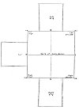

  
[Intangible Textual Heritage](../../../index)  [Hinduism](../../index.md) 
[Satapatha Brahmana](../index)  [Index](index)  [Previous](sbe4167.md) 

------------------------------------------------------------------------

[Buy this Book at
Amazon.com](https://www.amazon.com/exec/obidos/ASIN/8120801423/internetsacredte.md)

------------------------------------------------------------------------

*Satapatha Brahmana Part III (SBE41)*, Julius Eggeling tr. \[1894\], at
Intangible Textual Heritage

------------------------------------------------------------------------

p. 419

### PLAN OF FIRE-ALTAR (AGNIKSHETRA)

[  
Click to enlarge](img/41900.jpg.md)  
PLAN OF FIRE-ALTAR (AGNIKSHETRA)  

 
