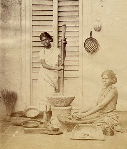

  
[Intangible Textual Heritage](../../index)  [Hindusim](../index.md) 

------------------------------------------------------------------------

<table width="75%">
<colgroup>
<col style="width: 50%" />
<col style="width: 50%" />
</colgroup>
<tbody>
<tr class="odd">
<td width="50%" data-valign="CENTER"> 
</td>
<td width="50%" data-valign="CENTER"><h1 id="studies-from-an-eastern-home" data-align="CENTER">Studies from an Eastern Home</h1>
<h2 id="by-sister-nivedita-margaret-e.-noble" data-align="CENTER">by Sister Nivedita 
(Margaret E. Noble)</h2>
<h4 id="section" data-align="CENTER">[1913]</h4></td>
</tr>
</tbody>
</table>

------------------------------------------------------------------------

This is a set of essays by Sister Nivedita, published posthumously.
Nivedita was a woman of Irish nationality who converted to Hinduism and
spent her life selflessly helping the poor women of India. This book
gives a rare ground-level vista of vernacular Hinduism from a woman's
point of view in the 19th century. Pervading Nivedita's writing is an
earnest quest for spiritual liberation and sincere love for the Indian
people of all castes. Also at this site by Sister Nivedita are [Kali the
Mother](../ktm/index), and [The Web of Indian Life](../wil/index.md).

------------------------------------------------------------------------

[Title Page](seh00.md)  
[Works by Sister Nivedita](seh01.md)  
[Contents](seh02.md)  
[Margaret Noble: In Memoriam](seh03.md)  
[A Few Tributes](seh04.md)  
[Books by Sister Nivedita](seh05.md)  
[Life in the Hindu Quarter of Calcutta](seh06.md)  
[Our Zenana Terrace](seh07.md)  
[The Hindu Widow and the Zenana](seh08.md)  
[The Sacred Year](seh09.md)  
[Dol-Jatra](seh10.md)  
[Janmastami; The Day of the Great Birth](seh11.md)  
[The Saraswati Puja](seh12.md)  
[The Durga Puja](seh13.md)  
[The Festival of Ras](seh14.md)  
[The Plague](seh15.md)  
[The Mediæval University of India](seh16.md)  
[An Old Collegiate Village](seh17.md)  
[The Holy City](seh18.md)  
[Chitore](seh19.md)  
[An Indian Amulet](seh20.md)  
[King Parikshit and the Frog Maiden](seh21.md)  
[Gopaler-Ma: The Mother of the Christ-Child](seh22.md)  
[The Indian Ash, or Tree of Healing](seh23.md)  
[The Dread Seven](seh24.md)  
[The Kashmir Shawl](seh25.md)  
[The Land of the Water-Ways](seh26.md)  
[The Northern Pilgrimage](seh27.md)  
[Note to the Northern Pilgrimage](seh28.md)  
[The Ship of Flowers](seh29.md)  
