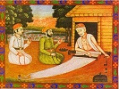

  
[Intangible Textual Heritage](../../index)  [Hinduism](../index.md) 
[Sufism](../../isl/index.htm#sufi)  [Index](index)  [Previous](sok017.md) 
[Next](sok019.md) 

------------------------------------------------------------------------

[Buy this Book at
Amazon.com](https://www.amazon.com/exec/obidos/ASIN/B002B55PTI/internetsacredte.md)

------------------------------------------------------------------------

  
*The Songs of Kabir*, tr. by Rabindranath Tagore, intro. by Evelyn
Underhill, \[1915\], at Intangible Textual Heritage

------------------------------------------------------------------------

### XVII

II\. 61.

grah candra tapan jot varat hai

THE light of the sun, the moon, and the stars shines bright:  
The melody of love swells forth, and the rhythm of love's detachment
beats the time.  
Day and night, the chorus of music fills the heavens; and Kabîr says  
"My Beloved One gleams like the lightning flash in the sky."

Do you know how the moments perform their adoration?  
Waving its row of lamps, the universe sings in worship day and night,  
There are the hidden banner and the secret canopy:  
There the sound of the unseen bells is heard.  
Kabîr says: "There adoration never ceases; there the Lord of the
Universe sitteth on His throne." p. 61  
The whole world does its works and commits its errors: but few are the
lovers who know the Beloved.  
The devout seeker is he who mingles in his heart the double currents of
love and detachment, like the mingling of the streams of Ganges and
Jumna;  
In his heart the sacred water flows day and night; and thus the round of
births and deaths is brought to an end.

Behold what wonderful rest is in the Supreme Spirit! and he enjoys it,
who makes himself meet for it.  
Held by the cords of love, the swing of the Ocean of Joy sways to and
fro; and a mighty sound breaks forth in song.  
See what a lotus blooms there without water! and Kabîr says  
"My heart's bee drinks its nectar." p. 62  
What a wonderful lotus it is, that blooms at the heart of the spinning
wheel of the universe! Only a few pure souls know of its true delight.  
Music is all around it, and there the heart partakes of the joy of the
Infinite Sea.  
Kabîr says: "Dive thou into that Ocean of sweetness: thus let all errors
of life and of death flee away."

Behold how the thirst of the five senses is quenched there! and the
three forms of misery are no more!  
Kabîr says: "It is the sport of the Unattainable One: look within, and
behold how the moon-beams of that Hidden One shine in you."  
There falls the rhythmic beat of life and death: p.
63  
Rapture wells forth, and all space is radiant with light.  
There the Unstruck Music is sounded; it is the music of the love of the
three worlds.  
There millions of lamps of sun and of moon are burning;  
There the drum beats, and the lover swings in play.  
There love-songs resound, and light rains in showers; and the worshipper
is entranced in the taste of the heavenly nectar.  
Look upon life and death; there is no separation between them,  
The right hand and the left hand are one and the same.  
Kabîr says: "There the wise man is speechless; for this truth may never
be found in Vadas or in books."

I have had my Seat on the Self-poised One, p.
64  
I have drunk of the Cup of the Ineffable,  
I have found the Key of the Mystery,  
I have reached the Root of Union.  
Travelling by no track, I have come to the Sorrowless Land: very easily
has the mercy of the great Lord come upon me.  
They have sung of Him as infinite and unattainable: but I in my
meditations have seen Him without sight.  
That is indeed the sorrowless land, and none know the path that leads
there:  
Only he who is on that path has surely transcended all sorrow.  
Wonderful is that land of rest, to which no merit can win;  
It is the wise who has seen it, it is the wise who has sung of it.  
This is the Ultimate Word: but can any express its marvellous savour?
p. 65  
He who has savoured it once, he knows what joy it can give.  
Kabîr says: "Knowing it, the ignorant man becomes wise, and the wise man
becomes speechless and silent,  
The worshipper is utterly inebriated,  
His wisdom and his detachment are made perfect;  
He drinks from the cup of the inbreathings and the outbreathings of
love."

There the whole sky is filled with sound, and there that music is made
without fingers and without strings;  
There the game of pleasure and pain does not cease.  
Kabîr says: "If you merge your life in the Ocean of Life, you will find
your life in the Supreme Land of Bliss."

What a frenzy of ecstasy there is in p. 66
every hour! and the worshipper is pressing out and drinking the essence
of the hours: he lives in the life of Brahma.  
I speak truth, for I have accepted truth in life; I am now attached to
truth, I have swept all tinsel away.  
Kabîr says: "Thus is the worshipper set free from fear; thus have all
errors of life and of death left him."

There the sky is filled with music:  
There it rains nectar:  
There the harp-strings jingle, and there the drums beat.  
What a secret splendour is there, in the mansion of the sky!  
There no mention is made of the rising and the setting of the sun;  
In the ocean of manifestation, which is the light of love, day and night
are felt to be one. p. 67  
Joy for ever, no sorrow,--no struggle!  
There have I seen joy filled to the brim, perfection of joy;  
No place for error is there.  
Kabîr says: "There have I witnessed the sport of One Bliss!"

I have known in my body the sport of the universe: I have escaped from
the error of this world..  
The inward and the outward are become as one sky, the Infinite and the
finite are united: I am drunken with the sight of this All!  
This Light of Thine fulfils the universe: the lamp of love that burns on
the salver of knowledge.  
Kabîr says: "There error cannot enter, and the conflict of life and
death is felt no more."

p. 68

------------------------------------------------------------------------

[Next: XVIII](sok019.md)
