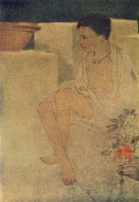

[Intangible Textual Heritage](../../../index)  [Hinduism](../../index) 
[Tagore](../index)  [Index](index)  [Previous](cm17)  [Next](cm19) 

------------------------------------------------------------------------

### FAIRYLAND

 

\[Illustration: From a drawing by Abanindranath Tagore--see cfairy.jpg\]

If people came to know where my king's palace is, it would vanish into
the air.

The walls are of white silver and the roof of shining gold.

The queen lives in a palace with seven courtyards, and she wears a jewel
that cost all the wealth of seven kingdoms.

But let me tell you, mother, in a whisper, where my king's palace is.

It is at the corner of our terrace where the pot of the *tulsi* plant
stands.

The princess lies sleeping on the far-away shore of the seven impassable
seas.

There is none in the world who can find her but myself.

She has bracelets on her arms and pearl drops in her ears; her hair
sweeps down upon the floor.

She will wake when I touch her with my magic wand, and jewels will fall
from her lips when she smiles.

But let me whisper in your ear, mother; she is there in the corner of
our terrace where the pot of the *tulsi* plant stands.

When it is time for you to go to the river for your bath, step up to
that terrace on the roof.

I sit in the corner where the shadows of the walls meet together.

Only puss is allowed to come with me, for she knows where the barber in
the story lives.

But let me whisper, mother, in your ear where the barber in the story
lives.

It is at the corner of the terrace where the pot of the *tulsi* plant
stands.

------------------------------------------------------------------------

[Next: The Land Of The Exile](cm19)
