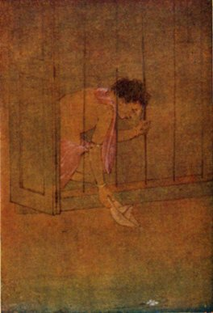

[Intangible Textual Heritage](../../../index)  [Hinduism](../../index.md) 
[Tagore](../index)  [Index](index)  [Previous](cm20)  [Next](cm22.md) 

------------------------------------------------------------------------

### PAPER BOATS

 

\[Illustration: From a drawing by Surendranath Ganguli\]

Day by day I float my paper boats one by one down the running stream.

In big black letters I write my name on them and the name of the village
where I live.

I hope that someone in some strange land will find them and know who I
am.

I load my little boats with *shiuli* flowers from our garden, and hope
that these blooms of the dawn will be carried safely to land in the
night.

I launch my paper boats and look up into the sky and see the little
clouds setting their white bulging sails.

I know not what playmate of mine in the sky sends them down the air to
race with my boats!

When night comes I bury my face in my arms and dream that my paper boats
float on and on under the midnight stars.

The fairies of sleep are sailing in them, and the lading is their
baskets full of dreams.

------------------------------------------------------------------------

[Next: The Sailor](cm22.md)
