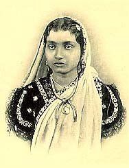

[Intangible Textual Heritage](../../../index)  [Hinduism](../../index) 
[Tagore](../index)  [Index](index)  [Next](hw01) 

------------------------------------------------------------------------

# The Home and the World

## by Rabindranath Tagore \[1861-1941\]

#### Translated \[from Bengali to English\] by Surendranath Tagore

#### London: Macmillan, 1919 \[published in India, 1915, 1916\]

 

###### redacted by Chetan K Jain, BharatLiterature, 2002

------------------------------------------------------------------------

[Next: I](hw01)
