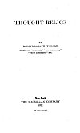

  
[Intangible Textual Heritage](../../../index)  [Hinduism](../../index) 
[Tagore](../index)  [Index](index)  [Previous](tr00)  [Next](tr02) 

------------------------------------------------------------------------

# THOUGHT RELICS

##### BY

##### RABINDRANATH TAGORE

###### AUTHOR OF "GITANJALI," "THE GARDENER," "FRUIT GATHERING," ETC.

New York

THE MACMILLAN COMPANY

\[1921\]

Scanned at Intangible Textual Heritage, September 2005. Proofed and
formatted by John Bruno Hare. This text is in the public domain in the
United States because it was published prior to January 1st, 1923. These
files may be used for any non-commercial purpose provided this notice of
attribution is left intact in all copies.

[  
Click to enlarge](img/cover.jpg)  
Cover and Spine  

[  
Click to enlarge](img/title.jpg)  
Title Page  

[  
Click to enlarge](img/verso.jpg)  
Verso  

------------------------------------------------------------------------

[Next: Thought Relics](tr02)
