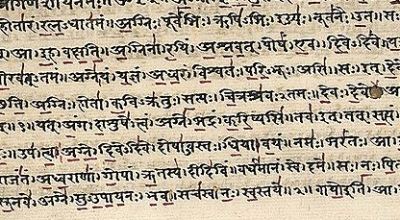

  
[Intangible Textual Heritage](../../index)  [Hinduism](../index.md) 

------------------------------------------------------------------------

[Buy this Book on
Kindle](https://www.amazon.com/exec/obidos/ASIN/B0031574GO/internetsacredte.md)

------------------------------------------------------------------------

<table width="75%">
<colgroup>
<col style="width: 50%" />
<col style="width: 50%" />
</colgroup>
<tbody>
<tr class="odd">
<td width="50%" data-valign="TOP"></td>
<td width="50%" data-valign="CENTER"><h1 id="thirty-minor-upanishads" data-align="CENTER">Thirty Minor Upanishads</h1>
<h2 id="tr.-by-k.-narayanasvami-aiyar" data-align="CENTER">tr. by K. Narayanasvami Aiyar</h2>
<h4 id="section" data-align="CENTER">[1914]</h4></td>
</tr>
</tbody>
</table>

------------------------------------------------------------------------

[Contents](#contents)    [Start Reading](tmu00.md)    [Page
Index](pageidx)    [Text \[Zipped\]](tmu.txt.gz.md)

------------------------------------------------------------------------

|                                                                                                                           |
|---------------------------------------------------------------------------------------------------------------------------|
|  |

This is a selection of translations from the 'minor' Upanishads. These
are texts which have been incorporated into the list of 108 Upanishads,
principally dealing with Yogic philosophy and practices. They describe
some very esoteric concepts, and enumerate Hindu technical terminology
in great detail.

------------------------------------------------------------------------

 [Title Page](tmu00.md)  
[Contents](tmu01.md)  
[Foreword](tmu02.md)  
[1. Mukṭikopanishaḍ of Śukla-Yajurveḍa](tmu03.md)  
[2. Sarvasāra-Upanishaḍ of Kṛshṇa-Yajurveḍa](tmu04.md)  
[3. Nirālamba-Upanishaḍ of Śukla-Yajurveḍa](tmu05.md)  
[4. Maiṭreya-Upanishaḍ of Sāmaveḍa](tmu06.md)  
[5. Kaivalya-Upanishaḍ of Kṛshṇa-Yajurveḍa](tmu07.md)  
[6. Amṛṭabinḍu-Upanishaḍ of Kṛshṇa-Yajurveḍa](tmu08.md)  
[7. Āṭmaboḍha-Upanishaḍ of Ṛgveḍa](tmu09.md)  
[8. Skanḍa-Upanishaḍ of Kṛshṇa-Yajurveḍa](tmu10.md)  
[9. Paiṅgala-Upanishaḍ of Śukla-Yajurveḍa](tmu11.md)  
[10. Aḍhyāṭma-Upanishaḍ of Śukla-Yajurveḍa](tmu12.md)  
[11. Subala-Upanishaḍ of Śukla-Yajurveḍa](tmu13.md)  
[12. Ṭejobinḍu-Upanishaḍ of Kṛshṇa-Yajurveḍa](tmu14.md)  
[13. Brahmopanishaḍ of Kṛshṇa-Yajurveḍa](tmu15.md)  
[14. Vajrasūchi-Upanishaḍ of Sāmaveḍa](tmu16.md)  
[15. Śārīraka-Upanishaḍ of Kṛshṇa-Yajurveḍa](tmu17.md)  
[16. Garbha-Upanishaḍ of Kṛshṇa-Yajurveḍa](tmu18.md)  
[17. Ṭārasāra-Upanishaḍ of Śukla-Yajurveḍa](tmu19.md)  
[18. Nārāyaṇa-Upanishaḍ of Kṛshṇa-Yajurveḍa](tmu20.md)  
[19. Kalisanṭāraṇa Upanishaḍ of Kṛshṇa-Yajurveḍa](tmu21.md)  
[20. Bhikshuka-Upanishaḍ of Śukla-Yajurveḍa](tmu22.md)  
[21. Naraḍaparivrājaka-Upanishaḍ of Aṭharvaṇaveḍa](tmu23.md)  
[22. Śāṇdilya-Upanishaḍ of Aṭharvaṇaveḍa](tmu24.md)  
[23. Yogaṭaṭṭva-Upanishaḍ of Kṛshṇa-Yajurveḍa](tmu25.md)  
[24. Ḍhyānabinḍu-Upanishaḍ of Sāmaveḍa](tmu26.md)  
[25. Hamsa-Upanishaḍ of Śukla-Yajurveḍa](tmu27.md)  
[26. Amṛṭanāḍa-Upanishaḍ of Kṛshṇa-Yajurveḍa](tmu28.md)  
[27. Varāha-Upanishaḍ of Kṛshṇa-Yajurveḍa](tmu29.md)  
[28. Maṇdalabrāhmaṇa-Upanishaḍ of Śukla-Yajurveḍa](tmu30.md)  
[29. Nāḍabinḍu-Upanishaḍ of Ṛgveḍa](tmu31.md)  
[30. Yogakuṇdalī-Upanishaḍ of Kṛshṇa-Yajurveḍa](tmu32.md)  
[Index of Proper Names](tmu33.md)  
