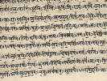

  
[Intangible Textual Heritage](../../index)  [Hinduism](../index) 
[Index](index)  [Previous](tmu09)  [Next](tmu11) 

------------------------------------------------------------------------

[Buy this Book on
Kindle](https://www.amazon.com/exec/obidos/ASIN/B0031574GO/internetsacredte)

------------------------------------------------------------------------

  
*Thirty Minor Upanishads*, tr. by K. Narayanasvami Aiyar, \[1914\], at
Intangible Textual Heritage

------------------------------------------------------------------------

p. 41

### SKANḌA [1](#fn_15)-UPANISHAḌ

### OF

### KṚSHṆA-YAJURVEḌA

Om. O Mahāḍeva (Lord of Ḍevas), I am
indestructible through a small portion of Thy grace. I am replete with
Vijñāna. I am Śiva (Bliss). What is higher than It? Truth does not shine
as such on account of the display of the antaḥkaraṇa (internal organs).
Through the destruction of the antaḥkaraṇa, Hari abides as Samviṭ
(Consciousness) alone. As I also am of the form of Samviṭ, I am without
birth. What is higher than It? All inert things being other (than Āṭmā)
perish like dream. That Achyuṭa (the indestructible or Vishṇu), who is
the seer of the conscious and the inert, is of the form of Jñāna. He
only is Mahāḍeva. He only is Mahā-Hari (Mahāvishṇu). He only is the
Jyoṭis of all Jyoṭis (or Light of all lights). He only is Parameśvara.
He only is Parabrahman. That Brahman I am. There is no doubt (about it).
Jīva is Śiva. Śiva is Jīva. That Jīva is Śiva alone. Bound by husk, it
is paddy; freed from husk, it is rice. In like manner Jīva is bound (by
karma). If karma perishes, he (Jīva) is Saḍāśiva. So long as he is bound
by the bonds of karma, he is Jīva. If freed from its bonds, then he is
Saḍāśiva. Prostrations on account of Śiva who is of the form of Vishṇu,
and on account of Vishṇu who is of the form of Śiva. The heart of Vishṇu
is Śiva. The heart of Śiva is Vishṇu. As I see no difference [2](#fn_16) (between these two), therefore to me are
prosperity and life. There is no difference—between Śiva and

p. 42

\[paragraph continues\] Keśava (Vishṇu).
The body is said to be the divine temple. The Śiva (in the body) is the
God Saḍāśiva [1](#fn_17) (in the temple).

Having given up the cast-off offerings of ajñāna, one should worship Him
with the thought "I am He". To see (oneself) as not different (from Him)
is (jñāna) wisdom. To make the mind free from sensual objects is ḍhyāna
(meditation). The giving up of the stains of the mind is snāna
(bathing). The subjugation of the senses is śoucha (cleansing). The
nectar of Brahman should be drunk. For the upkeep of the body, one
should go about for alms and eat. He should dwell alone in a solitary
place without a second. He should be with the sole thought of the
non-dual One. The wise person who conducts himself thus, attains
salvation. Prostrations on account of Śrīmaṭ Param-Jyoṭis (Supreme
Light) abode! May prosperity and long life attend (me). O
Narasimha! [2](#fn_18) O Lord of Ḍevas! through
Thy grace, persons cognize the true nature of Brahman that is
unthinkable, undifferentiated, endless, and immutable, through the forms
of the Gods, Brahma, Nārāyaṇa, and Śaṅkara.

Like the eye (which sees without any obstacle the things) spread in the
ākāś, so the wise always see the supreme abode of Vishṇu. Brahmans with
divine eyes who are always spiritually awake, praise in diverse ways and
illuminate the supreme abode of Vishṇu. Thus is the teaching of the
Veḍas for salvation.

Thus is the Upanishaḍ.

------------------------------------------------------------------------

### Footnotes

[41:1](tmu10.htm#fr_15) Skanḍa is the son of
Śiva and is represented on earth by Sanaṭkumāra.

[41:2](tmu10.htm#fr_16) This will give a rude
shock to the followers of Śiva and Vishṇu in India, who, wage useless
war as to the supremacy of Vishṇu and Śiva.

[42:1](tmu10.htm#fr_17) Saḍāsiva, lit., eternal
bliss. This is one of the names applied to Śiva as also Mahāḍeva.

[42:2](tmu10.htm#fr_18) Narasimha, lit.,
Man-lion. This refers to one of the incarnations of Vishṇu when he
killed the evil power Hiraṇyakasipu.

------------------------------------------------------------------------

[Next: 9. Paiṅgala-Upanishaḍ of Śukla-Yajurveḍa](tmu11)

