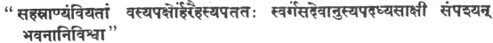

  
[Intangible Textual Heritage](../../index)  [Hinduism](../index) 
[Index](index)  [Previous](tmu30)  [Next](tmu32) 

------------------------------------------------------------------------

[Buy this Book on
Kindle](https://www.amazon.com/exec/obidos/ASIN/B0031574GO/internetsacredte)

------------------------------------------------------------------------

  
*Thirty Minor Upanishads*, tr. by K. Narayanasvami Aiyar, \[1914\], at
Intangible Textual Heritage

------------------------------------------------------------------------

p. 254

### NĀḌABINḌU [1](#fn_223)-UPANISHAḌ

### OF

### ṚGVEḌA

The syllable A is considered to be its
(the bird Om's) right wing, U, its left: M [2](#fn_224), its tail; and the arḍhamāṭrā
(half-metre) is said to be its head.

The (rājasic and ṭāmasic) qualities, its feet upwards (to the loins);
saṭṭva, its (main) body;  [3](#fn_225) ḍharma
is [considered](errata.htm#20) to be its right eye, and aḍharma, its
left.

The Bhūrloka is situated in its feet; the Bhuvarloka, in its knees; the
Suvarloka, in its loins; and the Maharloka, in its navel.

In its heart is situate the Janoloka; the ṭapoloka in its throat, and
the Saṭyaloka in the centre of the forehead between the eyebrows.

Then the māṭrā (or manṭra) beyond the Sahasrāra (thousand-rayed) is
explained (*viz*.,) should be explained.

An adept in yoga who bestrides the Hamsa (bird) thus (*viz*.,
contemplates on Om) is not affected by karmic influences or by tens of
crores of sins. [4](#fn_226)

p. 255

The first māṭrā has agni as its ḍevaṭā (presiding deity); the second,
vayu as its ḍevaṭā; the next māṭrā is resplendent like the sphere of the
sun and the last, the Arḍhamāṭrā the wise know as belonging to Varuṇa
(the presiding deity of water) .

Each of these māṭrās has indeed three kalās (parts). This is called
Omkāra. Know it by means of the ḍhāraṇās, *viz*., concentration on each
of the twelve kalās, or the variations of the māṭrās produced by the
difference of svaras or intonation). The first māṭrā is called ghoshiṇī;
the second, viḍyunmāli (or viḍyunmāṭrā); the third, paṭaṅginī; the
fourth, vāyuveginī; the fifth, nāmaḍheya; the sixth, ainḍrī; the
seventh, vaishṇavī; the eighth, śāṅkarī; the ninth, mahaṭī; the tenth,
ḍhṛṭi (ḍhruva, Calcutta ed.); the eleventh, nārī (mauni, Calcutta ed.);
and the twelfth, brāhmī. [1](#fn_227)

If a person happens to die in the first māṭrā (while contemplating on
it), he is born again as. a great emperor in Bhāraṭavarsha.

If in the second māṭrā, he becomes an illustrious yaksha; if in the
third māṭrā, a viḍyāḍhara; if in the fourth, a ganḍharva (these three
being the celestial hosts).

If he happens to die in the fifth, *viz*., arḍhamāṭrā, he lives in the
world of the moon, with the rank of a ḍeva greatly glorified there.

If in the sixth, he merges into Inḍra; if in the seventh, he reaches the
seat of Vishṇu; if in the eighth, Ruḍra, the Lord of all creatures.

If in the ninth, in Maharloka; if in the tenth, in Janoloka (Ḍhruvaloka,
Calcutta ed.); if in the eleventh, Ṭapoloka, and if in the twelfth, he
attains the eternal [2](#fn_228) state of
Brahma.

p. 256

That which is beyond these, (*viz*.,) Parabrahman which is beyond (the
above māṭrās), the pure, the all-pervading, beyond kalās, the ever
resplendent and the source of all jyoṭis (light) should be known.

 [1](#fn_229) When the mind goes beyond the
organs and the guṇās and is absorbed, having no separate existence and
no mental action, then (the guru) should instruct him (as to his further
course of development).

That person always engaged in its contemplation and always absorbed in
it should gradually leave off his body (or family) following the course
of yoga and avoiding all intercourse with society.

Then he, being freed from the bonds of karma and the existence as a jīva
and being pure, enjoys the supreme bliss by his attaining of the state
of Brahmā. [2](#fn_230)

O intelligent man, spend your life always in the knowing of the supreme
bliss, enjoying the whole of your prārabḍha (that portion of past karma
now being enjoyed) without making ally complaint (of it).

Even after āṭmajñāna (knowledge of Mind or Self) has awakened (in one),
prārabḍha does not leave (him); but he does not feel prārabḍha after the
dawning of ṭaṭṭvajñāna [3](#fn_231) (knowledge
of ṭaṭṭva or truth) because the body and other things are asaṭ (unreal),
like the things seen in a dream to one on awaking from it.

That (portion of the) karma which is done in former births, and called
prārabḍha does not at all affect the person (ṭaṭṭvajñānī), as there is
no rebirth 'to him.

As the body that exists in the dreaming state is untrue, so is this
body. Where then is rebirth to a thing that is illusory? How can a thing
have any existence, when there is no birth (to it)?

As the clay is the material cause of the pot, so one learns from Veḍānṭa
that ajñāna is the material cause of the

p. 257

universe: and when ajñāna ceases to exist, where then is the cosmos?

As a person through illusion mistakes a rope for a serpent, so the fool
not knowing Saṭya (the eternal truth) sees the world (to be true.)

When he knows it to be a piece of rope, the illusory idea of a serpent
vanishes.

So when he knows the eternal substratum of everything and all the
universe becomes (therefore) void (to him), where then is prārabḍha to
him, the body being a part of the world? Therefore the word prārabḍha is
accepted to enlighten the ignorant (only).

Then as prārabḍha has, in course of time, worn out, he who is the sound
resulting from the union of Praṇava with Brahman who is the absolute
effulgence itself, and who is the bestower of all good, shines himself
like the sun at the dispersion of the clouds.

The yogin being in the siḍḍhāsana (posture) and practising the
vaishṇavīmuḍrā, should always hear the internal sound through the right
ear.

The sound which he thus practises makes him deaf to all external sounds.
Having overcome all obstacles, he enters the ṭurya state within fifteen
days.

In the beginning of his practice, he hears many loud sounds. They
gradually increase in pitch and are heard more and more subtly.

At first, the sounds are like those proceeding from- the ocean, clouds,
kettle-drum, and cataracts: in the middle (stage) those proceeding from
marḍala (a musical instrument), bell, and horn.

At the last stage, those proceeding from tinkling bells, flute, vīṇā (a
musical instrument), and bees. Thus he hears many such sounds more and
more subtle.

When he comes to that stage when the sound of the great kettle-drum is
being heard, he should try to distinguish only sounds more and more
subtle.

He may change his concentration from the gross sound to the subtle, or
from the subtle to the gross, but he should not allow his mind to be
diverted from them towards others.

p. 258

The mind having at first concentrated itself on any one sound fixes
firmly to that and is absorbed in it.

It (the mind) becoming insensible to the external impressions, i becomes
one with the sound as milk with water, and then becomes rapidly absorbed
in chiḍākāś (the akāś where Chiṭ prevails).

Being indifferent towards all objects, the yogin having controlled his
passions, should by continual practice concentrate his attention upon
the sound which destroys the mind.

Having abandoned all thoughts and being freed from all actions, he
should always concentrate his attention on the sound, and (then) his
chiṭṭa becomes absorbed in it.

Just as the bee drinking the honey (alone) does not care for the odour,
so the chiṭṭa which is always absorbed in sound, does not long for
sensual objects, as it is bound by the sweet smell of nāḍa and has
abandoned its flitting nature.

The serpent chiṭṭa through listening to the nāḍa is entirely absorbed in
it, and becoming unconscious of everything concentrates itself on the
sound.

The sound serves the purpose of a sharp goad to control the maddened
elephant—chiṭṭa which roves in the pleasure-garden of the sensual
objects.

It serves the purpose of a snare for binding the deer—chiṭṭa. It also
serves the purpose of a shore to the ocean waves of chiṭṭa.

The sound proceeding from Praṇava which is Brahman is of the nature of
effulgence; the mind becomes absorbed in it; that is the supreme seat of
Vishṇu.

The sound exists till there is the ākāśic conception (ākāśasaṅkalpa).
Beyond this, is the (aśabḍa) soundless Parabrahman which is Paramāṭmā.

The mind exists so long as there is sound, but with its (sound's)
cessation, there is the state called unmanī of manas (*viz*., the state
of being above the mind).

This sound is absorbed in the Akshara (indestructible) and the soundless
state is the supreme seat.

The mind which along with Prāṇa (Vāyu) has (its) karmic affinities
destroyed by the constant concentration upon nāḍa is absorbed in the
unstained One. There is no doubt of it.

p. 259

Many myriads of nāḍas and many more of binḍus—(all) become absorbed in
the Brahma-Praṇava sound.

Being freed from all states and all thoughts whatever, the yogin remains
like one dead. He is a mukṭa. There is no doubt about this.

After that, he does not at any time hear the sounds of conch or ḍunḍubhi
(large kettle-drum).

The body in the state of unmanī is certainly like a log and does not
feel heat or cold, joy or sorrow.

The yogin's chiṭṭa having given up fame or disgrace is in samāḍhi above
the three states.

Being freed from the waking and the sleeping states, he attains to his
true state.

When the (spiritual) sight becomes fixed without any object to be seen,
when the vāyu (prāṇa) becomes still without any effort, and when the
chiṭṭa becomes firm without any support, he becomes of the form of the
internal sound of Brahma-Praṇava.

Such is the Upanishaḍ.

------------------------------------------------------------------------

### Footnotes

[254:1](tmu31.htm#fr_238) Lit., Sound-seed.

[254:2](tmu31.htm#fr_239) The commentator says
that M is the last letter and hence tail and arḍhamāṭrā is the head, as
it enables one to attain to higher worlds.

[254:3](tmu31.htm#fr_240) Another reading is:
The qualities are its feet, etc., and Ṭaṭṭva is its body.

[254:4](tmu31.htm#fr_241) Comm.: Since this
manṭra has already occurred in the preceding khaṇda of the same sākhā,
it is simply referred in the text. The manṭra is:

 

The meaning seems to be—the letters A and U are the two wings of the
Hamm (Om) of the form of Vishṇu which goes to svarga, the abode of
Sūrya, the thousand-rayed God; that syllable, 'Om' bearing in its heart
all the ḍevas (of saṭṭvaguṇa). He goes up to Sahasrānha seeing the
worlds personally: Sahasrānha being the seat of the spiritual sun.

[255:1](tmu31.htm#fr_242) Comm.: The four
māṭrās are subdivided into twelve by their having each three svaras,
Uḍāṭṭa, Anuḍāṭṭa, and Svarīṭa. Here the author goes on to give the names
of the twelve kalās and shows the method of practising Dhāraṇā on each.
Ghoshiṇī is that which gives Prajña: Viḍyunmālī is that which secures
entrance into the loka of Viḍyunmālī, the king of the yakshas: Paṭaṅginī
is that which confers the power of movement through air like the bird
Paṭanginī; Vāyuvegiṅī is that which gives the power of moving very
rapidly: Nāmaḍheya means that which confers existence in Piṭṛloka:
Ainḍrī in Inḍraloka: Vaishṇavī and Sāṅkarī in Vishṇu and Siva-lokas
respectively: Maunī to the loka of Munis or Janoloka and Brāhmī to
Brahmaloka.

[255:2](tmu31.htm#fr_243) Eternal here means
the lifetime of Brahmā.

[256:1](tmu31.htm#fr_244) Another edition says:
he should enter through yoga the incomparable and quiescent Śiva.

[256:2](tmu31.htm#fr_245) Here the Calcutta
edition stops.

[256:3](tmu31.htm#fr_246) Taṭṭvajñāna is the
discrimination of the ṭaṭṭvas of this universe and man. Āṭmajñāna—the
discrimination of Āṭmā or the Self in man.

------------------------------------------------------------------------

[Next: 30. Yogakuṇdalī-Upanishaḍ of Kṛshṇa-Yajurveḍa](tmu32)

