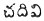
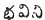

  
[Intangible Textual Heritage](../../index)  [Hinduism](../index.md) 
[Index](index)  [Previous](vov01)  [Next](vov03.md) 

------------------------------------------------------------------------

p. 7

To the sainted Bards, to the nine poets, to the Siva creed, to his
essence, and to the boon-granting Gem, to those who attend in the heaven
of Siva, to the god himself and to thy teacher--pray for aid of Vema.

1

The unborn (see 556) the slayer of *sharabha* endowed with the qualities
of Siva and the lord of a thousand millions of demigods; the servants of
Siva who sitteth at the root of the sacred Banyan, He that is endowed
with the mind of Siva, the sage Somasekhara is my teacher.

\[He who is exalted above mortality, the vanquisher of the *Chinmaya*
full of blessedness, Lord of ten thousand millions of saints who is also
devoted to Siva, this is he who dwelleth under the sacred Fig tree whose
heart is enwrapt in bliss, the crescent crowned Teacher, that is, the
Deity alone was my instructor\].

2

Who ever learneth the verses uttered by the sainted, this man shall
attain to that object which is emphatically Incomprehensible.

p. 8

3

Shall not they who read the thousand verses uttered by the venerable
Vemana (who is full of the divine nature) relinquish all filthy lure
whether of mind or body. (For 
 I have substituted 
 the name given by Jangams to all persons and things
that are not consecrated to the Jangam creed.)

4

He that will become a sage, and with pure faith learn these thousand
verses without quitting them surely the place of beatitude is put into
the palm of his hand.

5

That wise man who will even learn only the number of hundred verses, his
appetites shall be at an end--and he by the four paths shall verily
attain the abode of the Deity.

6

Know that the mind is the universal cause. By viewing and meditating on
this, a man shall himself become spirit wherever he dwelleth all his
days--know well the truth of this Vema!

p. 9

7

Is it in the hand of any one to attain beatitude except that perfected
saint who has himself become a portion of the universe? Though those
roam the whole earth, the caverns, the mountains or the waters of the
great deep?

8

The learned Brahmins who read all that is to be read, cannot yet attain
heaven and the chief God. If you remain still without moving thy lips,
this shall thee within thy mind, the glory of the perfected saint.

9

Perfect that the prime root is the first of beings whom it is out of our
power to make known. If with our secret soul and the thought of our mind
we meditate upon this perfect, then in the end of thine shall our whole
living spirits attain beatitude. Therefore will Vemana even in his songs
sings the preaches of this blessed power whose form he beholdeth in the
chamber of his heart.

p. 10

10

These worlds are all like leaves veiling the branch which is hidden from
the view even of Brahma. He alone who can perceive the branch can sing
its praises.

11

Though called yet remain silent; Though even again called yet maintain
silence, whatever they think, or any one say, let the wise smile as
though it was not intended for them; let them meditate in their souls on
the supreme, hereby becoming themselves Eternal. The hermit that thus
persistingly learneth shall like Vemana for ever attain the form of God.

12

One man became diseased, one became a donor every where, another became
a possessor--such a man became a true saint. One himself became a
libertine. But nowhere shall we see a mighty sage like to thee O
Vemana--truly all these various forms pertain to thee O brother.

13

Agreeably to the character of an ascetic relinquish all the objects of
carnality (or passion). Touch not carnal objects after the manner of a
magnanimous sage on earth, consider them the offspring of carnality.
Vema hath learned, to subdue all carnality.

p. 11

14

Vemana openeth not his mouth to say no to anyone's assertion. Thus he
seems like to a mad man. He can explain every mystery of that Vedantam
which destroys all distinctions and differences. From this knowledge his
apathy arises.

15

The worshipful teacher who by the due performances of worship hath
attained merit. He by that worship shall see (i.e., obtain). Never shall
he be changed.

16

By freely bestowing gifts you on one hand attain heaven but if you trust
to your own mind delusion enters. Trust to the light of wisdom to
destroy all that is inimical.

17

He [whom](errata.htm#9.md) in this world knows wisdom to him, there was no
next world (he is as if in heaven). He shall not lose his soul even in
the death of Brahma, In that he shall be absorbed in the divine mind.

p. 12

18

Is he whom you call God in another land? With *Devee* (the Goddess) he
is in the body. Mounting his vehicles (the senses), he rapidly drives
his chariots.

19

Until you find the thing you have lost, you require a light--only so
long--after finding it why keep the light? After becoming God why retain
the body.

20

If thou fall at the feet of the teacher will the dog of passion seize ye
thee? If you leave the teacher's feet, those dogs will seize thee.
Indeed the dog's disposition does not attach to the teacher.

21

By knowledge of the great spirit he himself became all things. By the
knowledge of life he became living. Let us first attain the destruction
of love and opinion?

p. 13

22

Why should ye in so many ways take care of (afford nourishment) this
body? Will it not perish (go)? If knowing futurity ye purge away your
impurities putting an end to destructions ye shall attain beatitude.

28

The cat having caught a muskrat delights not in it; but pursues the fowl
to seize it. Without relinquishing the delights
([possession](errata.htm#10).md) will love cease?

24

The only god is Eternal; to him who knows that all things curiously
compounded are in truth the unity and afflictions are as a lie and to
him beatitude is easy of attainment.

25

Again by perfection ghee is produced from curds, fire in trees,
fragrance from fine flowers and oil in seeds; thus shineth forth god the
soul of intellect.

p. 14

26

By friction and friction fire is produced in a tree. By continual
agitation ghee is produced in curd. Thus by perpetual meditation shall
divine wisdom be produced in our body.

27

Until he explores his own soul, a man acts (or roams) in ignorance of
God (or illusion caused by God). If by meditation you comprehend that
God is a spirit by understanding the beatitude shall be clearly
manifested to thee O Vemana.

28

This ignorant soul (living creature) after living so long imagines that
to die and be reproduced is the course of nature. To know that heaven
where we shall be so far advanced as to forget instruction this is
spirituality. ([Brahman](errata.htm#11).md)

29

Fire can even exist in a tree. But a tree has no power to remain where
fire is. Like to fire in a tree, is the worldly state, It contains
hidden the seeds of flame,

p. 15

30

If a cloud intervenes in a way destroys the sun. if your inclinations
intervene they destroy your firmness. If forgetfulness takes place it
destroys beatitude itself

31

Consider the soul in its fourth state (the *turyavastha* or death); view
it minute as a mote (cucumber-prickle). Hereby cut off all attachment to
earthly desires. He who comprehendeth the essence (or savour) of wisdom,
go to, he is Divinity.

32

Though he searches, he cannot see the teacher of wisdom (vedanta). There
is none in the world who can discover truth, even he be found he will
not look to any other object.

83

He that cloth not wallow in nor seek the enjoyments of sensual objects,
who (in the earth) sees the path of obtaining those objects who yet
calls all those deceptive pleasures which proceed from sensual objects
sensuality, they are the wise. They enjoy this world declaring they
enjoy it not.

p. 16

34

The great teacher is concealed in the word. The teacher is the Essence
of the word. The teacher is hidden in darkness. The teacher is the
support of all.

35

Action and inaction are the same to him who sports with his acts and to
him who is mighty in *tatwa*. If thou understand it from a determination
of what is right (*dharmam*) and what the contrary and with pure mind
truly set it forth.

36

They who are not able to free them from the trio of attachment (to sons,
wife and wealth) shall remain plunged in the multitude of desires. How
shall they attain the bliss of beatitude?

37

The senseless body (lit. animal) continueth for a while dies, and is
reproduced in the course of nature. So know that mansion of absorption
where thou shall forget knowledge. This is Divinity.

p. 17

38

It is the favour of the excellent teacher and through much study that is
illumed with knowledge and (good conduct) ethics, that shall put thee
into right path. Teach men that the excellent teacher is himself a part
of the [Divinity](errata.htm#12.md).

39

If thou have not lost shame thou shall not attain the delight of god;
unless thou humble and incline thyself shame will not leave thee. He who
hath given all shame shall live a lengthened age (i.e., a man to be
perfect must be independent of opinions).

40

Surely thy mother is thy wife and thy wife thy mother. Wise is he who
has comprehended this regarding these two (incomplete).

41

Unless thou give up thy lusts thou shall not be released from thy ties.
(lit. cord: earthly ties). Unless thou be free thou at no devotee. None
but a devotee can be freed from all desires.

p. 18

42

If you listen and listen to the voice within thy soul, the first saint
shall not be entangled in desires. If thou attain light In the soul,
this beatitude,

43

Convert thy mind into a fair chamber built in a summer mansion (pleasure
house) with a bath, well and garden. Prepare it for meeting the maid of
wisdom in secret and enjoying her charms. Thus let thy hours sweetly
glide away.

44

If thou search in the place where a thing is, thou shalt find it. Why
search in a place where it is not? Without the conjuration of deep
thought thou canst not attain that thing that is above all desirable.

45

How did he learn all the truth, and yet fail of becoming the Eternal;
carefully ascertaining the mystic word in abstraction, they distribute
instruction regarding the wondrous from. (loose version).

46

p. 19

In the flame of fire when thou hast firmly immolated (as a holocaust)
all personal affection fixing thy thought on the unborn, this shall he
an acceptable dedication to Hari.

47

Though fire is produced in a tree, is the tree conscious of that fire?
Like as the fire is concealed in the tree, thus can no one perceive the
nature of the devotee who hath dispelled those passions that harass the
soul.

48

To gaze and gaze on the firmament in the mundane egg shall be
excellently sweet to the sage if he fully meditates on it: abundantly
blessed shall he be in whatever direction he directs his view or his
steps.

49

How can he be a (Brahmin) Divine who knoweth not (Brahma) the Divinity
in the city of the Divine egg or universe? To understand by own mind, go
to, this is (Brahminity) Divinity.

50

p. 20

The science taught by a teacher is known to the teacher. The teacher
knoweth what the teacher explaineth. The power of the teacher is known
to the primal teacher.

51

Understanding well in thy mind uniting thyself with thy mind and seizing
him who is in thy mind--he that can stay his mind, this is the *yogee*
who knows the great secret.

52

Ignorant that he is himself the truth (*tatwa*) he loves delusion which
he imagines to be truth. If truly he sought for uprightness and virtue
(*dharma and carma*) this should be, to him, the truth, that is the
source of happiness,

53

He who constantly, without intermission, holdeth the all pervading
Divinity in (the place of) his soul, he shall arrive at the ineffable
dwelling, he shall truly comprehend the world--this is the truth.

54

Quitting this thick darkness of ignorance he who in due time forgetteth
himself, and who fixeth his mind with care on the supreme, this great
noble sage no where is to be found.

p. 21

55

As when one sees a rope and mistakes it for a snake he is alarmed, but
when he knows it is a rope his fear is over. Thus only when fear
departs, can we know the true nature of god.

56

The Divinity appears diversely to all those who look him. They who
seeing see and see him with understanding shall behold him; they
themselves shall become that vision and that vision, them.

57

He who comprehends the creed of the spine (*cundali*) what hath that
sage of might to do with the embraces of a girl --nobly in this body
shall the maid of beatitude alone shine.

58

The Veda taught by Vemana is known to him alone. Hear! Others know it
not. To those who understand Vemana shall the one letter (Om) be a
thousand times taught and permanently impressed on their mind.

p. 22

59

The corporal form being burnt in the flame of wisdom the body is all
vexed crushing all that desire, that (rolls about or) is afflicted in
the body. If thus we behold God, this is beatitude, O Vema!

60

He is like to a meditator, like a dumb man, like to an enjoyer, like a
diseased one. He who knows every state shall become Omniscient and be
like the prince of *yogees*.

61

Is not there one man living of good position? He may live some days in
comfort. After living, living and living he lives no longer. If he will
know the path to happiness, let him seize that stout thief, his mind cut
into pieces and prepare a dwelling for himself in heaven.

62

What is the wisdom of that man who in the house of the body cannot
distinguish his friends and foes? On him who knoweth them shall Divine
ambrosia be bestowed.

p. 28

63

Like as water flows in its channel thus does an immersion in that
knowledge of truth that arises in the mind ultimately (through an
absorption in the final essence) constitute the perfect saint. Then is
he like to the Ganges when her streams reach the ocean. (a
[correct](errata.htm#13) version of awful intricacy.md).

64

Casting away the mind and turning it back knowing the secret of the
heart and if thou fix thy mind, this is the greatest task of religion.

65

While pride of the body remains, love and the lust plunge us in the
ocean of reproduction. Therefore, desire, mental enemies, senses,
thoughts, deceit and fraud are all like to dream let us awake O Vema!

66

If you comprehend not the entire secret and if thy mind be not bound up
to one aim, the Divine secret shall not be revealed to thee. Should it
be shewn openly it would be but as the unveiling of the secret parts.

p. 24

67

If we look into these our bodies let us with inner vision consider that
the nature our forms possess is also that of all other bodies--with
devotion do all penitents, behold this.

68

If the teacher knows not in his character, the prime teacher, he is
himself as blind. The teacher who teaches the teacher is the lord of
life.

69

If first thy intellect steadfastly attached to thy resolution, it shall
dissipate this blind sleep. If this sleep be dissipated, it shall cause
thee to attain fearlessness. By tranquillity thou shalt gain the
assemblage of all felicity. By that felicity thou shall become the whole
world. By being united to the universe thou shalt become divine essence.
By subduing thy senses, the essence (permanent life) shall remain stable
in thee. If thou thus fix the divine essence, thou shalt become it. By
becoming the lord of the kings of saints thou shalt shine brilliantly;
thou shalt walk in delight and with deliracy like an infant, like to an
aged man, like a spirit (nocturnal apparition) like a mad man shalt thou
be. Behold thus, shalt thou act in thy dignity.

p. 26

70

Whatever there be of knowledge and ignorance in the mind, we can neither
perceive, see nor hear it. If we attempt to take hold on the mind to
seize and bind it we shall see that the body is replete with delusion
and nothing but delusion.

71

Though we know delusion to the death we cannot quit it in the courts of
God. They cannot see his equals and co-equals. Were all mighty would
there be a distinguished place for God?

72

All this life is illusion; possession and connections are delusion;
understanding is delusion. I myself on consideration, am delusion. He
that understands this illusion is the sage that comprehends the great
secret.

73

They know not the secret that this is all a world of delusion. They are
entangled in delusion and deluded. If you only understand this delusion
you shall attain the celestial regeneration.

74

p. 26

Wives and sons are delusion; connections are delusion; wealth and
greatness are delusion; the body is delusion, he that is aware of this
delusion is the sage who knows all secrets.

75

Born in delusion, grown in delusion to what end is a man who cannot
discern the nature of delusion. He who can under-stand this delusion is
the only happy man in the world.

76

For the sake of delusive worldly state, a man being ensnared in it
wanders in delusion, After he understands this delusion through delusion
itself he attains beatitude; that is, his sins, by his quitting them,
become sources of felicity.

77

As long as we are held in the present delusion, the abode of the true
state (of perfection) is beyond our reach. Then let us become perfected
in accomplished essence.

78

When we see our true figure shall we see truly that our body is born of
delusion. He alone who beholdeth within himself the possession of the
truth, this is the *parama yogi*.

p. 27

79

The delusion of delusion is the great *maya*; the *maya* that hath not
suffered delusion is unknown; it exists not. The *maya* that is not
delusion is truth.

80

(Mystic) If through pleasure, and the favour of the teacher, if thou
quit this house with nine doors, thou shalt become the universal spirit
and the universe.

81

Strife ceases when anger ceases; when strife ceases wishes also cease.
The connections that lead to future transmigrations cease when
distinctions are done away and when the three qualities of virtue,
passion and ignorance are dissolved, beatitude is permanent, O Vema.

82

He that knows not the mystical syllable, Om, never can become a saint.
He that knows not the glory of god is no *yogee*. He that knows not the
everlasting is not in a state of beatitude.

83

p. 28

By conquering the senses he that is steady knows the essence of god. How
should a man not knowing himself will call such a man a sage?

84

He who daily and highly considers and forgets from his mind the
distinctions of I and thou and he that thus liveth is the noble ascetic.

85

Search and view thyself; thou art the living being. Behold the great
(*tatwa*) existent and thou shalt become the spirit. Earth and Heaven
shall depart and delusion herself be destroyed.

86

He who knowing all the powers of Him who dwelleth in the dwelling shall
seize his evil mind and seat it. He who can retain his body is the
greatest of devotees.

87

If thou apply thy heel and hold it firmly to thy anus and then seek for
thy interior so as to understand the entrance of power, then if thou
also cause a change in thy mind (give thy word) and determine on
attaining felicity and it becomes the perfection. This is the path of
perfection (or *yoga*).

p. 29

88

By aid of the observances the mind is stayed. By wrath it is dissipated.
The steadfast mind obtains fearlessness. Resolution puts an end to
alliance. The mind that is removed from alliance suffers us to attain
tranquillity. From tranquillity is equality he himself becomes the
entire world. If he be transmuted into the universe, he is Essence
(*tatwa*). That Essence will watch its opportunity and vanquish all the
senses. If he becomes thus skilled in *tatwa* he shall become it
himself. He shall thus be a *raja yogi* in lustre and shine in the
world.

89

Words are a pack of evils; to keep a matter secret is a virtue; avarice
is like to death, loan a misfortune, an oath is an evil, words are
arrows--all this is not in the least known to men.

90

Why does this body a bag with nine holes in it, require convenient
things and a high caste, tell me. Believe not that it is thine.
Understand and say I am Brahma,

p. 80

91

All men are intoxicated and entangled in the six inimical causes of evil
propensities. Imagining this to be the path of prudence they walk in it;
but they cannot view and perceive the truth of god.

92

Burning the tree of earthly ties, the wise man engaging himself in
wisdom proceeds with propriety. The tree thus burnt will be very
delightful.

93

Seeing that connections keep the world in darkness, connections yet form
a tie between man and his creator. If all these connections were
dissolved, then in the true path should man see
[beatitude](errata.htm#14). (Loose version.md)

94

The eye is first fixed on the path of instructions. In the midst, when
we have learned somewhat the view dwelleth on our own mind, and at the
last the vision resteth on him who is pure light.

p. 31

95

Whenever you behold him he is looking at nothing else; he fixes his eyes
with quivering lids upon beatitude night and day in one fixed manner,
shall he ever learn to bow to Yama who visiteth the sins of men? What
more need we say the whole way of beatitude shall be attained by Vemana.

96

Unless thou relinquish vain words, the formula (of prayer and worship)
cannot be learnt; unless thou relinquish the form of prayer and become
absorbed in meditation the mind cannot be restrained. Unless thou
restrain thy mind thou shalt not attain beatitude.

97

In this filled vessel of the body with which light and darkness agree
well, if we forget the sleep of meditation, however great we be we
cannot know the first thing.

98

He that will strive and bind all the designs, or think not on anything
in his mind, but be like as a picture, this is the truly great man,
whether he be in forest or town,

p. 32

99

He who will remain in contemplation with quivering eyelids and fail not
to fix the Being in his mind, but perpetually view him--easy is not
anywhere for beatitude to be duly placed in him.

------------------------------------------------------------------------

[Next: 100-199](vov03.md)
