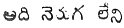

  
[Intangible Textual Heritage](../../index)  [Hinduism](../index) 
[Index](index)  [Previous](vov06)  [Next](vov08) 

------------------------------------------------------------------------

500

The earth is the noble mother; the seed is the father, the crops are
sons, the produce of cattle (i.e., milk etc.), is heaven (because milk
in various forms is offered in sacrifice), virtue is divinity. That is
Truth.

501

The farmer begins by cutting hastily down the flower gardens of the god
to build gates for the sluice (with the planks of the trees). Sinners
are they who attempt such acts.

502

Sorrow shall follow and seize him who wastes grain. If he possesses
grain his pain is over. In the veranda of the very whores of him who
hath grain, men shall abjectly wait for gruel.

503

Bread and water are the origin of the glory even to the Gods. In this
iron age it is the seat of all virtues. Food is as the elder brother of
all men (a pun).

p. 127

504

Food puts an end to difficulties; food alone is the dwelling of life,
beyond all other things. Are there any in this earth who desire not food
(instance of comparative?) If there be any, they must be none but Siva
(*Ugrudu*).

505

If the beggar cries (Date obolum) he who replies 'Oho' how likely and
asks him ridiculous questions, where shall such fools acquire honours?
They shall perish roots and branch in their avarice.

506

What honour or what shame can the mouth full of spittle, receive a
buffalo mouth, (mouth as gaping as that of a [buffalo](errata.htm#85))
is like a dry well. They cannot discern purity as they discern tastes.

507

However many curses (slaying words) we utter, they are but as wealth
beheld in a dream, all fleeting, but a single blessing (word of life)
suffices--it is unexhaustible as the mines of the Ocean.

p. 128

508

He who after receiving the value the mortgage usurps, more than was
settled shall lose that surplus and the original article alone shall be
his.

509

Inordinate enjoyment occasions the loss of the original possession.
Property put in pledge suffers a certain degree of loss. In the first
case the original possessor sustains a loss.

510

If when the assembly has met, you give the full price, the cost will all
be paid, but if instead of payment you give a bond with interest for it,
it will occasion a heavy loss.

511

When a sale is made if a single farthing remains unpaid, a covetous
desire may arise. If the property you have purchased come not into your
possession without delay, you suffer loss.

512

p. 129

If thou enjoy personal possession of the land and hold it for twenty
years, this forms a strong title to it. Enjoyment constitutes the basis
of written deeds.

513

If such a possessor holds undisturbed enjoyment of the land for twenty
years--though the written deed exists or destroyed, enjoyment
constitutes the strongest title to the possession.

514

In this world thou attain possession--the written documents form the
strongest instrument of right. Consider enjoyment as the mother of the
title deed.

515

In gift or sale you may dispose of what is your own. But cannot give to
others that which belongs to your neighbour. If others give their
countenance to such acts, yet how can it pass valid on the earth.

516

This man, void of all caste is the *yogee* worthy of honour. He is
cautious as a cubbed tigress. The words of his rectitude shall never
cease (very difficult).

p. 130

517

(Pure sanskrit) By the possession of the four methods (gentleness,
liberality, also the unison of discrimination, punishment) giving,
secrecy, resolution, wealth and readiness--by these, the unparalleled
man is king (very difficult).

518

He who nourishes the earth, who relieves dependants, who foresees what
shall happen, who undertakes upright conduct, who surpasses mortality,
who respects every creed--this man shall shine as royal saint.

519

Harischandra drawing near in truth, in former time, established himself
in eternal fame. Truth is the chief grace of kings.

520

The class of half casts are seceders from the family ordinances, a
wicked tribe; full of robbery and adultery. What more need we say of
these cruel wretches that are heedless of right and wrong?

p. 131

521

They mention not their own conduct but say *Dharmudu* (yama) is vainly
given to anger. They listen not to a word in due season; but talk and
chatter ultimately they shall fall into his burnings.

522

When a cataract (*pora*) covers his eyes, a man unable to see, tosses
about (pora) begging that the cataract might be removed. But surely this
is the unalterable punishment of his frauds in a former birth.

523

All men have one excellent dwelling. Beholding this house the heart is
afraid when it is in dread; it (forgets the body) swoons when the body
swoons; then are we resolved into the great spirit.

524

I will fitly teach all that dwell in the earth; that they may know the
city (i.e., body) that beholds God is but one. Let not thy mind be
corrupt and in it shalt thou gloriously behold Him

p. 132

525

With this vile mouth defiled with spittle let us not read the *shastras*
or *Veda*. Consider are they not thereby defiled.

526

The name teacher is very mighty; is not the most chief place attained
through the Teacher. Teacher signifies light. To such a teacher let us
remain attached.

527

Will not the word, 'I', equally suit thee? Surely if you lay aside of
the fashion of saying thou and I, then shall He thou and thou I.

528

Let those who restrain all their thoughts and attach them-selves to the
deity, become even while householders, recluses and gain heaven. But if
like the *budama* fruit they please all men, how shall they be blessed.

529

Him that truly know that God that dwells in the heart shall they call
*yogee*; if thou know thyself thou art thyself the deity.

p. 133

530

Water sinks into the earth; a sprout turns into earth (observe phrase);
the plant is both husband and son to the earth-(This has
[occurred](errata.htm#86) elsewhere). The earth is mother and wife of
all men.

531

If thou give food to one who has failed (lost his opportunity), having
failed (or lost luck) he will be ruined even by that food. When fortune
is gone, food itself is death. (Simple construction, untranslatable in
English).

532

If a poor wretch void of means and subsistence dies, no one who has
means will go near him; will not men who have means go to those have
subsistence.

533

Will not the life of the poor end? Will not they roam from place to
place? They who will not look towards him who has no support, these are
themselves destitute. (puns)

534

p. 134

Wealth suits well the acts that we participate in it. Power is a tie on
us. (The power is led on to great oppression). Wealth and power each do
us harm. (loose version)

535

Shall those who while they have wealth labour and toil and in the feast
days (on happy days) bestow on others what they ask, shall these be
called hardmen?

536

Those who are not able to know the everlasting, and who are ignorant of
wisdom who know not the truth, murderers, have no fate (course), but
this, in the fire of hell and in paining hunger shall they...

537

Those ignorant souls that know not that this can be done (avuta) and
this not (cāmi) ignorant of the truth, daily through impurity produce
offspring; unable to know the spirit they continue to die and born anew
in this world.

538

Bodies are transient, virtue is eternal, all the virtue we perform is
alone the thing that cannot be ruined. These brutes of men though they
see and hear cannot understand.

p. 135

539

A village void of farmers is a sorrow to the *curnam*. The hatred of the
*curnam* is a grief to the farmer. The farmer and the *curnam* are to
each other like the buckets (pots) on a yoke.

540

If on any occasion the curnam scorns the farmers, their dwelling become
unstable as a paper kite. If the *curnam* despises the farmer, the
*curnam* surely becomes (upakaranam) a mere appendage.

541

If the [*curnam*](errata.htm#87) conducts himself as the farmers'
desire, the *curnam* obtains good property and power. If he despises
them, evil shall not fail of reaching him, the village being deserted.

542

All the attainments (learning) of a man in poverty turn to disgrace,
even to him that is of celebrity and however great. Shame falls to the
share of the base. (who repay it not)

543

p. 136

Like as lotuses which if they leave the water fade; the rays of the sun
who is the lover of the lotus affecting them; thus if thou leave thy due
station it is certain that thy friends shall become thy foes.

544

How many lusts has the belly? For it men are in anxiety. For the sake of
the belly, villages exist and so do forests. In someway or other
provision is always found for the belly. Surely it governs men.

545

What shall become of the hard man who wishing to give gifts or charity
says he will give it today or tomorrow and thus procrastinates? What
shall become of his life? .He is ignorant of the force of delusion?

546

Our own kin (passions) are foes to us and our own virtues are our
nearest relations. He who knows his own thought and that of his foe;
this man is assured by Siva. (that is who thoroughly knows the good and
evil propensities of his nature).

p. 137

547

If we consider the conduct of men, surely no one is able to esteem it
aright no more than we are able to esteem the purple hue of the *pindi*
herb.

548

The villages (mahals) we possess shall not follow us in death, nor shall
our jewels, our wife, children or friends accompany us. The alms we have
bestowed shall alone follow us.

549

All the wealth of *Bāchanna* who was born in the Raya caste fell to the
lot of the Bhatts (poets). But the wealth of the base was shared between
his kin and the strange woman.

550

Manifest in the world was Guntupally Muttadu gifted with noble virtues.
By means of bestowing food and through worship of God, was he absorbed
in the Deity.

551

Behold the unrighteous who in the severest famine give the mere leavings
of food to others; these shall be born again as dogs that lick defiled
leaf-platters.

p. 138

552

Strange is that a man will embezzle the donations made either by himself
or by others. It is like selling a wife and buy a slut instead. (A
substitution of crime for virtue.)

553

The sinner [that](errata.htm#88) interferes with the charities
[established](errata.htm#89) by himself or others, he shall for many
years be repeatedly born in the earth as a worm and suffer misery,

554

Say not he is there or here. Vishnu dwells through all places shining in
splendour. Behind him does the serpent follow the course of his
*chacra*.

555

He has given some creatures feathers as a covering, tails to others,
clothes to some, and leaves to others. Thus has God provided for all,

556

p. 139

He who investigates in water the element (of fire) and ascertains it
with delight in his mind--this man is like water of elemental nature.
(awfully difficult)

557

A wife unapproved, who does not love you, a friend who desires you not,
he hateth not these--he is a silly swain.

558

The state in which it is not disunited from the soul is agreeable to the
body. But the state of separation is best for the soul. Therefore if
thou obtain such a state thou shall enjoy its fruits.

559

Behold the world is bound with the seven cords of passions. Strange!
with the sword of knowledge let us strive to sever them.

560

Let the fool first learn to know the Deity. (I propose reading  ). He is himself unable to
describe it. But when another dies he merely cavils like to a dog that
can upset a pile of pots but is it able to erect it?

561

p. 140

If thou eat a powdered bar of steel in medicine. it will make thee pure;
if thou eat a bar of steel, disease will be removed. A bar of steel is
thus superior to the tree of desire.

562

He who eats steel is the mightiest in the world. He who swallows steel
shall dwell in the earth. What is superior to steel? nothing but the
tree of desire.

563

Distress and sorrow are in proportion to our wealth. By sorrow is the
body weakened; freedom from anxiety is the only possession secure from
ruin.

564

He that loves the body undertakes to attain corporeal perfection. He who
loves the body becomes a lover of God. When he becomes a lover of God,
he shall attain immortality.

565

Those who know every distinction of soul shall never fall. These are not
ensnared in affection for those who are later born. When water hath
become a pearl, will it again be reduced to water.

566

p. 141

Soon shall the sensual (*dēhi*) wretch who is blinded with attachment to
his wealth, sons and wife reach utter ruin through his desires--alas!
how shall this wretch attain emancipation?

567

First born in a bag of skin, if he be wise will learn what happened
before his birth. If he cannot learn then he shall perish in his folly.

568

Through the deceit of the wicked and crafty thus Nay Harm are deceived
and ruined. (Their raft is sunk--a proverb) Evil qualities and evil
talkers are grief.

569

With these eyes how can we behold thee? The eyes that see thee are other
and the vision diverse. Let us turn our eyes inwards and behold thee.

570

The wife that answers again to her husband is a bitch. The husband who
persists in being coupled with her, these are like a pair of swine that
tumble together into the mud,

571

p. 142

A stumpy man is a sorrow and a spotted worm (serpent)is a grief, the
longing for interest is a sorrow and the lions provider is a grief. A
short leg or arm an equal plague.

572

Should a fire billet pride itself on being placed on another? To be on a
tree, might indeed make it proud. Yet surely both the stick and the tree
were created by the divinity.

573

Sinful gains are the cause of hanging the head--truth is surely the
heart (ball of the soul), but to know this requires firm wisdom.

574

When a crane sees the moon it cries 'Co' and mounts on the summit of the
banyan branch on the hill. The fair coloured moon is placed on the head
of Siva.

575

If thou art beaten, reviled and bound fast, and with all violence, it
shall not go well with thee (tiradu), unless thou refrain from saying
thou art cruel, and meditate with firm mind on Siva.

576

p. 143

The waters of the firmament doth he hold as a bunch of flowers in his
hand in noble beauty. He that hath such surpassing power is the teacher
of teachers.

577

Woman is like a box containing a young serpent; if thou put anything in
this box and after closing it, thou try to pull it again she springs out
as a great serpent.

578

They talk of what they call shame? Where doth it reside? They talk of
hunger. Where does it lie? Where they are I suppose.

579

When man accepts alms and when he possesses fortune, he is a fool; he
suffers anxiety in his mind for the body he inhabits.

580

Happiness shall never flourish with him who gives not meal nor drink. He
shall be as a widower. Besides, shall the deity dwell with him.

581

p. 144

If thou fasten a stone to a gourd with a rope it will grow elegantly
without a curve. But were you to fasten it to a dog's tail, would it
become straight?

582

What are we to think of the slaughters of these cruel half cast wretches
(born out of the limits of the caste) who being themselves rationed slay
animals without any offence and guilty and eat them.

583

If you with displeasure take a meal in the house of a person you dislike
then one thing happens or you gain your end. It is as though you got it
not evidently to both parties; that food produces hatred.

584

Like water on a lotus leaf (which rolls of and leaves it dry) walked
Vemana. seeking God. O trust not to this illusion. To this mind, the
lord is incomprehensible.

585

p. 145

O Vemana! thy powers are not yet known even in the least. O Vemana! let
us know how great it is thy pleasure to be [hereafter](errata.htm#90)
styled. That is, thou alone art all we have; who else is our refuge?
(admirable, simple)

586

Vemana is like to a man without food, void of anger, in every place at
every (word i.e.,) moment, also in the form of verse has he spoken
decidedly and so that it might be understood by all, in the earth he
assumed the form of Siva, who is there who, time after time, is equal to
Vemana?

587

What does a foul feeder care for excellent food? What does this body
care for the light of wisdom? Know this and hereby learn the Vedanta.

588

If, viewing the *yugas* of the world as we pass through our
transmigrations, we be not entangled there in, but in each yuga we
become penitents, suffering sorrow and distress, the brilliant glory
shall dwell in our soul.

589

p. 146

Hearing he heareth not, being mad seeing he seeth not, this is *yogee*.
He receives homage from the noblest of men.

590

Look on all pleasure. Surely it is sorrow. Our sins are the parents of
even our virtues. This is as though a robber should wish to be impaled.
The punishment will befall him unsought.

591

If you have hold of the root of a tree why go search all over it? If you
possess the philosopher stone why (grieve) take further trouble
regarding the voices of birds that knew where it lies or regarding the
caves of the hills where it is?

592

If thou think on thy wife and children with great love, if thy desires
be attached to thy wealth, surely there is no salvation in the world for
this man.

593

Like as a cuckoo enters the nest of a crow, like as a maggot lives
sustained by a wasp, such is the ruined teacher, (what sort of teacher)
that knows not the truth and salvation.

594

p. 147

How bright is the eye of the lover? It ever gazes on woman. Where is
there anything like this? if thou look on the image in the eye how small
it is?

595

They will not give to the poor as they will to the chief in the earth.
To a (Brahmachari) student they will not give as they do to a woman.
They will not give for wise what they will for wine (lit. toddy).

596

They are pleased when they see a village thinking it will be good
residence; when they see the wilderness they are alarmed. He who looks
upon forest and town as on; this is the settled and pure saint.

597

He who lauds the base, and roams and rambles in mendicity gaineth but
fatigue. But be is superior who guards the brute senses (lit.
sense--cattle) and shall shine both in this world and the next.

598

p. 146

God causes us to possess the skill of composing verse. With apt skill
and correctness, Vemana having duly performed (sandhya) draughts,
(nishtha) meditation, (homa) oblation, and offering of water (tarpana)
to the manes has had the happiness to compose it.

599

He who desires not any enjoyment, who ceases from loving and dislike,
and who looks for the attainment, soon, of beatitude, this is the king
of yogees.

------------------------------------------------------------------------

[Next: 600-699](vov08)
