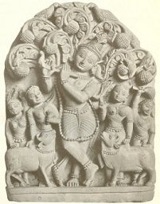

  
[Intangible Textual Heritage](../../index)  [Hinduism](../index.md) 

------------------------------------------------------------------------

[Buy this Book at
Amazon.com](https://www.amazon.com/exec/obidos/ASIN/B0026P4NWS/internetsacredte.md)

------------------------------------------------------------------------

<table width="75%">
<colgroup>
<col style="width: 50%" />
<col style="width: 50%" />
</colgroup>
<tbody>
<tr class="odd">
<td width="50%" data-valign="TOP"></td>
<td width="50%" data-valign="CENTER"><h1 id="the-vishnu-purana" data-align="CENTER">The Vishnu Purana</h1>
<h3 id="translated-by-horace-hayman-wilson" data-align="CENTER">translated by Horace Hayman Wilson</h3>
<h4 id="section" data-align="CENTER">[1840]</h4></td>
</tr>
</tbody>
</table>

------------------------------------------------------------------------

[Contents](#contents)    [Start Reading](vp000.md)    [Page
Index](pageidx)    [Text \[Zipped\]](vp.txt.gz.md)

------------------------------------------------------------------------

|                                                                                                                           |
|---------------------------------------------------------------------------------------------------------------------------|
|  |

The Vishnu Purana is a primary sacred text of the Vaishnava branch of
Hinduism, which today probably has more adherents than any other. It is
one of the canonical Puranas, a branch of post-Vedic sacred literature
which was first committed to writing during the first millennium of the
common era. Like most of the other Puranas, this is a complete narrative
from the creation of the current universe to its destruction. The
chronology describes periods as long as a hundred trillion
(1014) years! It includes extensive sections on the genealogy
of the legendary kings, heroes and demigods of ancient India, including
those from the epics, the [Mahabharata](../maha/index.md) and
[Ramayana](../rama/index.md). There are fascinating descriptions of ancient
Hindu cosmology and geography. Of general interest is a collection of
stories about the boyhood adventures of Krishna and Rama, whom the
Vaishnavas believe to be avatars of Vishnu. There are also references to
Buddhism and Jainism, which help establish the date of composition of
the work.

This is the first time that this work has appeared on the Internet in
any form. H.H. Wilson was one of the first European scholars to produce
a scholarly translation of a major Hindu sacred text. His translation
employs clear English which modern readers will find very readable.
There is very little of the pseudo-King James style, loved by 19th
century orientalists (and loathed by modern scholars). The footnotes are
extensive and very helpful, with comprehensive notes correlating the
Vishnu Purana with other Puranas and Hindu texts. Unfortunately, good
editions of this translation have largely been unavailable in print for
many years. There are some re-typeset and heavily edited versions
printed in India, of dubious quality, which I can't recommend. The
copytext for this etext was a very expensive photographic reproduction
of the original 1840 edition. This is part of a reprint series which may
be obtainable from some larger urban and academic libraries.

*Production notes*: As per site policy, I have attempted to match the
printed edition's transliteration of Sanskrit exactly. This uses
Unicode, so if you have trouble viewing some of the letters in this
text, please refer to the [Unicode help file](../../unicode.md). Wilson
used a very simple transliteration system, just an acute accent for both
long vowels and alternate consonants. He does not distinguish between
the dental, palatal and anusvara variants of 'n', but this will only
bother the sanscritologists. Although he applied this scheme fairly
consistently, there are numerous variations in the transliteration of
less-common Sanskrit proper nouns (particularly in the Index). I have
not attempted to correct any of these variations except for a few
obvious errors, which are indicated in the usual way by links to my
[errata file](errata.md).

There were numerous passages and words in the footnotes in Devanagari
(the Sanskrit alphabet). I have created image files for these in the
Preface. There were far too many of these in the body text to reproduce
as images. So I have silently edited Devanagari out from the main text,
altering punctuation where necessary. In most cases where he supplies a
passage in Devanagari, he translates it in the immediate vicinity, so
omitting these does not lose any information. In the rare case where
such an omission would change the meaning of a sentence, I have inserted
the placeholder '\#\#\#' to indicate where a word or phrase in
Devanagari was positioned.

While proofing the Index, many errors in page references were silently
corrected so that the page hyperlinks would work correctly. There are
doubtless other remaining page number errors in the Index, some from OCR
errors (the OCR software I use, OmniPage, has trouble recognizing digits
in older typeset text), some, typically, in the copytext, so this part
of the etext should be considered provisional. However, the body text
has been subjected to three proof passes, so every effort has been made
to produce a very accurate etext.

--John Bruno Hare, March 15th, 2006.

------------------------------------------------------------------------

 [Title Page and Front Matter](vp000.md)  

### Preface

[Introduction](vp001.md)  
[Date of the Puráńas](vp002.md)  
[Form of the Puráńas](vp003.md)  
[Classification of the Puráńas](vp004.md)  
[1. The Brahmá Puráńa](vp005.md)  
[2. The Padma Puráńa](vp006.md)  
[3. The Vishńu Puráńa](vp007.md)  
[4. The Váyavíya Puráńa](vp008.md)  
[5. The Bhágavata Puráńa](vp009.md)  
[6. The Naradíya Puráńa](vp010.md)  
[7. The Márkańd́eya Puráńa](vp011.md)  
[8. The Agni Puráńa](vp012.md)  
[9. The Bhavishya Puráńa](vp013.md)  
[10. The Brahma-vaivartta Puráńa](vp014.md)  
[11. The Linga Puráńa](vp015.md)  
[12. The Varáha Puráńa](vp016.md)  
[13. The Skanda Puráńa](vp017.md)  
[14. The Vámana Puráńa](vp018.md)  
[15. The Kúrma Puráńa](vp019.md)  
[16. The Matsya Puráńa](vp020.md)  
[17. The Gárud́a Puráńa](vp021.md)  
[18. The Brahmáńd́a Puráńa](vp022.md)  
[The Upa-puráńas](vp023.md)  
[Synopsis of the Vishńu Puráńa](vp024.md)  
[Book One](vp025.md)  
[Book Two](vp026.md)  
[The Third Book](vp027.md)  
[The Fourth Book](vp028.md)  
[The Fifth Book](vp029.md)  
[The Sixth Book](vp030.md)  
[Date of the Vishńu Puráńa](vp031.md)  
[Conclusion](vp032.md)  
[Contents](vp033.md)  
[Corrections](vp034.md)  

### Book I

[Chapter I](vp035.md)  
[Chapter II](vp036.md)  
[Chapter III](vp037.md)  
[Chapter IV](vp038.md)  
[Chapter V](vp039.md)  
[Chapter VI](vp040.md)  
[Chapter VII](vp041.md)  
[Chapter VIII](vp042.md)  
[Sacrifice of Daksha (From the Váyu Puráńa)](vp043.md)  
[Chapter IX](vp044.md)  
[Chapter X](vp045.md)  
[Chapter XI](vp046.md)  
[Chapter XII](vp047.md)  
[Chapter XIII](vp048.md)  
[Chapter XIV](vp049.md)  
[Chapter XV](vp050.md)  
[Chapter XVI](vp051.md)  
[Chapter XVII](vp052.md)  
[Chapter XVIII](vp053.md)  
[Chapter XIX](vp054.md)  
[Chapter XX](vp055.md)  
[Chapter XXI](vp056.md)  
[Chapter XXII](vp057.md)  

### Book II

[Chapter I](vp058.md)  
[Chapter II](vp059.md)  
[Chapter III](vp060.md)  
[Topographical Lists from the Mahábhárata](vp061.md)  
[Chapter IV](vp062.md)  
[Chapter V](vp063.md)  
[Chapter VI](vp064.md)  
[Chapter VII](vp065.md)  
[Chapter VIII](vp066.md)  
[Chapter IX](vp067.md)  
[Chapter X](vp068.md)  
[Chapter XI](vp069.md)  
[Chapter XII](vp070.md)  
[Chapter XIII](vp071.md)  
[Chapter XIV](vp072.md)  
[Chapter XV](vp073.md)  
[Chapter XVI](vp074.md)  

### Book III

[Chapter I](vp075.md)  
[Chapter II](vp076.md)  
[Chapter III](vp077.md)  
[Chapter IV](vp078.md)  
[Chapter V](vp079.md)  
[Chapter VI](vp080.md)  
[Chapter VII](vp081.md)  
[Chapter VIII](vp082.md)  
[Chapter IX](vp083.md)  
[Chapter X](vp084.md)  
[Chapter XI](vp085.md)  
[Chapter XII](vp086.md)  
[Chapter XIII](vp087.md)  
[Chapter XIV](vp088.md)  
[Chapter XV](vp089.md)  
[Chapter XVI](vp090.md)  
[Chapter XVII](vp091.md)  
[Chapter XVIII](vp092.md)  

### Book IV

[Chapter I](vp093.md)  
[Chapter II](vp094.md)  
[Chapter III](vp095.md)  
[Chapter IV](vp096.md)  
[Chapter V](vp097.md)  
[Chapter IV](vp098.md)  
[Chapter VII](vp099.md)  
[Legend of Paraśuráma](vp100.md)  
[Chapter VIII](vp101.md)  
[Chapter IX](vp102.md)  
[Chapter X](vp103.md)  
[Chapter XI](vp104.md)  
[Chapter XII](vp105.md)  
[Chapter XIII](vp106.md)  
[Chapter XIV](vp107.md)  
[Chapter XV](vp108.md)  
[Chapter XVI](vp109.md)  
[Chapter XVII](vp110.md)  
[Chapter XVIII](vp111.md)  
[Chapter XIX](vp112.md)  
[Chapter XX](vp113.md)  
[Chapter XXI](vp114.md)  
[Chapter XXII](vp115.md)  
[Chapter XXIII](vp116.md)  
[Chapter XXIV](vp117.md)  

### Book V

[Chapter I](vp118.md)  
[Chapter II](vp119.md)  
[Chapter III](vp120.md)  
[Chapter IV](vp121.md)  
[Chapter V](vp122.md)  
[Chapter VI](vp123.md)  
[Chapter VII](vp124.md)  
[Chapter VIII](vp125.md)  
[Chapter IX](vp126.md)  
[Chapter X](vp127.md)  
[Chapter XI](vp128.md)  
[Chapter XII](vp129.md)  
[Chapter XIII](vp130.md)  
[Chapter XIV](vp131.md)  
[Chapter XV](vp132.md)  
[Chapter XVI](vp133.md)  
[Chapter XVII](vp134.md)  
[Chapter XVIII](vp135.md)  
[Chapter XIX](vp136.md)  
[Chapter XX](vp137.md)  
[Chapter XXI](vp138.md)  
[Chapter XXII](vp139.md)  
[Chapter XXIII](vp140.md)  
[Chapter XXVI](vp141.md)  
[Chapter XXV](vp142.md)  
[Chapter XXVI](vp143.md)  
[Chapter XXVII](vp144.md)  
[Chapter XXVIII](vp145.md)  
[Chapter XXIX](vp146.md)  
[Chapter XXX](vp147.md)  
[Chapter XXXI](vp148.md)  
[Chapter XXXII](vp149.md)  
[Chapter XXXIII](vp150.md)  
[Chapter XXXIV](vp151.md)  
[Chapter XXXV](vp152.md)  
[Chapter XXXVI](vp153.md)  
[Chapter XXXVII](vp154.md)  
[Chapter XXXVIII](vp155.md)  

### Book VI

[Chapter I](vp156.md)  
[Chapter II](vp157.md)  
[Chapter III](vp158.md)  
[Chapter IV](vp159.md)  
[Chapter V](vp160.md)  
[Chapter VI](vp161.md)  
[Chapter VII](vp162.md)  
[Chapter VIII](vp163.md)  

### Index

[A](vp164.md)  
[B](vp165.md)  
[C](vp166.md)  
[D](vp167.md)  
[E](vp168.md)  
[F](vp169.md)  
[G](vp170.md)  
[H](vp171.md)  
[I](vp172.md)  
[J](vp173.md)  
[K](vp174.md)  
[L](vp175.md)  
[M](vp176.md)  
[N](vp177.md)  
[O](vp178.md)  
[P](vp179.md)  
[Q](vp180.md)  
[R](vp181.md)  
[S](vp182.md)  
[T](vp183.md)  
[U](vp184.md)  
[V](vp185.md)  
[W](vp186.md)  
[Y](vp187.md)  
