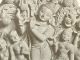

  
[Intangible Textual Heritage](../../index)  [Hinduism](../index.md) 
[Index](index)  [Previous](vp001)  [Next](vp003.md) 

------------------------------------------------------------------------

[Buy this Book at
Amazon.com](https://www.amazon.com/exec/obidos/ASIN/B0026P4NWS/internetsacredte.md)

------------------------------------------------------------------------

  
*The Vishnu Purana*, translated by Horace Hayman Wilson, \[1840\], at
Intangible Textual Heritage

------------------------------------------------------------------------

Date of the Puráńas

The Puráńas are also works of evidently different ages, and have been
compiled under different circumstances, the precise nature of which we
can but imperfectly conjecture from internal evidence, and from what we
know of the history of religious opinion in India. It is highly
probable,

p. x

that of the present popular forms of the Hindu religion, none assumed
their actual state earlier than the time of Śankara Áchárya, the great
Śaiva reformer, who flourished, in all likelihood, in the eighth or
ninth century. Of the Vaishńava teachers, Rámánuja dates in the twelfth
century, Madhwáchárya in the thirteenth, and Vallabha in the
sixteenth [17](#fn_16.md); and the Puráńas seem to
have accompanied or followed their innovations, being obviously intended
to advocate the doctrines they taught. This is to assign to some of them
a very modern date, it is true; but I cannot think that a higher can
with justice be ascribed to them. This, however, applies to some only
out of the number, as I shall presently proceed to specify.

Another evidence of a comparatively modern date must be admitted in
those chapters of the Puráńas which, assuming a prophetic tone, foretell
what dynasties of kings will reign in the Kálí age. These chapters, it
is true, are found but in four of the Puráńas, but they are conclusive
in bringing down the date of those four to a period considerably
subsequent to Christianity. It is also to be remarked, that the Váyu,
Vishńu, Bhágavata, and Matsya Puráńas, in which these particulars are
foretold, have in all other respects the character of as great antiquity
as any works of their class [18](#fn_17.md).

------------------------------------------------------------------------

### Footnotes

[x:17](vp002.htm#fr_16.md) As. Res. vols. XVI. and
XVII. Account of Hindu Sects.

[x:18](vp002.htm#fr_17.md) On the history of the
composition of the Puráńas, as they now appear, I have hazarded some
speculations in my Analysis of the Váyu Puráńa: Journ. Asiatic Society
of Bengal, December 1832.

------------------------------------------------------------------------

[Next: Form of the Puráńas](vp003.md)
