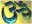

  
[Intangible Textual Heritage](../../index)  [Hinduism](../index) 
[Index](index)  [Previous](vp021)  [Next](vp023) 

------------------------------------------------------------------------

[Buy this Book at
Amazon.com](https://www.amazon.com/exec/obidos/ASIN/B0026P4NWS/internetsacredte)

------------------------------------------------------------------------

  
*The Vishnu Purana*, translated by Horace Hayman Wilson, \[1840\], at
Intangible Textual Heritage

------------------------------------------------------------------------

18\. The Brahmáńd́a Puráńa

18\. Brahmáńd́a Puráńa. "That which has declared, in twelve thousand two
hundred verses, the magnificence of the egg of Brahmá, and in which an
account of the future Kalpas is contained, is called the Brahmáńd́a
Puráńa, and was revealed by Brahmá [80](#fn_79)."

The Brahmáńd́a Puráńa is usually considered to be in much the same
predicament as the Skanda, no longer procurable in a collective body,
but represented by a variety of Khańd́as and Máhátmyas, professing to be
derived from it. The facility with which any tract may be thus attached
to the non-existent original, and the advantage that has been taken of
its absence to compile a variety of unauthentic fragments, have given to
the Brahmáńd́a, Skanda, and Padma, according to Col. Wilford, the
character of being the Puráńas of thieves or impostors [81](#fn_80). This is not applicable to the Padma,
which, as above shewn, occurs entire and the same in various parts of
India. The imposition of which the other two are made the vehicles can
deceive no one, as the purpose of the particular legend is always too
obvious to leave any doubt of its origin.

Copies of what profess to be the entire Brahmáńd́a Puráńa are sometimes,
though rarely, procurable. I met with one in two portions, the former
containing, one hundred and twenty-four chapters, the latter
seventy-eight; and the whole containing about the number of stanzas
assigned to the Puráńa. The first and largest portion, however, proved
to be the same as the Váyu Puráńa, with a passage occasionally slightly
varied, and at the end of each chapter the common phrase 'Iti Brahmáńd́a
Puráńe' substituted for 'Iti Váyu Puráńe.' I do not think there was any
intended fraud in the substitution. The last section of the first part
of the Váyu Puráńa is termed the Brahmáńd́a section, giving an

p. lv

account of the dissolution of the universe; and a careless or ignorant
transcriber might have taken this for the title of the whole. The checks
to the identity of the work have been honestly preserved, both in the
index and the frequent specification of Váyu as the teacher or narrator
of it.

The second portion of this Brahmáńd́a is not any part of the Váyu; it is
probably current in the Dakhin as a Sanhitá or Khańd́a. Agastya is
represented as going to the city Kánchí (Conjeveram), where Vishńu, as
Hayagríva, appears to him, and, in answer to his inquiries, imparts to
him the means of salvation, the worship of Paraśaktí. In illustration of
the efficacy of this form of adoration, the main subject of the work is
an account of the exploits of Lalitá Deví, a form of Durgá, and her
destruction of the demon Bháńd́ásura. Rules for her worship are also
given, which are decidedly of a Śákta or Tántrika description; and this
work cannot be admitted, therefore, to be part of a genuine Puráńa.

------------------------------------------------------------------------

### Footnotes

[liv:80](vp022.htm#fr_79)   [  
Click to view](img/_05400.jpg)

[liv:81](vp022.htm#fr_80) As. Res. vol. VIII. p.
252.

------------------------------------------------------------------------

[Next: The Upa-puráńas](vp023)
