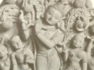

  
[Intangible Textual Heritage](../../index)  [Hinduism](../index) 
[Index](index)  [Previous](vp027)  [Next](vp029) 

------------------------------------------------------------------------

[Buy this Book at
Amazon.com](https://www.amazon.com/exec/obidos/ASIN/B0026P4NWS/internetsacredte)

------------------------------------------------------------------------

  
*The Vishnu Purana*, translated by Horace Hayman Wilson, \[1840\], at
Intangible Textual Heritage

------------------------------------------------------------------------

The Fourth Book

The fourth book contains all that the Hindus have of their ancient
history. It is a tolerably comprehensive list of dynasties and
individuals; it is a barren record of events. It can scarcely be
doubted, however, that much of it is a genuine chronicle of persons, if
not of occurrences. That it is discredited by palpable absurdities in
regard to the longevity of the princes of the earlier dynasties must be
granted, and the particulars preserved of some of them are trivial and
fabulous: still there is an inartificial simplicity and consistency in
the succession of persons, and a possibility and probability in some of
the transactions which give to these traditions the semblance of
authenticity, and render it likely that they are not altogether without
foundation. At any rate, in the absence of all other sources of
information, the record, such as it is, deserves not to be altogether
set aside. It is not essential to its credibility or its usefulness that
any exact chronological adjustment of the different reigns should be
attempted. Their distribution amongst the several Yugas, undertaken by
Sir Wm. Jones or his Pandits, finds no countenance from the original
texts, farther than an incidental notice of the age in which a
particular monarch ruled, or the general fact that the dynasties prior
to Krishńa precede the time of the great war, and the beginning of the
Kálí age; both which events we are not obliged, with the Hindus, to
place five thousand years ago. To that age the solar dynasty of princes
offers ninety-three descents, the lunar but forty-five, though they both
commence at the same time. Some names may have been added to the former
list, some omitted in the latter; and it seems most likely, that,
notwithstanding their synchronous beginning, the princes of the lunar
race were subsequent to those of the solar dynasty. They avowedly
branched off from the solar line; and the

p. lxv

legend of Sudyumna [85](#fn_84), that explains
the connexion, has every appearance of having been contrived for the
purpose of referring it to a period more remote than the truth.
Deducting however from the larger number of princes a considerable
proportion, there is nothing to shock probability in supposing that the
Hindu dynasties and their ramifications were spread through an interval
of about twelve centuries anterior to the war of the Mahábhárata, and,
conjecturing that event to have happened about fourteen centuries before
Christianity, thus carrying the commencement of the regal dynasties of
India to about two thousand six hundred years before that date. This may
or may not be too remote [86](#fn_85); but it is
sufficient, in a subject where precision is impossible, to be satisfied
with the general impression, that in the dynasties of kings detailed in
the Puráńas we have a record which, although it cannot fail to have
suffered detriment from age, and may have been injured by careless or
injudicious compilation, preserves an account, not wholly undeserving of
confidence, of the establishment and succession of regular monarchies
amongst the Hindus, from as early an era, and for as continuous a
duration, as any in the credible annals of mankind.

The circumstances that are told of the first princes have evident
relation to the colonization of India, and the gradual extension of the
authority of new races over an uninhabited or uncivilized region. It is
commonly admitted that the Brahmanical religion and civilization were
brought into India from without [87](#fn_86).
Certainly, there are tribes on the

p. lxvi

borders, and in the heart of the country, who are still not Hindus; and
passages in the Rámáyańa and Mahábhárata and Manu, and the uniform
traditions of the people themselves, point to a period when Bengal,
Orissa, and the whole of the Dekhin, were inhabited by degraded or
outcaste, that is, by barbarous, tribes. The traditions of the Puráńas
confirm these views, but they lend no assistance to the determination of
the question whence the Hindus came; whether from a central Asiatic
nation, as Sir Wm. Jones supposed, or from the Caucasian mountains, the
plains of Babylonia, or the borders of the Caspian, as conjectured by
Klaproth, Vans Kennedy, and Schlegel. The affinities of the Sanscrit
language prove a common origin of the now widely scattered nations
amongst whose dialects they are traceable, and render it unquestionable
that they must all have spread abroad from some centrical spot in that
part of the globe first inhabited by mankind, according to the inspired
record. Whether any indication of such an event be discoverable in the
Vedas, remains to be determined; but it would have been obviously
incompatible with the Pauráńik system to have referred the origin of
Indian princes and principalities to other than native sources. We need
not therefore expect from them any information as to the foreign
derivation of the Hindus.

We have, then, wholly insufficient means for arriving at any information
concerning the ante-Indian period of Hindu history, beyond the general
conclusion derivable from the actual presence of barbarous and
apparently aboriginal tribes--from the admitted progressive extension of
Hinduism into parts of India where it did not prevail when the code of
Manu was compiled--from the general use of dialects in India, more or
less copious, which are different from Sanscrit--and from the affinities
of that language with forms of speech current in the western world--that
a people who spoke Sanscrit, and followed the religion of the Vedas,
came into India, in some very distant age, from lands west of the Indus.
Whether the date and circumstances of their immigration will ever be
ascertained is extremely doubtful, but it is not difficult to form a
plausible outline of their early site and progressive colonization.

The earliest seat of the Hindus within the confines of Hindusthán was

p. lxvii

undoubtedly the eastern confines of the Panjab. The holy land of Manu
and the Puráńas lies between the Drishadwatí and Saraswatí rivers, the
Caggar and Sursooty of our barbarous maps. Various adventures of the
first princes and most famous sages occur in this vicinity; and the
Ásramas, or religious domiciles, of several of the latter are placed on
the banks of the Saraswatí. According to some authorities, it was the
abode of Vyása, the compiler of the Vedas and Puráńas; and agreeably to
another, when on one occasion the Vedas had fallen into disuse, and been
forgotten, the Brahmans were again instructed in them by Sáraswata, the
son of Saraswatí [89](#fn_87). One of the most
distinguished of the tribes of the Brahmans is known as the
Sáraswata [90](#fn_88); and the same word is
employed by Mr. Colebrooke to denote that modification of Sanscrit which
is termed generally Prakrit, and which in this case he supposes to have
been the language of "the Sáraswata nation, which occupied the banks of
the river Saraswatí [91](#fn_89)." The river
itself receives its appellation from Saraswatí, the goddess of learning,
under whose auspices the sacred literature of the Hindus assumed shape
and authority. These indications render it certain, that whatever seeds
were imported from without, it was in the country adjacent to the
Saraswatí river that they were first planted, and cultivated and reared
in Hindusthán.

The tract of land thus assigned for the first establishment of Hinduism
in India is of very circumscribed extent, and could not have been the
site of any numerous tribe or nation. The traditions that evidence the
early settlement of the Hindus in this quarter, ascribe to the settlers
more of a philosophical and religious, than of a secular character, and
combine with the very narrow bounds of the holy land to render it
possible that the earliest emigrants were the members, not of a
political, so much as of a religious community; that they were a colony
of priests, not in the restricted sense in which we use the term, but in
that in which it still applies in India, to an Agrahára, a village or
hamlet of Brahmans, who, although married, and having families, and
engaging in tillage, in domestic duties, and in the conduct of secular
interests affecting the

p. lxviii

community, are still supposed to devote their principal attention to
sacred study and religious offices. A society of this description, with
its artificers and servants, and perhaps with a body of martial
followers, might have found a home in the Brahmá-vartta of Manu, the
land which thence was entitled 'the holy,' or more literally 'the
Brahman, region;' and may have communicated to the rude, uncivilized,
unlettered aborigines the rudiments of social organization, literature,
and religion; partly, in all probability, brought along with them, and
partly devised and fashioned by degrees for the growing necessities of
new conditions of society. Those with whom this civilization commenced
would have had ample inducements to prosecute their successful work, and
in the course of time the improvement which germinated on the banks of
the Saraswatí was extended beyond the borders of the Jumna and the
Ganges.

We have no satisfactory intimation of the stages by which the political
organization of the people of Upper India traversed the space between
the Saraswatí and the more easterly region, where it seems to have taken
a concentrated form, and whence it diverged in various directions,
throughout Hindustan. The Manu of the present period, Vaivaswata, the
son of the sun, is regarded as the founder of Ayodhyá; and that city
continued to be the capital of the most celebrated branch of his
descendants, the posterity of Ikshwáku. The Vishńu Puráńa evidently
intends to describe the radiation of conquest or colonization from this
spot, in the accounts it gives of the dispersion of Vaivaswata's
posterity: and although it is difficult to understand what could have
led early settlers in India to such a site, it is not inconveniently
situated as a commanding position, whence emigrations might proceed to
the east, the west, and the south. This seems to have happened: a branch
from the house of Ikshwáku spread into Tirhut, constituting the Maithilá
kings; and the posterity of another of Vaivaswata's sons reigned at
Vaisáli in southern Tirhut or Saran.

The most adventurous emigrations, however, took place through the lunar
dynasty, which, as observed above, originates from the solar, making in
fact but one race and source for the whole. Leaving out of consideration
the legend of Sudyumna's double transformation, the first prince of
Pratisht́hána, a city south from Ayodhyá, was one of Vaivaswata's

p. lxix

children, equally with Ikshváku. The sons of Pururavas, the second of
this branch, extended, by themselves or their posterity, in every
direction: to the east to Káśí, Magadhá, Benares, and Behar; southwards
to the Vindhya hills, and across them to Vidarbha or Berar; westwards
along the Narmadá to Kuśasthali or Dwáraká in Guzerat; and in a
north-westerly direction to Mathurá and Hastinápura. These movements are
very distinctly discoverable amidst the circumstances narrated in the
fourth book of the Vishńu Puráńa, and are precisely such as might be
expected from a radiation of colonies from Ayodhyá. Intimations also
occur of settlements in Banga, Kalinga, and the Dakhin; but they are
brief and indistinct, and have the appearance of additions subsequent to
the comprehension of those countries within the pale of Hinduism.

Besides these traces of migration and settlement, several curious
circumstances, not likely to be unauthorized inventions, are hinted in
these historical traditions. The distinction of castes was not fully
developed prior to the colonization. Of the sons of Vaivaswata, some, as
kings, were Kshatriyas; but one, founded a tribe of Brahmans, another
became a Vaiśya, and a fourth a Śúdra. It is also said of other princes,
that they established the four castes amongst their subjects [92](#fn_90). There are also various notices of
Brahmanical Gotras, or families, proceding from Kshatriya races [93](#fn_91): and there are several indications of
severe struggles between the two ruling castes, not for temporal, but
for spiritual dominion, the right to teach the Vedas. This seems to be
the especial purport of the inveterate hostility that prevailed between
the Brahman Vaśisht́ha and the Kshatriya Viswámitra, who, as the Rámáyańa
relates, compelled the gods to make him a Brahman also, and whose
posterity became very celebrated as the Kauśika Brahmans. Other legends,
again, such as Daksha's sacrifice, denote sectarial strife; and the
legend of Paraśuráma reveals a conflict even for temporal authority
between the two ruling castes. More or less weight will be attached to
these conjectures, according to the temperament of different inquirers;
but, even whilst

p. lxx

fully aware of the facility with which plausible deductions may cheat
the fancy, and little disposed to relax all curb upon the imagination, I
find it difficult to regard these legends as wholly unsubstantial
fictions, or devoid of all resemblance to the realities of the past.

After the date of the great war, the Vishńu Puráńa, in common with those
Puráńas which contain similar lists, specifies kings and dynasties with
greater precision, and offers political and chronological particulars,
to which on the score of probability there is nothing to object. In
truth their general accuracy has been incontrovertibly established.
Inscriptions on columns of stone, on rocks, on coins, decyphered only of
late years, through the extraordinary ingenuity and perseverance of Mr.
James Prinsep, have verified the names of races, and titles of
princes--the Gupta and Andhra Rájás, mentioned in the Puráńas--and have
placed beyond dispute the identity of Chandragupta and Sandrocoptus:
thus giving us a fixed point from which to compute the date of other
persons and events. Thus the Vishńu Puráńa specifies the interval
between Chandragupta and the great war to be eleven hundred years; and
the occurrence of the latter little more than fourteen centuries B. C.,
as shewn in my observations on the passage [94](#fn_92), remarkably concurs with inferences of
the like date from different premises. The historical notices that then
follow are considerably confused, but they probably afford an accurate
picture of the political distractions of India at the time when they
were written; and much of the perplexity arises from the corrupt state
of the manuscripts, the obscure brevity of the record, and our total
want of the means of collateral illustration.

------------------------------------------------------------------------

### Footnotes

[lxv:85](vp028.htm#fr_84) P.
[349](vp093.htm#page_349).

[lxv:86](vp028.htm#fr_85) However incompatible
with the ordinary computation of the period that is supposed to have
elapsed between the flood and the birth of Christ, this falls
sufficiently within the larger limits which are now assigned, upon the
best authorities, to that period. As observed by Mr. Mil-man, in his
note on the annotation of Gibbon (II. 301.) which refers to this
subject; "Most of the more learned modern English protestants, as Dr.
Hales, Mr. Faber, Dr. Russell, as well as the continental writers, adopt
the larger chronology." To these may be added the opinion of Dr. Mill,
who, for reasons which he has fully detailed, identifies the
commencement of the Kálí age of the Hindus, B. C. 3102, with the era of
the deluge. Christa Sangita, Introd., supplementary note.

[lxv:87](vp028.htm#fr_86) Sir Wm. Jones on the
Hindus (As. Res. vol. III.); Klaproth. Asia Polyglotta; Vans Kennedy on
the Origin of Languages; A von Schlegel Origines des Hindous (Trans. R.
Soc. of Literature).

[lxvii:89](vp028.htm#fr_87) See p. 285. note.

[lxvii:90](vp028.htm#fr_88) As. Res. vol. V. p.
55.

[lxvii:91](vp028.htm#fr_89) As. Res. vol. VII.
p. 219.

[lxix:92](vp028.htm#fr_90) See p.
[406](vp101.htm#page_406)-409. [444](vp111.htm#page_444). &c.

[lxix:93](vp028.htm#fr_91) P.
[448](vp112.htm#page_448). [459](vp113.htm#page_459).
[454](vp112.htm#page_454). &c.

[lxx:94](vp028.htm#fr_92) P.
[484](vp117.htm#page_484) n. [81](vp117.htm#fn_1433).

------------------------------------------------------------------------

[Next: The Fifth Book](vp029)
