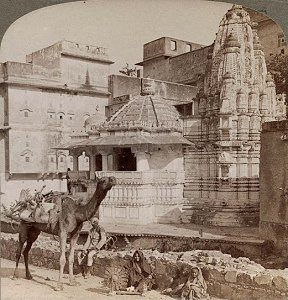

  
[Intangible Textual Heritage](../../index)  [Hinduism](../index.md) 

------------------------------------------------------------------------

<table width="75%">
<colgroup>
<col style="width: 50%" />
<col style="width: 50%" />
</colgroup>
<tbody>
<tr class="odd">
<td width="50%" data-valign="CENTER"> 
</td>
<td width="50%" data-valign="CENTER"><h1 id="the-web-of-indian-life" data-align="CENTER">The Web of Indian Life</h1>
<h2 id="by-sister-nivedita-margaret-e.-noble" data-align="CENTER">by Sister Nivedita 
(Margaret E. Noble)</h2>
<h4 id="section" data-align="CENTER">[1904]</h4></td>
</tr>
</tbody>
</table>

------------------------------------------------------------------------

This is a collection of essays by Sister Nivedita, Margaret E. Noble, an
Anglo-Irish Hindu convert who moved to India and devoted herself to
helping poor women of all castes. It includes an appreciative
introduction by [Rabindranath Tagore](../tagore/index.md), the Nobel
laureate writer, one of her many friends in the Bengali artistic
community.

Although long out of print, this book was a sensation when it was
originally published. Nivedita here espouses Hindu pan-Indian
nationalism, while also rationalizing some of the aspects of Indian life
such as the caste system. She deals with the historical background of
religious tolerance in India, including the contributions of Muslims and
Buddhists, and the ability of Hinduism to assimilate compatible
doctrines, no matter what their source.

Nivedita has a unique and much beloved position in Indian history as one
of the few westerners who took up the cause of Indian independence. You
will come away from reading this book with a new appreciation for the
problems which India faced in forging a democratic nation based on
diversity.

Also at this site by Sister Nivedita are [Studies from an Eastern
Home](../seh/index), and [Kali the Mother](../ktm/index.md).

------------------------------------------------------------------------

[Title Page and Front Matter](wil00.md)  
[Contents](wil01.md)  
[Introduction](wil02.md)  
[Chapter I. The Setting of the Warp](wil03.md)  
[Chapter II. The Eastern Mother](wil04.md)  
[Chapter III. Of the Hindu Woman as Wife](wil05.md)  
[Chapter IV. Love Strong as Death](wil06.md)  
[Chapter V. The Place of Woman in the National Life](wil07.md)  
[Chapter VI. The Immediate Problems of the Oriental Woman](wil08.md)  
[Chapter VII. The Indian Sagas](wil09.md)  
[Chapter VIII. Noblesse Oblige: A Study of Indian Caste](wil10.md)  
[Chapter IX. The Synthesis of Indian Thought](wil11.md)  
[Chapter X. The Oriental Experience](wil12.md)  
[Chapter XI. The Wheel of Birth and Death](wil13.md)  
[Chapter XII. The Story of the Great God: Siva or Mahadev](wil14.md)  
[Chapter XIII. The Gospel of the Blessed One](wil15.md)  
[Chapter XIV. Islam In India](wil16.md)  
[Chapter XV. An Indian Pilgrimage](wil17.md)  
[Chapter XVI. On the Loom of Time](wil18.md)  
