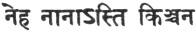

  
[Intangible Textual Heritage](../../index)  [Hinduism](../index) 
[Index](index)  [Previous](wos05)  [Next](wos07) 

------------------------------------------------------------------------

[Buy this Book at
Amazon.com](https://www.amazon.com/exec/obidos/ASIN/8177557459/internetsacredte)

------------------------------------------------------------------------

  
*Select Works of Sri Sankaracharya*, tr. by S. Venkataramanan, \[1921\],
at Intangible Textual Heritage

------------------------------------------------------------------------

p. 39

### Direct Realisation.

I bow to that Ṣrî Hari (Vishṇu), the infinite bliss, the Teacher, the
Supreme Lord, all-pervading, the prime-cause of all the worlds. (1)

Direct realisation is herein expounded as a means to liberation. It
should be studied, again and again, with great effort, only by the wise.
(2)

By following the duties of one's own caste and order, by asceticism and
by the propitiation of Hari, men will gain the four-fold requisite of
freedom from desires, etc. (3)

p. 40

Spotless freedom from desires means such a dissatisfaction in respect of
all objects from Brahman down to the inanimate as is felt in respect of
the excrement of a crow. (4)

Discrimination of the real means the determination that the nature of
the self is eternal while, all that is perceptible is otherwise (5)

The constant eradication of mental impressions is called control of
mind. The restraint of external activities is called control of body.
(6)

p. 41

Extreme abstention is the turning away from the objects of enjoyment.
The endurance of all kinds of pain is called resignation, which is
beneficial. (7)

Devoted belief in the sayings of the Veda and of the teacher is called
faith. The concentration of the mind on the reality that is the ultimate
goal is called balance. (8)

Desire for liberation is the name given to the intense thought "How and
when, O Lord, shall liberation from the bonds of *samsâra* come to me?"
(9)

Whosoever desires his own welfare should, after acquiring the
above-mentioned qualifications,

p. 42

commence the enquiry with a view to the attainment of knowledge. (10)

Knowledge cannot spring up by any other means than enquiry, just as the
perception of things is impossible without light. (11)

"Who am I? How was this (universe) born? Who is its maker? What is its
material cause?" This is the kind of enquiry referred to above. (12)

"I am not the body which is a mere conglomeration of the elements, nor
am I the group of the senses, but am something different from all
these." This is the kind of enquiry referred to above. (13)

p. 43

"All this (universe) has its origin in ignorance and is dissolved by
knowledge. Desire, in its various aspects, is the mainspring of all
action." This is the kind of enquiry referred to above. (14)

"The prime cause of both these (*viz*., ignorance and desire) is the
one, subtle and immutable Reality [\*](#fn_34),
even as the clay is the prime cause of the earthen vessel etc." This is
the kind of enquiry referred to above. (15)

"I too am the one, subtle, and immutable Reality, the knower, the
witness. I am That, without doubt." This is the kind of enquiry referred
to above. (16)

p. 44

The self is without parts and without a second; but the body is
comprised of many parts. And yet they identify the two. Can any
ignorance be worse than this? (17)

The self is the ruler and subjective; the body is the ruled and
objective. And yet they identify the two. Can any ignorance be worse
than this? (18)

The self is of the nature of knowledge and pure; the body consists of
flesh and is impure. And yet they identify the two. Can any ignorance be
worse than this? (19)

p. 45

The self is that which illuminates and is absolutely pure; the body is
inert. [\*](#fn_35) And yet they identify the
two. Can any ignorance be worse than this? (20)

The self is eternal and real by nature; the body is transient and
unreal. And yet they identify the two. Can any ignorance be worse than
this? (21)

The resplendence of the self consists in its making all things
cognisable. Its shining is not like that of fire etc., for, there is
darkness at night (in spite of their presence in one place). (22)

p. 46

He who thinks "I am the body" remains, alas! in ignorance, as also he
who thinks "this body is mine", as if he were always looking at an
earthen vessel belonging to him. (23)

"I am indeed Brahman, without difference, without change, and of the
nature of reality, knowledge and bliss. I am not, therefore, the body
which is unreal." This is what the wise call knowledge. (24)

"I am without change, without form, without blemish and without decay. I
am not, therefore, the body which is unreal." This is what the wise call
knowledge. (25)

"I am without disease, without appearances, without alternatives, and
all-pervading. I am

p. 47

not, therefore, the body which is unreal." This is what the wise call
knowledge. (26)

"I am without attribute, without action, eternal, eternally free, and
imperishable. I am not, therefore, the body which is unreal." This is
what the wise call knowledge. (27)

"I am stainless, without motion, without end, pure, and devoid of old
age and death. I am not, therefore, the body which is unreal." This is
what the wise call knowledge (28)

Why, fool, dost thou imagine to be an absolute void the self which is
different from the body but which resides even in your body as the
informing spirit [\*](#fn_36) auspicious, real,
accepted by all? (29)

p. 48

Fool, learn from the Veda and by reasoning the nature of thy own self
which is the informing spirit beyond the body, absolutely real by nature
and utterly incomprehensible by men like you. (30)

That which is denoted by the word "I" for ever remains sole and
transcendental. That which is gross, on the other hand, undergoes
multiplicity. How then can the body be the self? (31)

The "I" is assuredly the perceiver and the body the perceived, as is
evident from the expression "this body is mine". How then can the body
be the self?

p. 49

It is a matter of direct experience that the "I" is devoid of change,
whereas the body is undergoing incessant change. How then can the body
be the self? (33)

The wise have ascertained the exact nature of the self from the Vedic
passage "Than whom there is naught higher, etc." [\*](#fn_37) How then can the body be the self? (34)

It is further declared by the Veda in the *Purusha-sûkta* that all this
universe is verily

p. 50

the self. How then can the body be the self? (35)

Further, it is declared in the *Brihadârnyaka-upanishad* that the self
is incontaminable. How then can the body, contaminated by numberless
impurities, be the self? (36)

In that same *upanishad* it is declared that the self is indeed
self-resplendent. How then can the body, inert and requiring to be
illuminated by another, be the self? (37)

Even the ritual portion of the Veda declares that the self, distinct
from the body and eternal, enjoys the fruits of ritual after the demise
of the body. (38)

p. 51

Even the subtle body [\*](#fn_38), composed of
many parts, Unstable, objective, mutable, finite, and unreal,—how can it
be the self? (39)

The self is thus distinct from both the gross and the subtle bodies. It
is the informing Spirit, the Supreme Lord, the soul of all, identical
with all, beyond all, the "I", the immutable. (40)

(Says the opponent.) By the above distinction between the self and the
body, it only follows that the manifested world is real, as declared by
the science of logic. [†](#fn_39) Your aim
therefore fails. (41)

p. 52

(This is the answer.) By the above distinction between the self and the
body, the identification of the body with the self has alone been
refuted. The unreality of the body as a separate entity will now be
clearly explained. (42)

Since Consciousness is one by nature, no distinction is admissible under
any circumstances. Even the condition of the individual soul must be
understood to be unreal, like the apprehension of a serpent in a rope.
(43)

As the rope, in consequence of one's ignorance of it, appears in an
instant as a serpent,

p. 53

so does consciousness, which is ever pure, manifest itself as the
universe. (44)

There can be no other material cause of the universe than *Brahman*. All
this universe, therefore, is only *Brahman* and naught else. (45)

The distinction of the pervader and the pervaded is unreal by reason of
the declaration "The Self is all." If the highest truth is thus
understood, how can there be room for difference? (46)

Indeed, multiplicity is directly contradicted by the Veda. [\*](#fn_40) How can there be any manifestation

p. 54

different from the one (secondless) cause. (47)

The Veda has also pointed out the evil consequence, namely, that the man
who, duped by illusion, perceives [multiplicity](errata.htm#1) in this
world, passes on from death to death. [\*](#fn_41) (48)

All creatures are born of Brahman, the Supreme Self. One should
therefore understand. that all these are Brahman itself. (49)

The Veda has declared that Brahman alone assumes all names, all forms
and all activities. (50)

p. 55

Whatever is made of gold retains for ever the nature of gold. So, too,
all that is born of Brahman is of the nature of Brahman. (51)

The Veda has declared that the ignorant man who rests content with
making the slightest distinction between the individual soul and the
Supreme Self is exposed to danger. (52)

Where there is duality by virtue of ignorance one sees all things as
distinct from the self. When everything is seen as the self, then there
is not even an atom other than the self. (53)

p. 56

For him who has realised that all beings are the self, there is neither
delusion nor misery, since there is no second. (54)

It has been established in a. passage of the Brihadaranyaka that this
self is Brahman itself which is everything. (55)

This world, although it is the object of experience and of phenomenal
treatment, is yet unreal like a dream, because it is followed by
contradiction. [\*](#fn_42) (56)

A dream becomes unreal in the waking state; nor does the waking state
exist in dream. Both dream and waking are absent in sleep,

p. 57

and sleep too is absent in dream and in waking. (57)

Thus all the three states are unreal, being produced by the three
[qualities](errata.htm#2). [\*](#fn_43) The
Eternal is the witness of these three states, beyond the three
[qualities](errata.htm#3), the One that is pure consciousness. (58)

Just as one sees not the separate existence of the pot when he knows
that it is clay, or the illusive existence of silver when he knows that
it is mother-of-pearl, so too does one see not the condition of the
individual soul when he knows Brahman. (59)

Just as a pot is only a name of clay, an ear-ring of gold, or the
(illusive) silver of

p. 58

mother-of-pearl, so too is the individual foul a name of the supreme.
(60)

Like the blueness in the sky, like the mirage in the desert and like the
illusive appearance of a person in a post, so is the universe in
Brahman. (61)

Like a ghost in vacant space, like a city of the celestials [\*](#fn_44) and like two moons in the sky, so is the
existence of the world in Brahman. (62)

Just as it is water alone that appears as waves and tides, and copper
alone as vessels, so

p. 59

does the self alone appear as many universes. (63)

As the clay alone appears under the name of pot, as the threads appear
under the name of cloth, so does Brahman appear under the name of the
world. It (Brahman) should, therefore, be realised by the elimination of
name. (64)

All phenomenal life is possible for men only by virtue of Brahman, just
as the pot is possible only by virtue of clay. But men do not understand
it thus, owing to ignorance. (65)

p. 60

Just as the relation of effect and cause always subsists between the pot
and clay, so does the same relation subsist between the world and
Brahman. This is known both from the Vedas and by reasoning. (66)

Just as, when the pot is being seen, it is the clay that is seen *ipso
facto*, so too when the world is being seen, it is only the
self-resplendent Brahman that is seen. (67)

The self always shines as unconditioned for the wise and always as
conditioned for the ignorant, just as the rope appears in two
ways. [\*](#fn_45) (68)

p. 61

Just as the pot consists of clay, so does even the body consist of the
self. This distinction between the self and the not-self is therefore
unnecessary for the wise. (69)

As a rope is perceived as a serpent, or the mother-of-pearl as silver,
so too is the self understood as the body by the utterly ignorant. (70)

As clay is perceived as a pot, as threads are perceived as a cloth, so
too is the self understood as the body by the utterly ignorant. (71)

As gold is perceived as an ear-ring or water as a wave, so too is the
self understood as the body by the utterly ignorant. (72)

p. 62

As a post is perceived as a thief or the mirage as water, so too is the
self understood as the body by the utterly ignorant. (73)

As pieces of wood are perceived as a house or as steel is perceived as a
sword, so too is the self understood as the body by the utterly
ignorant. (74)

Just as trees are seen by one as topsy-turvy by reflection in water, so
does one perceive the self as the body by virtue of ignorance. (75)

p. 63

For the person who is going in a boat, everything appears to be in
motion, so does one perceive the self as the body by virtue of
ignorance. (76)

Just as some one with a faulty vision sees a white thing as yellow, so
does one perceive the self as the body by virtue of ignorance. (77)

Just as, when the eyes are dizzy, everything appears as wandering, so
does one perceive the self as the body by virtue of ignorance. (78)

Just as a firebrand, by being revolved, appears to be circular like the
sun, so does one perceive the self as the body by virtue of ignorance.
(79)

p. 64

All things, however big in size, appear very small at a great distance.
So does one perceive the self as the body by virtue of ignorance. (80)

All things, however small in size, appear big under a magnifying glass.
So does one perceive the self as the body by virtue of ignorance. (81)

A glassy surface appears as water, and a watery surface as glass. So
does one perceive the self as the body by virtue of ignorance. (82)

p. 65

Just as one mistakes charcoal for a gem or a gem for charcoal, so does
one perceive the self as the body by virtue of ignorance. (83)

When the clouds are moving, the moon appears to move. So does one
perceive the self as the body by virtue of ignorance. (84)

Just as the directions seem to be changed for one who is in a swoon, so
does one perceive the self as the body by virtue of ignorance. (85)

Just as the moon appears to some one as moving in the waters, so does
one perceive the self as the body by virtue of ignorance. (86)

p. 66

Thus is the self mistaken for the body owing to ignorance. But when the
self is realised, this mistake disappears in Brahman. (87)

The whole world, sentient and non-sentient, is realised to be only the
self. How then can the various things and the various bodies be the
self, since they are unreal? (88)

O thou that art most intelligent! Spend all thy time in realising the
self. Exhausting all the ripe fruits of thy past deeds, thou needest not
feel any anxiety. (89)

We shall now refute the statement in the books that, even when the self
has been realised, such fruits of past actions as are ripe for
experience [\*](#fn_46) cannot be avoided. (90)

p. 67

When the knowledge of the reality has sprung up, there can be no fruits
of past actions to be experienced, owing to the unreality of the body,
etc., in the same way as there can he no dream after waking. (91)

Action done in past lives is called *prârabdha*. But that has no
existence at all at any time, since past life is itself unreal. (92)

Just as the dream-body is a mere illusion, so is this (physical) body
also. How can an illusory thing have life, and how, if there is no life,
can there be that (past action)? (93)

p. 68

As clay is the efficient cause of the pot, so is ignorance declared by
the Vedanta to be the efficient cause of the universe. When that
ignorance itself is destroyed, where then is this universe? (94)

Just as, by delusion, one ignores the rope and perceives the serpent, so
does he of deluded intellect perceive the universe without realising the
truth. (95)

When the form of the rope is understood, the appearance of a serpent
disappears. So too when the ultimate reality is realised, the universe
vanishes. (96)

And as the body too is part of the universe, how can any past action
subsist? But the

p. 69

\[paragraph continues\] Vedas speak of
past action in order to help-the understanding of the ignorant. (97)

In the passage "his actions are destroyed when the supreme is realised",
the Veda expressly speaks of actions in the plural, in order to signify
the destruction of *prârabdha*. [\*](#fn_47)
(98)

There is a twofold fault [†](#fn_48) in the
obstinate insistence on *prârabdha* by the ignorant. There is also the
forsaking of the Vedanta doctrine, since the Veda declares the
possibility of knowledge. (99)

p. 70

For the gaining of the liberation aforesaid, I shall now explain fifteen
steps, by the help of all of which one should at all times practice
meditation. (100)

Without constant practice the self that is pure existence and knowledge
cannot be realised. Therefore one who desires knowledge and seeks
liberation should meditate on Brahman for a long time. (101)

The control of the senses (*yama*), the control of the intellect
(*niyama*), the avoidance of unreality (*tyâga*), spiritual silence
(*manna*), place (*desa*), time (*kâla*), posture (*âsana*), the subdual
of the root-cause (*mulabandha*), the equipoise of the body
(*deha-sâmya*), the firmness of vision (*drik-sthiti*), (102)

p. 71

The control of life-forces (*prânâyâma*), the withdrawal of
consciousness (*pratyâhâra*), the holding of consciousness, (*dhâranâ*),
self-contemplation (*dhyâna*), and absorption (*samâdhi*),—these, in
order, are said to be the steps. (103)

The control of all the senses by means of the knowledge "all is Brahman"
is called yama and should be practised again and again. (104)

The incessant flow of thought towards all that relates to the self and
the submergence of all that relates to the not-self is called *niyama*.
It imparts supreme bliss and is assiduously practised by the wise. (105)

p. 72

*Tyâga* is the elimination of the phenomenon of the Universe by
realising the self that is Brahman. *Tyâga* is venerated even by the
great, because it is of the nature of instant liberation. (106)

The wise man should always see himself as that *mauna* [\*](#fn_49) from which word and thought, not reaching
it, turn away, but which is attainable by *yogis*. (107)

Who can speak of that from which all words turn away? If the universe is
to be spoken of, even that is devoid of words. [†](#fn_50) (108)

p. 73

The above may also be termed *mauna* and is known as *sahaja*, among the
enlightened. The *mauna* relating to speech [\*](#fn_51) has been ordained by the teachers of
Brahman for the ignorant. (109)

That in which no individual existence is possible at the beginning or
end or in the middle, that by which this universe is at all times
pervaded,—that is known as the solitary place (*desa*). (110)

The secondless (*Brahman*) that is infinite bliss is known as *kâla*,
because by it are manifested, in the twinkling of an eye, all creatures
from the creator downwards. (111)

p. 74

That \[condition\] in which Brahman is incessantly contemplated with
unmixed bliss is known as *âsana*, and not others [\*](#fn_52) which destroy bliss. (112)

The *siddha-âsana* [†](#fn_53) is the Immutable
which is the beginning of all beings and the reality behind the
universe, that in which the perfected ever repose. (113)

That which is the root of all existence and which has the control of the
mind for its root is the *mula-bandha* [†](#fn_53) which should be adopted at all times,
being fit for the greatest of *yogis*. (114)

p. 75

Absorption in the all-pervading Brahman is known as the equipoise of the
limbs. Without such (absorption) there is no equipoise. Mere stiffness
of body is like that of a withered tree. (115)

Converting one's vision into one of knowledge, one should realise the
whole world to be Brahman itself. This is the most advantageous vision
(*drishti*) and not that which is directed to the tip of the nose. (116)

Or, the vision should be solely directed to that wherein ceases the
distinction of seer, sight and object. It need not be directed to the
tip of the nose. (117)

p. 76

*Prânâyâma* is the control of all life-forces by realising naught but
Brahman in all things such as the mind, etc. (118)

The negation of the universe is the outgoing breath. The thought "I am
Brahman itself" is called the incoming breath. (119)

The permanence of that; thought thereafter is the restrained breath.
This is the *prânâyâma* for the wise, while the pressing of the nose is
only for the unknowing, (120)

The merging of consciousness in Brahman by realising the self in all
objects is known as *pratyâhâra* and should be practiced by all seekers
after liberation. (121)

p. 77

*Dhâranâ*, in its highest sense, is the holding of consciousness by
realising Brahman wheresoever the consciousness reaches. (122)

The condition wherein there is only the uncontradictable thought "I am
Brahman itself" and there is no external hold, is denoted by the term
*dhyâna* and is productive of the highest bliss. (123)

*Samâdhi*, whose other name is knowledge, is the forgetfulness of all
mental activity by first making thought changeless and then identifying
the consciousness with Brahman. (124

p. 78

One should earnestly practice this unconventional bliss until it will
obediently spring up of its own accord in an instant at the will of the
individual. (125)

Then does one, independent of all means, become a perfected being and
the greatest of *yogis*. But its real nature cannot be reached by one's
word or thought. (126)

While *samâdhi* is being practised, many impediments will perforce
assail one: break of continuity, idleness, desire for worldly pleasure,
(127)

Sleep, confusion, temptation, infatuation, and a sense of blankness.
These and many other obstacles should be got over, step by step, by the
seeker after Brahman. (128)

p. 79

By the thought of an object, the consciousness becomes objective; by the
thought of blankness, the consciousness becomes blank; and by the
thought of fullness (Brahman). it becomes full (Brahman). One should
therefore practice fullness. (129)

Those that give up this highest and purest Brahmic consciousness live in
vain and, though human, are like unto beasts. (130)

They that have realised this consciousness and, having realised it,
develop it more and more, are the best of men, fortunate, and venerable
in all the three worlds. (131)

p. 80

They, in whom this consciousness grows and also fructifies, attain
identity with the eternal Brahman, and not those others who merely fight
about words. (132)

These, that are clever in their talk of Brahman, but are devoid of this
consciousness and are swayed by strong passions, are, indeed, the most
ignorant among men, and they again and again pass through births and
deaths. (133)

The former (on the other hand) do not remain for even half a second
without the Brahmic consciousness, in the same way as Brahman [\*](#fn_54) and others, Sanaka and others, Suka and
others. (134)

p. 81

The nature of the cause passes into the effect, but not the nature of
the effect into the cause. One should, therefore, by diligent
investigation, attain the nature of the cause by eliminating the effect.
(135)

Then will shine the absolutely real (self) that is beyond the scope of
words. This should be understood again and again by the illustration of
the earthen vessel. [\*](#fn_55) (136)

In this manner do the understanding (*vritti*) of Brahman and,
thereafter, the Brahmic consciousness, (vṛitti jnâna) spring up in the
pure-minded. (137)

p. 82

One should first see the cause as distinct from the effect, and should
then, at all times, realise the cause as inherent in the effect itself.
(138)

One should see the cause in the effect, and should then eliminate the
effect. The cause, as such, will vanish (of its own accord). What then
remains, that the sage becomes. (139)

For, one soon becomes that which he contemplates with extreme assiduity
and absolute certainty. This should be understood by the illustration of
the wasp and the worm. [\*](#fn_56) (140)

p. 83

The wise man, at all times, should attentively meditate upon his own
self which, though unseen, is yet the only reality, and, though manifest
as the external universe, is yet of the nature of subjective
consciousness. (141)

Having turned the visible into the invisible, one should realise
everything to be Brahman itself. The wise man should then dwell in
eternal bliss with his mind full of the essence of pure consciousness.
(142)

This is known as the *râja-yoga*, consisting of the steps mentioned
above. With this should be combined the *hatha-yoga* for those whose
passions have only been partially eradicated. (143)

p. 84

To those however whose minds are fully ripe, the above *yoga* is by
itself productive of perfection. It is easily and speedily attainable by
all who have faith in the teacher and in the Lord. (144)

 

 

Thus ends Direct Realisation.

\_\_\_\_\_

------------------------------------------------------------------------

### Footnotes

[43:\*](wos06.htm#fr_38) Brahman.

[45:\*](wos06.htm#fr_39) That which is
illuminated.

[47:\*](wos06.htm#fr_40) Purusha.

[49:\*](wos06.htm#fr_41) "Than whom there is
naught else that is higher, naught that is smaller or bigger. It stands
in space unmoving, like a tree. By That, which is the Self, all this
universe is filled."

[51:\*](wos06.htm#fr_42) Linga-sarîra.

[51:†](wos06.htm#fr_43) Tarka-sâstra.

[53:\*](wos06.htm#fr_44)  . *i.e.*, there is naught of
multiplicity in this world.

[54:\*](wos06.htm#fr_45) *I.e.* Is born again
and again; does not become free.

[56:\*](wos06.htm#fr_46) When Brahmad is
realised.

[57:\*](wos06.htm#fr_47) *Sattva*, *rajas* and
*tamas*.

[58:\*](wos06.htm#fr_48) An accidental formation
of the clouds resembling a city.

[60:\*](wos06.htm#fr_49) As a rope to the clear
vision or as a serpent to the mistaken vision.

[66:\*](wos06.htm#fr_50) Prârabdha.

[69:\*](wos06.htm#fr_51) There are three kinds
of actions:—(1) *prârabdha*, so much of past actions as has given rise
to the present birth, (2) *sanchita*, the balance of past actions that
will give rise to future births and (3) *kriyamâna*. acts being done in
the present life. If by knowledge (2) and (3) were alone to be destroyed
and not (1) also, the dual number would have been used and not the
plural.

[69:†](wos06.htm#fr_52) The impossibility of
liberation and the futility of knowledge.

[72:\*](wos06.htm#fr_53) Used here in the sense
of *Brahman*.

[72:†](wos06.htm#fr_54) Since it is neither real
nor non-existent. hence *anirvachanîya*.

[73:\*](wos06.htm#fr_55) Literal silence.

[74:\*](wos06.htm#fr_56) Postures and other
conditions.\]

[74:†](wos06.htm#fr_58) The name or a particular
posture in *yoga*.

[80:\*](wos06.htm#fr_59) The four-faced Creator.

[81:\*](wos06.htm#fr_60) The earthen vessel and
the clay are illustrations of effect and cause respectively. One can
only see the clay in the vessel, by eliminating the name and form of the
vessel.

[82:\*](wos06.htm#fr_61) It is the popular
belief that the worm in the wasp's nest develops into a wasp by its
constant expectation of the wasp's return.

------------------------------------------------------------------------

[Next: The Century of Verses.](wos07)
