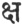

  
[Intangible Textual Heritage](../../index)  [Hinduism](../index) 
[Index](index)  [Previous](wos09) 

------------------------------------------------------------------------

[Buy this Book at
Amazon.com](https://www.amazon.com/exec/obidos/ASIN/8177557459/internetsacredte)

------------------------------------------------------------------------

  
*Select Works of Sri Sankaracharya*, tr. by S. Venkataramanan, \[1921\],
at Intangible Textual Heritage

------------------------------------------------------------------------

p. 199

### Definition of One's Own Self.

I salute the two feet of the holy Master, which destroy (this)
unendurable duality, and whose dust, like the sacred ashes, quell the
demon of illusion. (1).

I salute the merciful and most excellent Master who destroys all doubts
and whose two feet reveal the enjoyment of one-ness as the meaning of
the word "that". (2).

p. 200

Scorched by the forest-fire of phenomenal existence, the pupil,
possessed of all necessary qualifications, is thus enlightened by the
Master with words capable of revealing the true self. (3).

Whoever doubts the fact that himself exists? If even this is doubted, he
who doubts is only thyself. (4).

p. 201

When one knows "I am not", it is verily Brahman itself that knows "it is
not." When one knows "I am", then (too) it is that Brahman itself that
knows thus. (5).

Thyself, therefore, art Brahman. "I am not Brahman" is a mere illusion.
From illusion springs separation [\*](#fn_170)
wherein all sorrows have root. (6).

He who gains a clear knowledge of the five sheaths (of the self) does
not experience the five sufferings. [†](#fn_171) The wise, therefore, always investigate
the five sheaths. (7).

p. 202

By a clear knowledge of the five sheaths, *anna-maya*, *prâna-maya*,
*mano-maya*, *vijnâna-maya* and *ânanda-maya*, each within the one
before it, the self becomes capable of being revealed. (8).

This (gross) body which is called the *anna-maya* sheath, is not the
self, for it is non-sentient, almost like an earthen vessel, and is
non-existent before birth and after death. (9).

p. 203

So much of the atmosphere as is contained by the body is the
*prâna-maya* sheath. How can this be the self, being afflicted with
hunger and thirst? (10).

Nor can the *mano-maya* sheath be the self, which thinks of the body as
'I' and of home, etc., as 'mine', and which is the slave of likes and
dislikes. (11).

Nor can the individual consciousness known by the name of *vijnâna-maya*
(sheath), be the self, for it is only a reflection of the pure
consciousness, [\*](#fn_172) disappearing in
deep sleep and permeating the whole body in conscious moments. (12).

p. 204

How can I-ness (or egoism), which is called the *ânanda-maya* sheath, be
the self, fondly imagining "I am happy" by reason of the small fractions
of bliss found in deep sleep?(13).

That which shines as the reality is bliss itself, is the self of all,
for it exists before and after, is changeless and uncontradictable.
(14).

p. 205

If nothing different from the annamaya and other sheaths is perceived,
it cannot nevertheless he denied that there is one that Perceives the
*annamaya*, etc., sheaths. (15).

Although the self, being of the very nature of consciousness, cannot
therefore be the object of consciousness, nevertheless there can never
be a doubt regarding the absolute existence of consciousness itself.
(16).

The self experiences all things, but cannot be experienced by anything.
The sun, that illumines the whole world, is not, in its turn, illumined.
(17).

p. 206

What is neither that nor this, so or thus, that much or this much,—that
should be understood to be Brahman. Otherwise, it will be a mere object,
and not directly knowable. (18).

While everything that is perceived as 'this, this' is
contradictable [\*](#fn_173), the reality that
is 'not this' is not contradictable. It is, moreover, not unrealisable,
because it exists. (19).

p. 207

Brahman, although not knowable (by the intellect), is yet not
unrealisable, because it is self-resplendent. The passage, "Brahman is
reality, knowledge, infinity", expresses the definition thereof. (20).

As long as there is limitation by the powers of the sheaths, the
conditions of individual soul and Supreme Self affect it. Otherwise,
these two conditions disappear, and its real nature without any
distinction shines forth. (21).

If it is determined by ordinary reasoning that, when everything visible
is known to be unreal, there is naught at all, it is further determined
by the Vedas that what is established as naught at all, is Brahman
itself. (22).

p. 208

Although this is so, to those that are devoid of even a thought of
passages like "that thou art", the self, though (ever) resplendent
within, becomes, as it were, invisible. (23).

Therefore, by a contemplation of the meaning of such passages through an
examination of their word-meanings, and by the glory of the grace of the
Master, one directly sees the self in an instant. (24).

p. 209

The expressed meaning of the word 'thou' is the (individual)
consciousness that prides in being doer, (enjoyer,) etc., superimposing
the functions of the body, the senses, etc., on the self as if they were
identical. (25).

The derived meaning of the word 'thou' is the consciousness that
manifests itself as the. witness of the body, the ego, and the senses,
distinct from them. (26).

The expressed meaning of the word "that" is the supreme self which is
knowable from Vedantic texts, which is the efficient cause of the whole
universe, and which is endowed with omniscience, etc. (27).

p. 210

The derived meaning of the word "that" is the supreme self, free of all
condition whatsoever, beyond all phenomena, absolute, second-less,
eternal, and realisable by (direct) experience. (28).

The relation between the two word-meanings is either sameness of object,
or the relation of attribute and subject, or that of indicated and
indicator. (29).

p. 211

Those versed in interpretation explain "sameness of object" as the
application of words, individually denoting different objects, to denote
together the same object. (30).

Visibility and invisibility, fullness and the having a second, are
mutually contradictory. Therefore, in the case on hand, the derived
meaning alone is possible. (31).

Derivation of meaning is the denotation of an object not unconnected
with the primary

p. 212

meaning, in a case where the primary meaning cannot be adopted owing to
its contradiction by other reasons. (32)

Exclusive derivation of meaning [\*](#fn_174)
is the denotation of a different object connected with the expressed
meaning, but completely exclusive of the latter; for instance, the
hamlet on the Ganges [†](#fn_175). Such
derivation of meaning is not applicable to the present case. (33).

p. 213

Inclusive derivation of meaning is the denotation of another object
without abandoning the expressed meaning; for instance, the red [\*](#fn_176) (one) is running. Such derivation, too,
should not be adopted in the present case. (34).

The partly exclusive and partly inclusive derivation is that which
excludes a portion of the expressed object and denotes another portion
thereof; for instance, "this is that Brahmin". This mode of derivation
should be adopted in the present case. (35).

p. 214

The sentence, "this is that Brâhmin", indicates the Brâhmin alone by
excluding the remoteness and the nearness of place, (time), etc., and
thus denotes identity between the meanings of the two words ('this' and
'that'.) (36).

In the same way, the sentence, "that thou art", indicates the Supreme
Self that is the reality, by excluding directness and remoteness, etc.,
and thus clearly denotes identity [\*](#fn_177)
by the word "art." (37).

In regard to those that realise as "I" the reality thus indicated by the
principal text

p. 215

declaring identity, the Vedas declare that they shall be free from all
sorrow. (38).

It is generally observed, both in secular and Vedic matter, that words
of injunction (alone) are capable of inciting one to action. How can the
same hold good in the case of passages like "that thou art" which
(merely) reveal a thing already established? (39).

It is not injunction alone that can incite one to action, but also an
assertion regarding a desired object. A person will begin to act by
virtue of the knowledge. "Here is the king" or "a son has been born."
(40).

p. 216

Although, according to the Vedic passages declaring identity, the self
is incessantly revealed, yet it is not possible to realise it for those
that are devoid of the grace of the Master. (41).

Do not think, 'what is the need for a Master, since one, by himself, can
attain a knowledge of the self by avoiding optional and prohibited rites
and by purifying the mind through the performance of prescribed rites?'
(42).

p. 217

Knowledge (of self) cannot result from rites alone, without the Master
that is the ocean of mercy; for it is established by the Vedas that only
he who has a Master can know. (43).

The Vedas are the highest authority, either because they are
beginningless or because they are the utterances of the Supreme Lord.
Knowledge, (therefore) cannot result either by itself or from any other
authority. (44).

The Vedic sentence, which does not depend on any other proof, but on
which depend all

p. 218

proofs, is the only source of the knowledge of Brahman and other things
that are beyond the senses. (45).

Those that attempt, by means of proof, to realise a knowledge which
reveals the proof itself, are such wonderful beings that they will burn
fire itself by means of fuel. (46).

The Veda is beginningless, and the self-resplendent Lord himself
manifests it. In view of its manifestation thus, the great ones have
declared that it is the (highest) authority. (47).

p. 219

As no authority is equal to the eye in the perception of forms, so is
there no authority for knowledge, equal to the Veda, in the realisation
of that which is beyond perception. (48).

If any treatise elucidates a truth established by the Vedas, it is
merely a repetition and is not indicative of any authority whatsoever.
(49).

p. 220

Of the Vedas consisting of two parts, one part [\*](#fn_178) enunciates duality and the other [†](#fn_179) plainly expounds the one (secondless)
reality. (50).

The secondless alone is real. Duality. being only superimposed thereon,
is not real, like (the illusion of) silver in the mother-o’-pearl, or
the appearance of water in a mirage. (51).

It is not proper to say that the secondless reality may be superimposed
on the unreal and dual; for superimposition is (always) that of the
unreal on the real. (52).

p. 221

Both cannot be superimposed, for there is naught different from them and
superimposition cannot be on nothing. Hence, the reality of the
secondless (*self*) must be accepted. (53).

What is expounded by the Vedas is the secondless (Brahman) that cannot
be known by direct perception and other proofs, and not duality, for the
latter is already established by ordinary reasoning. (54).

p. 222

The secondless (Brahman) is of the nature of happiness, while duality is
always unendurable misery. The Vedas, therefore, expound only that [\*](#fn_180) which is aspired for. (55).

In respect of the secondless reality which is expounded by the Vedas and
which is of the nature of bliss, some say that the condition of
individual self is its ordinary nature. (56).

If the condition of individual self be the very nature of (Brahman that
is) absolute consciousness, then, like the heat and light of fire, it
can never disappear. (57).

p. 223

Some are of opinion that the individual soul becomes the supreme soul by
virtue of spiritual effort in the same way as iron becomes gold by the
action of some chemical. (58).

This is not right; for when the power of the chemical disappears by
lapse of time, the golden colour that was imparted to the iron, also
disappears. (59).

p. 224

In the same way, the condition of individual soul, with its
characteristics of pleasure and pain, will only seem to disappear
(according to the above reasoning), but will not be utterly destroyed.
(60).

Therefore, if, by its very nature, it is the individual self, it will
for ever remain the individual self. 'In the same way, if (by its very
nature) it is the supreme self, it stands to reason that it is always
the supreme self. (61).

Even if the individual soul were to attain (only a) similarity with the
supreme self by virtue of spiritual efforts, it has been decided

p. 225

by all authorities that even that similarity must necessarily perish
after some time [\*](#fn_181). (62).

Having therefore destroyed, by the knowledge of the self, the
insuperable ignorance regarding one's self and phenomenal limitation
(*samsâra*) which is of the nature of (that) ignorance, one becomes
oneself the Infinite, and naught else remains. (63).

All the Vedas and all religious treatises (*smriti*) expound the supreme
secondless Self whose nature is reality, knowledge and bliss as the
thing to be realised. (64)

p. 226

In respect of all the numerous Vedic passages declaring oneness, all
other passages are said to be subordinate thereto. (65).

 [\*](#fn_182) From passages like "that thou
art," how does the knowledge of non-duality spring up, at whose very
origin the conditions of doer, etc., disappear, like darkness at the
rise of the sun? (66).

p. 227

Those versed in ritual argue that knowledge occurs in the ritual portion
(of the Veda) and is therefore an auxiliary to ritual. But how can
knowledge be an auxiliary to ritual, since it occurs in a quite
different context? (67).

The two portions (of the Veda) relating to ritual and knowledge, are
entirely different, both in respect of the aspirant's qualifications and
the subject dealt with. This being so, how can they be principal and
auxiliary in relation to each other? (68).

p. 228

Knowledge cannot exist in ritual. So, too, ritual cannot exist in
knowledge. How is any correlation possible between the two, which are
like sun and darkness? (69),

Therefore, for the removal^ of illusion, knowledge does not need the
assistance of anything else, in the same way as the sun for the
dispulsion of the densest darkness. (70).

The supreme self that is the witness of al;. is itself that unsullied
knowledge. The witness, therefore, is not affected by those limitations
(of ignorance) but is (even) reality, knowledge and bliss. (71).

p. 229

Its relation to them as (subject and) object is (illusory) like the
relation of rope, etc., to serpent, etc. The Vedas, too, establish the
same truth by declaring "this (self) is ever unattached". (72)

That which cognises both subject and object is the supreme self itself.
Neither of them can know it. That which is neither subject nor object
can alone know (itself) clearly. (73).

p. 230

Some say that the nature of doer, (enjoyer,) etc. and all else is
manifested (in the self) by its power of *mâyâ*. This is (however) a
delusion, because there is naught other than Brahman. (74).

That Brahman being known, all this universe will become known, in the
same way as all earthern jars, pots, etc., become known by the clay,
which is their cause, being known. (75).

This (Brahman), then, is the one cause, devoid of all distinction, of
the nature of purest

p. 231

consciousness. From that which is the sole reality, conditioned by
*mâyâ*, sprang forth all this universe. (76).

Some say that the cause is non-entity. (But) the non-existent cannot be
a cause. The power to generate a sprout is visible to all, only if the
seed exists. (77).

He who declares the cause to be non-entity, can manage affairs with the
son of a barren woman and quench intense thirst by drinking the water of
a mirage. (78).

p. 232

As this doctrine of a non-existent cause is untenable both according to
scripture and reason, it follows that real entity is alone the cause of
all the worlds. (79)

This reality, higher than the highest, manifests itself as the worlds,
also as teacher and pupil, also as (the four-faced) Brahman and other
gods. (80).

For those whose minds are not ripe, the impression that the world is
real will tend to

p. 233

bondage (of births and deaths). Hence, the Vedantas declare all this
universe to be unreal. (81)

On the other hand, to those great persons whose minds have become ripe
by virtue of their past merits, the Vedas declare that all this universe
is Brahman alone. (82).

Those that do not realise the gold understand a golden ornament only as
an ornament. So, too, those that are devoid of realisation do not
perceive the world to be Brahman. (83).

p. 234

How can Brahman be unknown to anyone, which is realisable by means of
I-ness? [\*](#fn_183) And yet, it is impossible
of realisation by the un-enquiring ignorant. (84).

All persons carry on their activities at all times by means of the ideas
"I" and "this". Of these, the former relates to the inner self, and the
latter to external objects like the body, the senses, etc. (85).

p. 235

If the idea of "I" springs up in respect of the body, senses, etc., it
is then a huge delusion; for, delusion is defined as the perception of
anything in what is not that thing. (86).

It therefore stands to reason that the supreme self that is the witness
of all is alone denoted by the idea "I". This I-ness, although devoid of
consciousness, becomes conscious, as it were, by its contact with the
self. (87).

The direct meaning of the clear and unmixed conception, "I", "I", in all
bodies is therefore Brahman alone. (88)

p. 236

By the word "cow", the genus 'cow' is primarily meant; but, from the
context, a particular cow is also indicated. In the same way, the
primary meaning of "I" is the supreme self, but, by virtue of delusion,
becomes the ego. (89).

Just as the power to burn, etc., is manifest in iron by reason of its
contact with fire, so do the conditions of doer, (enjoyer) etc.,
manifest themselves in the "I" by reason of its connection with the
self. (90).

p. 237

Having understood the meaning of "I" to be the pure, transcendental,
secondless (self) that is different from the body, senses and other
objects, one should not attribute any other meaning thereto. (9l).

Just as, in the same body, the pleasures and pains are numerous in
respect of the various limbs, so, too, there are differences of
experiences in respect of these individual souls, although there is
really no differentiation at all: (92).

p. 238

A wise person should never enquire of the universe, 'what is this',
'what is its nature', 'how was it born' 'and 'what is its cause'. He
should merely think of it as delusion. (93).

The wood is forgotten in the elephant made of wood, and the elephant in
the wood. [\*](#fn_184) So is the supreme self
forgotten in the universe and the universe in the self. (94)

On the vast canvas of the self, the self itself paints the picture of
the various worlds and

p. 239

the supreme-self itself derives extreme bliss from seeing that
picture. [\*](#fn_185) (95).

The wise have the firm conviction that there is nothing else than the
supreme self alone, consisting of pure consciousness, attributeless,
imperishable, secondless, of the nature of bliss, and attainable only by
direct realisation. (96).

The talk in the Vedas about knowledge and ne-science relates to the
stage of argumentation. From the true standpoint there is no such
distinction, because Brahman is the only reality and there is naught
else than this. (97).

p. 240

If one asserts that there *is* anything other than the self, even that
is the self in its aspect of existence. Anything which is different from
being existent, is non-existent and therefore a mere void. (98).

For the wise, although delusion has been conquered by the steady power
of their knowledge of the self, yet it seems to remain until the death
of their bodies. But the self shines for them in its real nature. (99)

p. 241

This is the peculiarity of the wise, that, although they are looking at
all the variety of phenomenal existence, they could see naught other
than the self understood from all the Vedas. (100).

For the wise that realise everything to be Brahman, what is there to
meditate or not meditate, what to speak or not speak, what to do or not
do? (101)

p. 242

For the wise that see all objects as the self (*drik*), there is neither
bondage nor liberation, neither the condition of supreme self nor that
of individual soul. (102)

This is the sole ultimate teaching of all the Vedas if they are
repeatedly enquired into,—the Vedas which uncontradictably reveal the
self and which are the highest authority possible. (103).

Thus taught by his master, the disciple saluted his feet with joy and
meditated within

p. 243

himself on the truth established by his own direct realisation. (104).

I am undecaying, I am imperishable, I am the Lord (*prâjna*), I am the
consciousness that is the inner self, I am full of supreme bliss, I am
the supreme self (*parama-siva*), I am the infinite. (105).

I am the greatest of those that have realised the self. I am the enjoyer
of the realisation of my own bliss. I am he whose glory is realised as
"I" by all beings down to children and the illiterate. (106),

p. 244

I am averse to sensual pleasures. I am full of the bliss, knowledge and
realisation of the self. I am far aloof from any thought of the
objective. I am delighted at heart by that which is not objective.
(107).

I am the Lord of lords. I am devoid of even a touch of jealousy and
hatred. I am he that fulfils the desired object for those who are bent
on realising the goal. (108).

p. 245

I alone am the origin of the worlds. I am he that sports in the garden
of the *upanishads*. I am the flame of the sub-marine fire that will dry
up the overflowing ocean of sorrow. (109).

I pervade up and down and around with my own extraordinary glories. I am
he who appears to be determined by means of argument, counter argument
and enquiry. (110).

p. 246

I am the seer. I am the host of seers. I am the act of creation and I
myself am the created. I am prosperity, I am progress, I am
satisfaction, I am the glow of the lamp .of satisfaction. (111).

I am one. I am devoid of all distinctions, such as "this," "like this"
or "thus". I am he that should be worshipped by the non-desirous. I am
devoid of the inner feeling of merit or demerit. (1I2).

I am the revealer of oneness. I alone am the supreme reality for minds
purified by a

p. 247

thorough understanding of the (Vedantic) formula. I am the sun that
dispels ignorance like the darkness of the night. (113).

I am the efficacy of herbs. I am the warp and woof of the worlds. I am
the bee intoxicated with the fragrance of the bliss of self emanating
from the lotus of the sacred syllable *om*. (114).

I am the healing balm for evils. I am devoid of all conditional
properties. I am the acne of liberality. I am he that rescues

p. 248

all by (granting) the fourfold desires [\*](#fn_186) in various ways. (115).

I am the goad of all powerfullest elephants, being greater than them. I
am as spotless as space. I am devoid of emotions generated by the god of
love. (116).

Amidst doubts and doctrines regarding the self, I am he that is realised
by unerring instruction. I am averse to transient pleasures. I am
fittest for the plenitude of eternal bliss and knowledge. (117).

p. 249

I am filled with the nectar of mercy. I am he that devours all the
worlds including that of the lotus-seated. [\*](#fn_187) I am devoid of the sinful "I". I am
free from the contagion of sin and virtue. (118).

I am beyond the scope of the senses. I transcend the ether (*âkâsa*). I
pervade phenomenal existence which is (unreal) like a sky-flower. I am
unattainable by the wicked. I am bent on dispelling imperfect knowledge.
(119).

p. 250

The very mention of duality will slip away from me. I am he whose
dwelling is the innermost heart of all. I am attainable by the
contented. I am the perfect consciousness that knows no going or coming.
(120).

I am a host of suns for destroying the accumulated darkness of densest
delusion. I am the various divisions of time, hour, day, night, year,
*yuga* and *kalpa*. (121).

p. 251

The sentient and the non-sentient are my forms. My actions are extolled
by the wisest. I am inaccessible to the unsteady. My abode is the other
shore of the boisterous ocean of phenomenal existence. (122).

I am elated with the joy of conscious bliss that is hidden down the
ocean of the Vedas. I am concealed to those whose minds are fond of
deceptive verbiage. I am attainable by the way of peace. (123).

p. 252

I am the root of all objects from the lotus-seated (Brahman) downwards
and of the five great elements. I impart bliss to the worlds. I am free
from birth, age, disease and death. (124).

I am the several varieties of noise like the buzz, the grunt, the
tinkling and the roar. I am he that illuminates the mansion of the heart
by the lamp of self-realisation promptly lit. (125).

I am knowledge. I am the known. I am the knower. I am all the aids to
knowledge.

p. 253

\[paragraph continues\] I am that pure
sole existence bereft of knower, knowledge and known. (126).

My nature is beyond all principles. I am devoid of the thought that I am
among them. I am difficult of attainment for the ignorant. My secret is
realisable by a knowledge of the words "that" and "thou." (127).

I am the foremost of all deities, demons, fiends, men, animals and
mountains. I am without body and senses. I am the various directions
like south, east, etc. (128).

p. 254

I am of the nature of right and wrong. I am free from the bondage of
right and wrong etc. I am easily attainable by those that follow the
right. I am the happiest. I am the origin of the Creator himself. (129).

I am devoid of names (and forms) etc. I am free from hell, heaven and
liberation. I am he that is realised by the ultimate inner sound. I am
the essence of all the Vedas and of the whole universe. (130).

p. 255

I am he whose mind is purified by the knowledge of the reality which
dispels the distinction between the supreme self and the individual
soul. I am the original. I am the change. I am the fruition of all
fortunes. (131).

In the shape of the serpent, the mountain and the elephant, I bear the
whole weight of the world. I (am Siva who) destroyed the five-arrowed
(Cupid) by the fire emanating from the eye in the forehead. (132).

p. 256

I never become bound. So, too, I am never liberated from bondage. I am
never such as to be taught. I am not the teaching. I am not the teacher.
(133).

I am devotion. I am worship. I am liberation. I alone am the means to
liberation. I am the ruler of all beings. I am the root-cause of all
that is past, present and future. (134).

I am respected by the great. I am disrespected by the ignorant. I am
difficult to attain, owing to the evil tendencies of the mind deluded by
pride, desire and vanity. (135).

p. 257

I am the sacrificial rite, the sacrificer, the priest and the sacrifice.
I am free from control of mind etc. [\*](#fn_188) I am Yama, Varuna, Kubera, Indra,
Nirriti, Váyu, Ísvara and Agni. [†](#fn_189)
(136).

I are the glory of that playful glance that affords protection and
witnesses the control (of the universe.) I am established by the
authority of that realisation which springs up amidst conditions wherein
there is neither night nor day. (137).

p. 258

I am the definition and the defined. I am the implied meaning. I am
devoid of dissolution etc. I am the gain and the loss. I am the
unattained amidst the attainable. (138).

I have no castes or rules of life. I am the sacred syllables. I am the
respected among the most respectable. I am beyond the scope of speech. I
am within the words and the meaning of every sentence. (139).

p. 259

I am unattainable even by hundreds of philosophies for minds that are
devoid of peace and self-control. I am the sole refuge of the wise. I
break to pieces countless doubts of various sorts. (140).

I am free from the six states [\*](#fn_190) and
the six tastes. [†](#fn_191) I. have no enemy.
I am free from the six bodily sheaths. [‡](#fn_192) I am beyond the thirty-six
principles. [§](#fn_193) (141).

p. 260

I am the bliss of realisation. I am the celestial tree that grants the
desire for absorbed contemplation. I am free from phenomenal condition.
I am the direct realisation of the Vedánta (*átma vidyá*). (142)

I am the oblation to the gods and the oblation to the *manes*. I am
devoid of all ideas of rejection and acceptance. I am Vishnu, I am Siva,
I am Brahman (the creator), and I alone am their cause. (143)

p. 261

All my sins have been washed away. The sorrows of phenomenal existence
have been dispelled from my heart. I am the root of all the various
activities expressed by the letters ending with *ksha* and beginning
with *a*. [\*](#fn_194) (144)

Why say so much! All this universe, sentient and non-sentient, is
myself. Spray and foam and wave are not, in reality,
substances-different from the ocean. (145)

p. 262

My refuge is neither my mother, nor father, nor sons, nor brothers, nor
others. My supreme refuge shall be the foot placed by my master on my
head. (146)

There is the foot of the master. There is unbounded mercy in his look.
There is whatever he has taught. Is there any higher fulfilment of life?
(147)

The looks of the venerable master are as full as the flood of rays of
the (full) moon, they

p. 263

are a variety of the celestial tree in granting whatever boon is
desired, and they soothen and quell the sorrow of the mind. (148)

In the cave of the heart there lies for ever by herself, the
serpent-maid of pure consciousness, made happy by swallowing the huge
frog of a fickle mind. (149)

In the vast ocean of bliss and realisation, which is myself,
characterised by *máyá*, a thousand universe bubbles spring up and
disappear again and again. (150)

p. 264

Solely by the good ship of the master's grace, wafted by the wind of
good luck acquired in former lives, I have crossed the vast ocean of
phenomenal existence, whose waves of sorrow are unendurable. (151)

While there was the darkness of ignorance, I saw the whole universe as a
reality before my eyes. But when the sun of knowledge has risen, I see
nothing at all. This is wonderful! (152)

p. 265

I prostrate not to the gods. One who is beyond all gods does not salute
a god. After that stage, one does no prescribed act. I prostrate again
and again to my own self, which is the root of all endeavour. (153)

Thus, rejoicing again and again at the thought of his having gained the
knowledge of the self, he reaches the supreme state of absoluteness
(*kaivalya*), when the fruits of actions ripe for present enjoyment are
[exhausted](errata.htm#7). (154)

p. 266

The Lord facing the south [\*](#fn_195),
himself, has composed this work entitled "The definition of one's own
self", which will dispel the darkness of ignorance and will carry one
across the shoreless ocean of phenomenal existence. (155)

The sky of my mind is illumined by the sun of the master who is the Lord
Vishnu that destroys the darkness of ignorance and causes the lotus of
realisation to blossom. (156)

Here Ends

THE DEFINITION OF ONE'S OWN SELF.

\_\_\_\_\_\_\_\_\_

 

 

 

------------------------------------------------------------------------

### Footnotes

[201:\*](wos10.htm#fr_176) Difference, duality,
manifoldness, variety.

[201:†](wos10.htm#fr_177) *Avidya*, ignorance;
*asmitä*, egoism; *räga*, desire; *dvesha*, hate; and *abhinivesa*, fear
of death.

[203:\*](wos10.htm#fr_178) The Supreme Self.

[206:\*](wos10.htm#fr_179) *i.e.*, Unreal.

[212:\*](wos10.htm#fr_180) Derivation of
meaning is of three kinds: exclusive, inclusive, and partly exclusive
and partly inclusive.

[212:†](wos10.htm#fr_181) Which really means
"the banks of the Ganges"

[213:\*](wos10.htm#fr_182) The quality of
redness cannot run. The red horse or other animal is meant.

[214:\*](wos10.htm#fr_183) Between the two
indicated by "that" and "thou"

[220:\*](wos10.htm#fr_184) The *karma-kânda*.

[220:†](wos10.htm#fr_185) The *jnâna-kânda*.

[222:\*](wos10.htm#fr_186) Brahman, that is,
eternal bliss.

[225:\*](wos10.htm#fr_187) Because whatever has
au artificial origin must have an end.

[226:\*](wos10.htm#fr_188) This and the first
half of the next verse are the view of the mid *mimâmsaka* or ritual
school.

[234:\*](wos10.htm#fr_189) *i.e.* realisable by
the experiences common to all, "I am ", "I know", "I feel" etc,

[238:\*](wos10.htm#fr_190) Children treat it as
an elephant, and the elderly as wood. So the wise see only the supreme
self and the ignorant the non-self only.

[239:\*](wos10.htm#fr_191) As a painter may
draw a picture on the back of his hand and enjoy its sight himself.

[248:\*](wos10.htm#fr_192) *Dharma*, merit,
*artha*, riches, *kama*, pleasure and *moksha*, liberation.

[249:\*](wos10.htm#fr_193) The four-faced
Brahman.

[257:\*](wos10.htm#fr_194) The eight limbed (or
Rája—) Yoga.

[257:†](wos10.htm#fr_195) The eight deities
presiding over the eight cardinal points.

[259:\*](wos10.htm#fr_196) Birth, existence,
growth, ripeness, decay, death.

[259:†](wos10.htm#fr_197) Sweet, sour, salt,
bitter, pungent and astringent.

[259:‡](wos10.htm#fr_198) Skin muscles, blood,
nerves, bones and marrow.

[259:§](wos10.htm#fr_199) The five elements,
the five pranas (vital breaths), the five sensory and the five motor
organs, the four aspects of the mind, *mahat*, *kála*, (time),
*pradhána*, *máyá*, *avidyá*, *purusha*, *bindu*, *náda*, *sakti*,
*siva*, *sánta* and *atíta*.

[261:\*](wos10.htm#fr_200) अ (*a*) and   (*ksha*) are the first and
last letters of the Samskrit alphabet.

[266:\*](wos10.htm#fr_201) Dakshinámúrti, the
Lord Siva in the shape of a spiritual teacher.

 
