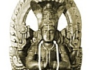

  
[Intangible Textual Heritage](../../index)  [Hinduism](../index.md) 
[Yoga](../yoga/index)  [Index](index)  [Next](ysp01.md) 

------------------------------------------------------------------------

[Buy this Book at
Amazon.com](https://www.amazon.com/exec/obidos/ASIN/B0026P42UQ/internetsacredte.md)

------------------------------------------------------------------------

  
*The Yoga Sutras of Patanjali*, by Charles Johnston, \[1912\], at
Intangible Textual Heritage

------------------------------------------------------------------------

# THE YOGA SUTRAS OF PATANJALI

## The Book of the Spiritual Man

###### An Interpretation By

### Charles Johnston

###### Indian Civil Service, Sanskrit Prizeman Dublin University, Sanskrit Prizeman

#### New York: Charles Johnston

#### \[1912\]

Formatted, with additional proofing at Intangible Textual Heritage,
October, 2007. This text is in the public domain in the US because it
was published prior to 1923.

------------------------------------------------------------------------

[Next: Introduction to Book I](ysp01.md)
