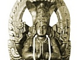

  
[Intangible Textual Heritage](../../index)  [Hinduism](../index) 
[Yoga](../yoga/index)  [Index](index)  [Previous](ysp06)  [Next](ysp08) 

------------------------------------------------------------------------

[Buy this Book at
Amazon.com](https://www.amazon.com/exec/obidos/ASIN/B0026P42UQ/internetsacredte)

------------------------------------------------------------------------

  
*The Yoga Sutras of Patanjali*, by Charles Johnston, \[1912\], at
Intangible Textual Heritage

------------------------------------------------------------------------

# INTRODUCTION TO BOOK IV

The third book of the Sutras has fairly completed the history of the
birth and growth of the spiritual man, and the enumeration of his
powers; at least so far as concerns that first epoch in his immortal
life, which immediately succeeds, and supersedes, the life of the
natural man.

In the fourth book, we are to consider what one might call the mechanism
of salvation, the ideally simple working of cosmic law which brings the
spiritual man to birth, growth, and fulness of power, and prepares him
for the splendid, toilsome further stages of his great journey home.

The Sutras are here brief to obscurity; only a few words, for example,
are given to the great triune mystery and illusion of Time; a phrase or
two indicates the sweep of some universal law. Yet it is hoped that, by
keeping our eyes fixed on the spiritual man, remembering that he is the
hero of the story, and that all that is written concerns him and his
adventures, we may be able to find our way through this thicket of
tangled words, and keep in our hands the clue to the mystery.

The last part of the last book needs little introduction. In a sense, it
is the most important part of the whole treatise, since it unmasks the
nature of the personality, that psychical 'mind,' which is the wakeful
enemy of all who seek to tread the path. Even now, we can hear it
whispering the doubt whether that can be a good path, which thus sets
'mind' at defiance.

If this, then, be the most vital and fundamental part of the teaching,
should it not stand at the very beginning? It may seem so at first; but
had it stood there, we should not have comprehended it. For he who would
know the doctrine must lead the life, doing the will of his Father which
is in Heaven.

------------------------------------------------------------------------

[Next: Book IV](ysp08)
