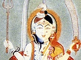

  
[Intangible Textual Heritage](../../index)  [Hinduism](../index) 
[Index](index)  [Previous](yvhf07)  [Next](yvhf09) 

------------------------------------------------------------------------

[Buy this Book at
Amazon.com](https://www.amazon.com/exec/obidos/ASIN/1432515268/internetsacredte)

------------------------------------------------------------------------

  
*Yoga Vashisht or Heaven Found*, by Rishi Singh Gherwal, \[1930\], at
Intangible Textual Heritage

------------------------------------------------------------------------

p. 63

### QUEEN CHUNDALAI, THE GREAT YOGIN

"O may thou rest thyself in Thy all peaceful Atma [\*](#fn_0) like the King Sikhithwaya who controlled
the restless bird called Mind," said Rishi Vashisht to Ram.

Whereupon Ram asked him this, "Tell me, O Guru, who was the King
Sikhithwaya, possessor of the peaceful Bliss? Let me learn that Jnana
(Wisdom), which is the basis of everything, that it, may arise in me to
its .fullest power."

The Rishi Vashisht replied: "King Sikhithwaya was born in the Dwapara
Yuga [\*\*](#fn_1). Over his people he ruled
wisely and well. His justice had no bond by-ways. He had but one
purpose—to do good and perform the works of virtue. Master over body and
mind, his great joy lay in the happiness of his Subjects.

"Chundalai, his Queenly Consort, born through Tapas (Meditation), to the
Queen of

p. 64

the Sourashtra country was like a peacock in beauty. Her beauty glowed
like a jewel in the perfect setting of her sterling virtue.

 

"This King and Queen lived together in perfect happiness, fulfilling
their duties without the slightest difference of opinion. Their youth
passed delightfully, united in body and mind, and their days flowed away
like water from a broken jar, and middle age hovered over them like
clouds on a rainy day. They had tasted the passion fruit of worldly
things. In their youth they loved this and desired that, but now
materiality fell from them like an worn-out garment: The only desire
left was to obtain Adhyatmic-Jnana (wisdom of the self), for this wisdom
is the only certain ending of the disease of rebirth.

"Realizing there is no escape from the disease of rebirth, except
through Atma-Jnan (self-wisdom), they started toward the attainment of

p. 65

this goal with minds fixed in true meditation. About them were gathered
the Wise and Learned of their time. In this environment of Harmony and
Peace, they collected a store of Wisdom, and led a truly spiritual life.

"Queen Chundalai, she of true discernment, having heard and understood
well the real significance of the Sastra (Wisdom) taught by the Wise,
for the attainment of the Higher spirituality, said to herself—since
there exists Atma as I fully realize, why do we use the term "I"? From
whence comes this illusion to the mind; to what is it due; how does it
arise? The body is not the "I", as the body is visible to us, and is
changeable and incomplete in itself. Nor can it designate the organs
functioning in the body, nor its moving force Prana. Further, it does
not describe the mind which owes its activity to thought. The term Jiva
cannot be applied to the "I", as the Jiva is the individual soul. I have
learned through this enquiry that Atma-jnana (Wisdom of the self) will
never be attained through the senses, but through the Eternal Jnana
(Wisdom). I know my Jiva exists through Atmic reality. This Atmic Wisdom
become known only by knowing oneself, not through

p. 66

another. This self-wisdom or self light shines everywhere.

"By divine realization the Queen enjoyed the consciousness of the
reality of the Atma self, and discharged her daily duties without desire
for their fruits. Longing ceased, and the inclination of her mind toward
the pairs of opposites, love and hate, cold and heat. She became the
receptacle of Bliss as a result of the control of her mind. Then with
the daily Yoga practices, the Queen developed Atmic reality, that true
realization, which is a certainty beyond explanation. Only he knows it,
who has realized the reality. The beautiful Queen shone with a radiant
Spiritual Light.

"The King noted the refulgence of his wife's beauty with great pleasure.
He asked his Queen, 'O Beloved One, you are now radiant with such great
beauty, it is as if your youth had come back again, or as if you had
sipped a divine nectar by which you have attained Eternal Divine beauty.
You seem so happy, your mind so blessed with divine peace, that you are
perfect in body and mind. Tell me, my Queen, of the wonderous purity
which so dazzles me.'

p. 67

"Queen Chundalai replied: 'Having abandoned and risen above this world
which is form but formless, real but without reality, I attained the
Mighty One, who is the reality beyond the older age or death. Hence, the
radiance in my body, which is but the reflection of the refulgent peace
within. I have realized That God which is the essential nature of all;
being the atom of atoms; the whole, without creation or destruction.
That is why my body is radiant. I have no joy in the object of the
senses, yet do I partake of the Bliss and happiness of beauty. Love and
hate have both gone from me, and every hour I glory in the attainment of
physical beauty and contentment, but the objects my eyes and mind behold
awake no response in me, either of joy or sorrow. I have attained the
super-consciousness, which is the cause of my Bliss and beauty.'

"Hearing the explanation from his wife, the King without understanding
or trying to understand her words, said: 'O Beloved, thou hast given
utterance to words which are not befitting thee. Hast thou lost thy
mental balance? How is it that thou, living in palaces and in

p. 68

the luxuries of wealth, should attain the realization of Atma when the
greatest of men have cut themselves off from the outward world and have
sought the quiet retreats of the Himalaya Mountains, in order to attain
that state of Bliss, or Atma?

"'How can a Queen, like you, realize that which can only be realised by
the Wise? Thou mayest say that thou hast enjoyed that blessed state,
like those who were unable to reach that exalted state, but claimed they
had sensed it, intuitionally, within. Tell me, how canst thou realise
the Atma within? Thou who art a poor fragile creature, without Wisdom,
tossed to and fro by the senses.'

"The Queen was touched by the King's remarks. She pitied the poor King,
who had not reached that state in which he could understand or enjoy the
Divine Bliss. Still the King and Queen lived together in Peace and
Harmony as they had done in the past. The Queen had gained perfect
control over her mind and desires. She thought if she were able too
develop the power of levitation, then it would be easy to convince her
King of her power. For this purpose

p. 69

she practised Madras in Yoga for the attainment of levitation."

Ram said to the Master: "Please explain how one may attain such psychic
power as levitation, etc."

The Master answered: "I am telling you the interesting story of the
Queen, and now thou dost ask an explanation of Yoga. However, I will
answer thee. By control of Prana (Vital or Life Force), one may attain
that power. One who wishes to attain that power should have a balanced
diet: should practice Mudras and Postures. Control of the mind is also
necessary as well as the study and ceaseless practice of Yoga. One
should have the help of a Spiritual Teacher. One should be free from
anger, love and hate. Try to understand the nature of Prana (Vital or
Life Force) and control its movements, then you can Master the forces of
nature, Sidhi (psychic), and attain liberation.

"There is in the midst of the one hundred Nadis (big vein or nerve), one
which is called Kundalini, it is within every being from Brahma to worm.
It is like a serpent, and is sleeping as the serpent sleeps in the
winter. When the Kundalini

p. 70

power is aroused, it enables one to master the powers of nature. All
other Nadis of the body are connected with the Kundalini. The powers of
the Kundalini become useful, through the Light of Wisdom. This power,
through meditation becomes meditation, through wisdom becomes wisdom,
mind through mind, thought through thought, egoism through egoism.

"This greatest of all powers may easily be controlled, if one masters
the Prana. The Prana (Vital or life force) always goes upward, the
Apana, (or other vital force) always goes downward. These two vital or
life forces cause death of the body. If Prana is brought down, and Apana
be permitted to rise and mix in the heart, then disease would leave the
body, never to return."

Ram again said to the Master: "Please explain how mental disease can be
destroyed."

The Master answered: "Diseases which affect the mind are the first and
are not the easiest to heal; those which affect the body may be classed
as secondary. The desires which affect the mind are primary diseases; we
have sunk thus

p. 71

far by absence of Wisdom, and lack of Mastery over ourselves. We are
under the seeming power of delusion. We cannot realise to what extent we
arc pulled down by such delusion. The mental disease is similar to the
coming of a winter storm. When the power of desires gets hold of one, he
then is liable to be guilty of fearful karma (wrong action); this in
turn produces bodily disease.

"Bodily disease is also brought on by overeating, living in unhealthy
places, association with the wicked, impure desires, evil thoughts, etc.
These mental or indirect diseases have a direct effect upon the body.

"Now I will explain how both forms of disease perish, O Ram. The wise
say that the mental diseases have two divisions, common and specific,
the former affect this body only, but the latter tend to rebirth, also.
The common diseases may be banished by correct eating and right
thinking.

"When the mind is not in perfect harmony it may affect the blood and
produce discord in any portion of the body. Mental discord will produce
poison in the blood, and the poison will

p. 72

affect the nervous system. When the nervous system is affected, then
Prana (Vital Force) cannot follow its right path. When Prana does not
follow its right path, then it cannot reach all parts of the body as it
should, and thus many of the nerves may wither or die. If harmony is
established in the mind, all else is easy and simple. When harmony is
established in the mind, it will naturally follow, that one will want to
do good and read good books pertaining to truth. When peace is
established in the mind, then Prana will follow its right course and all
disease will vanish.

"The path of Yoga, by which one may master the power of the Kundalini,
is through the practise of Pranayama, which causes the power of the
Kundalini to arise, and then the holy becomes strong. By Pranayama the
movement of Prana and Apana may be controlled; then the Yogin will be
able to go up like a bird. The Prana is the cause, and when it is made
to go up through the Sushumna, all kinds of psychic powers are attained,
such as seeing, hearing and levitation."

Ram again questioned Rishi Vashisht; "How

p. 73

do such people become light and heavy, seemingly at will, and how do
they gain control over the powers of nature?"

The Master replied: "Such powers are mastered only by one who has a
consciousness of absolute purity, free from the worldly things. The self
is finest of the fine, which is not the Universe, neither its
association with it. But through its own thoughts becomes individual
soul, and is known by the name Jiva (individual soul). This Jiva mingles
with many things in the world, forgets its reality and thinks of the
body as being real. When one has the last awakening or illumination and
determines to know the Absolute Reality, then the gross and unreal
vanish and the real nature comes to light, and is revealed or
manifested. Through meditation the psychic powers are awakened and
mastered. This is the truth revealed to those who have gained mastery
through Yoga.

"Through Yoga means, the Queen mastered the psychic powers, and with it
encircled the world, simply to convince her King. No one

p. 74

knew that the Queen possessed such marvelous power. That was one reason
her King did not believe or gain the state of Bliss. For the King was as
ignorant of her blessed power, as a child is ignorant of higher
education. The King was without peace of mind, so this great Yogin did
not try to raise the King to Atmic Wisdom."

Ram then said: "O Master, how can others hope to attain pure Wisdom when
the great King failed, when his wife, the great Yogin, tried to help him
realise the blessed Wisdom? Speak, O Master, and say which is the right
means to attain the goal?"

Rishi Vashisht answered: "Faith in the word of the Guru (Spiritual
Teacher) is the way, but discipleship alone is the means of reaching
Atmic Wisdom."

Ram said: "If the disciple alone is the means of reaching the Atmic
Wisdom, then why should it be necessary to have faith in the word of the
Guru?"

The Master explained: "A certain hunter, who lived in the mountains,
lost a shell while walking along through the grassy forest; he was
greatly worried about the lost shell and

p. 75

went searching for it. After a long search he came upon a gem shining
like a moon. Searching for his shell led to the finding of a precious
gem. Such may be the experience of the disciple, in looking for the Guru
(Spiritual teacher), he may find true Wisdom. Studying with the Guru
will help, but the discipleship is the means of developing Atmic Wisdom.

"The King without true wisdom tried many means of attaining self wisdom,
but he was working under illusion, as he thought lie would gain by
giving gifts, bathing in Holy Water and observance of religious laws.
These did not set him free from his mental suffering. At last he turned
to his Queen and said: 'I am giving up everything in this world, but, I
have one desire,—to go to the forest and live there a peaceful life, as
delusion of wealth or pain do not hunt there. The bliss that is the
highest attainable is in the forest; so let me go.'

"The Queen said, 'everything will be ready and ripe at the time, I pray
thee do not go?'

"The King said: 'Do not interfere with my plans. You are young, and
shalt rule in my place, as it is the wife's duty not to languish at the
absence

p. 76

of her husband, but to protect those who are near her.'

"The King gave an order that the city should be patrolled that night,
that every one should remain at home, within the house. That night the
King made his way to the forest. After walking for two weeks he reached
a spot in the Mandara Hills, which are surrounded by beautiful pools and
wild flowers. He made a hut of leaves, a cloth bag for fruit, and a
place for meditation. Then he started his practice; the first hour, for
religious rites, the second and third, gathering flowers for Gods's
worship, fourth, eating fruits; at night, chanting Mantras, thus the
King did his tapasa.

"Next morning the Queen found the King had gone to the woods, leaving
behind his Kingdom, wealth and Queen. She pitied the poor King, and
wanted to know where he had gone, so she levitated and roamed in the
sky. She appeared to Sidhas (psychic persons), as beautiful as the
shining moon. She saw her husband in the forest, meditated upon what she
should do, and reached the conclusion she would not disturb him. She
thought it would be better to let him

p. 77

master himself; so she returned to her palace without letting him see
her.

"The Master Yogin issued a proclamation to her people, stating that her
husband was away on a secret mission. For eight years she ruled with
royal grace of equal justice to all, while the poor King suffered a life
of privation and penance in the forest.

"Realizing that the time had come for her to again see her husband, she
went forth one night through the air. She alighted on a near by hill,
where she saw a decrepit and care worn, old man, whom at first she did
not recognize as her husband. But her clear vision soon discovered that
it was indeed he, and she cried out with her grief, to see, through dire
ignorance, the King bent, groaning in pain. The Queen thought, I have
power to confer Atmic Wisdom on him at this moment, but he will reject
me as his young wife, so I shall not appear before him in this form. I
shall change to [another](errata.htm#4) form to accomplish my purpose.
As his mind is now ripe for Atmic Wisdom, a single word from me will
show him the way to that blessed state, at this time. At this hour a
rare opportunity was at

p. 78

hand. She changed her form from woman to man by the power of Samayan
(the Samayan is the highest power of the Raja Yogin), and
[descended](errata.htm#5) from the sky before the King. The King saw the
form of a young Brahman standing in the air before him.

"The King paid due respect to him, and asked him to be seated. The young
Brahman returned due respect to Raja Rishi (the King), of true Tapas
(prayer, meditation etc.).

"The King said: 'By thy gracious visit I am greatly benefited, as thou
art my Guru.'

"The young Brahman replied: 'Who in this world has such great qualities
as you possess? May you live long. May your mind be filled with Divine
Peace and be free from all delusion of the world.

"'You are performing very high Tapas, as you have given up everything
for the sake of liberation. You are performing Tapas as trying, as
meeting the point of the sword.'

"The King said: 'Thou being a God, art well aware of my condition. May I
ask thy name, and who thou art?'

p. 79

"The young Brahman replied: 'I am the son of Rishi Narada, whose Atmic
Wisdom shines like the sun. At my birth I was taken into the presence of
Brahma (God), who paved my way to Atmic Wisdom. As I was His grandson,
He named me Kumbha Muni: my mother is Saraswati (Mother of Wisdom). I
continually study the Vedas (Book of Holy Wisdom).'

"The King believed every word of the Kumbha Muni. The Muni asked the
King: 'What is thy name and what thy origin?'

"The King answered: 'From the pains of this world I came here for peace.
My name is Sikhithwaya. I have given up my kingship as my mind was
always binding me to the cycle of rebirth. I try my best to free myself
from pains, but they are increasing. O Muni, the milk has surely turned
to poison.'

"Kumbha Muni then replied: 'O King, without a Guru (Spiritual Teacher),
the bliss of Atmic Wisdom is not to be obtained; tapas and mantras are
merely a waste of time, O King. He who has not the Atmic Wisdom, but
follows his duty of action is the best. Unselfish action will remove the
impure desires; doing good

p. 80

karma will bring about heavenly bliss, and pure desire does not make any
fresh karma, but the impure one does. If you know that all is Brahma,
then ignorance is destroyed; the impure desires will never arise. If the
impure desires are controlled, then old age and death are also
controlled, and brings one to the highest state of Brahma.

"'The mind associated with impure desires is ignorance itself, but free
from impure desires it is Wisdom itself. If through Wisdom, Soul
realizes Reality, then one is free from the chain of rebirth.

"'When all the wise, even Brahma, have said the attainment of Wisdom is
the highest bliss, why do you not try to attain it? Why do you not try
to find whence came this Universe? Why are you killing time here in
ignorance? Why not try to find a Guru and from him learn what is bondage
and what, liberation? Go to those who have clear vision over all. They
are the embodiment of wisdom. Engage ceaselessly in enquiring, then
indeed you will find the real, the reality, which is the means of
emancipation.'

p. 81

"The King cried with joy. 'O Guru, I have learned all this attainment of
the way to bliss, and pure wisdom, by thy grace. I have left the company
of the wise through ignorance, came to this forest to suffer, but now I
am freed from pain, by thy kindness. I believe it is thy duty, as thou
art within the forest, to point the way to bliss. Thou art my friend,
thou art my Guru, thou art my parent. I shall be steadfast as thy
disciple. Please accept me as thy disciple. Lead me in the path you have
realized; you are equal to Brahma. Teach me the One-ness that sets
people free from all pain, and into the consciousness of blissful
truth.'

"The Kumbha Muni said: 'I can teach you if you will concentrate your
mind, which has been roaming, from place to place. Without
concentration, my word will not be of any help to you.'

"The King promised to believe and concentrate on the words of the Muni.
The Muni said: 'First you should have full confidence in my words, as a
child has in the words of his father. O King, hear what you will not
understand; I will relate again the hidden meaning. In the olden days
there was a man of wealth and

p. 82

great knowledge, but alas, he was without Atmic Wisdom. This man went in
search of Chintamuni, a lucky stone that brings anything its owner
wishes for. In the days when he was searching to find the lucky stone,
which was bright and shining as the moon, the man without understanding
passed by the lucky stone. He thought it might be only a common stone,
as he could not find the lucky stone in such a short space of time. He
thought, I am not pure, and I am only a poor man. So he left the lucky
stone beside the road, and went on hunting. After a long search, weary
and worn by hardships, a Sidha—a man of psychic powers—saw the poor man
looking for the lucky stone. So he thought he would fool the poor,
deluded man who had passed by without recognizing the lucky stone. The
Sidha threw a piece of glass in front of the man, which, as soon as he
saw it, he picked up, thinking surely it must he the lucky stone. He had
passed by the real lucky stone and picked up instead the simple ball of
glass. He was over-joyed and gave away all his wealth, with the hope
that his lucky stone would bring him anything he desired. So he went to
the forest, with the hope that he would find happiness there,

p. 83

as the lucky stone was supposed to bring him anything for which he
wished. In the forest he tried to have the lucky stone bring forth the
thing he wanted, but it did not bring forth anything, for the reason it
was not a lucky stone at all, it was merely a ball of glass. The poor,
deluded man brought all the hardships upon himself, suffering alone and
without wealth.'

"'I will tell another story about an elephant, that will help you in the
understanding of pure Wisdom.

"'In the midst of a forest there lived an elephant, the most gigantic of
its kind. A Mahout of the forest followed the elephant and trapped him.
His tusks were very long, sharp and dangerous. The Mahout fettered him
with chains, and started to bring him to the city, tied to another
elephant. This gigantic elephant became mad with pain caused by the
chains, as well as the loss of his liberty. With the help of his
powerful tusks he shook himself free. The Mahout seated on this elephant
became frightened, and fell to the ground. The giant elephant,
bewildered by his freedom, passed over the Mahout without hurting him,
and raced to the security of the forest. The Mahout getting to his feet,

p. 84

and alarmed at the loss of his beast of wealth, went after the elephant
and found him in the depth of the forest. The Mahout selected a spot
where he knew the elephant would pass. Then he dug a trench and covered
it with leaves. The elephant after a long time came to the place and
fell into the trench. This time the Mahout fastened the elephant more
securely. So again, the powerful animal was enslaved.

"'Had this gigantic elephant stepped on the Mahout, whom once he shook
from his back and laid prostate upon the ground, he might easily have
crushed him or dashed out his brains, then he would not have been
captured again and deprived of his precious liberty. Likewise, he who
does not think of the result of evil living, and that it would surely
bring him to grief.

"The King asked the master: 'Please give the reason why you narrated the
story of this Lucky Stone, and the story of the elephant?'

"The Master replied: 'The man who had all wealth and knowledge, without
pure Wisdom, went in search of the Lucky Stone. That man is like
yourself, for, although you are well versed in knowledge, you have not
attained poise and peace of mind. This lesson, I meant to convey,

p. 85

by telling the story of the Lucky Stone. In order to overcome suffering
and hypocrisy and attain true renunciation, you have forsaken your
kingdom, wealth, wife and relations, which were the real Lucky Stone,
and you came to the forest, which is the stone of glass.

"'The true renunciation was developing in you, little by little, in the
midst of your worldly surroundings, but your mind was lead astray by the
wrong ideal of renunciation. By delusion your mind was enveloped as by a
dark cloud, instead of being illumined, by the clear light of Spiritual
understanding. This renunciation of yours is not the renunciation which
generates true happiness. With the hopes that you might attain
illumination, or the realization of TRUTH—that which is real—you gave up
everything that men hold dear. You have lost the Lucky Stone and are
holding to the false, the stone of glass.

"'The wise say that those who reject the enjoyment which comes from
their daily lives, and the mind which is filled with imaginary things,
are self-destructive. By giving up your all, and running to the forest
your mind did not attain Divine peace, even when the valuable Lucky
Stone

p. 86

was laid before you. Then what advantage is to be gained by finding the
stone of glass?

"'The gigantic elephant, I also applied to you. The two long tusks are
discrimination and indifference. Your ignorance is the driver which
inflicted suffering upon you, as the elephant was caused to suffer by
the driver (the Mahout). The chain and fetters stand for desires. The
chain and fetters which bound the elephant will wear out, but the bonds
of desire become stronger every day. As the elephant shook itself free
from the chains, so you gave up your kingdom. Throwing the Mahout, or
driver of the elephant,—stands for overcoming the ignorance by the power
of indifference to objects, or the fruits of your work. If we overcome
the impure desires, then ignorance and rebirth will be destroyed.

"'To abandon the delusion of wealth, by sheer asceticism, will never
dispel the ghost, but if the delusion of wealth is destroyed through
discrimination, then the ghost of ignorance will leave forever.

"'At the time you reached this forest your ignorance was laid on the
ground before you, but you did not cut its head off with the true
renunciation. The great elephant did not kill the

p. 87

\[paragraph continues\] Mahout, who was
once laid on the ground at his feet. At that time if the elephant had
put one foot upon the Mahout, then he would not have been made to fall
into the trench, and suffer when he was [imprisoned](errata.htm#6)
there.

"'But, O King, you have suffered more than the elephant here in the
forest. You threw away the Lucky Stone, that, was true renunciation, but
why did you not follow the advice of your wife? But you came to this
forest and picked up the stone of glass, which was not worth anything.'

"The King declared: 'I have given up my kingdom, my dear wife and all.
Is not this true renunciation, O Master?'

"The Master replied: 'True, you have given up your kingdom, your wife
and all, but that is not renunciation, as you are a slave to your
desires, even now. But by giving up all of them, you will attain the
blessed state of Brahma.'

"The King said: 'All right, I will give up this forest and hills, I have
no desire for them; now, I have made the true renunciation.'

"The Master again said: 'Giving up this beautiful forest, will not make
the true renunciation, as long as you have with you impure desires.

p. 88

\[paragraph continues\] When you give them
up, then only, will you attain divine joy.'

"The King answered: 'If this is not true renunciation, then, I will give
up the rest.'

"So the King threw his garments and all that he had into the fire and
presented himself to the Master and said: 'Now, by thy grace, I have
freed myself of all things and thoughts that were only bondage, and the
seed of the rebirth. By giving up all desires I have set myself free,
and attained the true renunciation by thy kindness. What else remains to
be done, O Master?'

"The Master replied: 'You have not done any thing. What you call a true
renunciation is only vain delusion.'

"The King said: 'While I remain within this body, the five snakes, which
are the sense organs remain. Therefore, I shall give them up in your
presence.'

"So the King prepared to kill himself.

"The Master stopped him by saying: 'What foolish thing are you trying to
do? Is your body holding you from progress? 'What will you gain by
giving up your body? To kill or destroy your body is not true
renunciation. O

p. 89

\[paragraph continues\] King, if you will
give up the seed or cause of this body, which is the seed of rebirth,
then you will make the true renunciation.'

"The King besought the Master to tell him how he might give up or
control the cause, or the seed of the body.

"The Master said: 'The Wise say the mind, with its thoughts, called by
many names, is one. The cause is attached to delusive objects. This
restless mind forms the Universe and bondage. It is the mind which is
the seed of all karma (spiritual cause and effect), and moves this body
to and fro, like a tree in the wind. Controlling this mind is true
renunciation and Godly Bliss. O King, all other renunciations are not
true.

"'After reaching the true renunciation you will be illumined in mind,
free from oscillation; then you will recognize your true self with the
self of Brahma, and you will be radiant with glory.'

"The King asked: 'What is the cause of the mind? What is its true
nature? How should I master it? O Master, enlighten me.'

"The Master answered: 'The true nature of the mind is determined by the
desires, as mind

p. 90

and desires are one. Know, O King, the ideal of the "I" (Ego), which is
the house in which exists all qualities of good and evil: this, is the
seed of the mind. The first sprout that comes out of this seed is
Egoism, and originates without form. Its apperception is by inner
experience. This sprout is called Budhi (the reasoning intelligence).
From this little shoot the many branches known as thoughts take their
origin through differentiation. The thought of the mind, the reason and
intelligence, called by different names are really only Egoism. If you
try to cut off the branches (thoughts) of the tree of the mind, you will
not succeed, as the branches will produce more and more, through
desires. But if you cut the root of the tree with the ax of Wisdom, then
the branches will die themselves, and the karma that causes the branches
(desires) will disappear with them. But to merely cut off the branches,
will not harm the tree of the mind. You should cut the root of the tree
or through virtuous actions overcome the ideal of the Ego.'

"The King said: 'I am the Nature, that pure absolute consciousness which
evolves. preserves, and destroys everything. I do not know the cause

p. 91

of the "I", which is the nature of Wisdom. I have not been able to find
the means which will remove the Egoism, the seed of the treacherous
mind. My mind betrayed me as I tried to overthrow this Ego, but it
clings to me.'

"The Master said: 'No effect can be found without a cause. So search
within to find the cause of the Egoism that is always within you. Answer
me, O King.

"The King answered: 'The cause of this impure Egoism is the knowledge of
the mind. How have I become mixed with this knowledge? I sink back when
the knowledge of objects arise. How am I to arise above the objective
world?'

"The Master answered: 'If you tell me the cause of knowledge, then I
will give you the means to arise above it.'

"The King then said: 'The existence of the illusory objects of knowledge
is produced through mind. If the illusory objects cease to exist, then
no knowledge arises. Then the seed of the mind, Egoism will be
absorbed.'

"The Master answered: 'As the illusory objects (body etc.) exist so the
knowledge, but the illusory objects (body etc.) are unreal. Then what is
the basis for knowledge, O King?'

p. 92

"The King replied: 'Tell me first, O Master, how the body which enjoys
all karma, which [performs](errata.htm#7) through organs, (hands etc.)
can be unreal?'

"The Master answered: 'This body, arising through karma, cannot be the
cause, therefore, neither the effect of intelligence, as it is itself
illusory or nonexistent. The Egoism and all other illusory objects which
arise through the delusion of knowledge are not real. Therefore, all the
objects which are not of the nature of cause and effect, are not real,
any more than the mistaken conception of the snake in the rope.'

"The King said: 'All are the creation of Brahma, who was alone in the
beginning of the Universe. How, then, can you say that Brahma is not the
cause of it?'

"The Master answered: 'Prior to the creation, the Parabrahma (Universal
soul) alone shone as Truth, which is nondual and quiescent. He alone is
without a second, then how can the Brahma be the cause?'

"The King asked: 'Is not Parabrahma (the Universal Soul) the cause?'

"The Master replied: 'Parabrahma (Universal Soul) is the emancipation,
the imperishable, birthless, deathless, without beginning and without

p. 93

end. The non-dual and unspeakable can not be reached by thought. How can
Parabrahma (Universal Soul) be the cause which is above the reach, of
the mind and thought? How can one be an actor and an audience? As it
would be impossible, it must follow that this Universe is not created by
any one, nor is self-created. The Supreme Will of the Absolute
Consciousness is the Brahma (God), nothing else is the one true Wisdom.
All the objects created out of that Wisdom can be said to be none other,
than the form of that Wisdom.

"'All is Brahma itself. Realize the one Reality, which will destroy
ignorance, never to rise again. There is no other path through which to
destroy the delusion of karma, which will surely vanish when ignorance
and illusion are destroyed. The Brahmic (Godly) state will be attained,
then the mind through all-pervading Wisdom will merge into Paramatma
(God), and will never be evolved into new creations by thoughts. That
which is called Brahma, through the Atmic Tattva (highest pure wisdom of
the self), is none other than the latent aspect of the Universe.'

"The King replied: 'All that you have taught

p. 94

me is very reasonable. As before creation there was no Creator; so there
is really no Universe, there are no objects; illusory things do not
really exist according to your clear teaching. I understand the reality
of myself and recognize that external objects do not really exist. I
have worshipped myself through many substances. Now I realize that all
were unreal, through this wise teaching. I have become one without a
thought of a second, as one Akasa (Ether) is everywhere.'

"Through the Master's reasoning, the King realized his reality, also,
the true discrimination of time and space.

"Mental activity is to understand the Universe, in all its different
aspects. They have existed in your mind a long time, but they will
depart, leaving only Brahma alone.

"The King was illumined by the Wisdom he attained and was immediately
freed from Maya (illusion). He reached the state of Brahma or Brahmic
(Divine) state and sank into Samadhi.

"After some hours he awakened from meditation, and the Master asked:
'Are you free from

p. 95

all passion? Have you enjoyed the Brahmic Bliss? Have you enjoyed the
Brahmic seat which is fulness of all wealth? Have you attained Atmic
Wisdom? Are you freed from all delusion? Have you met that which is
worth meeting? Have you seen the Blessed One that is worthy to be seen?'

"The King replied: 'I have now the eternal peace. I have indeed reached
the Brahmic state, which is above all. With thy kind help I have reached
the Brahmajnan state, the powerful state of Divine Wisdom. O Master, why
was I not able to reach this high state before?'

"The Master answered: 'When mind becomes absolutely at rest and one sees
all with impartial eyes, with vision turned inward, with all impurities
of the mind gone, then it is easy for the Master to help the disciple,
as there is no doubt in the mind of the student.'

"'Doubt is the big stone in the road of divine wisdom. The king attained
the wealth of wealth, bliss of bliss, which is the divine wisdom, and
the highest good.

"'Master,' said the King, 'Are not the Jivanmukta (bodily emancipated)
performing actions through their mind?'

"The Master answered: 'The mind is nothing

p. 96

without desire; mind and desires bind one to rebirth. If one knows
himself (the divine self), there is no fear of rebirth. Truth sets them
free. Those Jivanmukta (bodily emancipated) have realized the reality;
therefore, their Minds do not generate impure desires, but generate pure
desires. With pure desire, you do not create rebirth. The lower mind, or
work done under the influence of the lower mind produce cause but the
higher mind or work done under the influence of the higher mind does not
produce any cause.'

"So the King gave up the idea of doing good for reward, but sought to do
good for the sake of good. Give up the idea of going to heaven, then you
will shine like the Light of Lights that is in all, and is
everywhere,—which really you are. Let the lower mind go, that has a
hankering to go from place to place, from earth to sky, and from sky to
earth.

"With the control of the lower mind, the rebirth is also
controlled,—becomes peaceful, immovable, then you become one with pure
Wisdom (motion and non-motion).'

"'O, Master', said the King. 'How am I to attain that state where motion
and non-motion is one?'

p. 97

"The Master replied: 'As the ocean is rippled by the waves, but is still
one, so all the Universe is non-dual, is Absolute Consciousness,
compelling, drawing intelligence unto itself. The ignorant will not
understand the difference, how the Truth and Brahma is the Universe
itself,—motion in itself,—this Universe Created by itself. If you
realize this outwardly, then the blessed state is yours. This merely
reverses the appearance, seen as the real cause, as the rope in the dark
appears as a snake.

"'By following pure wisdom, and association with the wise., then the
spiritual vision will develop; then only can you truly realize as I have
explained to you—this creation and the destruction of the Universe.

"'If you practise according to your will, do your duty
[conscientiously](errata.htm#8), then you will not fail to attain the
Brahmic state. Does not that do away with all the differences that arise
from delusion and ignorance?'

"The Master disappeared, and the King thought to himself,—how can I
understand that I am All Peace, All Rest, All Bliss, and Absolute Truth?
The King sank into Samadhi, which is above

p. 98

all pain, misery and the Universe. It is True Peace, and True Silence.
The Master resumed the tender form of the Queen, and went through the
sky by levitation to her chamber in the palace. There she again
graciously ruled over her people three years.

"With her higher mind and power she changed her feminine body for a
masculine form, and again visited the King, as she was teaching her King
in the form of a Master.

"When she reached the forest where the King was, she found him in a
seedless Samadhi. To acquaint him of her arrival she caused the forest
to re-echo with her voice. This did not disturb the King, as he was not
awakened from the seedless Samadhi. Though she shook him vigorously, he
evinced no evidence of her presence.

"'This is truly wonderous', said the Queen, 'he has merged into the seat
of Brahma, I will concentrate on his finer body. If I find any residue
of truth typifying the seed of intelligence in his heart, I will join my
King and live with him joyfully; otherwise, I shall have to give up my
feminine form, and myself obtain the Brahmic

p. 99

\[paragraph continues\] State, then I will
be free from re-birth.'

"The Queen concentrated on the finer form of the King, and found there
was still a residue of good qualities in the heart of the King."

Ram asked: "When one's mind has control, and has merged into the inner
vision, how can there still be a residue of good or bad qualities in the
heart?"

Rishi Vashisht answered: "Like the tree, the branches, flowers, and
fruit are all contained in the seed, so the cause of intelligence, like
Satwa, always rests in the heart. The Jivanmukta (bodily emancipated)
who has controlled his mind, does not die and is nut affected by
diseases or pains,—he is living in the world, but above the world, like
the Lotus flower that lives in the water, but does not get wet. Even in
the heart of the Jivanmukta, the cause of the intelligence, latent in
the heart, is like the tree that is in the seed.

"O Ram, the Great Yogin Queen gave up the grosser body of the Master and
merged into the finer form of the King, that is, higher
[consciousness](errata.htm#9),—without beginning or end. She caused it
to vibrate and return to her body, as

p. 100

a bird to its cage. Again in the Master form, she chanted the Divine
Song, which brought the King to consciousness, as the rays of the Sun
make the Lotus flower bloom.

"The King saw his dear Guru (Spiritual Teacher) sitting before him. With
great joy he praised the Master (Queen).

"The Master said: 'From the day I parted from you my mind did not find
blessed peace. Even in the Higher Heavens, there is no joy for me,
except with you.'

"The King replied: 'Blessed, Holy God, I have obtained this blessed
state by Thy favor, and am freed from all pain and misery. Even the
Higher Heavens did not give me the blessed joy that I have from the
seedless Samadhi (trance-like meditation). Now I am Master of ail.
Blessed Peace is mine. I can roam freely in Heaven and on earth.'

"The Master asked: 'Have you tasted the Brahmic Bliss,—God—like joy,
which is above all pleasure and pains? Have you given up all older
thoughts from which arise the ideas of, this is mine, and that is thine?
Can you hold and equal vision over all? Are you able to do

p. 101

your daily duty without effort, or being affected by it? Are you free
from hate and love? Have you realized your all?'

"The King replied: 'Indeed, I have acquired all the spiritual benefits.
I have known all that is worth knowing, have seen all that is worth
seeing, there is nothing that I long to see or hear.'

"So the Master (Queen) and the King with great respect for one another,
enjoyed great bliss and Divine joy, as one in mind and one in
everything. They had destroyed delusion of Maya, (illusion), by the pure
Wisdom. They were firm like the Himalayan Mountains, not to be shaken by
the rustling winds.

"The Queen in the form of the Master, found by the power of Samyam
(highest concentration of the Raja Yogi), that the King's mind was pure
and free from all illusion. She also thought, if one is filled with
wisdom, shouldn't he enjoy the joy that comes without seeking; or how
can it be said he or she had true wisdom? She thought she would
interrogate the King further. 'There is a festival in the Higher Heavens
to-day,' said the Queen, 'I shall be there, I will return tonight.'

p. 102

"The Queen discarded her heavy male body, and resumed her own beautiful
form. She reached her palace by air, and performed her Queenly duties
all day. After sunset she again went forth by levitating her body to the
forest where the King was. The Queen resumed her disguise of the
Master's form, descended before her husband with dejected mien, long and
downcast heart.

The King rising said: 'My Perfect One, my Guru, what has affected
you,—you are suffering from pain? What is it? May you overcome it as a
person of Wisdom. You are not affected by pain or joy, as the water
falling on the duck's back, does not affect her.'

"The Master related the following story: 'The true Jnani who visions all
with an equal eye, and sees all in all, will never be a true Jnani as
long as he does not use his organs, as long as he possesses a body.
Otherwise, that person is an imposter. The ignorant are those who do not
perform their karma (actions), but try to avoid them. They will suffer
as they are trying to separate the oil from the mustard seed, which is
inseparable. As long as the body exists, pains and pleasures remain.
They who

p. 103

try to do away with affections and so forth, are like a man who tries to
cut air with a sword. Pain and an impure body always go together. The
Brahma has the organs of Karmaendriya (organs of action), and the
Jnanendriya (organs of sense), and follows the path which is forever
followed by the ignorant and wise, which has moved the concourse with
Universal Law.

"'The Wise daily do their duty, as long as they stay in their bodies.
They are not affected by performing actions, but the ignorant mind is
never at peace, is ever moving and affected by pain and pleasure.

"'The Cause of my pain—it is not pain when told to those we love. This
morning I went to the Higher Heavens for the meeting. I went there by
air. After the meeting, when coming through the sky to this place, I saw
before me the Rishi Divwasa coming through the clouds. I said to him,
Thou art ill clad; and I acted like a silly woman whereupon the Rishi
cursed me. He said, 'You are acting like a woman, so your form will
change to female from now on, every night.' Hearing this I begged for
pardon, but

p. 104

the Rishi disappeared. This is the cause of my distress. I have to
change to woman's form every night. I am ashamed.'

"'Do not grieve,' said the King, 'changing your form will not change you
from wise to ignorant, only the unwise can be so affected by pain.'

"'The sun is setting,' the Master (Queen) said to the King, 'and the
change in me is taking place.'

"The King said: 'you are wise, and you know the true path, so you shall
not be affected by the change.' So they retired for the night.

"At dawn the Queen was again the Master; so she was a man by day, and by
night a woman.

"'O King, how long, I ask, are we going to live like this? I want to
have a husband, but I cannot find one to equal you in the three worlds.
You should marry me, without the fear of Heaven or Hell.'

"The King was prepared for her proposal, and made ready for the marriage
rites. White silken robes were procured by the power of thought. When
the sun set, the marriage ceremony

p. 105

took place. Every other day the King went into Samadhi (deep
meditation), then the Queen would go to her Palace, perform her Queenly
duties, and return to the forest before the King awakened from his
Samadhi. Thus the time passed away.

"The Queen wanted to enquire into her husband's mind, so one day with
power of her Yoga, she created a heaven of illusion in the forest, also
an illusory God to appear before the King. When the King saw the God and
His Heaven, he asked: 'What good karma have I performed to induce you to
visit me?' "I am attracted by your love and [purity](errata.htm#10), and
I came to take you to the Higher Heavens. It is fitting for you to
leave. The Divine Maidens will wait upon thee, and will always be at
your command. O King, you will live there as long as you wish. This
place is not good enough for you to live in; Heaven is the place for
you, and you will not want to leave it. For that reason I came to take
thee."

"The King with a gesture of gentle remonstrance, replied, 'I have known
all the pleasure of Heaven. One locality is the same as another

p. 106

to me. Wherever I am, there is my Heaven and Bliss. Be pleased to return
to your throne. I have no desire to go with you.' Hearing this, the
Indra (God) disappeared. The Queen felt that the King had attained
Master control.

"The Queen decided to try the King further. It chanced that the King was
sitting at the Holy Ganges watching the Moon rise. The Queen, with power
of thought, created a lover and embraced him. When the King came out of
his trance and found his wife in the company of another man, he returned
to the river at once, without disturbing his peace of mind. When the
Queen went to the King, with embarrassment, she appeared before her
husband, ashamed. Without evincing the least sign of anger, he said
tenderly: 'Why did you, my dear, leave your lover so soon?—If you wish
you may go back to him and gratify your passion.' Thus spoke the king
without anger.

"'It is the duty,' said the Queen, 'of a good husband to overlook the
faults of his wife, who is ignorant and carried away by her emotions;
and I am trusting that you will forgive me.'

"The King replied: 'The sun may rise in the

p. 107

\[paragraph continues\] West, but never
will anger arise in me. A house may be built in the air, but anger will
never arise in me. I have controlled both love and hate.'

"The Queen understood that her husband was really a Master, and had
attained the pure Wisdom of Divine Peace.

"'The time has now arrived for me to show myself in my true colors, and
let him see me as I really am.' She assumed her Queenly body and
appeared before him. The King beheld his Queen, whom he had left at his
Kingdom twenty years ago. He could not believe his eyes.

"'How is this. Am I beholding my Queen? Who are you, please speak?'

"The Queen replied: 'Yes, I am your wife, with whom you have lived for
nearly one hundred years. You left me at the Palace when you retired to
the forest.'

"'So dearest, it was you who came in the guise of Master Kunbhamuni to
save me?'

"'It was I who took the form of Master; it was I who gave you Divine
Wisdom; it was I who took the Madanika (another woman's form); it was I
who tested your Wisdom. Now

p. 108

go into Samadhi; then you will understand all that has been happening,'
said the Queen.

"The King went into Samadhi, the Brahmic or Universal consciousness. In
that state he saw all the events and remembered them from the time he
vacated his kingdom, to the time of his appearing to his Queen Chundalai
in her feminine body. When he came out of his Samadhi, he was blessed
with divine peace and joy. With joy he looked upon his wife who was
standing before him. He embraced her, who was the embodiment of pure
love and grace.

"The King could not find words with which to thank his wife. Later he
began to speak: 'Through your great Wisdom you have saved me, who was
crying in the darkness from ignorance. Who is there in the Universe to
equal thee? You are the Blessed Light, dispelling the fear of the
ignorant. How can I repay thee for all that you have done for me? You
are on equality with the Divine Mother [\*](#fn_2):

p. 109

"'I saw you in despair,' lovingly replied the Queen. 'Your self-imposed
penances were destroying your body. That kind of penance is used only by
the ignorant. I came to save and lift you from worldly pain. Do not
praise me. I but did my duty. Tell me, dear husband, are you free from
the world's troubles? Have you reached the divine state which will not
be affected by action or thought?'

"'All doubt and desire have vanished from my mind,' said the King. 'I
shall never fall through the senses. I have become like Askasa (Ether).
I am above pain or pleasure. I have attained the highest Samadhi. There
is no joy like the joy of Samadhi. I have reached the highest state; I
am the Sun of the Suns; I am the Light of the Lights; I am pure Wisdom;
I am the Absolute Consciousness. I realize my Reality, which is none
other than THAT (God). My wife, you are my Spiritual Teacher. I worship
Thee.'

"'What do you intend to do next,' questioned the Queen?

"'From now on,' answered the King, 'according to thy dictates, I shall
perform my duties. I will live in the world, but not of it, like the

p. 110

\[paragraph continues\] Lotus flowers
which grow in the lake but never get wet.'

"'If Thou art willing to do as I say, then let us go back and reign over
our Kingdom, as Jivanmuktas (bodily emancipated).'

"'I will do as you say,' replied her husband.

"The Queen then created an elephant. It was decorated with rubies and
other gems. They both mounted the elephant's back, and when they came
near the town, with the power of her mind she created an army to escort
them into the city. They were received by their people.

"The King and Queen were enthroned, and ruled wisely and well ten
thousand years, and then they gave up the bodies and attained
emancipation of the Soul.

"O Ram, do you daily karma. Pure wisdom will develop in you. You will
reach the Blessed state Which the King and Queen have
attained,—Liberation."

Thus spoke the great Rishi Vashisht of Wisdom, to Ram.

p. 111

#### MAHABHARATA xii. 293 ff.

    "When old and grey, when strength decays,  
By foes when crushed, in evil days,  
From fortune's heights when downward hurled—  
Yes, then let men renounce the world;  
But not in days of youth and health,  
When crowned with glory, blest with wealth.  
Those scripture texts which praise as best  
A life ascetic, lone, unblest,  
Dragged sadly on in gloomy woods,  
And dreary, doleful solitudes,  
Are fictions hatched in squalid schools  
By needy unbelieving fools,  
Which look like truth, but proved, are found  
To rest on no substantial ground.

    "To savage beasts it is not given  
By forest life to merit heaven;  
Yet this same life, by hermits led,  
Their future bliss ensures, ‘tis said! p. 112

    "When men no pleasure feel, nor pain,  
A state of stupid torpor gain.  
They then have reached perfection, rise  
To heaven, so say the would-be wise.  
But should not trees,—if this be true,—  
And boulders, gain perfection too?  
For they are calm and torpid, feel  
Nor pain nor pleasure, woe nor weal;  
They dread no want, they seek no ease,  
Like self-tormenting devotees.

    "Abandon, then, thy vain design;  
By kingly virtues seek to shine.  
See how by acts all mortals strive  
Their ends to gain, through effort thrive,  
Inaction ne’er perfection brings;  
From strenuous deeds alone it springs."

Translation by J. Muir. For more, readers should look in the Metrical
Translation from Sanskrit writers.

------------------------------------------------------------------------

### Footnotes

[63:\*](yvhf08.htm#fr_0) Universal Soul.

[63:\*\*](yvhf08.htm#fr_1) Third Age in Brahma.
(see pg. 80, 81 Great Masters of the Himalayas).

[108:\*](yvhf08.htm#fr_2) In India we have a
Mother God, not a Father God. We address her Adakali (Divine Mother).

------------------------------------------------------------------------

[Next: The Great Egoist—Bali](yvhf09)
