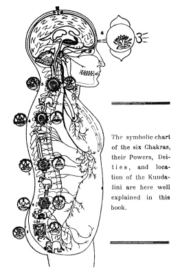

  
[Intangible Textual Heritage](../../index)  [Hinduism](../index.md) 
[Index](index)  [Previous](yvhf15.md) 

------------------------------------------------------------------------

[Buy this Book at
Amazon.com](https://www.amazon.com/exec/obidos/ASIN/1432515268/internetsacredte.md)

------------------------------------------------------------------------

  
*Yoga Vashisht or Heaven Found*, by Rishi Singh Gherwal, \[1930\], at
Intangible Textual Heritage

------------------------------------------------------------------------

The following three pages of advertisements for other books by Singh
Gherwal accompanied the original publication. They are included here for
completeness. Note that the image below does not pertain to this book,
but is a specimen illustration from his 'Kundalini' book. The addresses
and prices in these advertisements are long out of date and we cannot
provide further information about this.—JBH

p. 190

 

The symbolic chart of the six Chakras, their Powers, Deities, and
location of the Kundalini are here well explained in this book—see next
page.

p. 191

#### KUNDALINI

#### THE MOTHER OF THE UNIVERSE

India is the mysterious land. The things of which we have read in old
histories and all the bibles, of their marvelous feats are still
happening today.

Yogis are performing such feats as, walking on red hot coals of fire;
being buried alive for months and others quite as extraordinary,
however, far too many to enumerate.

These are all accredited to the Power of Kundalini, and in the pages of
this book, you will find the answer as to how this wonderful power is
created.

|     |                                                     |
|-----|-----------------------------------------------------|
|     | CHAPTERS                                            |
| 1   | Poem to Kundalini, Mother of the Universe.          |
| 2   | Introduction                                        |
| 3   | "Yoga and Its Objects".                             |
| 4   | Location of Kundalini.                              |
| 5   | What the Kundalini is: when She awakens, what then? |
| 6   | Mudras move the Kundalini.                          |
| 7   | Power of Pranayama Yoga.                            |
| 8   | Power of Dharana, Dhiyana and Samyama Yoga.         |
| 9   | Power of Samadhi Yoga.                              |
| 10  | The Highest Occult Mantrams of Kundalini.           |
| 11  | Why we worship Siva?                                |
| 12  | Review of Rev. Leadbeater's "Off the Trail".        |

In ordering Book write to

**Rishi S. Gherwal or J. Falkenstein.**

P.O. Box 533                  Santa Barbara, Calif.

U. S. A.

p. 192

#### THE BOOK YOU'VE BEEN WAITING FOR

At last a book giving an intimate glimpse into the lives of the great
Masters, by one who lived among them.

Read their priceless words of teaching, and read of the marvels they
daily perform.

No other book like this has come out of India In its pages YOU, too, may
walk beside the MASTERS, may listen to the Eternal Voice of the Ages
chant the song of the Infinite, may even dine on Prana.

When you are thru with the book, you will have had a visit with me to
the Holy Temples of the Himalayians.

**Great Masters of the Himalayas. Their Lives And Temple Teachings.**

**By Rishi Singh Gherwal.—Price $1.25**

**The Prasna Upanishad: Price $.75**

Marvelous Feats Performed by Yogis, through Yoga. Doctors, Scientists
and Chemists unable to solve the mysteries. PRICE $.35

By Same Author

For the book and correspondence course

write

**Rishi S. Gherwal or J. Falkenstein**

P. O. Box 533                  Santa Barbara, Calif.

 

 

 

 
