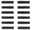

  
[Intangible Textual Heritage](../index)  [Index](index.md) 
[Previous](icpref)  [Next](icintr02.md) 

------------------------------------------------------------------------

p. 1

# INTRODUCTION

### CHAPTER I

#### THE YÎ KING FROM THE TWELFTH CENTURY B.C. TO THE COMMENCEMENT OF THE CHRISTIAN ERA

1\. Confucius is reported to have said on one occasion, 'If some years
were added to my life, I would give fifty to the study of the Yî, and
might then escape falling into great errors [1:1](#fn_0.md).'

|                                         |
|-----------------------------------------|
| There was a Yî in the time of Confucius |

The utterance is referred by the best critics to the closing period of
Confucius' life, when he had returned from his long and painful
wanderings among the States, and was settled again. in his native Lû. By
this time he was nearly seventy, and it seems strange, if he spoke
seriously, that he should have thought it possible for his life to be
prolonged other fifty years. So far as that specification is concerned,
a corruption of the text is generally admitted. My reason for adducing
the passage has simply been to prove from it the existence of a Yî King
in the time of Confucius. In the history of him by Sze-mâ *Kh*ien it is
stated that, in the closing years of his life, he became fond of the Yî,
and wrote various appendixes to it, that he read his copy of it so much
that the leathern thongs (by which the tablets containing it were bound
together) were thrice worn out, and that he said, 'Give me several years
(more), and I should be master of the Yî [1:2](#fn_1.md).' The ancient books on which Confucius had
delighted

p. 2

to discourse with his disciples were those of History, Poetry, and Rites
and Ceremonies [2:1](#fn_2.md); but ere he passed
away from among them, his attention was much occupied also by the Yî as
a monument of antiquity, which in the prime of his days he had too much
neglected.

2\. *Kh*ien says that Confucius wrote various appendixes to the Yî,
specifying all but two of the treatises, which go

|                                                                                          |
|------------------------------------------------------------------------------------------|
| The Yî is now made up of the Text which Confucius saw and the Appendixes ascribed to him |

by the name of the 'Ten Appendixes,' and are, with hardly a dissentient
voice, attributed to the sage. They are published along with the older
Text, which is based on still older lineal figures, and are received by
most Chinese readers, as well as by foreign Chinese scholars, as an
integral portion of the Yî King. The two portions should, however, be
carefully distinguished. I will speak of them as the Text and the
Appendixes.

3\. The Yî happily escaped the fires of Žhin, which proved so disastrous
to most of the ancient literature of China in

|                                  |
|----------------------------------|
| The Yî escaped the fires of Žhin |

B. C. 213. In the memorial which the premier Lî Sze addressed to his
sovereign, advising that the old books should be consigned to the
flames, an exception was made of those which treated of 'medicine,
divination, and husbandry [2:2](#fn_3.md).' The Yî
was held to be a book of divination, and so was preserved.

In the catalogue of works in the imperial library, prepared by Liû Hin
about the beginning of our era, there is an enumeration of those on the
Yî and its Appendixes,--the books of thirteen different authors or
schools, comprehended in 294 portions of larger or smaller
dimensions [2:3](#fn_4.md). I need not follow the
history and study of the Yî into the line of the centuries since the
time of Liû Hin. The imperial Khang-hsî edition of it, which appeared in
1715, contains quotations from the commentaries of 218 scholars,
covering, more or less closely, the time from the second century B. C.
to our seventeenth century. I may venture to say that

p. 3

those 218 are hardly a tenth of the men who have tried to interpret the
remarkable book, and solve the many problems to which it gives rise.

4\. It may be assumed then that the Yî King, properly

|                                               |
|-----------------------------------------------|
| The Yî before Confucius, and when it was made |

so called, existed before Confucius, and has come down to us as
correctly as any other of the. ancient books of China; and it might also
be said, as correctly as any of the old monuments of Hebrew, Sanskrit,
Greek, or Latin literature. The question arises of how far before
Confucius we can trace its existence. of course an inquiry into this
point will not include the portions or appendixes attributed to the sage
himself. Attention will be called to them by and by, when I shall
consider how far we are entitled, or whether we are at all entitled, to
ascribe them to him. I do not doubt, however, that they belong to what
may be called the Confucian period, and were produced some time after
his death, probably between B.C. 450 and 350. By whomsoever they were
written, they may be legitimately employed in illustration of what were
the prevailing views in that age on various points connected with the
Yî. Indeed, but for the guidance and hints derived from them as to the
meaning of the text, and the relation between its statements and the
linear figures, there would be great difficulty in making out any
consistent interpretation of it.

\(i\) The earliest mention of the classic is found in the

|                                                |
|------------------------------------------------|
| The Yî mentioned in the Official Book of *K*âu |

Official Book of the Kâu dynasty, where it is said that, among the
duties of 'the Grand Diviner,' 'he had charge of the rules for the three
Yî (systems of Changes), called the Lien-shan, the Kweî-žhang, and the
Yî of *K*âu; that in each of them the regular (or primary) lineal
figures were 8, which were multiplied, in each, till the), amounted to
64.' The date of the Official Book has not been exactly ascertained. The
above passage can hardly be reconciled with the opinion of the majority
of Chinese critics that it was the work of the duke of *K*âu, the
consolidator and legislator of the dynasty so called; but I think there
must have been the groundwork of it at a very early date. When that was
composed or compiled, there

p. 4

was existing, among the archives of the kingdom, under the charge of a
high officer, 'the Yî of *K*âu,'--what constitutes the Text of the
present Yî; the Text, that is, as distinguished from the Appendixes.
There were two other Yî, known as the Lien-shan and the Kwei-žhang. It
would be a waste of time to try to discover the meaning of these
designations. They are found in this and another passage of the Official
Book; and nowhere else. Not a single trace of what they denoted remains,
while we possess 'the Yî of *K*âu' complete [4:1](#fn_5.md).

\(ii\) In the Supplement of Žo *Kh*iû-ming to 'the Spring and Autumn,'

|                                    |
|------------------------------------|
| The Yî mentioned in the Žo *Kh*wan |

there is abundant evidence that divination by the Yî was frequent,
throughout the states of China, before the time of Confucius. There are
at least eight narratives of such a practice, between the years B.C. 672
and 564, before he was born; and five times during his life-time the
divining stalks and the book were had recourse to on occasions with
which he had nothing to do. In all these cases the text of the Yî, as we
have it now, is freely quoted. The 'Spring and Autumn' commences in B.C.
722. If it extended back to the rise of the *K*âu dynasty, we should, no
doubt, find

p. 5

accounts of divination by the Yî interspersed over the long intervening
period. For centuries before Confucius appeared on the stage of his
country, the Yî was well known among the various feudal states, which
then constituted the Middle Kingdom [5:1](#fn_6.md).

\(iii\) We may now look into one of the Appendixes for its testimony to
the age and authorship of the Text. The third Appendix is the longest,
and the most important [5:2](#fn_7.md). In the 49th
paragraph of the second Section of it it is said:--

'Was it not in the middle period of antiquity that the Yî began to
flourish? Was not he who made it (or were not they who made it) familiar
with anxiety and calamity?'

The highest antiquity commences, according to Chinese writers, with
Fû-hsî, B.C. 3322; and the lowest with Confucius in the middle of the
sixth century B.C. Between these is the period of middle antiquity,
extending a comparatively short time, from the rise of the *K*âu
dynasty, towards the close of the twelfth century B.C., to the Confucian
era. According to this paragraph it was in this period that our Yî was
made.

The 69th paragraph is still more definite in its testimony:--

'Was it not in the last age of the Yin (dynasty), when the virtue of
*K*âu had reached its highest point, and during the troubles between
king Wăn and (the tyrant) *K*âu, that (the study of) the Yî began to
flourish? On this account the explanations (in the book) express (a
feeling of) anxious apprehension, (and teach) how peril may be turned
into security, and easy carelessness is sure to meet with overthrow.'

The dynasty of Yin was superseded by that of *K*âu in B. C. 1122. The
founder of *K*âu was he whom we call king Wăn, though he himself never
occupied the throne. The

p. 6

troubles between him and the last sovereign of Yin reached their height
in B. C. 1143, when the tyrant threw him into prison in a place called
Yû-lî, identified as having been in the present district of Thang-yin,
department of *K*ang-teh, province of Ho-nan. Wăn was not kept long in
confinement. His friends succeeded in appeasing the jealousy of his
enemy, and securing his liberation in the following year. It follows
that the Yî, so far as we owe it to king Wăn, was made in the year B.C.
1143 or 1142, or perhaps that it was begun in the former year and
finished in the latter [6:1](#fn_8.md).

But the part which is thus ascribed to king Wăn is only a small portion
of the Yî. A larger share is attributed to his son Tan, known as the
duke of Kâu, and in it we have allusions to king Wû, who succeeded his
father Wăn, and was really the first sovereign of the dynasty of
*K*âu [6:2](#fn_9.md). There are passages, moreover,
which must be understood of events in the early years of the next reign.
But the duke of Kâu died in the year B. C. 1105, the 11th of king
*Kh*ăng. A few years then before that time, in the last decade of the
twelfth century B. C., the Yî King, as it has come down to us, was
complete [6:3](#fn_10.md).

5\. We have thus traced the text of the Yî to its authors, the famous
king Wăn in the year 1143 B. C., and his

|                                                     |
|-----------------------------------------------------|
| The Yî is not the most ancient of the Chinese books |

equally famous son, the duke of *K*âu, in between thirty and forty years
later. It can thus boast of a great antiquity; but a general opinion has
prevailed that it belonged to a period still more distant. Only two
translations of it have been made by European scholars. The first was
executed by Regis and other Roman Catholic missionaries in the beginning
of last century, though it was given to the public only

p. 7

in 1834 by the late Jules Mohl, with a title commencing 'Y-King,
antiquissimus Sinarum liber [7:1](#fn_11.md).' The
language of the other European translator of it, the Rev. Canon
McClatchie of Shanghâi, whose work appeared in 1876, is still more
decided. The first sentence of his Introduction contains two very
serious misstatements, but I have at present to do only with the former
of them;--that 'the Yî King is regarded by the Chinese with peculiar
veneration, . . . . as being the most ancient of their classical
writings.' The Shû is the oldest of the Chinese classics, and contains
documents more, than a thousand years earlier than king Wăn. Several
pieces of the Shih King are also older than anything in the Yî; to which
there can thus he assigned only the third place in point of age among
the monuments of Chinese literature. Existing, however, about 3000 years
ago, it cannot be called modern. Unless it be the books of the
Pentateuch, Joshua, and judges, an equal antiquity cannot be claimed for
any portion of our Sacred Scriptures.

It will be well to observe here also how much older the

|                                         |
|-----------------------------------------|
| The Text much older than the Appendixes |

Text is than the Appendixes. Supposing them to be the work of Confucius,
though it will appear by and by that this assumption

p. 8

can be received as only partially correct, if indeed it be received at
all, the sage could not have entered on their composition earlier than
B.C. 483, 660 years later than the portion of the text that came from
king Wăn, and nearly 630 later than what we owe to the duke of *K*âu.
But during that long period of between six and seven centuries changes
may have arisen in the views taken by thinking men of the method and
manner of the Yî; and I cannot accept the Text and the Appendixes as
forming one work in any proper sense of the term. Nothing has prevented
the full understanding of both, so far as parts of the latter can be
understood, so much as the blending of them together, which originated
with Pî *K*ih of the first Han dynasty. The common editions of the book
have five of the Appendixes (as they are ordinarily reckoned) broken up
and printed side by side with the Text; and the confusion thence arising
has made it difficult, through the intermixture of incongruous ideas,
for foreign students to lay hold of the meaning.

6\. Native scholars have of course been well aware of the difference in
time between the appearance of the Text and

|                                      |
|--------------------------------------|
| Labours of native scholars on the Yî |

the Appendixes; and in the Khang-hsî edition of them the two are printed
separately. Only now and then, however, has any critic ventured to doubt
that the two parts formed one homogeneous whole, or that all the
appendixes were from the style or pencil of Confucius. Hundreds of them
have brought a wonderful and consistent meaning out of the Text; but to
find in it or in the Appendixes what is unreasonable, or any
inconsistency between them, would be to impeach the infallibility of
Confucius, and stamp on themselves the brand of heterodoxy.

At the same time it is an unfair description of what they

|                                           |
|-------------------------------------------|
| An imperfect description of their labours |

have accomplished to say, as has been done lately, that since the fires
of Žhin, 'the foremost scholars of each generation have edited the Text
(meaning both the Text and the Appendixes), and heaped commentary after
commentary upon it; and one and all have arrived at the somewhat

p. 9

lame conclusion that its full significance is past finding out [9:1](#fn_12.md).' A multitude of the native commentaries
are of the highest value, and have left little to be done for the
elucidation of the Text; and if they say that a passage in an Appendix
is 'unfathomable' or 'incalculable,' it is because their authors shrink
from allowing, even to themselves, that the ancient sages intermeddled,
and intermeddled unwisely, with things too high for them.

When the same writer who thus speaks of native scholars goes on to say
that 'in the same way a host

|                                                               |
|---------------------------------------------------------------|
| Erroneous account of the labours of European Chinese scholars |

of European Chinese scholars have made translations of the Yî, and have,
if possible, made confusion worse confounded,' he only shows how
imperfectly he had made himself acquainted with the subject. 'The host
of European Chinese scholars who have made translations of the Yî'
amount to two,--the same two mentioned by me above on pp. [6](#page_6.md),
[7](#page_7.md). The translation of Regis and his coadjutors [9:2](#fn_13.md) is indeed capable of improvement; but
their work as a whole, and especially the prolegomena, dissertations,
and notes, supply a mass of correct and valuable information. They had
nearly succeeded in unravelling the confusion, and solving the enigma of
the Yî.

------------------------------------------------------------------------

### Footnotes

[1:1:1](icintr01.htm#fr_0.md) Confucian Analects,
VII, xvi.

[1:1:2](icintr01.htm#fr_1.md) The Historical
Records; Life of Confucius, p. 12.

[2:2:1](icintr01.htm#fr_2.md) Analects, VII, xvii.

[2:2:2](icintr01.htm#fr_3.md) Legge's Chinese
Classics, I, prolegomena, pp. 6-9.

[2:2:3](icintr01.htm#fr_4.md) Books of the Earlier
Han; History of Literature, pp. 1, 2.

[4:4:1](icintr01.htm#fr_5.md) See the *K*âu Kwan (or
Lî), Book XXIV, parr. 3, 4, and 27. Biot (Le Tcheou Lî, vol. ii, pp. 70,
71) translates the former two paragraphs thus: 'Il (Le Grand Augure) est
préposé aux trois methodes pour les changements (des lignes
divinatoires). La première est appelée Liaison des montagnes
(Lien-shan); la seconde, Retour et Conservation (Kwei-žhang); la
troisième, Changements des *K*âu. Pour toutes il y a huit lignes
symboliques sacrées, et soixante-quatre combinaisons de ces lignes.'

Some tell us that by Lien-shan was intended Fû-hsî, and by Kwei-žhang
Hwang Tî; others, that the former was the Yî of the Hsiâ dynasty, and
the latter that of Shang or Yin. A third set will have it that Lien-shan
was a designation of Shăn Năng, between Fû-hsî and Hwang Tî. I should
say myself, as many Chinese critics do say, that Lien-shan was an
arrangement of the lineal symbols in which the first figure was the
present 52nd hexagram, Kăn 
 consisting of the trigram representing mountains
doubled; and that Kwei-žhang was an arrangement where the first figure
was the present 2nd hexagram, Khwăn 
 consisting of the trigram representing the earth
doubled,--with reference to the disappearance and safe keeping of plants
in the bosom of the earth in winter. All this, however, is only
conjecture.

[5:5:1](icintr01.htm#fr_6.md) See in the Žo Khwan,
under the 22nd year of duke *K*wang (B.C. 672); the 1st year of Min
(1661); and in his 2nd year (660); twice in the 15th year of Hsî (645);
his 25th year (635); the 12th year of Hsüan, (597); the 16th year of
*Kh*ăng (575); the 9th year of Hsiang (564); his 25th year (548); the
5th year of *Kh*âo (537); his 7th year (535); his 12th year (530); and
the 9th year of Âi (486).

[5:5:2](icintr01.htm#fr_7.md) That is, the third as
it appears farther on in this volume in two Sections. With the Chinese
critics it forms the fifth and sixth Appendixes, or, 'Wings,' as they
are termed.

[6:6:1](icintr01.htm#fr_8.md) Sze-mâ *Kh*ien
(History of the *K*âu Dynasty, p. 3) relates that, 'when he was confined
in Yû-lî, Wăn increased the 8 trigrams to 64 hexagrams.'

[6:6:2](icintr01.htm#fr_9.md) E.g., hexagrams XVII,
1. 6; XLVI, 1. 4. Tan's authorship of the symbolism is recognised in the
Žo *Kh*wan, B. C. 540.

[6:6:3](icintr01.htm#fr_10.md) P. Regis (vol. ii,
P. 379) says: 'Vel nihil vel parum errabit qui dicet opus Yî King fuisse
perfectum anno quinto *Kh*ăng Wang, seu anno 1109 aut non ultra annum
1108, ante aerae Christianae initium; quod satis in rebus non omnino
certis.' But the fifth year of king *Kh*ăng was B. C. 1111.

[7:7:1](icintr01.htm#fr_11.md) It has been
suggested that 'Antiquissimus Sinarum liber' may mean only 'A very
ancient book of the Chinese,' but the first sentence of the Preface to
the work commences:--'Inter onmes constat librorum Sinicorum, quos
classicos vocant, primum et antiquissimum esse Y-King.'

At the end of M. De Guignes' edition of P. Gaubil's translation of the
Shû, there is a notice of the Yî King sent in 1738 to the Cardinals of
the Congregation de Propaganda Fide by M. Claude Visdelou, Bishop of
Claudiopolis. M. De Guignes says himself, 'L' Y-King est le premier des
Livres Canoniques des Chinois.' But P. Visdelou writes more guardedly
and correctly:--'Pour son ancienneté, s'il en faut croire les Annales
des Chinois, il a été commencé quarante-six siècles avant celui-ci. Si
cela est vrai, comme toute la nation l'avoue unanimement, ou peut à
juste titre l'appeler le plus ancien des livres.' But he adds, 'Ce
n'étoit pas proprement un livre, ni quelque chose d'approchant; c'étoit
une énigme très obscure, et plus difficile cent fois à expliquer que
celle du sphinx.'

P. Couplet expresses himself much to the same effect in the prolegomena
(p. xviii) to the work called 'Confucius Sinarum Philosophus,' published
at Paris in 1687 by himself and three other fathers of the Society of
Jesus (Intorcetta, Herdritch, and Rougemont). Both they and P. Visdelou
give an example of a portion of the text and its interpretation, having
singularly selected the same hexagram,--the 15th, on Humility.

[9:9:1](icintr01.htm#fr_12.md) See a communication
on certain new views about the Yî in the 'Times' of April 20, 1880;
reprinted in Trübner's American, European, and Oriental Literary Record,
New Series, vol. i, pp. 125-127.

[9:9:2](icintr01.htm#fr_13.md) Regis' coadjutors in
the work were the Fathers Joseph de Mailla, who turned the Chinese into
Latin word for word, and compared the result with the Man*k*âu version
of the Yî; and Peter du Tartre, whose principal business was to supply
the historical illustrations. Regis himself revised all their work and
enlarged it, adding his own dissertations and notes. See Prospectus
Operis, immediately after M. Mohl's Preface.

------------------------------------------------------------------------

[Next: Chapter II: The Subject-Matter of the Text. The Lineal Figures
and the Explanation of Them](icintr02.md)
