  
[Intangible Textual Heritage](../index)  [Index](index.md) 
[Previous](icintr01)  [Next](icintr03.md) 

------------------------------------------------------------------------

### CHAPTER II

#### THE SUBJECT-MATTER OF THE TEXT. THE LINEAL FIGURES AND THE EXPLANATION OF THEM

1\. Having described the Yî King as consisting of a text in explanation
of certain lineal figures, and of appendixes to it, and having traced
the composition of the former to

p. 10

its authors in the twelfth century B. C., and that of the latter to
between six and seven centuries later at least, I proceed to give an
account of what we find in the Text, and how it is deduced from the
figures.

The subject-matter of the Text may be briefly represented

|                                                   |
|---------------------------------------------------|
| The Yî consists of essays based on lineal figures |

as consisting of sixty-four short essays, enigmatically and symbolically
expressed, on important themes, mostly of a moral, social, and political
character, and based on the same number of lineal figures, each made up
of six lines, some of which are whole and the others divided.

The first two and the last two may serve for the present as a specimen
of those figures: 
, 
, and 
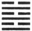 [10:1](#fn_14.md). The Text
says nothing about their origin and formation. There they are. King Wăn
takes them up, one after another, in the order that suits himself,
determined, evidently, by the contrast in the lines of each successive
pair of hexagrams, and gives their significance, as a whole, with some
indication, perhaps, of the action to be taken in the circumstances
which he supposes them to symbolise, and whether that action will be
lucky or unlucky. Then the duke of *K*âu, beginning with the first or
bottom line, expresses, by means of a symbolical or emblematical
illustration, the significance of each line, with a similar indication
of the good or bad fortune of action taken in connexion with it. The
king's interpretation of the whole hexagram will be found to be in
harmony with the combined significance of the six lines as interpreted
by his son.

Both of them, no doubt, were familiar with the practice of divination
which had prevailed in China for more than a thousand years, and would
copy closely its methods and style. They were not divining themselves,
but their words became oracles to subsequent ages, when men divined by
the hexagrams, and sought by means of what was said under them to
ascertain how it would be with them in the

p. 11

future, and learn whether they should persevere in or withdraw from the
courses they were intending to pursue.

2\. I will give an instance of the lessons which the lineal figures are
made to teach, but before I do so, it will be

|                                  |
|----------------------------------|
| The origin of the lineal figures |

necessary to relate what is said of their origin, and of the rules
observed in studying and interpreting them. For information on these
points we must have recourse to the Appendixes; and in reply to the
question by whom and in what way the figures were formed, the third, of
which we made use in the last chapter, supplies us with three different
answers.

\(i\) The 11th paragraph of Section ii says:--

'Anciently, when the rule of all under heaven was in the hands of
Pâo-hsî, looking up, he contemplated the brilliant forms exhibited in
the sky; and looking down, he surveyed the patterns shown on the earth.
He marked the ornamental appearances on birds and beasts, and the
(different) suitabilities of the soil. Near at hand, in his own person,
he found things for consideration, and the same at a distance, in things
in general. On this he devised the eight lineal figures of three lines
each, to exhibit fully the spirit-like and intelligent operations (in
nature), and to classify the qualities of the myriads of things.'

Pâo-hsî is another name for Fû-hsî, the most ancient personage who is
mentioned with any definiteness in Chinese history, while much that is
fabulous is current about him. His place in chronology begins in B.C.
3322, 5203 years ago. He appears in this paragraph as the deviser of the
eight kwâ or trigrams. The processes by which he was led to form them,
and the purposes which he intended them to serve, are described, but in
vague and general terms that do not satisfy our curiosity. The eight
figures, however, were 
,  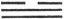,
 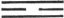,  ,  ,  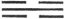,  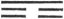, and  ; called *kh*ien, tui, lî,
*k*ăn, sun, khân, kăn, and khwăn; and representing heaven or the sky;
water, especially a collection of water as in a marsh or lake; fire, the
sun, lightning; thunder; wind and wood; water, especially as in rain,
the clouds, springs, streams in defiles, and the moon; a hill or
mountain; and the earth. To each of these figures is assigned a certain
attribute or quality which should be suggested by the

p. 12

natural object it symbolises; but on those attributes we need not enter
at present.

\(ii\) The 70th and 71st paragraphs of Section i give another account of
the origin of the trigrams:--

'In (the system of) the Yî there is the Great Extreme, which produced
the two Î (Elementary Forms). These two Forms produced the four Hsiang
(Emblematic Symbols); which again produced the eight Kwâ (or Trigrams).
The eight Kwâ served to determine the good and evil (issues of events),
and from this determination there ensued the (prosecution of the) great
business of life.'

The two elementary Forms, the four emblematic Symbols, and the eight
Trigrams can all be exhibited with what may be deemed certainty. A whole
line ( 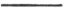) and a divided
( 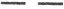) were the two Î. These
two lines placed over themselves, and each of them over the other,
formed the four Hsiang: 
;  ;
 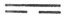;  . The same two lines placed
successively over these Hsiang, formed the eight Kwâ, exhibited above.

Who will undertake to say what is meant by 'the Great Extreme' which
produced the two elementary Forms? Nowhere else does the name occur in
the old Confucian literature. I have no doubt myself that it found its
way into this Appendix in the fifth (?or fourth) century B.C. from a
Tâoist source. *K*û Hsî, in his 'Lessons on the Yî for the Young,' gives
for it the figure of a circle,--thus, 
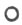; observing that he does so from the philosopher Kâu
(A.D. 1017-1073) [12:1](#fn_15.md), and cautioning
his readers against thinking that such a representation came from Fû-hsî
himself. To me the circular symbol appears very unsuccessful. 'The Great
Extreme,' it is said, 'divided and produced two lines,--a whole line and
a divided line.' But I do not understand how this could be. Suppose it
possible for the circle to unroll itself;--

p. 13

we shall have one long line, 
. If this divide itself, we have two whole lines; and
another division of one of them is necessary to give us the whole and
the divided lines of the lineal figures. The attempt to fashion the
Great Extreme as a circle must be pronounced a failure.

But when we start from the two lines as bases, the formation of all the
diagrams by a repetition of the process indicated above is easy. The
addition to each of the trigrams of each of the two fundamental lines
produces 16 figures of four lines; dealt with in the same way, these
produce 32 figures of five lines; and a similar operation with these
produces the 64 hexagrams, each of which forms the subject of an essay
in the text of the Yî. The lines increase in an arithmetical progression
whose common difference is 1, and the figures in a geometrical
progression whose common ratio is 2. This is all the mystery in the
formation of the lineal figures; this, I believe, was the process by
which they were first formed; and it is hardly necessary to imagine them
to have come from a sage like Fû-hsî. The endowments of an ordinary man
were sufficient for such a work. It was possible even to shorten the
operation by proceeding at once from the trigrams to the hexagrams,
according to what we find in Section i, paragraph 2:--

'A strong and a weak line were manipulated together (till there were the
8 trigrams), and those 8 trigrams were added each to itself and to all
the others (till the 64 hexagrams were formed).'

It is a moot question who first multiplied the figures

|                                         |
|-----------------------------------------|
| Who first multiplied the figures to 64? |

from the trigrams universally ascribed to Fû-hsî to the 64 hexagrams of
the Yî The more common view is that it was king Wăn; but *K*û Hsî, when
he was questioned on the subject, rather inclined to hold that Fû-hsî
had multiplied them himself, but declined to say whether he thought that
their names were as old as the figures themselves, or only dated from
the twelfth century B.C. [13:1](#fn_16.md) I will
not venture to controvert

p. 14

his opinion about the multiplication of the figures, but I must think
that the names, as we have them now, were from king Wăn.

No Chinese writer has tried to explain why the framers stopped with the
64 hexagrams, instead of going on to

|                                             |
|---------------------------------------------|
| Why the figures were not continued after 64 |

128 figures of 7 lines, 256 of 8, 512 of 9, and so on indefinitely. No
reason can be given for it, but the cumbrousness of the result, and the
impossibility of dealing, after the manner of king Wăn, with such a mass
of figures.

\(iii\) The 73rd paragraph of Section i, with but one paragraph between
it and the two others which we have been considering, gives what may be
considered a third account of the origin of the lineal figures:--

'Heaven produced the spirit-like things (the tortoise and the divining
plant), and the sages took advantage of them. (The operations of) heaven
and earth are marked by so many changes and transformations, and the
sages imitated them (by means of the Yî). Heaven hangs out its
(brilliant) figures, from which are seen good fortune and bad, and the
sages made their emblematic interpretations accordingly. The Ho gave
forth the scheme or map, and the Lo gave forth the writing, of (both of)
which the sages took advantage.'

The words with which we have at present to do are 'The Ho (that is, the
Yellow River) gave forth the Map.' This map, according to tradition and
popular belief, contained a scheme which served as a model to Fû-hsî in
making his 8 trigrams. Apart from this passage in the Yî King, we know
that Confucius believed in such a map, or spoke at least as if he
did [14:1](#fn_17.md). In the 'Record of Rites' it
is said that 'the map was borne by a horse [14:2](#fn_18.md);' and the thing, whatever it was, is
mentioned in the Shû as still preserved at court, among other
curiosities, in B.C. 1079 [14:3](#fn_19.md). The
story of it, as now current, is this, that 'a dragon-horse' issued from
the Yellow River, bearing on its back an arrangement of marks, from
which Fû-hsî got the idea of the trigrams.

p. 15

All this is so evidently fabulous that it seems a waste of time to enter
into any details about it. My reason for doing so is a wish to take
advantage of the map in giving such a statement of the rules observed in
interpreting the figures as is necessary in this Introduction.

The map that was preserved, it has been seen, in the eleventh century
B.C., afterwards perished, and though

|                           |
|---------------------------|
| The form of the River Map |

there was much speculation about its form from the time that the
restoration of the ancient classics was undertaken in the Han dynasty,
the first delineation of it given to the public was in the reign of Hui
Žung of the Sung dynasty (A. D. 1101-1125) [15:1](#fn_20.md). The most approved scheme of it is the
following:--

 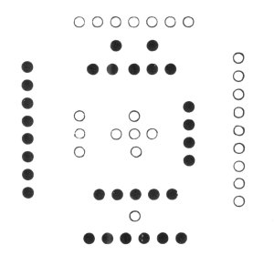

It will be observed that the markings in this scheme are small circles,
pretty nearly equally divided into dark and light. All of them whose
numbers are odd are light circles, 1, 3, 5, 7, 9; and all of them whose
numbers are even are dark,--2, 4, 6, 8, 10. This is given as the origin
of what is said in paragraphs 49 and 50 of Section i about the numbers
of heaven and earth. The difference in the colour of the circles
occasioned the distinction of them and of what they

p. 16

signify into Yin and Yang, the dark and the bright, the moon-like and
the sun-like; for the sun is called the Great Brightness (Thâi Yang),
and the moon the Great Obscurity (Thâi Yin). I shall have more to say in
the next chapter on the application of these names. Fû-hsî in making the
trigrams, and king Wăn, if it was he who first multiplied them to the 64
hexagrams, found it convenient to use lines instead of the circles:--the
whole line ( ) for the
bright circle ( ), and
the divided line ( ) for
the dark ( 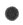). The
first, the third, and the fifth lines in a hexagram, if they are
'correct' as it is called, should all be whole, and the second, fourth,
and sixth lines should all be divided. Yang lines are strong (or hard),
and Yin lines are weak (or soft). The former indicate vigour and
authority; the latter, feebleness and submission. It is the part of the
former to command; of the latter to obey.

The lines, moreover, in the two trigrams that make up the hexagrams, and
characterise the subjects which they represent, are related to one
another by their position, and have their significance modified
accordingly. The first line and the fourth, the second and the fifth,.
the third and the sixth are all correlates; and to make the correlation
perfect the two members of it should be lines of different qualities,
one whole and the other divided. And, finally, the middle lines of the
trigrams, the second and fifth, that is, of the hexagrams, have a
peculiar value and force. If we have a whole line ( ) in the fifth place, and a
divided line ( ) in the
second, or vice versâ, the correlation is complete. Let the subject of
the fifth be the sovereign or a commander-in-chief, according to the
name and meaning of the hexagram, then the subject of the second will be
an able minister or a skilful officer, and the result of their mutual
action will be most beneficial and successful. It is specially important
to have a clear idea of the name of the hexagram, and of the subject or
state which it is intended to denote. The significance of all the lines
comes thus to be of various application, and will differ in different
hexagrams.

p. 17

I have thus endeavoured to indicate how the lineal figures were formed,
and the principal rules laid down for the interpretation of them. The
details are wearying, but my position is like that of one who is called
on to explain an important monument of architecture, very bizarre in its
conception and execution. A plainer, simpler structure might have
answered the purpose better, but the architect had his reasons for the
plan and style which he adopted. If the result of his labours be worth
expounding, we must not grudge the study necessary to detect his
processes of thought, nor the effort and time required to bring the
minds of others into sympathy with his.

My own opinion, as I have intimated, is, that the second, account of the
origin of the trigrams and hexagrams is the true one. However the idea
of the whole and divided lines arose in the mind of the first framer, we
must start from them; and then, manipulating them in the manner
described, we arrive, very easily, at all the lineal figures, and might
proceed to multiply them to billions. We cannot tell who devised the
third account of their formation from the map or scheme on the
dragon-horse of the, Yellow River [17:1](#fn_21.md). Its object, no doubt, was to impart a
supernatural character to the trigrams and produce a religious
veneration for them. It may be doubted whether the scheme as it is now
fashioned be the correct one,--such as it was in the *K*âu dynasty. The
paragraph where it is mentioned, goes on to say--'The Lo produced the
writing.' This writing was a scheme of the same character as the Ho map,
but on the back of a tortoise, which emerged from the river Lo, and
showed it to the Great Yü, when he was engaged in his celebrated work of
draining off the waters of the flood, as related in the Shû. To the hero
sage it suggested 'the Great Plan,' an interesting but mystical document
of the same classic, 'a Treatise,' according to Gaubil, 'of Physics,
Astrology, Divination, Morals, Politics, and Religion,' the great model
for the government of the

p. 18

kingdom. The accepted representation of this writing is the following:--

 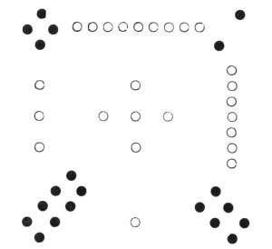

But substituting numbers for the number of marks, we have

|     |     |     |
|-----|-----|-----|
| 4   | 9   | 2   |
| 3   | 5   | 7   |
| 8   | 1   | 6   |

 

This is nothing but the arithmetical puzzle, in which the numbers from 1
to 9 are arranged so as to make 15 in whatever way we add them [18:1](#fn_22.md). If we had the original form of 'the
River Map,' we should probably find it a numerical trifle, not more
difficult, not more supernatural, than this magic square.

3\. Let us return to the Yî of *K*âu, which, as I have said above on [p.
10](#page_10.md), contains, under each of the 64 hexagrams, a brief essay
of a moral, social, or political character, symbolically expressed.

p. 19

To understand it, it will be necessary to keep in mind the circumstances
in which king Wăn addressed himself to the study of the lineal figures.
The kingdom, under

|                                          |
|------------------------------------------|
| State of the country in time of king Wăn |

the sovereigns of the Yin or Shang dynasty, was utterly disorganised and
demoralised. A brother of the reigning king thus described its
condition:--

'The house of Yin can no longer exercise rule over the land. The great
deeds of our founder were displayed in a former age, but through mad
addiction to drink we have destroyed the effects of his virtue. The
people, small and great, are given to highway robberies, villainies, and
treachery. The nobles and officers imitate one another in violating the
laws. There is no certainty that criminals will be apprehended. The
lesser people rise up and commit violent outrages on one another. The
dynasty of Yin is sinking in ruin; its condition is like that of one
crossing a large stream, who can find neither ford nor bank [19:1](#fn_23.md).'

This miserable state of the nation was due very much to

|                              |
|------------------------------|
| The character of the monarch |

the character and tyranny of the monarch. When the son of Wăn took the
field against him, he thus denounced him in 'a Solemn Declaration'
addressed to all the states:--

'Shâu, the king of Shang, treats all virtue with contemptuous slight,
and abandons himself to wild idleness and irreverence. He has cut
himself off from Heaven, and brought enmity between himself and the
people. He cut through the leg-bones of those who were wading in a
(winter-)morning he cut out the heart of the good man [19:2](#fn_24.md). His power has been shown in killing
and murdering. His honours and confidence are given to the villainous
and bad. He has driven from him his instructors and guardians. He has
thrown to the winds the statutes and penal laws. He neglects the
sacrifices to Heaven and Earth. He has discontinued the offerings

 

p. 20

in the ancestral temple. He makes (cruel) contrivances of wonderful
device and extraordinary ingenuity to please his wife [20:1](#fn_25.md)--.God will no longer bear with him, but
with a curse is sending down his ruin [20:2](#fn_26.md).'

Such was the condition of the nation, such the character of the
sovereign. Meanwhile in the west of the kingdom,

|                                             |
|---------------------------------------------|
| The lords of *K*âu; and especially king Wăn |

in a part of what is now the province of Shen-hsî, lay the principality
of *K*âu, the lords of which had long been distinguished for their
ability, and virtue. Its present chief, now known to us as king Wăn, was
*Kh*ang, who had succeeded to his father in B. C. 1185. He was not only
lord of Kâu, but had come to be a sort of viceroy over a great part of
the kingdom. Equally distinguished in peace and war, a model of all that
was good and attractive, he conducted himself with remarkable wisdom and
self-restraint. Princes and people would have rejoiced to follow him to
attack the tyrant, but he shrank from exposing himself to the charge of
being disloyal. At last the jealous suspicion of Shâu was aroused. Wăn,
as has been already stated, was thrown into prison in B. C. 1143, and
the order for his death might arrive at any moment. Then it was that he
occupied himself with the lineal figures.

The use of those figures--of the trigrams at least--had long been
practised for the purposes of divination. The employment of the divining
stalks is indicated in 'the Counsels of the Great Yü,' one of the
earliest Books of the Shû [20:3](#fn_27.md), and a
whole section in 'the Great Plan,' also a Book of the Shû, and referred
to the times of the Hsiâ dynasty, describes how 'doubts were to be
examined' by means of the tortoise-shell and the stalks [20:4](#fn_28.md). Wăn could not but be familiar with
divination as an institution of his

p. 21

country [21:1](#fn_29.md). Possibly it occurred to
him that nothing was

|                                                      |
|------------------------------------------------------|
| King Wăn in prison, occupied with the lineal figures |

more likely to lull the suspicions of his dangerous enemy than the study
of the figures; and if his keepers took notice of what he was doing,
they would smile at his lines, and the sentences which he appended to
them.

I like to think of the lord of *K*âu, when incarcerated in Yû-lî, with
the 64 figures arranged before him. Each hexagram assumed a mystic
meaning, and glowed with a deep significance. He made it tell him of the
qualities of various objects of nature, or of the principles of human
society, or of the condition, actual and possible, of the kingdom. He
named the figures, each by a term descriptive of the idea with which he
had connected it in his mind, and then he proceeded to set that idea
forth, now with a note of exhortation, now with a note of warning. It
was an attempt to restrict the follies of divination within the bounds
of reason. The last but one of the Appendixes bears the name of
'Sequence of the Diagrams.' I shall have to speak of it more at length
in the next chapter. I only remark at present that it deals, feebly
indeed, with the names of the hexagrams in harmony with what I have said
about them, and tries to account for the order in which they follow one
another. It does all this, not critically as if it needed to be
established, but in the way of expository statement, relating that about
which there was no doubt in the mind of the author.

But all the work of prince *Kh*ang or king Wăn in the Yî thus amounts to
no more than 64 short paragraphs.

|                                               |
|-----------------------------------------------|
| Work of the duke of Kâu on the separate lines |

We do not know what led his son Tan to enter into his work and complete
it as he did. Tan was a patriot, a hero, a legislator, and a
philosopher. Perhaps he took the lineal figures in hand as a tribute of
filial duty. What had been done for the whole hexagram he would do for
each line, and make it clear that all the six lines 'bent one way their
precious influence,' and blended their rays in the globe of light which
his father had made each figure give forth.

p. 22

\[paragraph continues\] But his method strikes us as singular. Each line
seemed to become living, and suggested some phenomenon in nature or some
case of human experience, from which the wisdom or folly, the luckiness
or unluckiness, indicated by it could be inferred. It cannot be said
that the duke carried out his plan in a way likely to interest any one
but a hsien shăng who is a votary of divination, and admires the style
of its oracles. According to our notions, a framer of emblems should be
a good deal of a poet, but those of the Yî only make us think of a
dryasdust. Out of more than 350, the greater number are only grotesque.
We do not recover from the feeling of disappointment till we remember
that both father and son had to write 'according to the trick,' after
the manner of diviners, as if this lineal augury had been their
profession.

4\. At length I come to illustrate what I have said on the
subject-matter of the Yî by an example. It shall be the treatment of the
seventh hexagram

|                      |
|----------------------|
| The seventh hexagram |

  which king Wăn
named Sze, meaning Hosts. The character is also explained as meaning
'multitudes;' and in fact, in a feudal kingdom, the multitudes of the
people were all liable to become its army, when occasion required, and
the 'host' and the 'population' might be interchangeable terms. As
Froude expresses it in the introductory chapter to his History of
England, 'Every man was regimented somewhere.'

The hexagram Sze is composed of the two trigrams Khan ( ) and Khwăn ( ), exhibiting waters
collected on the earth; and in other symbolisms besides that of the Yî,
waters indicate assembled multitudes of men. The waters on which the
mystical Babylon sits in the Apocalypse are explained as 'peoples and
multitudes and nations and tongues.' I do not positively affirm that it
was by this interpretation of the trigrams that king Wăn saw in   the feudal hosts of
his country collected, for neither from him nor his son do we learn, by
their direct affirmation, that they had any acquaintance with, the
trigrams of Fû-hsî. The name which he gave

p. 23

the figure shows, however, that he saw in it the feudal hosts in the
field. How shall their expedition be conducted that it may come to a
successful issue?

Looking again at the figure, we see that it is made up of five divided
lines, and of one undivided. The undivided line occupies the central
place in the lower trigram,--the most important place, next to the
fifth, in the whole hexagram. It will represent, in the language of the
commentators, 'the lord of the whole figure;' and the parties
represented by the other lines may be expected to be of one mind with
him or obedient to him. He must be the leader of the hosts. If he were
on high, in the fifth place, he would be the sovereign of the kingdom.
This is what king Wăn says:--

'Sze indicates how (in the case which it supposes), with firmness and
correctness, and (a leader of) age and experience, there will be good
fortune and no error.'

This is a good auspice. Let us see how the duke of *K*âu expands it.

He says:--

'The first line, divided, shows the host going forth according to the
rules (for such a movement). If those (rules) be not good, there will be
evil.'

We are not told what the rules for a military expedition were. Some
commentators understand them of the reasons justifying the
movement,--that it should be to repress and punish disorder and
rebellion. Others, with more likelihood, take them to be the discipline
or rules laid down to be observed by the troops. The line is divided, a
weak line in a strong place, 'not correct:' this justifies the caution
given in the duke's second sentence.

The Text goes on:--

'The second line, undivided, shows (the leader) in the midst of the
hosts. There will be good fortune and no error. The king has thrice
conveyed to him his charge.'

This does not need any amplification. The duke saw in the strong line
the symbol of the leader, who enjoyed

p. 24

the full confidence of his sovereign, and whose authority admitted of no
opposition.

On the third line it is said:--

'The third line, divided, shows how the hosts may possibly have many
commanders:--(in such a case) there will be evil.'

The third place is odd, and should be occupied by a strong line, instead
of which we have a weak line in it. But it is at the top of the lower
trigram, and its subject should be in office or activity. There is
suggested the idea that its subject has vaulted over the second line,
and wishes to share in the command and honour of him who has been
appointed sole commander-in-chief. The lesson in the previous line is
made of none effect. We have a divided authority in the expedition. The
result can only be evil.

On the fourth line the duke wrote:--

'The fourth line, divided, shows the hosts in retreat: there is no
error.'

The line is also weak, and victory cannot be expected but in the fourth
place a weak line is in its correct position, and its subject will do
what is right in his circumstances. He will retreat, and a retreat is
for him the part of wisdom. When safely affected, where advance would be
disastrous, a retreat is as glorious as victory.

Under the fifth line we read:--

'The fifth line, divided, shows birds in the fields which it is
advantageous to seize (and destroy). There will be no error. If the
oldest son lead the host, and younger men be (also) in command, however
firm and correct he may be, there will be evil.'

We have an intimation in this passage that only defensive war, or war
waged by the rightful authority to put down rebellion and lawlessness,
is right. The 'birds in the fields' are emblematic of plunderers and
invaders, whom it will be well to destroy. The fifth line symbolises the
chief authority, but here he is weak or humble, and has given all power
and authority to execute judgment into the hands of the
commander-in-chief, who is the oldest son; and in the subject of line 3
we have an example of the younger men who would cause evil if allowed to
share his power.

p. 25

Finally, on the sixth line the duke wrote:--

'The topmost line, divided, shows the great ruler delivering his charges
(to the men who have distinguished themselves), appointing some to be
rulers of states, and others to be chiefs of clans. But small men should
not be employed (in such positions).'

The action of the hexagram has been gone through. The expedition has
been conducted to a successful end. The enemy has been subdued. His
territories are at the disposal of the conqueror. The commander-in-chief
has done his part well. His sovereign, 'the great ruler,' comes upon the
scene, and rewards the officers who have been conspicuous by their
bravery and skill, conferring on them rank and lands. But he is warned
to have respect in doing so to their moral character. Small men, of
ordinary or less than ordinary character, may be rewarded with riches
and certain honours; but land and the welfare of its population should
not be given into the hands of any who are not equal to the
responsibility of such a trust.

The above is a specimen of what I have called the essays that make up
the Yî of *K*âu. So would king Wăn and his son have had all military
expeditions conducted in their country 3000 years ago. It seems to me
that the principles which they lay down might find a suitable
application in the modern warfare of our civilised and Christian Europe.
The inculcation of such lessons cannot have been without good effect in
China during the long course of its history.

Sze is a fair specimen of its class. From the other 63 hexagrams lessons
are deduced, for the most part equally good and striking. But why, it
may be asked, why should they be conveyed to us by such an array of
lineal figures, and in such a farrago of emblematic representations? It
is not for the foreigner to insist on such a question. The Chinese have
not valued them the less because of the antiquated dress in which their
lessons are arrayed. Hundreds of their commentators have evolved and
developed their meaning with a minuteness of detail and felicity of
illustration that leave nothing to be desired. It is for foreign
students of Chinese to gird up their loins for the

p. 26

mastery of the book instead of talking about it as mysterious and all
but inexplicable.

Granting, however, that the subject-matter of the Yî is what has been
described, very valuable for its practical wisdom, but not drawn up from
an abysmal deep of philosophical speculation, it may still be urged,
'But in all this we find nothing to justify the name of the book as Yî
King, the "Classic of Changes." Is there not something more, higher or
deeper, in the Appendixes that have been ascribed to Confucius, whose
authority is certainly not inferior to that of king Wăn, or the duke of
*K*âu?' To reply fully to this question will require another chapter.

------------------------------------------------------------------------

### Footnotes

[10:10:1](icintr02.htm#fr_14.md) See Plate I at the
end of the Introduction.

[12:12:1](icintr02.htm#fr_15.md) *K*âu-žze, called
*K*âu Tun-î and *K*âu Mâu-shuh, and, still more commonly, from the
rivulet near which was his favourite residence, *K*âu Lien-*kh*î. Mayers
(Chinese Reader's Manual, p. 23) says:--'He held various offices of
state, and was for many years at the head of a galaxy of scholars who
sought for instruction in matters of philosophy and research:--second
only to *K*û Hsî in literary repute.'

[13:13:1](icintr02.htm#fr_16.md) *K*û-žze *Kh*wan
shû, or Digest of Works of *K*û-žze, chap. 26 (the first chapter on the
Yî), art. 16.

[14:14:1](icintr02.htm#fr_17.md) Analects IX, viii.

[14:14:2](icintr02.htm#fr_18.md) Lî *K*î VIII, iv,
16.

[14:14:3](icintr02.htm#fr_19.md) Shû V, xxii, 19.

[15:15:1](icintr02.htm#fr_20.md) See Mayers'
Chinese Reader's Manual, pp. 56, 57.

[17:17:1](icintr02.htm#fr_21.md) Certainly it was
not Confucius. See on the authorship of the Appendixes, and especially
of Appendix III, in the next chapter.

[18:18:1](icintr02.htm#fr_22.md) For this
dissection, which may also be called reductio ad absurdum, of the Lo
writing, I was indebted first to P. Regis. See his Y-King I, p. 60. But
*K*û Hsî also has got it in the Appendix to his 'Lessons on the Yî for
the Young.'

[19:19:1](icintr02.htm#fr_23.md) The Shû IV, xi, 1,
2.

[19:19:2](icintr02.htm#fr_24.md) These were
well-known instances of Shâu's wanton cruelty. Observing some people one
winter's day wading through a stream, he ordered their legs to be cut
through at the shank-bone, that he might see the marrow which could so
endure the cold. 'The good man' was a relative of his own, called
Pî-kan. Having enraged Shâu by the sternness of his rebukes, the tyrant
ordered his heart to be cut out, that he might see the structure of a
sage's heart.

[20:20:1](icintr02.htm#fr_25.md) We do not know
what these contrivances were. But to please his wife, the infamous
Tâ-*k*î, Shâu had made 'the Heater' and, 'the Roaster,' two instruments
of torture. The latter was a copper pillar laid above a pit of burning
charcoal, and made slippery; culprits were forced to walk along it.

[20:20:2](icintr02.htm#fr_26.md) The Shû V, i,
Sect. iii, 2, 3.

[20:20:3](icintr02.htm#fr_27.md) Shû II, ii, 18.

[20:20:4](icintr02.htm#fr_28.md) Shû V, iv, 20-31.

[21:21:1](icintr02.htm#fr_29.md) In the Book of
Poetry we have Wăn's grandfather (Than-fû, III, i, ode 3, 3) divining,
and his son (king Wû, III, i, ode 10. 7) doing the same.

------------------------------------------------------------------------

[Next: Chapter III: The Appendixes](icintr03.md)
