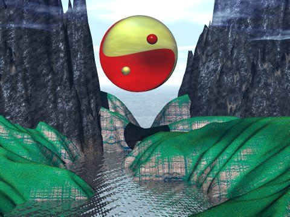

  
[Confucianism](../cfu/index)  [Taoism](../tao/index)  [Prophecy and
Divination](../pro/index)  

------------------------------------------------------------------------

|                                                                                                          |                                          |
|----------------------------------------------------------------------------------------------------------|------------------------------------------|
|  | I Ching |

------------------------------------------------------------------------

### The I Ching

##### James Legge, tr. Sacred Books of the East, vol. 16 \[1899\]

------------------------------------------------------------------------

[Contents](#contents)    [Start Reading](ictp)

------------------------------------------------------------------------

The I Ching, or Book of Changes, is the most widely read of the five
[Chinese Classics](../cfu/index.htm#fivecla). The book was traditionally
written by the legendary Chinese Emperor Fu Hsi (2953-2838 B.C.). It is
possible that the the I Ching originated from a prehistoric divination
technique which dates back as far as 5000 B.C. Thus it may be the oldest
text at this site. Futher commentaries were added by King Wen and the
Duke of Chou in the eleventh century B.C.

An I Ching interpretation is performed by making six binary decisions (a
hexagram). This is called 'casting the I Ching'. These are written down
as a stack of six solid or broken lines. This was traditionally done
either by tossing yarrow stalks or coins, although there is no reason
why the hexagrams can't be generated by some other means (such as a
computer program).

There are actually *four* possible values for each of the lines; the two
on/off values, and a line which changes from on to off or vice versa.
Thus one cast of the I Ching can generate two different hexagrams, which
adds depth to the interpretation. The sophistication of this method has
not escaped modern interpretation, and the four-valued logic has been
compared to the biochemistry of [DNA amino acids](../dna/index). How a
Neolithic shamans' divination technique presaged the basic logic of the
human genome is one of the ageless mysteries.

*Production Notes*: This is a complete overhaul of the Legge I Ching
etext, with all of the original illustrations. This utilizes [Unicode
characters](../unicode) throughout to represent the 'short A' and the
'Yodh' found in the original book. Because not all browsers support the
official Unicode 'Yodh' (Ȝ and ȝ), we have used Ž and ž to represent it.
In addition, we have used images to present the dozen or so Chinese
characters in this text.

------------------------------------------------------------------------

[Title Page](ictp)  
[Contents](ictoc)  
[Preface](icpref)  

### Introduction

[Chapter I: The Yî King from The Twelfth Century B.C. to the
Commencement of the Christian Era](icintr01)  
[Chapter II: The Subject-Matter of the Text. The Lineal Figures and the
Explanation of Them](icintr02)  
[Chapter III: The Appendixes](icintr03)  

### Plates

[Plate I](pl1)  
[Plate II, Figure 1](pl2-1)  
[Plate II, Figure 2](pl2-2)  
[Plate III, Figure 1](pl3-1)  
[Plate III, Figure 2](pl3-2)  

### The Yî King Text: Section I

[I. The Khien Hexagram](ic01)  
[II. The Khwăn Hexagram](ic02)  
[III. The *K*un Hexagram](ic03)  
[IV. The Măng Hexagram](ic04)  
[V. The Hsü Hexagram](ic05)  
[VI. The Sung Hexagram](ic06)  
[VII. The Sze Hexagram](ic07)  
[VIII. The Pî Hexagram](ic08)  
[IX. The Hsiâo *Kh*û Hexagram](ic09)  
[X. The Lî Hexagram](ic10)  
[XI. The Thâi Hexagram](ic11)  
[XII. The Phî Hexagram](ic12)  
[XIII. The Thung *Z*ăn](ic13)  
[XIV. The Tâ Yû Hexagram](ic14)  
[XV. The *Kh*ien Hexagram](ic15)  
[XVI. The Yü Hexagram](ic16)  
[XVII. The Sui Hexagram](ic17)  
[XVIII. The Kû Hexagram](ic18)  
[XIX. The Lin Hexagram](ic19)  
[XX. The Kwân Hexagram](ic20)  
[XXI. The Shih Ho Hexagram](ic21)  
[XXII. The Pî Hexagram](ic22)  
[XXIII. The Po Hexagram](ic23)  
[XXIV. The Fû Hexagram](ic24)  
[XXV: The Wû Wang Hexagram](ic25)  
[XXVI. The Tâ Khû Hexagram](ic26)  
[XXVII. The Î Hexagram](ic27)  
[XXVIII. The Tâ Kwo Hexagram](ic28)  
[XXIX. The Khan Hexagram](ic29)  
[XXX. The Lî Hexagram](ic30)  

### Text Section II

[XXXI. The Hsien Hexagram](ic31)  
[XXXII. The Hăng Hexagram](ic32)  
[XXXIII. The Thun Hexagram](ic33)  
[XXXIV. The Tâ *K*wang Hexagram](ic34)  
[XXXV. The Žin Hexagram](ic35)  
[XXXVI. The Ming Î Hexagram](ic36)  
[XXXVII. The *K*iâ *Z*ăn Hexagram](ic37)  
[XXXVIII. The *Kh*wei Hexagram](ic38)  
[XXXIX. The *K*ien Hexagram](ic39)  
[XL. The *K*ieh Hexagram](ic40)  
[XLI. The Sun Hexagram](ic41)  
[XLII. The Yî Hexagram](ic42)  
[XLIII. The Kwâi Hexagram](ic43)  
[XLIV. The Kâu Hexagram](ic44)  
[XLV. The Žhui Hexagram](ic45)  
[XLVI. The Shăng Hexagram](ic46)  
[XLVII. The Khwăn Hexagram](ic47)  
[XLVIII. The Žing Hexagram](ic48)  
[XLIX. The Ko Hexagram](ic49)  
[L. The Ting Hexagram](ic50)  
[LI. The *K*ăn Hexagram](ic51)  
[LII. The Kăn Hexagram](ic52)  
[LIII. The *K*ien Hexagram](ic53)  
[LIV. The Kwei Mei Hexagram](ic54)  
[LV. The Făng Hexagram](ic55)  
[LVI. The Lü Hexagram](ic56)  
[LVII. The Sun Hexagram](ic57)  
[LVIII. The Tui Hexagram](ic58)  
[LIX. The Hwân Hexagram](ic59)  
[LX. The *K*ieh Hexagram](ic60)  
[LXI. The *K*ung Fû Hexagram](ic61)  
[LXII. The Hsiâo Kwo Hexagram](ic62)  
[LXIII. The *K*î Žî Hexagram](ic63)  
[LXIV. The Wei Žî Hexagram](ic64)  

### The Appendixes

### Appendix I

[Section I](icap1-1)  
[Section II](icap1-2)  

### Appendix II

[Section I](icap2-1)  
[Section II](icap2-2)  

### Appendix III: The Great Appendix

[Section I](icap3-1)  
[Section II](icap3-2)  

### Appendix IV

### Section I

[Section I: *Kh*ien](icap4-1)  
[Section II: Khwăn](icap4-2)  

### Appendix V

[Appendix V: Treatise of Remarks on the Trigrams](icap5)  

### Appendix VI

[Appendix VI: The Orderly Sequence of the Hexagrams](icap6)  

### Appendix VII

[Appendix VII](icap7)  
