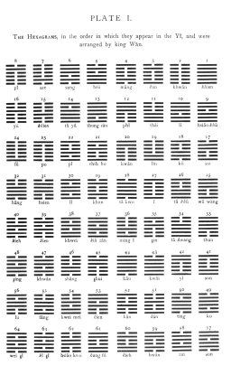

  
[Intangible Textual Heritage](../index)  [Index](index) 
[Previous](icintr03)  [Next](pl2-1) 

------------------------------------------------------------------------

 

# PLATE I.

The HEXAGRAMS, in the order in which they appear in the Yî, and were
arranged by Kin Wăn.

[  
Click to enlarge](img/pl1.jpg)

 

------------------------------------------------------------------------

[Next: Plate II, Figure 1](pl2-1)
