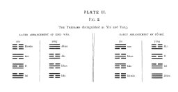

  
[Intangible Textual Heritage](../index)  [Index](index) 
[Previous](pl2-1)  [Next](pl3-1) 

------------------------------------------------------------------------

 

# PLATE II.

Fig 2.

The Trigrams distinguished as Yin and Yang.

[  
Click to enlarge](img/pl2-2.jpg)

 

------------------------------------------------------------------------

[Next: Plate III, Figure 1](pl3-1)
