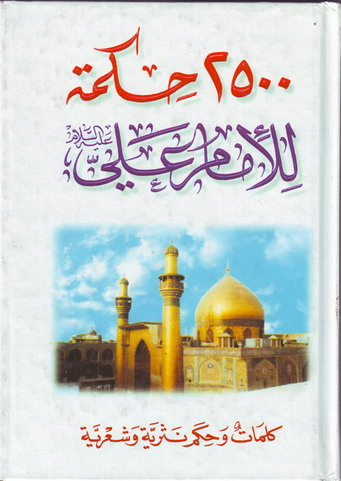
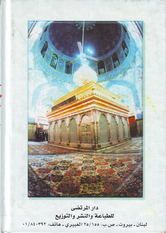

  
[Intangible Textual Heritage](../../index)  [Islam](../index) 
[Shiite](../shi)  [Index](index)  [Previous](adg00)  [Next](adg02) 

------------------------------------------------------------------------

<table data-border="1" width="">
<colgroup>
<col style="width: 50%" />
<col style="width: 50%" />
</colgroup>
<tbody>
<tr class="odd">
<td width="50%">
Front
</td>
<td width="50%">
Back
</td>
</tr>
<tr class="even">
<td width="50%">

2500 Adages 
for imam Ali (puh) 
[Picture of the shrine of imam Ali (puh) in Najaf, Iraq] 
Words and Adages, by prose and poetic
</td>
<td width="50%">

[Picture of the shrine from inside where the tomb of imam Ali (puh) lies] 
Al-Mortadha press 
for printing and publishing 
Lebanon - Beirut - P.O.Box 25/155 Al-Ghobayri - Phone:01/840392
</td>
</tr>
</tbody>
</table>

------------------------------------------------------------------------

[Next: Written For](adg02)
