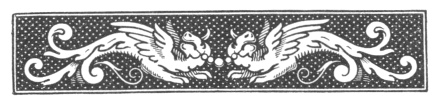

  
[Intangible Textual Heritage](../../index)  [Islam](../index) 
[Index](index)  [Previous](arp011)  [Next](arp013) 

------------------------------------------------------------------------

[Buy this Book at
Amazon.com](https://www.amazon.com/exec/obidos/ASIN/B002BNKRJ8/internetsacredte)

------------------------------------------------------------------------

  
*Arabian Poetry*, by W. A. Clouston, \[1881\], at Intangible Textual
Heritage

------------------------------------------------------------------------

p. 15

 

###### THE

##### POEM

###### OF

# TARAFA.

### THE ARGUMENT.

THIS Poem was occasioned by a little incident highly characteristic of
pastoral manners. Tarafa and his brother Mabed jointly possessed a herd
of camels, and had agreed to watch them alternately, each on his
particular clay, lest, as they were grazing, they should be driven off
by a tribe with whom their own clan was at war. But our poet was so
immersed in meditation, and so wedded to his muse, that he often
neglected his charge, and was sharply reproved by his brother, who asked
him, sarcastically, whether, if he lost the camels, they could be
restored by his poetry. "You shall be convinced of it," answered Tarafa;
and persisted so long in his negligence that the whole herd was actually
seized by the Modarites.

This was more than he really expected; and he applied to all his friends
for assistance in recovering the camels; among others, he solicited the
help of his cousin Malec, who, instead of granting

p. 16

it, took the opportunity of rebuking him with acrimony for his
remissness in that instance, and for his general prodigality,
libertinism, and spirit of contention; telling him that he was a
disgrace to his family, and had raised innumerable enemies.

The defence of a poet was likely to be best made in poetical language;
and Tarafa produced the following composition in vindication of his
character and conduct, which he boldly justifies in every respect, and
even claims praise for the very course of life which had exposed him to
censure.

He glories in his passion for women, and begins, as usual, with
lamenting the departure of his beloved Khaula (or, the "tender fawn"),
whose beauty he describes in a very lively strain. It were to be wished
that he had said more of his mistress, and less of his camel, of which
he interweaves a very long, and no very pleasing, description.

The rest of the poem contains an *èloge* on his own fortitude,
sprightliness, liberality, and valour, mixed with keen expostulations on
the unkindness and ingratitude of Malec, and with all the common topics
in favour of voluptuousness: he even triumphs on having slain and
dressed one of his father's camels, and blames the old man for his
churlishness and avarice.

It is a tradition preserved by Abu Obeida, that one of the chiefs, whom
the poet compliments in the eighty-first couplet, made him a present of
a hundred camels, and enabled him, as he had promised, to convince his
brother that poetry could repair his loss.

\_\_\_\_\_\_\_\_\_\_\_\_\_\_\_\_\_\_\_

The metre is the same with that used by Amriolkais.

------------------------------------------------------------------------

[Next: The Poem of Tarafa](arp013)
