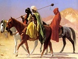

  
[Intangible Textual Heritage](../../index)  [Islam](../index) 
[Index](index)  [Previous](arp017)  [Next](arp019) 

------------------------------------------------------------------------

[Buy this Book at
Amazon.com](https://www.amazon.com/exec/obidos/ASIN/B002BNKRJ8/internetsacredte)

------------------------------------------------------------------------

  
*Arabian Poetry*, by W. A. Clouston, \[1881\], at Intangible Textual
Heritage

------------------------------------------------------------------------

p. 52

 

###### THE

##### POEM

###### OF

# ANTARA.

### THE ARGUMENT.

THIS Poem appears to have been a little older than that of Zohair; for
it must have been composed *during* the wars of Dahis, which the
magnanimity of the two chiefs, extolled by Zohair, "so nobly
terminated." Antara, the gallant Absite, distinguished himself very
early in the war by his valour in attacking the tribe of Dhobyan, and
boasts in this composition that he had slain Demdem, the father of
Hosein and of Harem, whom Ward, the son of Habes, afterwards put to
death. An old enmity subsisted, it seems, between our poet and those two
young men, who, as Antara believed, had calumniated him without
provocation; and his chief object in this poem was to blazon his own
achievements and exploits, and to denounce implacable resentment against
the calumniators, whom his menaces were likely to intimidate. Yet so
harsh an argument is tempered by a strain in some parts elegiac and
amatory: for even this vengeful impetuous warrior found himself obliged
to comply with the custom of the Arabian poets, "who had left," as he
complains, "little new imagery for their successors."

p. 53

He begins with a pathetic address to the bower of his beloved Abla, and
to the ruins of her deserted mansion: he bewails her sudden departure,
the distance of her new abode, and the unhappy variance between their
respective clans: he describes his passion and the beauties of his
mistress with great energy: thence he passes to his own laborious course
of life, contrasted with the voluptuous indolence of the fair, and gives
a forcible description of his camel, whom he compares to a male ostrich
hastening to visit the eggs, which the female (whose usual neglect of
them is mentioned by naturalists) had left in a remote valley. He next
expatiates on his various accomplishments and virtues: his mildness to
those who treat him kindly, his fierceness to those who injure him; his
disregard of wealth, his gaiety, liberality, and, above all, his
military prowess and spirit of enterprise, on which he triumphantly
enlarges through the rest of the poem, except four couplets, in which he
alludes obscurely to a certain love-adventure; and after many animated
descriptions of battles and single combats, he concludes with a wish
that he may live to slay the two sons of Demdem, and with a bitter
exultation on the death of their father, whom he had left a prey to the
wild beasts and the vultures.

\_\_\_\_\_\_\_\_\_\_\_

The metre is iambic, like that of the poem immediately preceding.

------------------------------------------------------------------------

[Next: The Poem of Antara](arp019)
