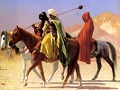

  
[Intangible Textual Heritage](../../index)  [Islam](../index) 
[Index](index)  [Previous](arp127)  [Next](arp129) 

------------------------------------------------------------------------

[Buy this Book at
Amazon.com](https://www.amazon.com/exec/obidos/ASIN/B002BNKRJ8/internetsacredte)

------------------------------------------------------------------------

  
*Arabian Poetry*, by W. A. Clouston, \[1881\], at Intangible Textual
Heritage

------------------------------------------------------------------------

### PRINCE HARITH IN LOVE.

Prince Harith, one of Zoheir's sons, while hunting, one day chanced to
stray into a valley, at some distance from the land of Shurebah. There
he saw a party of women of the tribe of Zohran, and conspicuous among
them was the chief's beautiful daughter, Labna. They fell in love with
each other at first sight. Shiboob contrived to carry off the damsel to
her lover; but her father, breathing vengeance, pursued them, with his
warriors. Harith was taken prisoner, but was soon afterwards released by
Shiboob, who, however, in his turn, was captured. At this juncture,
Antar, returning from Hirah, reached the place, and rescued his brother;
and Labna and Harith were restored to each other. The hero then
continued his journey home; and as his passion for Abla burst upon him,
thus he recited:

Oh! is it the fragrance of musk, or is it
*itr?*

Is it a voice, or the breeze, warbling over the desert, that sings of
her?

Is it a flash of lightning? or is it her teeth in the wastes, resembling
the full moon when it rises?

Is it the branch of the tamarisk, that sweetly waves in the wilds?

Is it the stem of the spear, or her form?

Is it the narcissus of the gardens, endued with visual powers, or her
cheek, like the untouched apple?

I rave through love of her; but let my railers see the torrents of my
tears, to which there is no end!

p. 281

O Abla! my heart for love of thee suffers tortures: this frequent
separation and these echoes fill me with grief.

O Abla! fear not thy enemies; for against the destiny of God there is no
opposition.

------------------------------------------------------------------------

[Next: King Zoheir and His Brother, Asyed](arp129)
