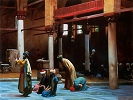

  
[Intangible Textual Heritage](../../index)  [Islam](../index) 
[Index](index)  [Previous](ath15) 

------------------------------------------------------------------------

[Buy this Book at
Amazon.com](https://www.amazon.com/exec/obidos/ASIN/0486427625/internetsacredte)

------------------------------------------------------------------------

  
*Arabic Thought and its Place in History*, by De Lacy O'Leary, \[1922\],
at Intangible Textual Heritage

------------------------------------------------------------------------

p. 321

### INDEX

‘Abbasids, [89](ath05.htm#page_89) sqq.

Abu Hanifa, [73](ath04.htm#page_73)

Abu Hashim, [97](ath05.htm#page_97), [98](ath05.htm#page_98),
[131](ath07.htm#page_131)

Abu l-‘Abbas, [101](ath05.htm#page_101)

Abu l-Faraj, [52](ath03.htm#page_52)

Abu Yazid, [194](ath09.htm#page_194)

Albertus Magnus, [235](ath11.htm#page_235)

Alexander of Aphrodisias, [4](ath03.htm#page_4) sqq.,
[18](ath03.htm#page_18)

Alexandrian period, [10](ath03.htm#page_10)

‘Ali, [67](ath04.htm#page_67), [92](ath05.htm#page_92)

‘Alids, [93](ath05.htm#page_93)

al-Allaf, [124](ath07.htm#page_124)

Arian controversy, [27](ath03.htm#page_27) sq.

Aristotle, [5](ath03.htm#page_5), [6](ath03.htm#page_6) sq.; . . .
theology of, [188](ath09.htm#page_188)

art, [78](ath04.htm#page_78) sqq.

ascetes, [133](ath07.htm#page_133)

al-Ash‘ari, [211](ath10.htm#page_211) sqq.

Avempace, [244](ath11.htm#page_244)

Avenzoar, [265](ath12.htm#page_265)

Averroes, [290](ath13.htm#page_290)-[91](ath13.htm#page_291)

 

Baqilani, [217](ath10.htm#page_217)

Barsuma, [32](ath03.htm#page_32), [44](ath03.htm#page_44)

Berthelot, [120](ath06.htm#page_120)

Bevan, [61](ath04.htm#page_61), [62](ath04.htm#page_62)

Bishr ibn Mu‘tamir, [127](ath07.htm#page_127)

Bologna, [294](ath13.htm#page_294)

Browne, [162](ath08.htm#page_162)

 

Chalcedon, council of, [36](ath03.htm#page_36)

Christianity, [7](ath03.htm#page_7) sqq.

Clement of Alexandria, [12](ath03.htm#page_12)

Cordova, khalifate of, [230](ath11.htm#page_230) sqq.

 

da’i (missionary), [99](ath05.htm#page_99), [162](ath08.htm#page_162),
[169](ath08.htm#page_169)

Da’ud az-Zahiri, [282](ath13.htm#page_282)

Dhu n-Nun, [191](ath09.htm#page_191)

Dominican friars, [286](ath13.htm#page_286), [288](ath13.htm#page_288)

 

Edessa, [32](ath03.htm#page_32)

 

failasuf, [135](ath08.htm#page_135)

al-Farabi, [143](ath08.htm#page_143)-[56](ath08.htm#page_156)

Frederick II, [281](ath13.htm#page_281), [290](ath13.htm#page_290)

 

al-Ghazali, [209](ath10.htm#page_209), [219](ath10.htm#page_219) sqq.

Gregory bar Hebraeus, [52](ath03.htm#page_52)

Gunde-Shabur, [109](ath06.htm#page_109)

 

al-Hallaj, [192](ath09.htm#page_192)

al-Hanafiya, [94](ath05.htm#page_94)

Harran, [43](ath03.htm#page_43)

Hasdai b. Shaprut, [241](ath11.htm#page_241)

al-Hasan, [95](ath05.htm#page_95)

Hellenism, [3](ath03.htm#page_3)

Hermann, translator, [282](ath13.htm#page_282)

Hunayn b. Ishaq, [51](ath03.htm#page_51), [112](ath06.htm#page_112)

al-Husayn, [95](ath05.htm#page_95)

 

Ibas, [32](ath03.htm#page_32), [44](ath03.htm#page_44)

Ibn Bajja, [269](ath12.htm#page_269)

Ibn Gabirol, [242](ath11.htm#page_242)

p. 322

Ibn Hazun, [231](ath11.htm#page_231) sq.

Ibn Rushd, [252](ath11.htm#page_252) sqq., [258](ath11.htm#page_258)

Ibn Sina, [170](ath08.htm#page_170)-[9](ath08.htm#page_179)

Ibn Tumart, [246](ath11.htm#page_246)

Ibn Zuhr, [265](ath12.htm#page_265)

Ifrikiya, [228](ath11.htm#page_228) sqq.

Ikhwanu s-Safa (Brotherhood of Purity), [164](ath08.htm#page_164)

 

Jabir b. Hayyan, [119](ath06.htm#page_119) sq.

Jacobites, [37](ath03.htm#page_37), [85](ath04.htm#page_85)

al-Jahir, [130](ath07.htm#page_130)

Jalalu d-Din Rumi, [204](ath09.htm#page_204)

James of Edessa, [48](ath03.htm#page_48); . . . of Sarugh,
[189](ath09.htm#page_189)

Jehuda b. Salomo Cohen, [271](ath12.htm#page_271)

Jehuda hal-Levi, [262](ath12.htm#page_262)

Jews, [261](ath12.htm#page_261); . . . in Egypt and Spain,
[239](ath11.htm#page_239) sq.

John Damascene, [85](ath04.htm#page_85); . . . of Salisbury,
[278](ath13.htm#page_278)

al-Junayd, [191](ath09.htm#page_191)

Jundi-Shapur (Gunde-Shabur, q.v.), [42](ath03.htm#page_42)

jurisprudence of Muslims, [73](ath04.htm#page_73) sqq.

 

Kalonymos b. Kalonymos, [312](ath15.htm#page_312)

Khalid, [119](ath06.htm#page_119); . . . b. Yazid,
[80](ath04.htm#page_80)

al-Kindi, [136](ath08.htm#page_136)-[43](ath08.htm#page_143)

von Kremer, [185](ath09.htm#page_185)

 

Lammens, H., [59](ath04.htm#page_59), [103](ath05.htm#page_103)

 

Ma‘bad al-Yuhani, [85](ath04.htm#page_85)

Maimonides, [265](ath12.htm#page_265)

Malik b. Anas, [76](ath04.htm#page_76)

Masudi, [9](ath03.htm#page_9)

Mataridi, [218](ath10.htm#page_218)

Mawla, [56](ath04.htm#page_56)

Monophysites, [37](ath03.htm#page_37), [47](ath03.htm#page_47)

Montpelier, [290](ath13.htm#page_290)

Moses b. Maymun, [265](ath12.htm#page_265); . . . of Narbonne,
[213](ath10.htm#page_213)

Muhammad b. ‘Ali, [98](ath05.htm#page_98) sqq.,
[100](ath05.htm#page_100)

Muhyi d-Din, [204](ath09.htm#page_204)

al-Muqaffa, [106](ath06.htm#page_106)-[9](ath06.htm#page_109)

Murabits, [234](ath11.htm#page_234) sqq.

Mutakallamin, [239](ath11.htm#page_239)

Mu‘tazilites, [83](ath04.htm#page_83), [86](ath04.htm#page_86),
[123](ath07.htm#page_123) sqq.

Muwahhids, [246](ath11.htm#page_246) sq., [268](ath12.htm#page_268) sqq.

Mu‘awiya, [67](ath04.htm#page_67), [73](ath04.htm#page_73)

 

an-Natali, [170](ath08.htm#page_170)

an-Nazzam, [126](ath07.htm#page_126), [129](ath07.htm#page_129)

neo-Platonism, [108](ath06.htm#page_108)

Nestorians, [38](ath03.htm#page_38)

Nestorius, [30](ath03.htm#page_30) sq.

Nisibis, [31](ath03.htm#page_31), [41](ath03.htm#page_41)

 

Origen, [24](ath03.htm#page_24)

 

Padua, [292](ath13.htm#page_292)

Persia, [43](ath03.htm#page_43); Persians, [101](ath05.htm#page_101)

Philo, [12](ath03.htm#page_12)

Philosophy, [4](ath03.htm#page_4)

Plato, [5](ath03.htm#page_5), [6](ath03.htm#page_6),
[15](ath03.htm#page_15)

Plotinus, [19](ath03.htm#page_19), [116](ath06.htm#page_116)

Porphyry, [22](ath03.htm#page_22)

 

Qadirites, [85](ath04.htm#page_85)

Quraysh, [92](ath05.htm#page_92)

 

Raymund of Toledo, [276](ath13.htm#page_276)

ar-Razi, [111](ath06.htm#page_111)

p. 327

sahibs, [67](ath04.htm#page_67)

Sa‘id al-Fayyumi, [237](ath11.htm#page_237)

Sayyid Murtada, [285](ath13.htm#page_285)

Sergius of Rashayn, [45](ath03.htm#page_45)

ash-Sha‘rani, [207](ath09.htm#page_207)

Shi‘a, [91](ath05.htm#page_91); Shi‘ite sects, [156](ath08.htm#page_156)
sqq.

Shu‘ubiyya, [102](ath05.htm#page_102), [159](ath08.htm#page_159) sq.

Spain, conquest of, [230](ath11.htm#page_230)

sufism, [181](ath09.htm#page_181)

as-Sulani, [127](ath07.htm#page_127)

 

Thabit b. Qurra, [119](ath06.htm#page_119)

Theodore Abucara, [83](ath04.htm#page_83)

Thomas Aquinas, [285](ath13.htm#page_285)

translators, [105](ath06.htm#page_105) sqq.

 

‘Umar, [67](ath04.htm#page_67)

‘Umayyads, [67](ath04.htm#page_67), [87](ath04.htm#page_87),
[94](ath05.htm#page_94)

‘Uthman, [66](ath04.htm#page_66)

 

al-Walid, [76](ath04.htm#page_76)

Wasil b. ‘Ata, [86](ath04.htm#page_86)

 

Zikr, [197](ath09.htm#page_197)

Zindiq, [107](ath06.htm#page_107), [191](ath09.htm#page_191)

 

 

 
