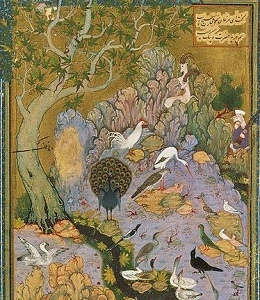

  
[Intangible Textual Heritage](../../index)  [Islam](../index.md) 

------------------------------------------------------------------------

[Buy this Book at
Amazon.com](https://www.amazon.com/exec/obidos/ASIN/0460879545/internetsacredte.md)

------------------------------------------------------------------------

<table width="75%">
<colgroup>
<col style="width: 50%" />
<col style="width: 50%" />
</colgroup>
<tbody>
<tr class="odd">
<td width="50%" data-valign="TOP"></td>
<td width="50%" data-valign="CENTER"><h1 id="bird-parliament" data-align="CENTER">Bird Parliament</h1>
<h2 id="by-farid-ud-din-attar" data-align="CENTER">by Farid ud-Din Attar</h2>
<h3 id="tr.-by-edward-fitzgerald" data-align="CENTER">tr. by Edward FitzGerald</h3>
<h4 id="section" data-align="CENTER">[1889]</h4></td>
</tr>
</tbody>
</table>

------------------------------------------------------------------------

[Contents](#contents)    [Start Reading](bp00.md)

------------------------------------------------------------------------

|                                                                                                                           |
|---------------------------------------------------------------------------------------------------------------------------|
|  |

This celebrated Sufi poem, also known as Conference of the Birds, by the
12th century Persian poet Farid ud-Din Attar, is a tale of a journey of
a group of thirty birds to the summit of the world mountain, Qaf. An
allegory of the Sufi journey to realization of the nature of God, each
bird has a particular signficance, a special fault, and a tale to tell.

In spite of its significance for world literature and the study of
religion, Attar's poem was not translated in its entirety until the
mid-twentieth century, and the standard English translations are hence
not in the public domain. However Edward FitzGerald, best known as the
translator of [The Rubayyat of Omar Khayyam](../khayyam.txt.md) worked on
this abridged translation of the Bird Parliament through 1857. It is
little known today, primarily because it was only published posthumously
(FitzGerald died in 1883), in Letters and Literary Remains, edited by
William Aldis Wright, in 1889. This is the first time an etext of
FitzGerald's translation of this work has been posted on the Internet.

--Jean Lelievre, April 12, 2007

------------------------------------------------------------------------

 [Title Page](bp00.md)  
[Bird Parliament](bp01.md)  
