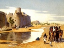

  
[Intangible Textual Heritage](../../index)  [Islam](../index.md) 
[Index](index)  [Previous](bus13)  [Next](bus15.md) 

------------------------------------------------------------------------

  
*The Bustan of Sadi*, tr. by A. Hart Edwards, \[1911\], at Intangible
Textual Heritage

------------------------------------------------------------------------

p. 149

### CHAPTER X

Concerning Prayer

Come, let us raise our hands in prayer,
for tomorrow they will be powerless in the dust.

Think not that he who supplicates before the Door of Mercy, which is
never shut, will turn away in hopelessness.

O Lord, regard us with compassion, for sin has entered among Thy
servants.

O gracious God! by Thy bounty have we been sustained; to Thy gifts and
loving kindness have we become habituated.

Since in this life Thou hast ennobled us above all things created, hope
of similar glory have we in the world to come.

O God, humiliate me not by reason of Thy greatness; make me not ashamed
by reason of my sins.

Let no one prevail over me, for it is better that I should suffer
punishment from Thy hand.

p. 150

Let it suffice that I am ashamed in Thy presence; make me not ashamed
before my fellow men.

If the shadow of Thy mercy fall upon me, mean is the dignity of the sky
before mine eyes.

If Thou give to me a crown, I will raise my head: exalt me, so that no
one may cast me down.

#### A WORSHIPPER'S LAMENT

I tremble when I recall the prayer of one distracted in the temple of
Mecca. Thus did he lament:

"Throw me not down, for no one will hold my hand to succour me. Whether
Thou call me or drive me away, my head has no resting-place but Thy
threshold. Thou knowest that I am poor and helpless; I am oppressed by
my evil passions. Keep me from pollution, and forgive my sins. Close not
mine eyes from the face of happiness; bind not my tongue when I recite
the creed. Place the lamp of Faith before my way; make my hand short
from doing evil.. From the sun of Thy goodness one ray suffices, for
except in Thy rays I am not seen. Why

p. 151

should I weep because of my condition? If am weak, my refuge is strong."

#### STORY OF AN IDOLATER

A fire-worshipper turned his back upon the world and girt up his loins
in the service of an idol. After some years he was overtaken by
misfortune and wept at the feet of the idol, saying: "I am
afflicted—help me, O idol! I am weary—have pity upon me."

Long did he continue in his lamentation, but no benefit did he derive.
How can an idol accomplish the desires of a man when of itself it cannot
drive away a fly?

The idolater frowned and said: "O thou, whose feet are bound to error!
with folly have I worshipped thee for years. Help me to fulfil my
wishes, or I will ask them of God."

While his face was yet besmeared with the dust of the idol's feet, the
Almighty fulfilled his object.

A pious man was astonished when he heard this. Then did a voice from
heaven speak into his ear, saying: "This old man prayed before

p. 152

the idol, but his prayer was not heard, If at the-shrine of God he were
likewise spurned, what difference would there be between an idol and Him
Who is eternal?"

------------------------------------------------------------------------

[Next: Notes](bus15.md)
