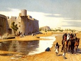

  
[Intangible Textual Heritage](../../index)  [Islam](../index.md) 
[Index](index)  [Previous](bus14.md) 

------------------------------------------------------------------------

  
*The Bustan of Sadi*, tr. by A. Hart Edwards, \[1911\], at Intangible
Textual Heritage

------------------------------------------------------------------------

p. 153

### NOTES

1. *I.e.* the *Bustān*.

2. *I.e.* its ten chapters.

3. Lit. "bone"; used metaphorically in the sense
of "a truth."

4. One of the kings of Persia in whose reign Sadi
flourished. His full name was Atābak Muzaffar-ud-Din Abu
Bakr-bin-Sa’d-bin-Zangī.

5. *I.e.* Abu Bakr.

6. Naushīravān the Just was the twentieth king of
the fourth dynasty of Persia, and contemporary with the Roman Emperor
Justinian. The Prophet Muhammad was born in his reign.

7. A title of the kings of Persia. It was
originally applied to Naushīravān.

8. Lit. "silver."

9. Darius Codomanus was the last king of Persia.
He waged many wars with Alexander the Great, who finally defeated him at
Arbela. The unfortunate king was afterwards killed by one Bessus,
governor of Bactriana, 331 B.C.

10. One of the kings of Persia. He was called
Qazal because of the redness of his hair. Arsalān means "a lion."

11. Name of a lofty mountain situated in Hamdān,
north-west of Isfahan.

p. 154

12. *I.e.* shows one thing and sells another of
inferior quality. The expression is commonly used to denote a hypocrite.

13. To do either is considered an act of virtue
among Muhammadans.

14. By reason of the opportunity it presented to
bestow his charity.

15. It is impossible to convey the beauty of
this line in English. The Persian words here used to express "food" and
"kiss" are written alike, except for one diacritical mark, and the word
change "literally means making an error in writing and changing the
diacritical points."

16. Hatim Tai was an Arabian chief who was
renowned for his generosity. He was born in Yaman, in Arabia Felix, and
lived some time before Muhammad in the sixth century. Many legends have
been woven round his life and character.

17. Horse-flesh was formerly eaten in parts of
the East.

18. *I.e.* their love for God is insatiable.

19. *I.e.* the fire of love.

20. "Gold" refers to "life," and "Friend" to
"God." The meaning is that one should devote one's life to religion, and
thus gain an entrance to the presence or the Deity.

21. Bāyazid Bustāmī was a celebrated saint of
Bustan, in Persia. He died A.D. 261.

p. 155

22. Abul Mahfūz, [surnamed](errata.htm#4.md) Marūf,
was a celebrated saint of Kareh, a village in Baghdad. He was the son of
a fire-worshipper, and was born A.D. 813, during the reign of Caliph
Māmūn, son of the celebrated Hārūn-ar-Rashīd.

23. Abū-al Hasan Kūshyār was a celebrated
astronomer and the tutor of Avicenna.

24. Luqman was a famous Greek philosopher, and
is supposed by some to have been the author of *Æsop's Fables*.

25. Bakhtyār literally means "fortunate "; the
play on the word is, therefore, obvious.

26. "Darkness" and "light" are used
metaphorically in the sense of "falseness" and "truth."

27. Khawarazm is situated to the east of the
Caspian Sea, near the mouth of the Oxus.

28. *I.e.* in this transient and fleeting world.

29. Korah, the cousin of Moses and the
proverbial miser of the Easterns.

30. *I.e.* if you possess merit.

31. A famous hero; the Hercules of the Persians.

32. The grandfather of Rustam, and, like him, a
celebrated hero.

33. Faridun was the seventh king of Persia, his
reign commencing about 750 B.C. He was the boast of the Persians and a
model of every virtue.

34. A celebrated temple in Guzerat demolished by
Sultan Mahmud of Ghazni in A.D. 1024.

35. *I.e.* engage in good works while you still
have time.

p. 156

36. Muhammad commanded that sand should be used
for ablution before prayer when water was unobtainable, as is more often
than not the case in the desert.

37. Name of a village on the road to Mecca.

38. The angel who examines the dead in their
graves.

39. *I.e.* your native land.
