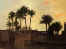
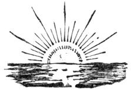

  
[Intangible Textual Heritage](../../index)  [Islam](../index) 
[Index](index)  [Next](daa01) 

------------------------------------------------------------------------

[Buy this Book at
Amazon.com](https://www.amazon.com/exec/obidos/ASIN/0766106071/internetsacredte)

------------------------------------------------------------------------

  
*The Diwan of Abu'l-Ala*, by Henry Baerlein, \[1909\], at Intangible
Textual Heritage

------------------------------------------------------------------------

p. 1

**The Wisdom of the East Series**

Edited By  
**L. Cranmer-Byng  
Dr. S. A. Kapadia**

THE DIWAN OF ABU’L-ALA

p. 2

|                  |                                              |
|------------------|----------------------------------------------|
| *First Edition*  | July, 1908    |
| *Second Edition* | January, 1909 |

p. 3

##### WISDOM OF THE EAST

# THE DIWAN OF ABU’L-ALA

### BY HENRY BAERLIN

*Author of "In Pursuit of Dulcinea," "The Shade of the Balkans,"
"Yrivand," etc.*

 

<table data-border="0">
<colgroup>
<col style="width: 100%" />
</colgroup>
<tbody>
<tr class="odd">
<td data-valign="top">
The stars have sunk from the celestial bowers, 
And in the garden have been turned to flowers 
                              Mutamid, <em>in captivity</em>.
</td>
</tr>
</tbody>
</table>

 

#### NEW YORK

#### E. P. DUTTON AND COMPANY

#### \[1909\]

Scanned, proofed and formatted at Intangible Textual Heritage, December
2008. This text is in the public domain in the US because it was
published prior to 1923.

  [  
Click to enlarge](img/cover.jpg)  
Front Cover and Spine  

  [  
Click to enlarge](img/title.jpg)  
Title Page  

------------------------------------------------------------------------

[Next: Dedication](daa01)
