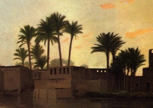

  
[Intangible Textual Heritage](../../index)  [Islam](../index) 

------------------------------------------------------------------------

[Buy this Book at
Amazon.com](https://www.amazon.com/exec/obidos/ASIN/0766106071/internetsacredte)

------------------------------------------------------------------------

<table width="75%">
<colgroup>
<col style="width: 50%" />
<col style="width: 50%" />
</colgroup>
<tbody>
<tr class="odd">
<td width="50%" data-valign="TOP"></td>
<td width="50%" data-valign="CENTER"><h1 id="the-diwan-of-abul-ala" data-align="CENTER">The Diwan of Abu'l-Ala</h1>
<h2 id="by-henry-baerlein" data-align="CENTER">by Henry Baerlein</h2>
<h4 id="section" data-align="CENTER">[1909]</h4></td>
</tr>
</tbody>
</table>

------------------------------------------------------------------------

[Contents](#contents)    [Start Reading](daa00)    [Page
Index](pageidx)    [Text \[Zipped\]](daa.txt.gz)

------------------------------------------------------------------------

|                                                                                                                           |
|---------------------------------------------------------------------------------------------------------------------------|
|  |

"There is no God save Allah!"—that is true,  
   Nor is there any prophet save the mind  
   Of man who wanders through the dark to find  
The Paradise that is in me and you.--LXXXI

Abu al-'Alā Ahmad ibn 'Abd Allāh ibn Sulaimān al-Tanūkhī al-Ma'arri (b.
973, d. 1057) was a blind poet and philosopher. Born in Syria, he lost
his sight at an early age due to smallpox. Although he spent most of his
life in Syria in his hometown of Ma'arrat al-Numan, he also taught in
Baghdad.

He was a skeptic and a rationalist, a keen observer of the human
condition, and an advocate for the poor and lowly. Modern doctrinaire
Muslims may not find this kind of critical thinking to their taste. But
Abu'l-Ala stands out as one of the best thinkers of medieval Islam, and
deserves to be better known. This work is composed of selections from
his two collections of poetry, The Tinder Spark, and Unnecessary
Necessity.

------------------------------------------------------------------------

 [Title Page](daa00)  
[Dedication](daa01)  
[Table of Contents](daa02)  
[Editorial Note](daa03)  
[Introduction to the Diwan](daa04)  
[The Diwan of Abu’l-Ala](daa05)  
[Appendix](daa06)  
